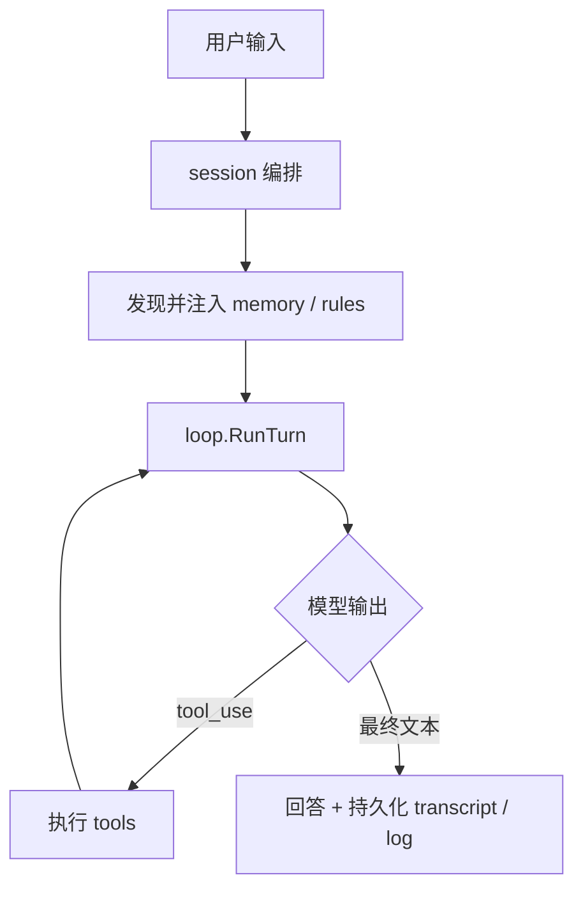
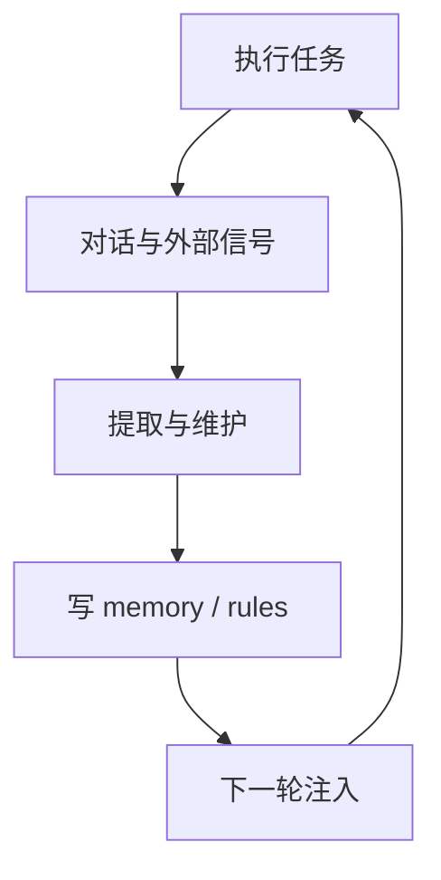

# oneclaw

用 Go 实现的 **可长期演进的 Agent 运行时**：围绕 **文件化记忆、工具运行时、上下文预算、维护子任务与审计**，让行为随使用沉淀为可复用的 memory / 规则，而不是只靠当轮对话。

**不做什么**：不训练或微调模型权重；不把全量历史无差别塞回上下文；不以向量库替代文件真源。

---

## 快速开始

```bash
go mod tidy
go build -o oneclaw ./cmd/oneclaw
# 可选：独立维护进程仍可用 go build -o maintain ./cmd/maintain
```

在项目根执行 **`go run ./cmd/oneclaw -init`**（或 `-cwd <dir> -init`）可生成或更新 **`<cwd>/.oneclaw/config.yaml`**（无则写入完整内置模板；已有则只补上模板里缺失的键、不覆盖你的配置）并创建记忆目录；再按需编辑密钥与渠道。

配置 OpenAI 兼容 API 后启动 REPL：在 **`~/.oneclaw/config.yaml`** 或 **`<项目>/.oneclaw/config.yaml`**（或 **`-config`** 额外层）中填写 `openai.api_key`、`openai.base_url` 等；合并与 `PushRuntime` 见 **[`docs/config.md`](docs/config.md)**。可选用 `github.com/lengzhao/conf` 加载 `.env` 供**其他**依赖使用，**oneclaw 运行时配置以 YAML 为准**。

```bash
cd /path/to/project         # 工具与会话 cwd 均为当前工作目录
go run ./cmd/oneclaw
# 可选：go run ./cmd/oneclaw -config ./my-layer.yaml
```

`cmd/oneclaw` 支持 **`-config`**（额外 YAML 层，覆盖顺序见 [`docs/config.md`](docs/config.md)）、**`-cwd`**（项目根，默认当前目录）、**`-init`**（初始化 `.oneclaw`）、**`-maintain-once`**（单次远场维护后退出）。Transcript 路径由 YAML `paths.transcript` 决定（未设置则 **`<cwd>/.oneclaw/transcript.json`**）；**每轮 `SubmitUser` 成功结束后**会自动写入。关闭落盘：`features.disable_transcript`（Slack 等渠道可自行设置 `Engine.TranscriptPath`）。

常用 REPL 命令：`/exit` 退出。对话落盘依赖配置中的 transcript 路径及每轮成功结束后的自动保存（见上段）；另存副本请用外部工具复制该文件。

**Memory 维护**：**回合后**由 `MaybePostTurnMaintain`（`features.disable_auto_maintenance`）；**定时**由 **`RunScheduledMaintain`** —— 将可整理要点写入 **`<cwd>/.oneclaw/memory/YYYY-MM-DD.md`**；**`<cwd>/.oneclaw/memory/MEMORY.md`** 仅作**规则**（与 `AGENT.md` 类似，进 prompt），不由维护追加大块 episodic 正文。合并 YAML 里 **`maintain.interval` 非空** 时主进程内 **`maintainloop`** 周期唤醒，**或** **`oneclaw -maintain-once`** / **`cmd/maintain`**（`-interval` / `-once`）。关闭后台定时（不挡单次维护）：`features.disable_scheduled_maintenance`。详见 [`docs/config.md`](docs/config.md)、[`docs/memory-maintain-dual-entry-design.md`](docs/memory-maintain-dual-entry-design.md)。

```bash
go run ./cmd/oneclaw -cwd . -maintain-once
# 或独立二进制：go run ./cmd/maintain --cwd . -once
# 仅 cmd/maintain：go run ./cmd/maintain --cwd . -interval 30m
```

---

## 项目定位

可将 oneclaw 看成三层组合（详见 [`docs/agent-runtime-golang-plan.md`](docs/agent-runtime-golang-plan.md)）：

| 层 | 职责 |
|----|------|
| **Agent Runtime** | 会话编排、模型调用、主循环、工具执行 |
| **Memory Plane** | 多作用域记忆、`MEMORY.md` / topic / daily log、发现、注入、recall、写回 |
| **Evolution Loop** | 执行任务 → 记录信号 → 提取与维护 → 回写 memory / rules → 下轮再注入 |

设计取向：**长期记忆可积累**、**策略可写回磁盘**、**能力通过工具与子 Agent 扩展**，并在预算、权限与审计下可控演进。

---

## 「自我学习 / 进化」在仓库里的含义

1. **文件型记忆平面**持续更新：`MEMORY.md` 索引、topic、daily log（先追加、后整理）。
2. **规则与策略**可持久化到 `.oneclaw/AGENT.md`、`.oneclaw/rules/*.md`、agent 专属 memory。
3. **维护型子任务**（**`MaybePostTurnMaintain`** + **`RunScheduledMaintain`** / **`oneclaw -maintain-once`** / [`cmd/maintain`](cmd/maintain)，见 [`docs/memory-maintain-dual-entry-design.md`](docs/memory-maintain-dual-entry-design.md)）整理日志与既有 memory。
4. **护栏**：全局 prompt 字节预算、工具权限收缩、memory 写入审计（append-only JSONL 等）。

更细的实验与验收思路见 [`docs/self-evolution-plan.md`](docs/self-evolution-plan.md)。任务勾选与阶段验收见 [`docs/todo.md`](docs/todo.md)。

---

## 实现进度（摘要）

与 [`docs/todo.md`](docs/todo.md) 阶段对应：

- **阶段 A**：主循环、工具、CLI、多轮 transcript — 已完成。
- **阶段 B**：memory 全链路、在线写入、回合后维护 + 定时维护入口 — 主干已完成；维护提示已含多日 daily log 与 project topic 摘录，并对写入 `MEMORY.md` 的 bullet 做强去重。
- **阶段 C**：子 Agent、`run_agent` / `fork_context`、侧链 transcript — 主干已完成；侧链结论合入主会话为可选后续。
- **阶段 D**：维护调度与变更审计 — 已接；**向量 recall** 为可选插件（文件仍为真源）。

---

## 核心能力一览

- **执行循环**：模型 ↔ 工具 ↔ 回灌；流式/非流式；Abort；`log/slog` 日志。
- **内置工具**：`read_file`、`write_file`、`grep`、**`exec`**（对标 picoclaw 的 shell 执行工具名；`sh -c`、前台默认最多等 30s 后返回部分信息、可选 background）、`run_agent`、`fork_context`、`task_create` / `task_update`、**`cron`**（定时/周期提醒，落盘 `.oneclaw/scheduled_jobs.json`，进程内轮询到期后注入用户消息；对标 picoclaw 的同名能力，简化版不含计划 shell 命令）、**`send_message`**（主动推送文本/附件到当前或指定 channel 实例，不经模型再生成一轮）（注册表 + schema；只读并行、写串行等保守策略）。
- **Memory**：user / project / local / auto / team / agent 等作用域；发现、注入、recall、与维护管道（回合内工具轨迹经内存进入 `PostTurn` / maintain，不再写 `.oneclaw/traces/`）。
- **子 Agent**：`.oneclaw/agents/*.md`；嵌套隔离上下文与工具面收缩。
- **路由抽象**：入站 `Inbound`、出站 `Record` / `Sink`，便于在 CLI 之外接 HTTP / webhook 等（见 `routing/` 与设计文档）。

---

## 仓库布局

```text
cmd/oneclaw/     主 CLI / REPL（-init、-maintain-once、-cwd、渠道）
cmd/maintain/    可选：独立定时或单次 memory 蒸馏
budget/          全局上下文字节预算
config/          统一 YAML 配置加载与合并（见 docs/config.md）
loop/            主循环、展示、工具 trace、历史预算等
maintainloop/    主进程内嵌定时维护（YAML `maintain.interval` 非空时启动）
memory/          记忆路径、注入、提取、维护、审计、回合日志
session/         会话引擎与编排
subagent/        子 Agent 运行时
routing/         入站/出站与 CLI 适配
schedule/        agent 定时任务持久化与到期收集
tools/           工具注册与内置实现
test/e2e/        端到端与 stub 测试
docs/            设计与 prompt 参考
```

---

## 架构流程

更完整的进程分支、WorkerPool、维护与定时任务说明见 **[`docs/runtime-flow.md`](docs/runtime-flow.md)**。

**单轮执行（简化）**



**长期沉淀（概念）**



---

## 环境与配置

- **Go**：`1.26.1+`（见 [`go.mod`](go.mod)）。
- **模型**：OpenAI 兼容 HTTP API。在 YAML 中配置 `openai.api_key`、可选 `openai.base_url`（自定义网关时需含 `/v1/` 后缀）等，见 **[`docs/config.md`](docs/config.md)** 与 [`config/init_template/config.yaml`](config/init_template/config.yaml)。

建议复制示例配置后按需修改：

```bash
cp env.example .env   # 可选：给其他工具用；oneclaw 以 YAML 为准
go run ./cmd/oneclaw -init
# 或手动：cp config/init_template/config.yaml <项目>/.oneclaw/config.yaml
```

**常用 YAML 段**：`model`、`chat.transport`、`openai.*`、`paths.*`、`budget.*`、`maintain.*`、`features.disable_*`、`log.*`、`usage.*`、`schedule.*` — 字段说明与默认值见 [`docs/config.md`](docs/config.md)。

---

## 命令行参考

**`cmd/oneclaw`**

| 标志 | 说明 |
|------|------|
| `-cwd` | 可选；项目根（memory / `.oneclaw/config.yaml` 根；默认当前工作目录） |
| `-config` | 可选；额外 YAML 配置层（相对路径相对于 `-cwd` 或当前目录） |
| `-init` | 创建记忆目录；`config.yaml` 不存在则写入内置模板，已存在则合并补全缺失键（不覆盖已有值），然后退出 |
| `-maintain-once` | 单次 `RunScheduledMaintain` 后退出（需 API 密钥；不启动渠道） |
| `-log-level` / `-log-format` | 可选；覆盖日志（`-maintain-once` / 正常模式在加载配置后生效；`-init` 仅用 CLI 标志） |

工作目录默认**进程当前目录**；指定 `-cwd` 时以其为项目根。日志与 transcript 见 YAML 或 `-log-*` 标志。

**`cmd/maintain`**

| 标志 | 说明 |
|------|------|
| `-cwd` | 项目根（memory 布局根） |
| `-config` | 可选；额外 YAML 配置层（相对路径相对于 `-cwd`） |
| `-once` | 只跑一轮蒸馏后退出（适合系统 crontab）；优先于间隔循环 |
| `-interval` | 循环间隔；`0` 等价单次；默认来自合并后的 YAML `maintain.interval`（代码内另有默认） |

---

## 文档阅读顺序

1. [`docs/README.md`](docs/README.md) — 文档索引  
2. [`docs/config.md`](docs/config.md) — 统一 YAML 配置与 `PushRuntime`  
3. [`docs/agent-runtime-golang-plan.md`](docs/agent-runtime-golang-plan.md) — 目标与边界  
4. [`docs/go-runtime-development-plan.md`](docs/go-runtime-development-plan.md) — 分阶段任务  
5. [`docs/claude-code-memory-system.md`](docs/claude-code-memory-system.md) / [`docs/claude-code-subagent-system.md`](docs/claude-code-subagent-system.md)  
6. [`docs/inbound-routing-design.md`](docs/inbound-routing-design.md) / [`docs/outbound-events-design.md`](docs/outbound-events-design.md)  
7. [`docs/prompts/README.md`](docs/prompts/README.md)  

---

## 适用场景

- 本地 Coding Agent / Agent Runtime 原型与实验  
- 文件化 memory、维护管道、审计与预算机制的验证  
- 子 Agent、fork、侧链执行模型的研究与扩展  

---

## 后续方向（摘自路线图）

详见 [`docs/todo.md`](docs/todo.md) 中「目标导向：自我进化闭环」：

- 多段 daily log 整理、topic 合并与强去重  
- **行为策略写回**：`write_behavior_policy`（由定时远场维护等专用 tool registry 提供，非默认主会话工具）与 D2 审计扩展（见 `docs/config.md`）  
- 可选：侧链摘要合入主会话、向量 recall 插件  

---

## License

[MIT](LICENSE)
