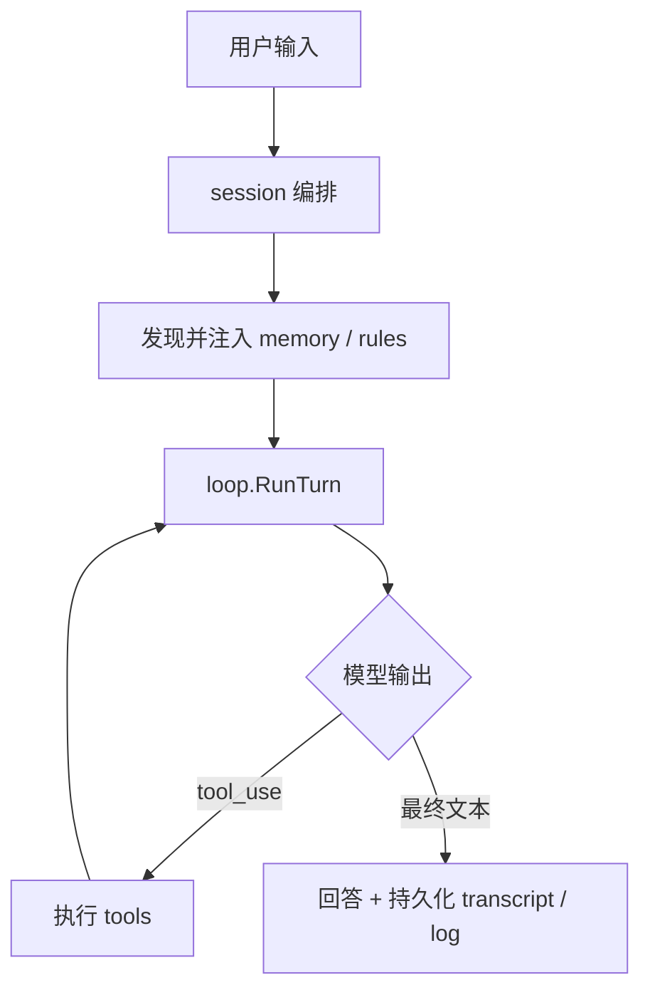

# oneclaw

用 Go 实现的 **可长期演进的 Agent 运行时**：围绕 **文件化记忆、工具运行时、上下文预算、维护子任务与审计**，让行为随使用沉淀为可复用的 memory / 规则，而不是只靠当轮对话。

**不做什么**：不训练或微调模型权重；不把全量历史无差别塞回上下文；不以向量库替代文件真源。

---

## 快速开始

```bash
go mod tidy
go build -o oneclaw ./cmd/oneclaw
go build -o maintain ./cmd/maintain
```

配置 OpenAI 兼容 API 后启动 REPL。方式二选一或组合：

- **YAML**（推荐密钥放文件）：复制 [`.oneclaw/config.example.yaml`](.oneclaw/config.example.yaml) 到 `~/.oneclaw/config.yaml` 或 `<项目>/.oneclaw/config.yaml`，填写 `openai.api_key` 等；合并规则见 **[`docs/config.md`](docs/config.md)**。
- **环境变量**：可用 `github.com/lengzhao/conf` 自动加载 `.env`（见 [`env.example`](env.example)），与 YAML 的优先级见 `docs/config.md`。

```bash
export OPENAI_API_KEY=...   # 若未在 YAML 中配置 api_key
cd /path/to/project         # 工具与会话 cwd 均为当前工作目录
go run ./cmd/oneclaw
# 可选：go run ./cmd/oneclaw -config ./my-layer.yaml
```

`cmd/oneclaw` 支持 **`-config`**（额外 YAML 层，覆盖顺序见 [`docs/config.md`](docs/config.md)）。Transcript 路径由配置 / **`ONCLAW_TRANSCRIPT_PATH`** 决定（未设置则 **`<cwd>/.oneclaw/transcript.json`**）；**每轮 `SubmitUser` 成功结束后**会自动写入。关闭落盘：`ONCLAW_DISABLE_TRANSCRIPT=1` 或 YAML `features.disable_transcript`（Slack 等渠道自行设置 `Engine.TranscriptPath` 即可）。

常用 REPL 命令：`/exit` 退出。对话落盘依赖配置中的 transcript 路径及每轮成功结束后的自动保存（见上段）；另存副本请用外部工具复制该文件。

**Memory 维护**（将 daily log 蒸馏进 `MEMORY.md` 等，默认按间隔循环；单次适合 cron）：

```bash
go run ./cmd/maintain --cwd . -once
# 或覆盖间隔：go run ./cmd/maintain --cwd . -interval 30m
```

---

## 项目定位

可将 oneclaw 看成三层组合（详见 [`docs/agent-runtime-golang-plan.md`](docs/agent-runtime-golang-plan.md)）：

| 层 | 职责 |
|----|------|
| **Agent Runtime** | 会话编排、模型调用、主循环、工具执行 |
| **Memory Plane** | 多作用域记忆、`MEMORY.md` / topic / daily log、发现、注入、recall、写回 |
| **Evolution Loop** | 执行任务 → 记录信号 → 提取与维护 → 回写 memory / rules → 下轮再注入 |

设计取向：**长期记忆可积累**、**策略可写回磁盘**、**能力通过工具与子 Agent 扩展**，并在预算、权限与审计下可控演进。

---

## 「自我学习 / 进化」在仓库里的含义

1. **文件型记忆平面**持续更新：`MEMORY.md` 索引、topic、daily log（先追加、后整理）。
2. **规则与策略**可持久化到 `AGENT.md`、`.oneclaw/rules/*.md`、agent 专属 memory。
3. **维护型子任务**（回合后 `MaybeMaintain` + 独立进程 [`cmd/maintain`](cmd/maintain)）整理日志与既有 memory。
4. **护栏**：全局 prompt 字节预算、工具权限收缩、memory 写入审计（append-only JSONL 等）。

更细的实验与验收思路见 [`docs/self-evolution-plan.md`](docs/self-evolution-plan.md)。任务勾选与阶段验收见 [`docs/todo.md`](docs/todo.md)。

---

## 实现进度（摘要）

与 [`docs/todo.md`](docs/todo.md) 阶段对应：

- **阶段 A**：主循环、工具、CLI、多轮 transcript — 已完成。
- **阶段 B**：memory 全链路、在线写入、回合后维护 + 定时维护入口 — 主干已完成；维护提示已含多日 daily log 与 project topic 摘录，并对写入 `MEMORY.md` 的 bullet 做强去重。
- **阶段 C**：子 Agent、`run_agent` / `fork_context`、侧链 transcript — 主干已完成；侧链结论合入主会话为可选后续。
- **阶段 D**：维护调度与变更审计 — 已接；**向量 recall** 为可选插件（文件仍为真源）。

---

## 核心能力一览

- **执行循环**：模型 ↔ 工具 ↔ 回灌；流式/非流式；Abort；`log/slog` 日志。
- **内置工具**：`read_file`、`write_file`、`grep`、`bash`、`run_agent`、`fork_context`（注册表 + schema；只读并行、写串行等保守策略）。
- **Memory**：user / project / local / auto / team / agent 等作用域；发现、注入、recall、回合日志（`ONCLAW_TURN_LOG_*`）与维护管道。
- **子 Agent**：`.oneclaw/agents/*.md`；嵌套隔离上下文与工具面收缩。
- **路由抽象**：入站 `Inbound`、出站 `Record` / `Sink`，便于在 CLI 之外接 HTTP / webhook 等（见 `routing/` 与设计文档）。

---

## 仓库布局

```text
cmd/oneclaw/     主 CLI / REPL
cmd/maintain/    定时或单次 memory 蒸馏
budget/          全局上下文字节预算
config/          统一 YAML 配置加载与合并（见 docs/config.md）
loop/            主循环、展示、工具 trace、历史预算等
memory/          记忆路径、注入、提取、维护、审计、回合日志
session/         会话引擎与编排
subagent/        子 Agent 运行时
routing/         入站/出站与 CLI 适配
tools/           工具注册与内置实现
test/e2e/        端到端与 stub 测试
docs/            设计与 prompt 参考
```

---

## 架构流程

**单轮执行（简化）**



**长期沉淀（概念）**


---

## 环境与配置

- **Go**：`1.26.1+`（见 [`go.mod`](go.mod)）。
- **模型**：OpenAI 兼容 HTTP API。API key 可在 YAML `openai.api_key` 或环境变量 **`OPENAI_API_KEY`**（至少其一）；可选 **`OPENAI_BASE_URL`**（自定义网关时需含 `/v1/` 后缀，环境变量优先于 YAML 中的 `openai.base_url`）。完整约定见 **[`docs/config.md`](docs/config.md)**。

建议复制示例配置后按需修改：

```bash
cp env.example .env
cp .oneclaw/config.example.yaml .oneclaw/config.yaml   # 可选：项目级 YAML
```

**常用变量（完整说明与默认值以 [`env.example`](env.example) 与 [`docs/config.md`](docs/config.md) 为准）**

| 类别 | 变量示例 |
|------|----------|
| 模型 | `ONCLAW_MODEL`、`ONCLAW_MAINTENANCE_MODEL`、`ONCLAW_MAINTENANCE_SCHEDULED_MODEL` |
| 日志 | `ONCLAW_LOG_LEVEL`、`ONCLAW_LOG_FORMAT` |
| Transcript（REPL 入口） | `ONCLAW_TRANSCRIPT_PATH`、`ONCLAW_DISABLE_TRANSCRIPT` |
| 传输 | `ONCLAW_CHAT_TRANSPORT`（如 `auto` / `non_stream`） |
| Memory | `ONCLAW_MEMORY_BASE`、`ONCLAW_DISABLE_MEMORY*`、`ONCLAW_TURN_LOG_PATH` |
| 维护 | `ONCLAW_DISABLE_AUTO_MAINTENANCE`、`ONCLAW_MAINTAIN_INTERVAL`、`ONCLAW_MAINTENANCE_*` |
| 预算 | `ONCLAW_DISABLE_CONTEXT_BUDGET`、`ONCLAW_MAX_PROMPT_BYTES`（未设置时代码默认约 **220000** 字节估算上限）、`ONCLAW_RECALL_MAX_BYTES` 等 |
| 审计 | `ONCLAW_DISABLE_MEMORY_AUDIT` |

YAML 与用户/项目/`-config` 合并、以及 `ApplyEnvDefaults` 与 `ONCLAW_*` 的对应关系见 [`docs/config.md`](docs/config.md)；纯环境变量语义见 `env.example` 文件头注释。

---

## 命令行参考

**`cmd/oneclaw`**

| 标志 | 说明 |
|------|------|
| `-config` | 可选；额外 YAML 配置层（路径相对于当前工作目录） |

工作目录为**进程当前目录**；日志与 transcript 见上表环境变量或 YAML。

**`cmd/maintain`**

| 标志 | 说明 |
|------|------|
| `-cwd` | 项目根（memory 布局根） |
| `-config` | 可选；额外 YAML 配置层（相对路径相对于 `-cwd`） |
| `-once` | 只跑一轮蒸馏后退出（适合 cron） |
| `-interval` | 循环间隔；`0` 等价单次；默认来自配置 / `ONCLAW_MAINTAIN_INTERVAL` |

---

## 文档阅读顺序

1. [`docs/README.md`](docs/README.md) — 文档索引  
2. [`docs/config.md`](docs/config.md) — 统一配置文件与环境变量优先级  
3. [`docs/agent-runtime-golang-plan.md`](docs/agent-runtime-golang-plan.md) — 目标与边界  
4. [`docs/go-runtime-development-plan.md`](docs/go-runtime-development-plan.md) — 分阶段任务  
5. [`docs/claude-code-memory-system.md`](docs/claude-code-memory-system.md) / [`docs/claude-code-subagent-system.md`](docs/claude-code-subagent-system.md)  
6. [`docs/inbound-routing-design.md`](docs/inbound-routing-design.md) / [`docs/outbound-events-design.md`](docs/outbound-events-design.md)  
7. [`docs/prompts/README.md`](docs/prompts/README.md)  

---

## 适用场景

- 本地 Coding Agent / Agent Runtime 原型与实验  
- 文件化 memory、维护管道、审计与预算机制的验证  
- 子 Agent、fork、侧链执行模型的研究与扩展  

---

## 后续方向（摘自路线图）

详见 [`docs/todo.md`](docs/todo.md) 中「目标导向：自我进化闭环」：

- 多段 daily log 整理、topic 合并与强去重  
- 行为策略写回 `.oneclaw/rules` / `AGENT.md` 的流程与护栏强化  
- 可选：侧链摘要合入主会话、向量 recall 插件  

---

## License

[MIT](LICENSE)
