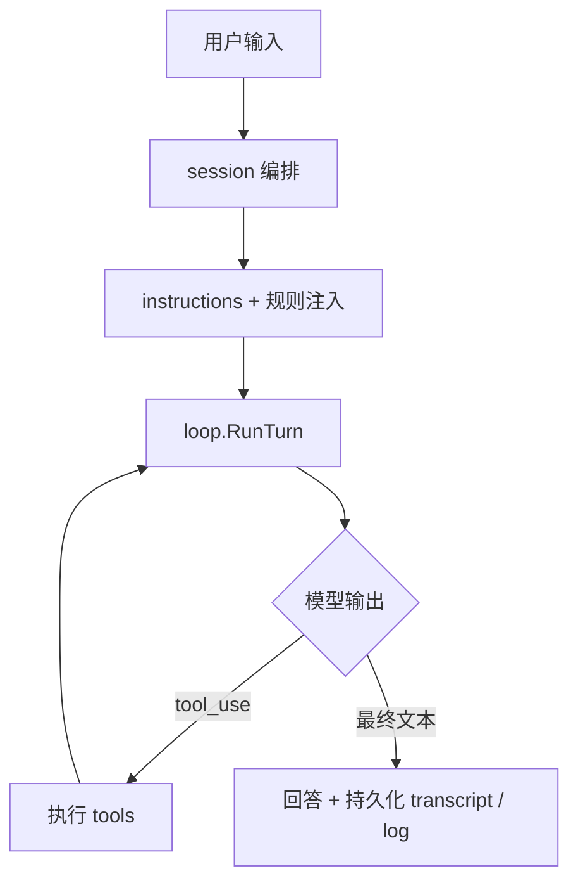

# oneclaw

用 Go 实现的 **可长期演进的 Agent 运行时**：围绕 **文件化记忆、工具运行时、上下文预算与可观测 notify**，让行为随使用沉淀为可复用的 memory / 规则，而不是只靠当轮对话。

**不做什么**：不训练或微调模型权重；不把全量历史无差别塞回上下文；不以向量库替代文件真源。

---

## 快速开始

```bash
go mod tidy
go build -o oneclaw ./cmd/oneclaw
```

执行 **`go run ./cmd/oneclaw -init`** 会在 **`$HOME/.oneclaw/`** 生成或更新 **`config.yaml`**（无则写入完整内置模板；已有则只补上模板里缺失的键、不覆盖你的配置），并复制 **`AGENT.md`**、**`memory/MEMORY.md`** 等（已存在则不覆盖），再创建记忆目录；再按需编辑密钥与渠道。

配置 OpenAI 兼容 API 后启动常驻服务：在 **`~/.oneclaw/config.yaml`** 与可选 **`-config`** 额外层中填写 `openai.api_key`、`openai.base_url` 等；合并与 `PushRuntime` 见 **[`docs/config.md`](docs/config.md)**。可选用 `github.com/lengzhao/conf` 加载 `.env` 供**其他**依赖使用，**oneclaw 运行时配置以 YAML 为准**。

```bash
go run ./cmd/oneclaw
# 可选：go run ./cmd/oneclaw -config ./my-layer.yaml  # 相对路径相对于 ~/.oneclaw/
```

`cmd/oneclaw` 支持 **`-config`**（额外 YAML 层，相对路径相对于 **`~/.oneclaw/`**，见 [`docs/config.md`](docs/config.md)）、**`-init`**（初始化 **`$HOME/.oneclaw`**）、**`-export-session`**（导出用户数据根快照）等。转写默认在 **`~/.oneclaw/sessions/<id>/transcript.json`**（与 `working_transcript.json` 同级）；**文件工具工作目录**（`Engine.CWD`）由 **`sessions.isolate_workspace`** 控制：默认 **false** 时为 **`~/.oneclaw/workspace`**，**true** 时为 **`~/.oneclaw/sessions/<id>/workspace`**。**每轮 `SubmitUser` 成功结束后**会写转写与 **`dialog_history.json`**（见 `workspace/dialog_history.go`）。关闭落盘：`features.disable_transcript`。

常用 REPL 命令：`/exit` 退出。对话落盘依赖配置中的 transcript 路径及每轮成功结束后的自动保存（见上段）；另存副本请用外部工具复制该文件。

**规则与落盘**：**`MEMORY.md`**（与 **`AGENT.md`** 同目录）等说明文件经每轮注入进上下文；**`dialog_history.json`** 等由运行时写入 **`UserDataRoot` / `sessions/<id>`** 下相应路径（见 **`workspace`** 包）。旧版 LLM 自动维护流水线已移除；以 [`docs/config.md`](docs/config.md) 与代码为准。

---

## 项目定位

可将 oneclaw 看成三层组合（详见 [`docs/agent-runtime-golang-plan.md`](docs/agent-runtime-golang-plan.md)）：

| 层 | 职责 |
|----|------|
| **Agent Runtime** | 会话编排、模型调用、主循环、工具执行 |
| **Memory Plane** | 多作用域记忆、`MEMORY.md` / topic / daily log、发现、注入、recall、写回 |
| **Evolution Loop** | 执行任务 → 记录信号 → 提取与维护 → 回写 memory / rules → 下轮再注入 |

设计取向：**长期记忆可积累**、**策略可写回磁盘**、**能力通过工具与子 Agent 扩展**，并在预算、权限与审计下可控演进。

---

## 「自我学习 / 进化」在仓库里的含义

1. **文件型说明与任务平面**持续更新：`MEMORY.md`、`tasks.json`、转写与 `dialog_history` 等。
2. **规则与策略**可持久化到 `.oneclaw/AGENT.md`、`.oneclaw/rules/*.md`、agent 专属说明目录。
3. **整理与演进**：由用户或模型通过 **`read_file` / Write 工具** 显式编辑文件；**无**进程内 LLM 自动维护流水线。
4. **护栏**：全局 prompt 字节预算、工具权限收缩；**无**内置多路 JSONL 审计 sink。

更细的实验与验收思路见 [`docs/self-evolution-plan.md`](docs/self-evolution-plan.md)。阶段与主路径见 [`docs/runtime-flow.md`](docs/runtime-flow.md)、[`docs/README.md`](docs/README.md)。

---

## 实现进度（摘要）

- **阶段 A**：主循环、工具、CLI、多轮 transcript — 已完成。
- **阶段 B**：指令与 **`workspace` 布局**、转写、dialog 落盘、`instructions` / `skills` 注入。
- **阶段 C**：子 Agent、`run_agent` / `fork_context`、侧链 transcript — 主干已完成；侧链结论合入主会话为可选后续。
- **阶段 D**：定时任务（**`schedule` + `cron` 工具**）、notify 生命周期；**向量检索** 等为可选后续（文件仍为真源）。

---

## 核心能力一览

- **执行循环**：模型 ↔ 工具 ↔ 回灌；流式/非流式；Abort；`log/slog` 日志。
- **内置工具**：`read_file`、`write_file`、`grep`、**`exec`**（对标 picoclaw 的 shell 执行工具名；`sh -c`、前台默认最多等 30s 后返回部分信息、可选 background）、`run_agent`、`fork_context`、`task_create` / `task_update`、**`cron`**（定时/周期提醒，落盘 **`scheduled_jobs.json`**（默认在 **`UserDataRoot`**，如 `~/.oneclaw/`），进程内轮询到期后注入用户消息；对标 picoclaw 的同名能力，简化版不含计划 shell 命令）、**`send_message`**（主动推送文本/附件到当前或指定 channel 实例，不经模型再生成一轮）（注册表 + schema；只读并行、写串行等保守策略）。
- **Memory / 指令平面**：`MEMORY.md`、`AGENT.md`、按项目分片的 auto memory（**`workspace`** 路径）；回合内工具轨迹经 **`notify`** 等可观测；**无**独立 `memory` 包维护管道。
- **子 Agent**：`.oneclaw/agents/*.md`；嵌套隔离上下文与工具面收缩。
- **路由抽象**：入站 `Inbound`、出站 `Record` / `Sink`，便于在 CLI 之外接 HTTP / webhook 等（见 `routing/` 与设计文档）。

---

## 仓库布局

```text
cmd/oneclaw/     主 CLI / REPL（-init、-export-session、渠道）
budget/          全局上下文字节预算
config/          统一 YAML 配置加载与合并（见 docs/config.md）
loop/            主循环、展示、工具 trace、历史预算等
workspace/       用户/会话路径布局、dialog 历史、导出快照
session/         会话引擎与编排
subagent/        子 Agent 运行时
routing/         入站/出站与 CLI 适配
schedule/        agent 定时任务持久化与到期收集
tools/           工具注册与内置实现
test/e2e/        端到端与 stub 测试
docs/            设计与 prompt 参考
```

---

## 架构流程

更完整的进程分支、WorkerPool、定时任务说明见 **[`docs/runtime-flow.md`](docs/runtime-flow.md)**。

**单轮执行（简化）**



---

## 环境与配置

- **Go**：`1.26.1+`（见 [`go.mod`](go.mod)）。
- **模型**：OpenAI 兼容 HTTP API。在 YAML 中配置 `openai.api_key`、可选 `openai.base_url`（自定义网关时需含 `/v1/` 后缀）等，见 **[`docs/config.md`](docs/config.md)** 与 [`config/init_template/config.yaml`](config/init_template/config.yaml)。

建议复制示例配置后按需修改：

```bash
cp env.example .env   # 可选：给其他工具用；oneclaw 以 YAML 为准
go run ./cmd/oneclaw -init
# 或手动：cp config/init_template/config.yaml ~/.oneclaw/config.yaml
```

**常用 YAML 段**：`model`、`openai.*`、`paths.*`、`budget.*`、`features.disable_*`、`log.*`、`usage.*`、`schedule.*`、`sessions.*`、`clawbridge.*`、`mcp.*` — 字段说明与默认值见 [`docs/config.md`](docs/config.md)。

---

## 命令行参考

**`cmd/oneclaw`**

| 标志 | 说明 |
|------|------|
| `-config` | 可选；额外 YAML 配置层（相对路径相对于 **`~/.oneclaw/`**） |
| `-init` | 在 **`$HOME/.oneclaw/`** 创建记忆目录；`config.yaml` 不存在则写入内置模板，已存在则合并补全缺失键（不覆盖已有值），然后退出 |
| `-export-session` | 将主机数据从 **`UserDataRoot`** 导出到指定目录后退出 |
| `-log-level` / `-log-format` / `-log-file` | 可选；覆盖日志（相对 **`UserDataRoot`** 等规则见 [`docs/config.md`](docs/config.md)） |

配置与主机数据根为 **`Resolved.UserDataRoot()`**（默认 **`~/.oneclaw`**）；**不再**使用进程工作目录或「项目 `-cwd`」解析配置。

---

## 文档阅读顺序

1. [`docs/README.md`](docs/README.md) — 文档索引  
2. [`docs/config.md`](docs/config.md) — 统一 YAML 配置与 `PushRuntime`  
3. [`docs/agent-runtime-golang-plan.md`](docs/agent-runtime-golang-plan.md) — 目标与当前包职责摘要  
4. [`docs/third-party/claude-code-vs-oneclaw.md`](docs/third-party/claude-code-vs-oneclaw.md) — 与 Claude Code 异同（优化与缺口）  
5. [`docs/third-party/claude-code-memory-system.md`](docs/third-party/claude-code-memory-system.md) / [`docs/third-party/claude-code-subagent-system.md`](docs/third-party/claude-code-subagent-system.md)  
6. [`docs/inbound-routing-design.md`](docs/inbound-routing-design.md) / [`docs/outbound-events-design.md`](docs/outbound-events-design.md)  
7. [`docs/prompts/README.md`](docs/prompts/README.md)  

---

## 适用场景

- 本地 Coding Agent / Agent Runtime 原型与实验  
- 文件化说明、任务与预算机制的验证  
- 子 Agent、fork、侧链执行模型的研究与扩展  

---

## 后续方向（摘自路线图）

- 侧链摘要合入主会话、出站抽象（见 [`docs/architecture-modularity-simplification.md`](docs/architecture-modularity-simplification.md)）  
- 可选：向量检索插件（文件仍为真源）  

---

## License

[MIT](LICENSE)
