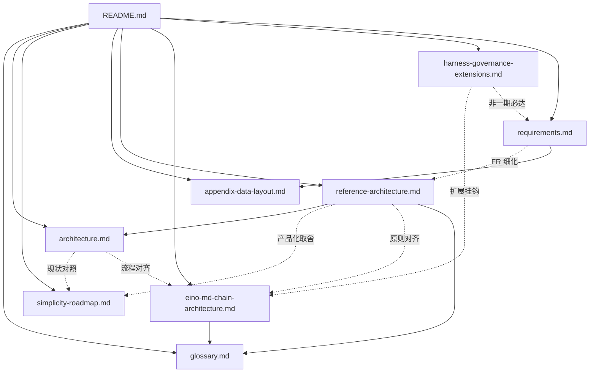

# Claw / Agent 运行时 — 设计文档套件（本仓库为 `docs/`）

本目录是一套**可整体复制**的文字规格：产品简介、抽象架构、目标技术栈（Eino + MD + **Workflow v2**）、**目标 PRD**、术语与数据布局附录。**套件内部交叉引用仅使用本目录内相对路径**；复制到其他仓库时可改名为 `docs/design/` 等任意路径，保持相对链接即可。

---

## 项目简介

**Claw** 这一类产品的目标：**用 Agent 运行时连接模型、工具与渠道，把用户意图落成可重复的自动化**——读写工作区、执行命令、调度提醒、多轮推理与子 Agent 委派，在对话或集成界面**交付结果**，而不止于单次问答。

常驻多通道（IM 等）侧推荐 Go 模块 **`github.com/lengzhao/clawbridge`** 与运行时对接。

---

## 文档一览与依赖关系

| 文件 | 角色 | 复制到新项目时 |
|------|------|----------------|
| [README.md](README.md) | 本索引与复制指南 | **必留** |
| [glossary.md](glossary.md) | 术语统一 | **建议保留**（可与 README 合并） |
| [appendix-data-layout.md](appendix-data-layout.md) | UserDataRoot / InstructionRoot / 隔离策略摘要 | **建议保留**（落地路径设计时对照） |
| [reference-architecture.md](reference-architecture.md) | 架构原则 + 场景化 PRD 条目 + 落地顺序 | **建议保留** |
| [architecture.md](architecture.md) | **主流程 + 各子系统生命周期**（Mermaid） | **建议保留** |
| [simplicity-roadmap.md](simplicity-roadmap.md) | **oneclaw 优缺点评估 + 简单易用改进路线** | **产品化 / 收敛默认体验时建议保留** |
| [workflow-architecture-review.md](workflow-architecture-review.md) | **oneclaw workflow 实现侧**复杂度、路线图；默认回合可读 **四阶段**（Receive → RunMainADK → Respond → PostTurnAsync），上下文由 Agent **`context_profile`** 控制，示例模板见仓库 **`setup/templates/workflows/default.turn.yaml`** | **实现/评审 oneclaw 时建议保留** |
| [eino-md-chain-architecture.md](eino-md-chain-architecture.md) | Eino + 全 MD + `agents/` + **Workflow v2** | **选 Go+Eino 时核心** |
| [workflows-spec.md](workflows-spec.md) | **`workflows/*.yaml`（nodes/depends_on）与 `steps` 糖；§8 为 manifest 路径与文件选用** | **实现编排必读** |
| [eino-integration-surface.md](eino-integration-surface.md) | **Eino / eino-ext 接口与包清单**（实现对照） | **实现工程师必读** |
| [memory-and-session.md](memory-and-session.md) | **Eino Session 示例 vs 检查点 vs `lengzhao/memory` vs oneclaw 文件 MEMORY** | **接记忆/会话持久化前读** |
| [harness-governance-extensions.md](harness-governance-extensions.md) | Harness 治理、SafeHarness 映射、**扩展 backlog** 与初期预留扩展性 | **增强方向**；一期验收以 requirements 为准 |
| [requirements.md](requirements.md) | **目标产品 PRD**（FR/NFR、验收要点） | **绿场核心**；若产品范围不同可删或替换 |

本仓库 **`examples/init/README.md`** 说明 init 落盘布局；**`examples/skills/`** 等与 **`setup/templates/`** 子树对齐，便于在 Git 中浏览。**`oneclaw init`** 通过 **`//go:embed templates`** 将 **`setup/templates/`** 整树拷到 **UserDataRoot**（缺才写；**`config.yaml`** 合并缺失键；**`agents/default.md`** 经模板渲染）。

```mermaid
flowchart TB
  README[README.md]
  G[glossary.md]
  A[architecture.md]
  S[simplicity-roadmap.md]
  L[appendix-data-layout.md]
  R[reference-architecture.md]
  E[eino-md-chain-architecture.md]
  H[harness-governance-extensions.md]
  Q[requirements.md]
  README --> G
  README --> A
  README --> S
  README --> L
  README --> R
  README --> E
  README --> H
  README --> Q
  R --> A
  R -.->|产品化取舍| S
  A -.->|现状对照| S
  A -.->|流程对齐| E
  R -.->|原则对齐| E
  Q -.->|FR 细化| R
  Q --> L
  R --> G
  E --> G
  H -.->|扩展挂钩| E
  H -.->|非一期必达| Q
```

---

## 推荐阅读顺序

1. **[glossary.md](glossary.md)**（首次阅读扫一遍术语）
2. **[architecture.md](architecture.md)** — **主流程与各生命周期图**（建议第二读）
3. **[reference-architecture.md](reference-architecture.md)** — 边界、架构块、PRD、落地顺序  
4. **[simplicity-roadmap.md](simplicity-roadmap.md)** — oneclaw 优缺点评估与「简单 / 易用」路线
5. **[eino-md-chain-architecture.md](eino-md-chain-architecture.md)** — 若技术栈含 Go + Eino  
6. **[workflows-spec.md](workflows-spec.md)** — `workflows/*.yaml`（DAG）与内置节点  
7. **[eino-integration-surface.md](eino-integration-surface.md)** — Eino / eino-ext **包与接口清单**（实现对照）  
8. **[memory-and-session.md](memory-and-session.md)** — 对话持久化、`lengzhao/memory` 与文件 MEMORY 边界  
9. **[appendix-data-layout.md](appendix-data-layout.md)** — 定目录与隔离策略时（含 **§6 其余推荐默认**）  
10. **[requirements.md](requirements.md)** — PRD 与验收要点  
11. **[harness-governance-extensions.md](harness-governance-extensions.md)** — 治理增强、扩展路线与初期预留扩展性（可选）  

---

## 复制到其他新项目时的说明

1. **整目录拷贝**：将本目录原样放入目标仓库的 `docs/design/`（或任意路径），保持相对链接有效即可。
2. **收窄范围**：若不需要完整 PRD，可删除或改写 **[requirements.md](requirements.md)**，并同步调整其他文档中的交叉引用。
3. **非 Go / 不用 Eino**：保留 [reference-architecture.md](reference-architecture.md) + [glossary.md](glossary.md) + [appendix-data-layout.md](appendix-data-layout.md)；[eino-md-chain-architecture.md](eino-md-chain-architecture.md) 可作「若将来迁移到 Eino」存档或删除。
4. **自洽性**：本套件对外部仓库链接主要包括 **`github.com/lengzhao/clawbridge`**（术语表与架构参考）及 **requirements.md §6** 等；其余多为本目录内 `.md`。
