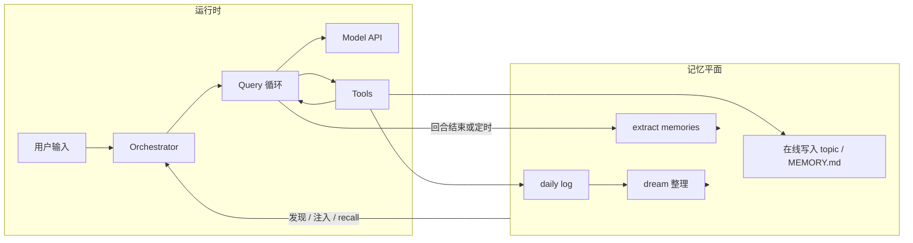

# Claude Code 范式下的 Golang Agent / Memory 实现计划

本文档汇总在独立仓库中用 Go 实现「可自我演进」的 BOT 时的架构取向。设计拆解与流程说明以**本目录**（`docs/`）下各文为准。原 `claude-code-2026-03-31/docs` 已归档至此；若从本仓库移除 `claude-code-2026-03-31` 子目录，不影响文档完整性。

---

## 1. 目标与边界

**自我学习 / 自我进化**在本方案中指：

- **外部知识平面持续更新**（`MEMORY.md`、topic、daily log、再蒸馏合并），而非对模型权重做训练。
- **行为策略可演进**（将验证有效的规则写入 `CLAUDE.md`、rules、Agent 专用 memory；或通过维护型子 Agent 改写这些文件）。
- **运行时能力可扩展**（新工具、新 Agent 定义、MCP），由编排层加载。

若引入**语义检索（向量库）**，建议仅作为 **recall 的可选插件**，**文件仍为真源**。详见 [`claude-code-memory-system.md`](claude-code-memory-system.md)。

---

## 2. 与 Claude Code 的对应关系（复用语义，非逐行移植）

| Claude Code 概念 | Go 侧职责（建议包名） |
|------------------|----------------------|
| QueryEngine / `submitMessage` | `session` / `orchestrator`：接入输入、slash、附件、transcript、是否进入模型 |
| `query()` 循环 | `agent` / `loop`：API、tool 解析、tool_result 回灌、终止条件 |
| Tool runtime | `tools`：注册、权限、保守并行 |
| 子 Agent / fork | `subagent`：独立 `agentId`、裁剪上下文、独立 transcript |
| Memory / context | `memory` + `context`：发现、注入、recall、写入、预算与去重 |

日志建议使用 **`log/slog`**。Go 项目目录约定按团队习惯即可（本方案不强制使用 `internal` 包）。

---

## 3. Memory 子系统（对齐 [`claude-code-memory-system.md`](claude-code-memory-system.md)）

1. **存储层**：`MEMORY.md` 为短索引；topic 承载正文；按 user / project / local / agent / team 分作用域；daily log 按日 append。
2. **发现层**：工作目录向上查找 `AGENT.md`、`.oneclaw/rules/*.md`、memory 根；**不实现** `@include`，文件以磁盘正文为准。
3. **注入层**：前缀（policy + 截断索引）↔ system；规则与日期等 ↔ messages 前缀 meta；按需 recall ↔ attachment（surfaced bytes 上限、路径去重）。
4. **在线更新层**：主 Agent 通过工具写文件。
5. **增量提取层**：窄上下文子任务，对应 `extract memories`。
6. **整理蒸馏层**：读 daily log 与既有 topic，合并去重，对应 `auto dream`。

### 3.1 SelectRecall 的 query 分词（Go 实现约定）

`memory.SelectRecall` 用「用户本轮 `userText` 分词 → 在 memory 根下各 `.md` 中按命中计分」做轻量召回，**不建倒排索引**。为避免纯中文整句被 `unicode.IsLetter` 粘成单一 token（召回几乎不可用），分词规则如下（第一版）：

| 片段 | 规则 |
|------|------|
| **汉字（CJK Unified Ideograph）** | 连续汉字块做**重叠 bigram**（块内仅一个汉字时不产生 term；**不**输出单字，避免「的、了」噪声）。 |
| **拉丁字母与数字** | 与非字母数字字符边界切分；仅当 `len(token) > 2`（**字节长度**，与旧行为一致）时作为 term。 |
| **去重** | 同一 term 只保留一次（先出现者优先，保证稳定）。 |
| **上限** | 去重后 term 总数有常量上限（防止极端长输入放大 CPU）；达到上限后不再接受新 term。 |

**评分**仍使用现有 `scoreRecall`（文件名命中权重高于正文）。后续若误召或漏召明显，可再评估 trigram、韩文/假名块同构 n-gram，或引入 Bleve 等索引方案。

实现位置：`memory/recall.go` 中的 `tokenizeRecall`。

---

## 4. Agent 子系统（对齐 [`claude-code-main-flow-analysis.md`](claude-code-main-flow-analysis.md)）

- 统一 **消息模型**（user / assistant / tool_use / tool_result / attachment / compact boundary）。
- **`ToolUseContext`（Go struct）**：工具集、Abort、只读缓存、权限、nested memory 追踪等；子 Agent **默认隔离、按需共享**。
- **主循环**：模型 → 工具 → 结果回灌 → 直至无 tool 或达上限。
- **并发**：只读且可证安全时再并行，避免写冲突。
- **子 Agent**：完整子 Agent 与 **fork**（轻量、共享前缀）两条路径。

主线程 prompt 分段习惯可参考 [`prompts/10-main-thread.md`](prompts/10-main-thread.md)、[`prompts/50-memory.md`](prompts/50-memory.md)。

---

## 5. 自我学习闭环（示意）

---

## 6. 分期里程碑

| 阶段 | 内容 |
|------|------|
| **A** | Transcript、主 query 循环、一种模型后端；最小工具集（读/写/搜索/shell，带沙箱与策略） |
| **B** | Memory 全链路：scope、`MEMORY.md` 截断、include、注入与 recall；extract + dream 入口 |
| **C** | 子 Agent 与隔离、sidechain transcript、权限收缩；fork 与完整子 Agent 分流 |
| **D** | 维护作业调度、变更审计；可选向量 recall |

更细的任务拆解与验收标准见 [`go-runtime-development-plan.md`](go-runtime-development-plan.md)。

---

## 7. 用另一个 Git 仓库管理实现（推荐）

- **新建独立仓库**存放 Go 实现；**本仓库**的 `docs/` 继续作为设计参考与 prompt/流程说明来源。
- **默认**：在新仓库 `README` 中写明参考本仓库 URL 与分支，不强制 submodule。
- **需要文档与 commit 强绑定时**：在新仓库使用 `git submodule` 挂载参考文档目录，并在 README 说明更新方式。
- **避免**：在同一仓库内混放「研究笔记」与「产品代码」导致 CI 与协作边界模糊。

---

## 8. 延伸阅读（本目录）

| 文档 | 说明 |
|------|------|
| [`claude-code-main-flow-analysis.md`](claude-code-main-flow-analysis.md) | 主流程与分层 |
| [`claude-code-memory-system.md`](claude-code-memory-system.md) | 记忆系统 |
| [`claude-code-subagent-system.md`](claude-code-subagent-system.md) | 子 Agent |
| [`claude-code-callstack-and-parameter-flow.md`](claude-code-callstack-and-parameter-flow.md) | 调用栈与参数流 |
| [`claude-code-core-tools.md`](claude-code-core-tools.md) | 核心工具 |
| [`claude-code-agenttool-deep-dive.md`](claude-code-agenttool-deep-dive.md) | Agent 工具深入 |
| [`prompts/00-request-envelope.md`](prompts/00-request-envelope.md) | 请求信封 |
| [`prompts/10-main-thread.md`](prompts/10-main-thread.md) | 主线程 prompt |
| [`prompts/50-memory.md`](prompts/50-memory.md) | Memory prompt |

---

*文档目的：便于在新仓库立项时携带一致的设计共识；细节以本 `docs/` 目录正文为准。*
