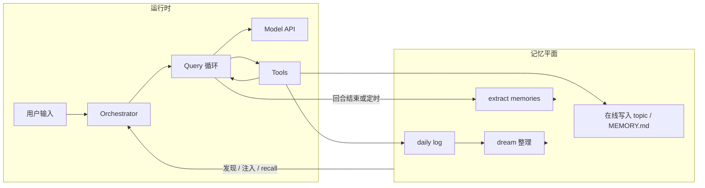
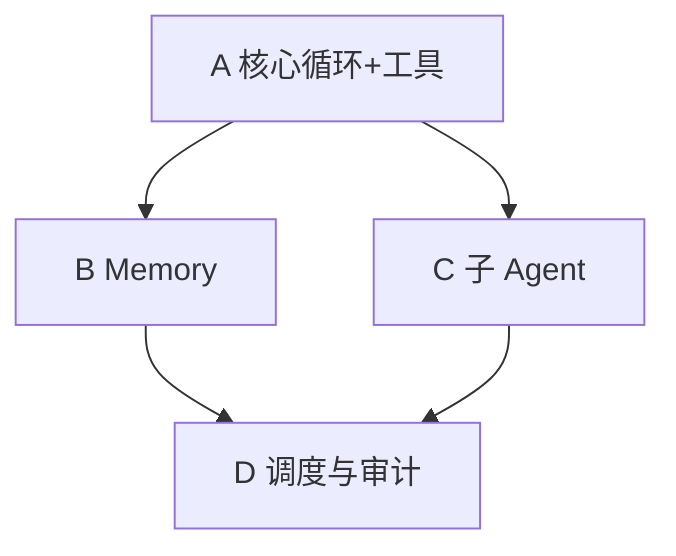

# Claude Code 范式下的 Golang Agent / Memory 实现计划

本文档汇总在独立仓库中用 Go 实现「可自我演进」的 BOT 时的架构取向。设计拆解与流程说明以**本目录**（`docs/`）下各文为准。原 `claude-code-2026-03-31/docs` 已归档至此；若从本仓库移除 `claude-code-2026-03-31` 子目录，不影响文档完整性。

---

## 1. 目标与边界

**自我学习 / 自我进化**在本方案中指：

- **外部知识平面持续更新**（`MEMORY.md`、topic、daily log、再蒸馏合并），而非对模型权重做训练。
- **行为策略可演进**（将验证有效的规则写入 `CLAUDE.md`、rules、Agent 专用 memory；或通过维护型子 Agent 改写这些文件）。
- **运行时能力可扩展**（新工具、新 Agent 定义、MCP），由编排层加载。

若引入**语义检索（向量库）**，建议仅作为 **recall 的可选插件**，**文件仍为真源**。详见 [`claude-code-memory-system.md`](claude-code-memory-system.md)。

---

## 2. 与 Claude Code 的对应关系（复用语义，非逐行移植）

| Claude Code 概念 | Go 侧职责（建议包名） |
|------------------|----------------------|
| QueryEngine / `submitMessage` | `session` / `orchestrator`：接入输入、slash、附件、transcript、是否进入模型 |
| `query()` 循环 | `agent` / `loop`：API、tool 解析、tool_result 回灌、终止条件 |
| Tool runtime | `tools`：注册、权限、保守并行 |
| 子 Agent / fork | `subagent`：独立 `agentId`、裁剪上下文、独立 transcript |
| Memory / context | `memory` + `context`：发现、注入、recall、写入、预算与去重 |

日志建议使用 **`log/slog`**。Go 项目目录约定按团队习惯即可（本方案不强制使用 `internal` 包）。

与 Claude Code **产品能力层面的异同**（优化点、缺失与后置项）见专文 [`claude-code-vs-oneclaw.md`](claude-code-vs-oneclaw.md)。

---

## 3. Memory 子系统（对齐 [`claude-code-memory-system.md`](claude-code-memory-system.md)）

1. **存储层**：`MEMORY.md` 为短索引；topic 承载正文；按 user / project / local / agent / team 分作用域；daily log 按日 append。
2. **发现层**：工作目录向上查找 `AGENT.md`、`.oneclaw/rules/*.md`、memory 根；**不实现** `@include`，文件以磁盘正文为准。
3. **注入层**：前缀（policy + 截断索引）↔ system；规则与日期等 ↔ messages 前缀 meta；按需 recall ↔ attachment（surfaced bytes 上限、路径去重）。
4. **在线更新层**：主 Agent 通过工具写文件。
5. **增量提取层**：窄上下文子任务，对应 `extract memories`。
6. **整理蒸馏层**：读 daily log 与既有 topic，合并去重，对应 `auto dream`。

### 3.1 SelectRecall 的 query 分词（Go 实现约定）

`memory.SelectRecall` 用「用户本轮 `userText` 分词 → 在 memory 根下各 `.md` 中按命中计分」做轻量召回，**不建倒排索引**。为避免纯中文整句被 `unicode.IsLetter` 粘成单一 token（召回几乎不可用），分词规则如下（第一版）：

| 片段 | 规则 |
|------|------|
| **汉字（CJK Unified Ideograph）** | 连续汉字块做**重叠 bigram**（块内仅一个汉字时不产生 term；**不**输出单字，避免「的、了」噪声）。 |
| **拉丁字母与数字** | 与非字母数字字符边界切分；仅当 `len(token) > 2`（**字节长度**，与旧行为一致）时作为 term。 |
| **去重** | 同一 term 只保留一次（先出现者优先，保证稳定）。 |
| **上限** | 去重后 term 总数有常量上限（防止极端长输入放大 CPU）；达到上限后不再接受新 term。 |

**评分**仍使用现有 `scoreRecall`（文件名命中权重高于正文）。后续若误召或漏召明显，可再评估 trigram、韩文/假名块同构 n-gram，或引入 Bleve 等索引方案。

实现位置：`memory/recall.go` 中的 `tokenizeRecall`。

---

## 4. Agent 子系统（对齐 [`claude-code-main-flow-analysis.md`](claude-code-main-flow-analysis.md)）

- 统一 **消息模型**（user / assistant / tool_use / tool_result / attachment / compact boundary）。
- **`ToolUseContext`（Go struct）**：工具集、Abort、只读缓存、权限、nested memory 追踪等；子 Agent **默认隔离、按需共享**。
- **主循环**：模型 → 工具 → 结果回灌 → 直至无 tool 或达上限。
- **并发**：只读且可证安全时再并行，避免写冲突。
- **子 Agent**：完整子 Agent 与 **fork**（轻量、共享前缀）两条路径。

主线程 prompt 分段习惯可参考 [`prompts/10-main-thread.md`](prompts/10-main-thread.md)、[`prompts/50-memory.md`](prompts/50-memory.md)。

---

## 5. 自我学习闭环（示意）

---

## 6. 分期里程碑

| 阶段 | 内容 |
|------|------|
| **A** | Transcript、主 query 循环、一种模型后端；最小工具集（读/写/搜索/shell，带沙箱与策略） |
| **B** | Memory 全链路：scope、`MEMORY.md` 截断、**不实现 `@include`**、注入与 recall；extract + dream 入口 |
| **C** | 子 Agent 与隔离、sidechain transcript、权限收缩；fork 与完整子 Agent 分流 |
| **D** | 维护作业调度、变更审计；可选向量 recall |

下列 **§8–§9** 为与里程碑对应的包布局建议、分阶段任务表与验收口径（原独立文档 `go-runtime-development-plan.md` 已并入本文）。

---

## 7. 工程约定

- **日志**：`log/slog`；包布局不强制 `internal`（团队约定）。
- **新功能**：先读 `docs/` 下对应设计再改代码。
- **设计真源**：本目录 `claude-code-*.md` 与 `prompts/`；**不依赖**仓库内 `claude-code-2026-03-31` 子目录。若对照原 TypeScript 实现，请自行保留或克隆参考仓库；下表「TS 参考路径」相对原 Claude Code `src/`，仅作语义映射。

---

## 8. 建议包布局

| 职责 | 建议包 | 原 TS 语义参考（路径相对原 Claude Code `src/`） |
|------|--------|--------------------------------------------------|
| 会话与入口 | `session` | `QueryEngine.ts`、`utils/processUserInput/processUserInput.ts` |
| 主循环 | `loop` | `query.ts` |
| 工具运行时 | `tools` | `Tool.ts`、`services/tools/toolOrchestration.ts`、`services/tools/toolExecution.ts` |
| 消息模型 | `message` / `types` | `types/message.js`、`utils/messages.ts` |
| Memory | `memory` + 注入 `toolctx` | `memdir/memdir.ts`、`utils/attachments.ts`、`utils/memoryFileDetection.ts` |
| 子 Agent | `subagent` | `tools/AgentTool/runAgent.ts`、`utils/forkedAgent.ts`、`utils/swarm/inProcessRunner.ts` |
| 系统前缀 | `context` | `utils/queryContext.ts`、`context.ts`、`constants/prompts.ts` |

**本仓库现状**：上述职责已落在 `session`、`loop`、`tools`、`memory`、`subagent` 等包中，与上表大体一致。

---

## 9. 阶段任务与验收

### 9.1 阶段 A：最小闭环

**目标**：Transcript + 主 query 循环 + 一种模型后端 + 最小工具集（读/写/grep/可选 shell），权限与保守并发。

| 序号 | 任务 | 要点 |
|------|------|------|
| A1 | 统一消息模型 | user / assistant / tool_use / tool_result / attachment；compact boundary 可先占位 |
| A2 | 会话编排 | 每轮输入 → 追加 transcript → 进入 query 循环；跨轮状态（messages、usage、abort） |
| A3 | query 循环 | 模型 → tool_use → 执行 → tool_result 回灌 → 直至无 tool 或达上限/预算 |
| A4 | 模型后端 | 一种供应商 + 流式 + tool 块解析 |
| A5 | 工具注册与执行 | schema、按名查找、权限钩子；只读工具可批量并行、写串行 |
| A6 | 最小工具 | Read / Write 或 StrReplace / Grep、Bash（cwd/超时/策略） |
| A7 | `ToolUseContext` | abort、只读缓存、权限上下文；为 B/C 预留 nested memory 等字段 |
| A8 | 测试与 CLI | 消息往返单测；简单多轮对话入口 |

**验收**：同 session 多轮 + 多轮工具调用；Abort 可停；transcript 可序列化/持久化。

### 9.2 阶段 B：Memory 全链路

**目标**：发现、注入、recall、在线写入；extract / dream 入口。设计对照 [`claude-code-memory-system.md`](claude-code-memory-system.md)。

| 序号 | 任务 | 要点 |
|------|------|------|
| B1 | 存储与路径 | 各 scope；`MEMORY.md` 索引；topic；daily log append |
| B2 | `MEMORY.md` 截断 | 行数 + 字节双上限、截断说明 |
| B3 | 发现层 | 向上查找 `AGENT.md`、`.oneclaw/rules`、`memory` 根 |
| B4 | `@include` | **不实现**（仅磁盘正文） |
| B5 | 注入与 recall | system 前缀；recall → attachment；字节上限与路径去重 |
| B6 | 在线更新 | 工具写 topic / `MEMORY.md` / daily log |
| B7 | extract / dream | 窄上下文子任务 + 触发策略；合并去重可先简化 |

**验收**：切换目录/scope 发现正确；下一轮能注入更新后的 memory；recall 可控不爆 token。

### 9.3 阶段 C：子 Agent 与隔离

**目标**：独立 agentId、裁剪上下文、独立 transcript；fork 与完整子 Agent；权限收缩。对照 [`claude-code-subagent-system.md`](claude-code-subagent-system.md)、[`prompts/20-subagent.md`](prompts/20-subagent.md)、[`prompts/30-fork-agent.md`](prompts/30-fork-agent.md)。

| 序号 | 任务 | 要点 |
|------|------|------|
| C1 | Agent 定义加载 | 目录或配置驱动 |
| C2 | 嵌套调用 | 子 Agent 内独立 query；默认隔离 `ToolUseContext` |
| C3 | Fork | 共享 system 前缀 + 裁剪 messages |
| C4 | sidechain transcript | 与主线程分离，可选合并 |
| C5 | 权限 | 子 Agent 侧默认更保守（如避免交互式授权） |

**验收**：主 transcript 不被子任务撑爆；fork 与全量子 Agent 两条路径行为符合设计文。

### 9.4 阶段 D：运维与可选向量

| 序号 | 任务 | 要点 |
|------|------|------|
| D1 | 维护调度 | dream / extract 的定时或事件触发；slog 记录失败 |
| D2 | 变更审计 | memory 写入可追溯（git 或 append-only log） |
| D3 | 向量 recall（可选） | 插件化；文件仍为真源 |

### 9.5 依赖顺序

---

## 10. 风险与刻意后置

- **MCP**：客户端主干已接入（见 [`todo.md`](todo.md) #30）；tool discovery、UI 级权限流、二进制结果与 mediastore 对齐等仍可后置。
- 刻意不做或晚做：复杂 compact UI、全量遥测、多 LLM 协议全家桶（见 [`multi-llm-provider-design.md`](multi-llm-provider-design.md) 分阶段）。
- 尽早做 token/字节预算，避免 Memory 阶段大改。
- 并发策略：**只读并行、写串行**，与 [`claude-code-main-flow-analysis.md`](claude-code-main-flow-analysis.md) 中工具层语义一致。

---

## 11. 仓库与文档关系

- **oneclaw** 本仓库已合并实现与 `docs/` 设计，日常以本目录为唯一设计真源。
- 若另起仓库复用文档：在新仓库 README 中写明参考 URL；需要与 commit 强绑定可用 `git submodule` 挂载 `docs/`。

---

## 12. 延伸阅读（本目录）

| 文档 | 说明 |
|------|------|
| [`claude-code-main-flow-analysis.md`](claude-code-main-flow-analysis.md) | 主流程与分层 |
| [`claude-code-memory-system.md`](claude-code-memory-system.md) | 记忆系统 |
| [`claude-code-subagent-system.md`](claude-code-subagent-system.md) | 子 Agent |
| [`claude-code-callstack-and-parameter-flow.md`](claude-code-callstack-and-parameter-flow.md) | 调用栈与参数流 |
| [`claude-code-core-tools.md`](claude-code-core-tools.md) | 核心工具 |
| [`claude-code-agenttool-deep-dive.md`](claude-code-agenttool-deep-dive.md) | Agent 工具深入 |
| [`prompts/00-request-envelope.md`](prompts/00-request-envelope.md) | 请求信封 |
| [`prompts/10-main-thread.md`](prompts/10-main-thread.md) | 主线程 prompt |
| [`prompts/50-memory.md`](prompts/50-memory.md) | Memory prompt |

---

*立项与排期勾选见 [`todo.md`](todo.md)；运行时主路径见 [`runtime-flow.md`](runtime-flow.md)。*
