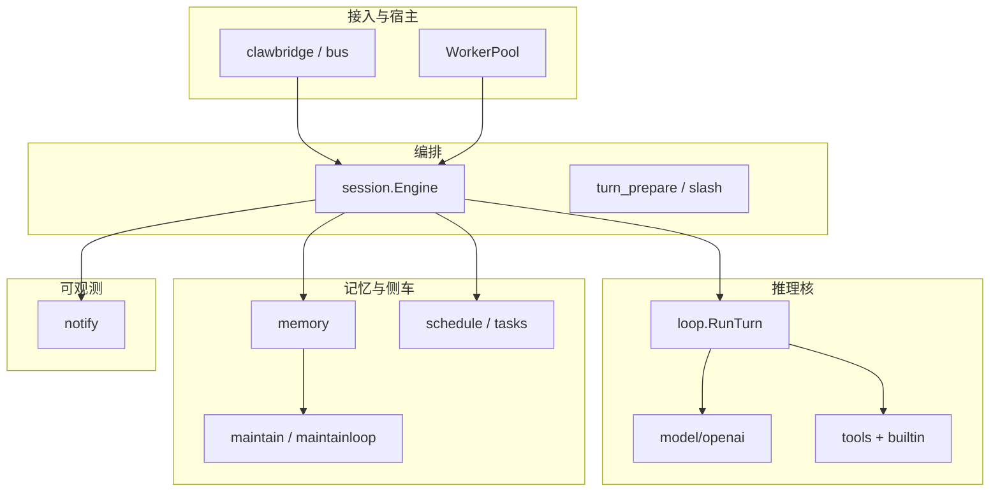

# 模块化、抽象与简化（优先于拆仓库）

## 1. 目标与顺序

| 优先级 | 方向 | 说明 |
|--------|------|------|
| **P0** | **抽象 / 简化** | 在**单仓库**内收紧边界、减少 `Engine` 与全局注册表的隐式耦合，便于测试与演进 |
| **P1** | **接口稳定后再考虑拆模块** | 将成熟边界以 **Go interface + 少量适配** 固化，必要时再抽到子模块或独立 repo |
| **后置** | **独立 repo** | 仅在 API 与发布节奏有明确外部消费者时再拆（见 §6） |

本文与 [`runtime-flow.md`](runtime-flow.md)（主路径）、[`code-simplification-opportunities.md`](code-simplification-opportunities.md)（已落实与待演进）互补；**不替代**各主题设计真源（入站/出站、memory、notify 等）。**Backlog 编号与各条目的对照表**见 [`todo.md`](todo.md) **§「架构模块化：backlog 对照」**（单一真源）。

---

## 2. 分层：自然接缝（便于抽象）

**结论**：**推理核**（`loop` + 模型 + 工具）与 **可观测**（`notify`）是相对清晰的底层；**编排层**（`session.Engine`）与 **配置/路径**（`config`、`UserDataRoot`）当前耦合最强，适合作为**抽象主战场**。

---

## 3. 建议的抽象方向（先做）

### 3.1 收窄 `session.Engine` 职责

**现状风险**：编排、transcript、notify、memory 布局、schedule 门控、出站等交织在同一执行路径，演进成本高（参见 [`code-simplification-opportunities.md`](code-simplification-opportunities.md) §4、`OutboundSender` 讨论）。

**建议**（渐进，不要求一次重构）：

- 将 **「出站解析 / Emit」**、**「维护触发条件」**、**「定时任务注入门控」** 收敛为可注入的 **小接口**（或显式依赖字段），避免继续在同一 struct 上堆全局可达状态。
- 与 **Turn 生命周期** 强相关的逻辑，优先落在 **`prepareSharedTurn` / `loop.RunTurn` / `PostTurn` 链**上，保持 **单一数据流** 可读性。

### 3.2 入站上下文与 `toolctx` 一致心智

**目标**：所有渠道最终进入同一套 **Turn 元数据**（来源、会话键、用户 id、correlation 等），与 [`inbound-routing-design.md`](inbound-routing-design.md) §2.1 的 **`ApplyTurnInboundToToolContext`** 语义对齐，避免「文档一套、调用处另一套」。

**简化**：

- 合并/澄清 **路由注册表** 的使用方式：**工具侧** **`tools/builtin.DefaultRegistry()`**（与出站正交）、**出站**可选 **`SinkRegistry` / `SinkFactory`** 演进，见 [`inbound-routing-design.md`](inbound-routing-design.md) §4–§5、[`code-simplification-opportunities.md`](code-simplification-opportunities.md) §2–§3。

### 3.3 Memory：读模型 vs 写模型（概念分层）

不强制立刻拆包，但在设计上区分：

- **读路径**：发现、`bundle`、inject、recall（含可选 `sessdb`）—— 面向「本轮 prompt 装配」。
- **写路径**：工具写文件、`PostTurn`、维护子任务 —— 面向「回合后/定时整理」。

便于后续若引入 **MemoryPlane 接口**，不会与「维护管线」绑死在同一类型上。

### 3.4 Notify：保持「薄、同步、可 recover」

与 [`notification-hooks-design.md`](notification-hooks-design.md) 一致：Hook **不阻塞**主推理；panic **recover**；载荷默认摘要。抽象阶段**不必**把 notify 拆仓库，只需避免从 notify 回调反向拉取重型子系统。

---

## 4. 简化清单（与现有文档对齐）

| 主题 | 参考 |
|------|------|
| `SubmitUser` / 本地 slash 共享 `prepareSharedTurn` | [`code-simplification-opportunities.md`](code-simplification-opportunities.md) §1 |
| `WorkerPool` vs 单测直接 `NewEngine` | 同文 §3、[`config.md`](config.md)「会话与多通道」、[inbound-routing-design.md](inbound-routing-design.md) §8 |
| 子 agent 工具表合成规则 | 同文 §2、[inbound-routing-design.md](inbound-routing-design.md) §9、`go doc subagent` |
| 出站 Emitter 与 `context` | 同文 §1、§4 |

---

## 5. 原则（避免无效拆分）

1. **先有稳定边界与接口，再谈子模块或独立 repo**；否则公共 API 会被 `PushRuntime`、路径、`agent_id` 等泄漏成第二个「全能配置」。
2. **抽象优先于文件搬家**：目录调整若无接口配合，只会打乱 blame，不降低复杂度。
3. **与产品形态对齐**：若主目标仍是「带记忆与 IM 的完整常驻进程」，单仓迭代通常优于多 repo；若未来要明确提供「仅嵌入推理核」，再按 §6 抽 `loop`+`tools` 等。

---

## 6. 后置：可能独立成库的方向（暂不实施）

仅作路线图占位；**当前默认不执行**。

| 候选 | 说明 |
|------|------|
| **`notify` + sinks** | 依赖面小，易版本化 |
| **`loop` + `model` + `tools` 核心** | 需先与 `session`/`memory` 解耦接口 |
| **`mcpclient`** | 通用 MCP 工具桥 |
| **`schedule` + `tasks`** | 与 `Engine` 门控解耦后再评估 |
| **`memory` 整包** | 需 **MemoryPlane** 级接口与配置迁移，工作量大 |

独立 **`cmd/maintain`** / `-maintain-once` 已是运维向拆分；是否单独 repo 由发布节奏决定，与代码抽象无必然先后。

---

## 7. 相关文档

| 文档 | 用途 |
|------|------|
| [`agent-runtime-golang-plan.md`](agent-runtime-golang-plan.md) | 总览包职责与阶段 |
| [`runtime-flow.md`](runtime-flow.md) | 进程与 `SubmitUser` 主路径 |
| [`todo.md`](todo.md) | 统一 backlog；**「架构模块化：backlog 对照」** 节含 #19–#27 与本文 §3 的映射表 |
| [`code-simplification-opportunities.md`](code-simplification-opportunities.md) | 具体简化点与 todo 交叉 |
| [`inbound-routing-design.md`](inbound-routing-design.md)、[`outbound-events-design.md`](outbound-events-design.md) | I/O 抽象 |
| [`notification-hooks-design.md`](notification-hooks-design.md) | 可观测边界 |

---

*修订：随抽象落地可更新 §3 中「建议」为「已落实」并指向 PR/提交；勾选与对照表以 [`todo.md`](todo.md) 为准。*
