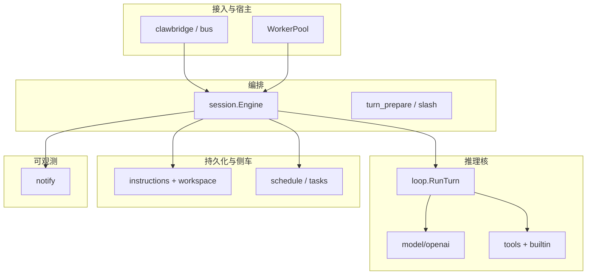

# 模块化、抽象与简化（优先于拆仓库）

## 1. 目标与顺序

| 优先级 | 方向 | 说明 |
|--------|------|------|
| **P0** | **抽象 / 简化** | 在**单仓库**内收紧边界、减少 `Engine` 与全局注册表的隐式耦合，便于测试与演进 |
| **P1** | **接口稳定后再考虑拆模块** | 将成熟边界以 **Go interface + 少量适配** 固化，必要时再抽到子模块或独立 repo |
| **后置** | **独立 repo** | 仅在 API 与发布节奏有明确外部消费者时再拆 |

本文与 [`runtime-flow.md`](runtime-flow.md)（主路径）互补；**未实现**的出站 / `context` 演进见下文 §3 草案。**不替代**入站/出站、notify 等专题设计真源。

---

## 2. 分层：自然接缝

**结论**：**推理核**（`loop` + 模型 + 工具）与 **可观测**（`notify`）是相对清晰的底层；**编排层**（`session.Engine`）与 **配置/路径**（`config`、`UserDataRoot`）当前耦合最强，适合作为**抽象主战场**。

---

## 3. 建议的抽象方向（先做）

### 3.1 收窄 `session.Engine` 职责

将 **出站解析 / Emit**、**定时任务注入门控** 等收敛为可注入的小接口（或显式依赖字段），避免在同一 struct 上堆全局可达状态。与 **Turn 生命周期** 强相关的逻辑保持在 **`prepareSharedTurn` → `loop.RunTurn`** 单一数据流上。

### 3.2 入站上下文与 `toolctx` 一致心智

所有渠道最终进入同一套 **Turn 元数据**，与 [`inbound-routing-design.md`](inbound-routing-design.md) §2.1 的 **`ApplyTurnInboundToToolContext`** 语义对齐。

### 3.3 指令与落盘

**读路径**：`instructions.BuildTurn`、布局解析、预算截断 —— 面向「本轮 prompt 装配」。**写路径**：工具写文件、`SaveTranscript`、`dialog_history` —— 与推理核解耦。

### 3.4 Notify

与 [`notification-hooks-design.md`](notification-hooks-design.md) 一致：Hook **不阻塞**主推理；panic **recover**；载荷默认摘要。

---

## 4. 可选演进（未实现）

出站进一步抽象（`SinkRegistry` / `SinkFactory`、`context` 透传入站元数据等）仍为草案，实现以 [`inbound-routing-design.md`](inbound-routing-design.md)、[`outbound-events-design.md`](outbound-events-design.md) 为准。

---

## 5. 相关文档

| 文档 | 用途 |
|------|------|
| [`agent-runtime-golang-plan.md`](agent-runtime-golang-plan.md) | 包职责摘要 |
| [`runtime-flow.md`](runtime-flow.md) | 进程与 `SubmitUser` 主路径 |
| [`inbound-routing-design.md`](inbound-routing-design.md)、[`outbound-events-design.md`](outbound-events-design.md) | I/O |
| [`notification-hooks-design.md`](notification-hooks-design.md) | 可观测边界 |
