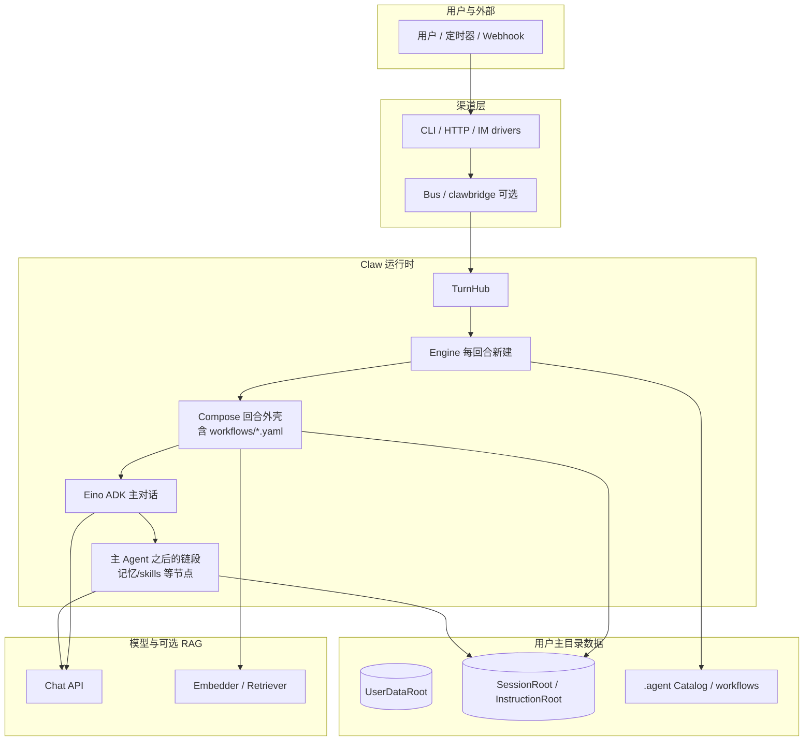
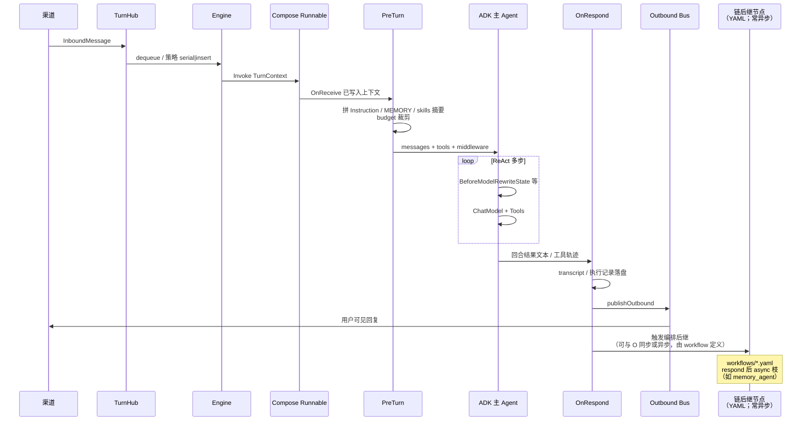
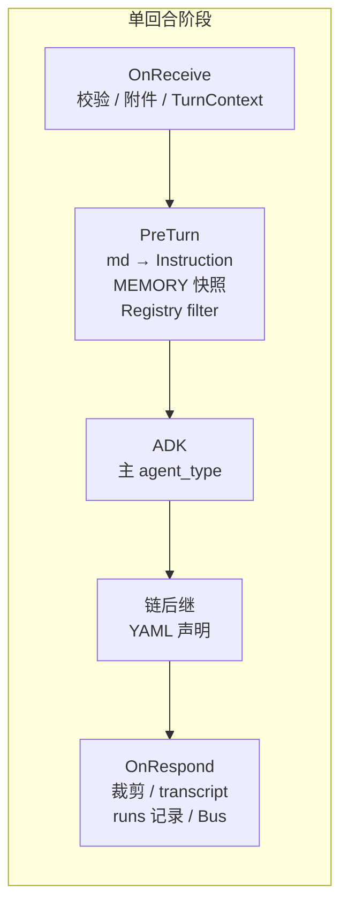
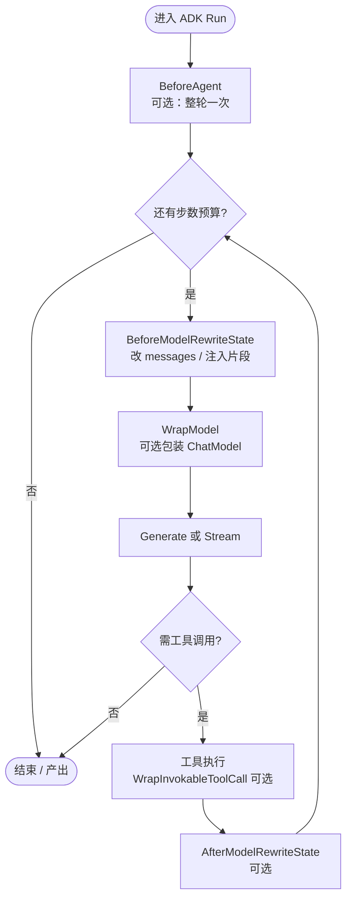
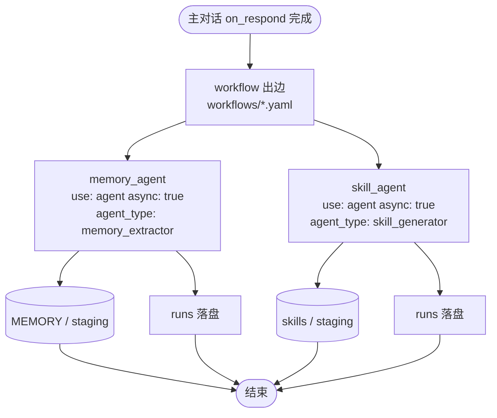
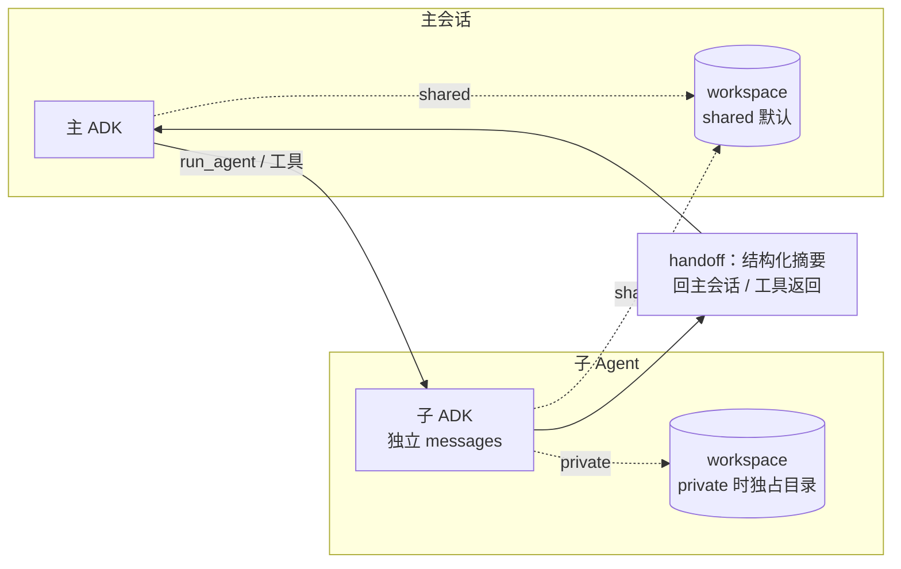
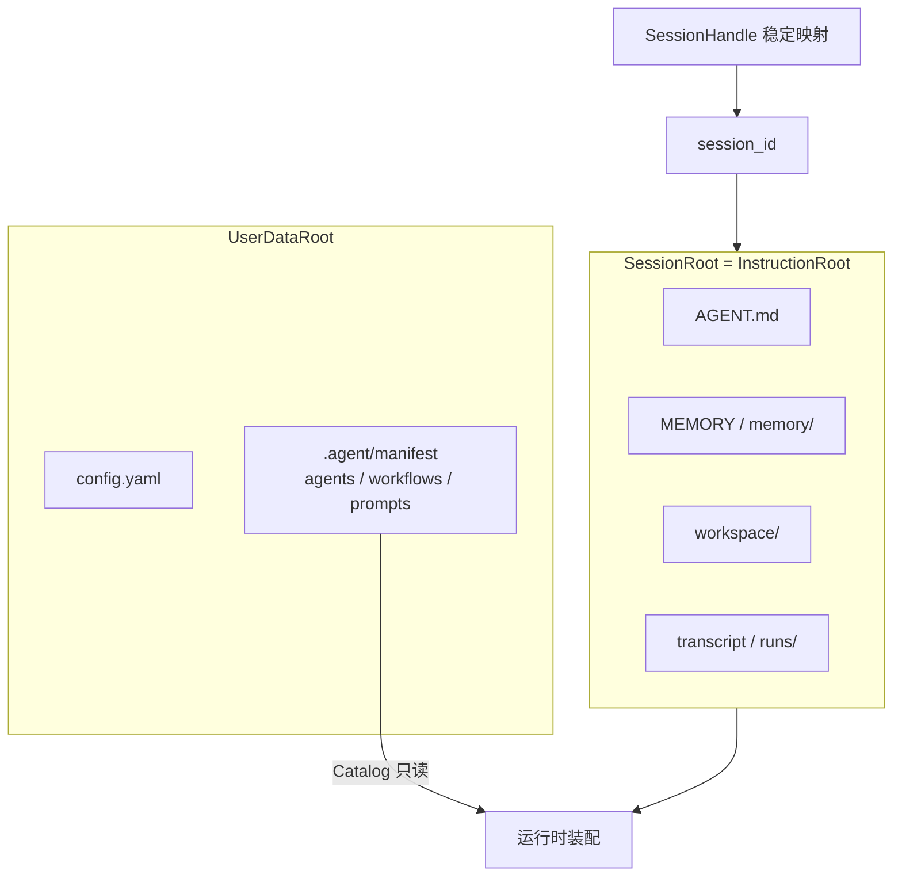
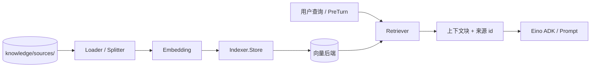
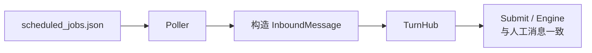

# Claw 运行时架构 — 主流程与生命周期

本文用 **文字 + Mermaid** 梳理 **主路径** 与关键子系统的 **生命周期**，与 [reference-architecture.md](reference-architecture.md)（原则）、[eino-md-chain-architecture.md](eino-md-chain-architecture.md)（Eino 挂载）、[appendix-data-layout.md](appendix-data-layout.md)（目录）、[requirements.md](requirements.md)（FR）一致。Eino **包级清单**见 [eino-integration-surface.md](eino-integration-surface.md)。

---

## 1. 文档定位

| 读者 | 本文提供 |
|------|-----------|
| 产品 / 架构 | 端到端流程、阶段划分、与渠道/数据的关系 |
| 实现 | 与 TurnHub、Compose、ADK、链后继节点、落盘的对齐关系 |
| 评审 | 演进枝叶（workflow）、子 Agent、Workspace 默认策略的可视化 |

---

## 2. 系统上下文（边界）

### 2.1 「PostTurn」与 `workflows/*.yaml`：编排即可，不必单独子系统

**可以**：记忆抽取、Skills 生成等 **全部是 Compose 图上的普通节点**，在 **`workflows/*.yaml`**（DAG；或由 manifest 引用的 workflow）里 **分支 / 汇合 / 异步枝** 声明即可 —— **不需要** 名为 PostTurn 的独立运行时模块；只要 **Workflow 注册表 + 执行器** 能实例化节点并沿边执行。字段、图模型与内置 `use` 见 **[workflows-spec.md](workflows-spec.md)**。

文档里的 **PostTurn** 仅是 **阶段别名**：指「**主对话 ADK 跑完之后**，在同一回合编排里 **排在后面的那一段链**」。实现上就是 **YAML 里 ADK 节点之后的若干节点**。

仍需显式策略的两点（**与是否叫 PostTurn 无关**）：

1. **异步**：用户应先收到 **OnRespond / Bus**，演进类节点 **后台执行** —— 在 YAML / manifest 用 **`async`、分叉边、队列** 等表达，由宿主解释（见 [eino-md-chain-architecture.md](eino-md-chain-architecture.md) §7）。
2. **编排**：主会话在 **`workflows/*.yaml`** 里用 **`memory_agent` / `skill_agent`** 等 **`use: agent` + `async: true`** 枝叶声明记忆抽取与 Skills（见 [workflows-spec.md](workflows-spec.md) §4.3、§8）；默认内置 Catalog 条目可被用户覆盖。**当前 oneclaw** **未**实现演进专用的加载期闭环校验，也 **未**在 **`TurnContext`** 上维护嵌套演进剖面。

---

## 3. 端到端主流程（单轮用户消息）

从入站到回复可见的 **主干**（省略流式 chunk 细节）。

---

## 4. 回合外壳生命周期（Compose 阶段）

与 [eino-md-chain-architecture.md](eino-md-chain-architecture.md) §3 对齐：**确定性节点** + **内核 ADK**。图中 **Q** 在实现上 **就是 workflow 图中主 ADK 之后的子图（常为 respond 出边或多枝）**，不必单独「PostTurn 服务」。

**持久化触点**：

- **OnReceive / OnRespond**：会话 transcript、本轮 **`runs/<agent_type>/`** 执行记录（见 FR-AGT-05 / FR-OBS-04）。
- **链后继（原 PostTurn 语义）**：MEMORY / skills 写入（经 staging / policy）；形状由 **YAML** 声明（**`async` 枝叶**）；与实现对齐见 [workflows-spec.md](workflows-spec.md) §6。

---

## 5. ADK 内核生命周期（单 Agent 一次运行）

单轮内 **模型 ↔ 工具** 循环与 Middleware 钩子（概念顺序；以 Eino 实际 API 为准）。

**Claw 关注点**：TurnHub insert、动态技能摘要、budget 裁剪 —— 多落在 **`BeforeModelRewriteState`**；观测可走 **callbacks**（见 [eino-integration-surface.md](eino-integration-surface.md)）。

---

## 6. 链后继演进生命周期（记忆 / Skills）

以下逻辑 **完全可用 `workflows/*.yaml` 的 DAG 中若干 `agent` 节点表达**；图仍沿用「主回合之后」的语义。展示 **角色拆分**（**`async`**）；默认模板为线性串联两 async 节点，并行扇出需自行构图（见 [workflows-spec.md](workflows-spec.md)）。

**硬性规则**：记忆抽取与 Skills 生成 **不在 Catalog 上用布尔开关声明**；由 **YAML 枝叶** + **内置 / 可覆盖的 Catalog 条目** 表达。**当前** **无**演进专用的加载期闭环校验与 **`TurnContext` 演进剖面**（见 [requirements.md](requirements.md) FR-FLOW-05）。

---

## 7. 子 Agent 生命周期（委托 / `run_agent`）

默认 **会话隔离 + 上下文隔离**；**Workspace 默认与主回合共享**（[requirements.md](requirements.md) FR-AGT-06）。

**落盘**：子运行优先使用 **`sessions/<parent>/subs/<sub_run>/`** 命名空间写 **runs / 可选 transcript**，避免与父 SessionRoot 混写（[appendix-data-layout.md](appendix-data-layout.md) §3.1）。

---

## 8. 会话与目录生命周期（推荐默认：会话隔离）

**扁平模式**（关闭隔离）：`InstructionRoot = UserDataRoot`，形状类似但根路径不同（见附录 §2）。

---

## 9. 可选：知识库 RAG 生命周期

与主对话 **并行可选**；索引为派生，**原文真源**仍在配置目录（FR-KNOW-*）。

---

## 10. 合成入站（定时）生命周期

与普通消息 **同形、同路径**（仅来源不同）。

---

## 11. 相关文档索引

| 主题 | 文档 |
|------|------|
| 术语 | [glossary.md](glossary.md) |
| 原则与场景 PRD 条目 | [reference-architecture.md](reference-architecture.md) |
| Eino + MD + Workflow 细节 | [eino-md-chain-architecture.md](eino-md-chain-architecture.md) |
| `workflows/*.yaml` 规格 | [workflows-spec.md](workflows-spec.md) |
| Eino API 清单 | [eino-integration-surface.md](eino-integration-surface.md) |
| 路径与隔离 | [appendix-data-layout.md](appendix-data-layout.md) |
| 功能 ID / 验收 | [requirements.md](requirements.md) |
| Harness 扩展 | [harness-governance-extensions.md](harness-governance-extensions.md) |

---

## 12. 修订记录

| 日期 | 说明 |
|------|------|
| 2026-05-02 | 首版：系统上下文、端到端序列图、Compose/ADK/子Agent/目录/RAG/定时 生命周期图；§2.1 后继编排；`chains` → `workflows`（DAG）；索引 [workflows-spec.md](workflows-spec.md) |
