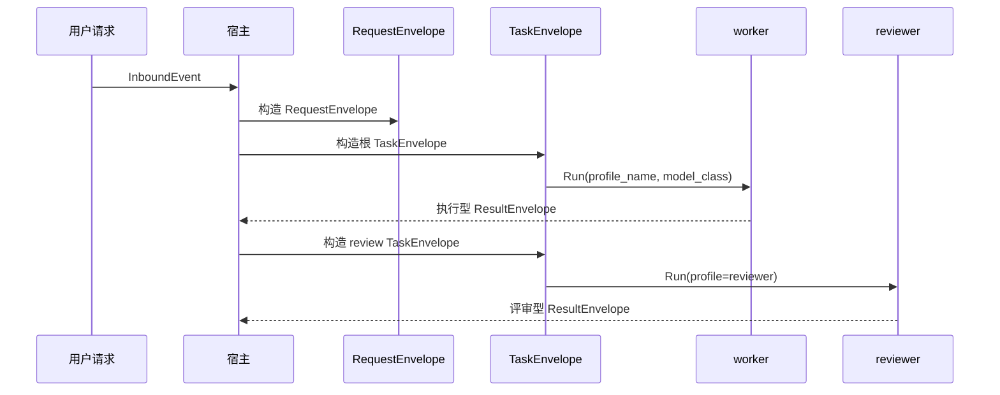

# ADR-003：任务编排信封与类型化元数据

## 状态

提议。

相关文档：

- [Agent Runtime 与学习闭环总览](./agent-runtime-and-learning-loop.md)
- [Agent Profile 与任务路由](../concepts/agent-profiles-and-routing.md)
- [运行时与会话模型](./runtime-and-session-model.md)
- [ADR-001：claw 模块边界与接口形态](./adr-001-module-boundaries.md)

## 背景

当前 `oneclaw` 的运行时主路径已经很清晰：请求进入宿主，经 `router / host / bus` 进入 `Loop.Run`。但随着默认形态转向混合型多 Agent，系统需要显式表达更多编排语义：

- 默认存在 `orchestrator -> worker -> reviewer` 的角色链
- 不同角色可能使用不同模型
- 执行与评价必须分离，避免自评闭环
- 学习闭环需要记录“是谁在什么任务上产出了什么结论和反馈”

如果这些信息长期隐含在自由 `Metadata` 中，会在以下场景失稳：

- 需要记录父子任务关系
- 需要做失败重试、resume 与结果重放
- 需要分析“是哪个 profile / 模型族产生了哪个写回”
- 需要把执行结果与评审结果区分存档
- 需要对编排行为进行审计与观测

## 决策

在保留 `Metadata` 扩展能力的前提下，为编排链路引入显式的**三层信封模型**：

1. `RequestEnvelope`
2. `TaskEnvelope`
3. `ResultEnvelope`

其中 `TaskEnvelope` 仍是运行时内部最核心的任务单元，但不再孤立存在，而是与请求入口和结果回流一起形成完整链路。

## 1. 引入 `RequestEnvelope`

建议由宿主在入口处构造逻辑上的 `RequestEnvelope`，统一承载顶层请求语义。

建议最少字段：

- `request_id`
- `trace_id`
- `source`
- `session_id`
- `user_goal`
- `requested_profile` 或等价路由提示
- `priority`
- `metadata`

`RequestEnvelope` 解决的是“外部到底请求了什么”，而不是“内部要拆成多少任务”。

## 2. 引入 `TaskEnvelope`

建议由宿主在进入 `Loop.Run` 前构造逻辑上的 `TaskEnvelope`，可映射到 `InboundEvent` / `RunInput`，但不要求一开始就重写全部已有结构。

建议最少字段：

- `task_id`
- `trace_id`
- `request_id`
- `session_id`
- `parent_task_id`
- `root_task_id`
- `profile_name`
- `task_kind`
- `goal`
- `model_class`
- `source`
- `correlation_id`
- `metadata`

其中：

- `profile_name` 用于说明角色身份
- `model_class` 用于说明该角色为什么使用这类模型
- `task_kind` 用于区分 `interactive`、`orchestration`、`background`、`review`

## 3. 引入 `ResultEnvelope`

建议为汇总、治理和学习闭环保留 `ResultEnvelope` 或等价结构，至少包含：

- `task_id`
- `trace_id`
- `profile_name`
- `result_kind`
- `summary`
- `payload`
- `write_intents`
- `next_actions`
- `review_of_task_id`

其中 `review_of_task_id` 用于让评审结果显式指向被评审任务，而不是只返回一段自由文本。

## 4. 把长期稳定字段从自由 `Metadata` 中提升出来

以下字段适合类型化，而不是长期依赖字符串键：

- `request_id`
- `profile_name`
- `model_class`
- `parent_task_id`
- `root_task_id`
- `task_kind`
- `correlation_id`
- `result_kind`
- `review_of_task_id`

`Metadata` 继续保留，但主要承载短生命周期、实验性或宿主私有字段。

## 5. 默认多 Agent 必须保留任务树关系

推荐约束：

- 每个子任务都有独立 `task_id`
- `root_task_id` 贯穿整条任务树
- 子任务显式记录 `parent_task_id`
- `session_id` 可派生，但不等于任务标识本身
- 若子任务允许异步或后台执行，则必须派生新的 `session_id`
- 评审任务应显式关联 `review_of_task_id`

这样可以避免把“请求”“任务”“会话”“评审目标”混成同一个概念。

## 6. 信封模型应支持执行与评价分离

默认运行时里，`reviewer` 只有评审权，不直接负责最终修复。

因此 `ResultEnvelope` 至少应支持两类结果：

- **执行结果**：实现、检索、摘要、工具操作产物
- **评审结果**：问题、风险、建议、回归点

推荐做法：

1. worker 返回执行型 `ResultEnvelope`
2. reviewer 返回评审型 `ResultEnvelope`
3. orchestrator 根据评审结果决定是否再派发修复任务

这可以从数据层避免“执行者自评即闭环”的隐性设计。

## 7. 类型化不等于把灵活性做死

设计目标不是替换所有 `Metadata`，而是把：

- 跨组件稳定字段
- 审计必需字段
- 编排语义核心字段
- 角色与评审边界字段

从自由文本键里提出来。

## 一个推荐模型

## 对现有架构的影响

### 对 `bus.InboundEvent`

`InboundEvent` 仍可保持通用，但宿主应逐步把关键编排字段提升为显式结构，而不是完全依赖 `Metadata`。

### 对 `host`

宿主成为最合适的 `RequestEnvelope` / `TaskEnvelope` 构造点，也是父子任务关系、模型路由和评审回流逻辑的持有者。

### 对 `agent.Loop`

`Loop` 依旧保持“单轮执行器”定位，不直接膨胀为复杂编排引擎。

### 对学习闭环

结构化结果会让写回治理、记忆沉淀和后续检索更容易区分：

- 谁执行了任务
- 谁审查了任务
- 哪些内容来自实现
- 哪些内容来自批评与风险判断

## 后果

### 优点

- 多 Agent 路由可观测、可审计、可重放。
- 父子任务、评审目标与会话边界更清晰。
- 异构模型分工可以在数据层显式表达。
- 后续接写回治理、resume 与结果汇总更自然。

### 代价

- 数据模型会比当前更重。
- 宿主需要承担更多结构化编排逻辑。
- 需要统一角色、结果和模型族的命名约定。

## 非目标

- 不要求首版就引入完整 DAG 调度器。
- 不要求内核直接暴露复杂工作流 DSL。
- 不试图完全消灭 `Metadata`。
- 不要求 `reviewer` 默认拥有自动修复权。

## 推荐后续实现

1. 先在文档与宿主示例中固定 `RequestEnvelope / TaskEnvelope / ResultEnvelope` 字段命名。
2. 再引入 `TaskEnvelope` / `ResultEnvelope` 结构体与最小映射层。
3. 最后再考虑更重的恢复、重试、重放、评审回流和可视化编排。
