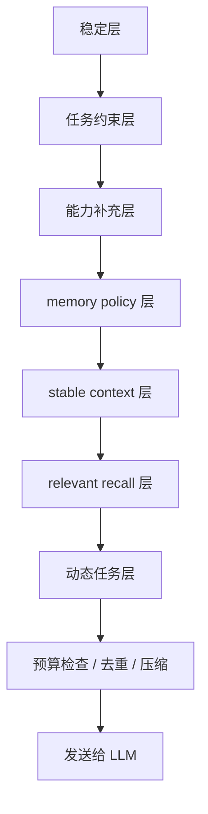

# ADR-004：上下文装配流水线

## 状态

提议。

相关文档：

- [默认自进化能力](../concepts/default-evolution.md)
- [Memory 架构](./memory-architecture.md)
- [工作区布局](../reference/workspace-layout.md)
- [ADR-001：claw 模块边界与接口形态](./adr-001-module-boundaries.md)

## 背景

`oneclaw` 当前已经明确了多种上下文来源：

- 工作区文件：`IDENTITY.md`、`SOUL.md`、`AGENTS.md`、`USER.md`
- Skills
- 记忆索引与 topic files
- 压缩摘要
- 相关记忆召回结果
- 后台沉淀结果

但“有哪些来源”不等于“如何稳定装配”。如果不把装配顺序、冲突优先级和预算控制定义清楚，系统在默认自进化成功之后反而会出现：

- 上下文越来越大
- 规则互相冲突
- 低风险沉淀意外覆盖高优先级约束
- 多 Agent 读取到不同质量的上下文

## 决策

将消息构造过程视为显式的上下文装配流水线，而不是零散拼接。

## 1. 定义来源分层

建议至少分为七层：

1. **系统稳定层**：`IDENTITY.md`、`SOUL.md`
2. **任务约束层**：`AGENTS.md`、`USER.md`
3. **能力补充层**：Skills、SOP
4. **memory policy 层**：memory 使用规则、保存规则、禁止保存规则
5. **stable context 层**：稳定项目上下文、记忆索引摘要、长期规则
6. **relevant recall 层**：基于当前任务召回的相关 topic 和片段
7. **动态任务层**：本轮用户输入、最近 turn、子任务结果、工具结果

这里最重要的变化是：**memory 不应再被视为单一“会话记忆层”**。

推荐借鉴 Claude Code，把 memory 相关输入拆成三路：

- `policy`：告诉模型如何使用和维护 memory
- `stable context`：提供稳定长期背景
- `relevant recall`：为当前任务补充相关证据

## 2. 定义优先级原则

默认建议：

- 稳定身份高于临时沉淀
- 明确任务约束高于一般能力说明
- memory policy 高于普通长期记忆正文
- 显式用户输入高于历史摘要
- relevant recall 只补充当前问题，不覆盖稳定规则
- 经审批的高风险规则高于低风险自动写入产物

低风险沉淀不应默认覆盖高优先级规则。

## 3. 定义预算策略

上下文预算不应只靠“超长就压缩”。

建议按层分配预算：

- 系统稳定层：固定保底
- 任务约束层：固定保底
- 能力补充层：按选择结果注入
- memory policy 层：固定小预算
- stable context 层：固定小预算
- relevant recall 层：按需注入，严格限额
- 动态任务层：优先保真

特别建议：

- `MEMORY.md` 必须保持短小，只承载索引
- 长正文应下沉到 topic files
- recall 预算应按 turn 限制，而不是默认全量加载

## 4. 定义压缩点位

建议把压缩视为流水线中的正式阶段，而不是事后补丁。

可选顺序：

在预算不足时，优先压缩或裁剪：

1. relevant recall
2. 历史摘要
3. 辅助型 Skills
4. stable context 中的低优先级索引内容

不应优先裁剪：

1. 本轮用户输入
2. 高优先级任务约束
3. 稳定身份层
4. memory policy

## 5. 定义去重与召回控制

Claude Code 最值得借鉴的一点，是把 memory 视为高价值补充，而不是无限历史。

推荐至少记录并控制：

- 已加载的 memory 路径
- 已 recall 的 topic
- 当前 turn surfaced bytes
- 已被任务读过或写过的内容片段

推荐原则：

1. 已进入上下文的 memory 不重复 recall
2. 已从工具结果获得的事实，不再重复通过 memory 注入
3. 索引与正文不能同时大段重复出现

## 6. 定义冲突处理

当内容来源冲突时，推荐至少记录：

- 冲突来源
- 被保留版本
- 决策原因

高风险规则与低风险沉淀冲突时，应默认前者胜出。

同样建议明确下面几个边界：

- memory 不等于 transcript
- memory 不等于 task
- memory 不等于当前 plan

## 7. 让多 Agent 共享同一装配原则

不同 `AgentProfile` 可以有不同的上下文预算和 Skills 集合，但不应拥有完全不同的冲突处理哲学，否则系统会失去整体一致性。

推荐差异只体现在：

- recall 预算大小
- 默认可见的 memory scope
- 是否拥有 agent memory / team memory
- 哪些 topic 对该角色默认可见

## 对现有架构的影响

### 对 `workspace`

工作区加载顺序继续保留，但需要被纳入更大的上下文装配模型。

### 对 `skills`

Skills 不只是“是否注入”，还要参与预算控制与优先级管理。

### 对 `memory`

memory 需要区分：

- policy
- stable context
- relevant recall
- 在线写入
- 增量提取
- 整理蒸馏

这些不应再被混成一个“会话记忆层”。

## 后果

### 优点

- 默认自进化不会因为“上下文越来越多”而反噬质量。
- 多来源内容可以更稳定地组合。
- 后续做长期记忆、多 Agent 和记忆维护时更容易保持一致性。
- 能更自然地接入 `MEMORY.md` 索引、topic files 和 relevant recall。

### 代价

- 消息构造逻辑会更正式、更复杂。
- 需要引入预算与冲突处理的显式策略。
- 需要维护索引长度、去重和 recall 限额。

## 非目标

- 不要求首版就有完美的 token 预算优化器。
- 不要求每一层都做复杂语义冲突检测。
- 不把所有装配策略塞进工作区 Markdown 自身。
- 不把 memory 设计成默认依赖向量库的黑盒召回系统。

## 推荐后续实现

1. 先在文档中固定 `policy / stable context / relevant recall` 三路注入模型。
2. 再把 `MEMORY.md` 定义为索引，把正文下沉到 topic files。
3. 在宿主或 `agent` 侧实现显式装配函数、去重和 recall 预算控制。
4. 最后补增量提取、整理蒸馏和 profile 级 memory scope 差异。
