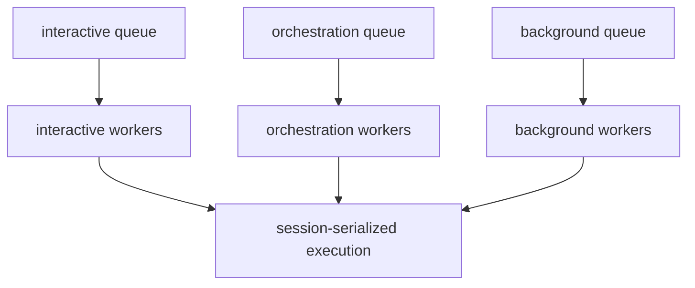

# ADR-005：工作负载分级与队列优先级

## 状态

提议。

相关文档：

- [运行时与会话模型](./runtime-and-session-model.md)
- [配置参考](../reference/config-reference.md)
- [路线图与长期方向](../notes/roadmap.md)

## 背景

当前 `oneclaw` 的并发模型很清晰：

- 同一会话串行
- 不同会话并行
- 背压通过队列满返回

这对最小可用内核是正确的。但随着以下能力默认化：

- `background_agent`
- 子会话编排
- Webhook 与自动化事件

系统会同时承载多种不同价值密度的工作。若所有任务共享同样的调度语义，容易出现：

- 前台交互被后台任务拖慢
- 分析任务占满队列
- 背景沉淀影响用户主路径体验

## 决策

为运行时引入工作负载分级概念，并在宿主层优先实现。

## 1. 推荐工作负载类别

| 类别 | 典型来源 | 目标 |
|------|----------|------|
| `interactive` | 用户直接输入、CLI、同步请求 | 优先保证响应时延 |
| `orchestration` | 路由、子任务分发、结果汇总 | 保证编排链路稳定 |
| `background` | 后台分析、周期任务、低优先级整理 | 不抢占主交互路径 |

## 2. 调度原则

- `interactive` 高于 `orchestration`
- `orchestration` 高于 `background`
- 后台任务默认应可延迟、可丢弃、可降频

## 3. 仍保留会话串行

引入优先级并不意味着打破“同一会话内串行”的基本模型。

推荐方式是：

- 先对任务分类
- 再决定进入哪个队列或 worker 池
- 最终在会话内保持确定性执行

## 4. `background_agent` 的默认要求

后台分析不应默认与用户主路径抢资源。

建议：

- 独立 debounce
- 可配置 interval
- 独立 worker 或独立队列
- 队列满时优先丢弃旧分析，而非阻塞前台输入

## 一个推荐模型

## 对现有架构的影响

### 对 `bus`

`bus` 可继续负责会话串行语义，但任务分类与优先级更适合由宿主在入队前决定。

### 对 `host`

宿主应承担工作负载分类、隔离队列与拒绝策略。

### 对 `scheduler`

自动化事件默认应归类为 `background` 或 `orchestration`，而不是直接与前台输入同权。

## 后果

### 优点

- 用户主路径响应更稳。
- 后台沉淀不会轻易反噬默认体验。
- 为后续多 Agent 与自动化扩展保留性能缓冲。

### 代价

- 调度模型更复杂。
- 宿主需要处理更多队列与拒绝策略。

## 非目标

- 不要求首版实现复杂全局调度器。
- 不要求内核原生支持抢占式执行。
- 不把优先级逻辑全部放入 `agent.Loop`。

## 推荐后续实现

1. 先在文档与配置中定义 `task_kind` / workload class。
2. 在宿主示例中把 `background_agent` 单独隔离。
3. 后续再评估更细粒度的优先级与容量策略。
