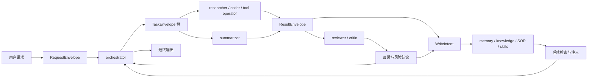

# Agent Runtime 与学习闭环总览

## 定位

本文给 `oneclaw` 一个总纲式描述：它不是单个大模型加若干工具，而是一个**默认多 Agent 的运行时**，并通过**外部化学习闭环**持续积累能力。

这份文档回答四个问题：

1. 默认为什么要多 Agent。
2. 不同模型为什么要在不同角色上分工。
3. 为什么执行和评价必须分离。
4. memory / knowledge / SOP / skills 如何成为系统成长闭环。

## 核心判断

1. 默认形态应为混合型多 Agent，而不是单 Agent。
2. 默认应允许异构模型协作，而不是要求所有角色共享同一个模型。
3. 执行角色不应对自己的结果做最终评价，评审必须由独立角色承担。
4. 系统成长依赖外部化写回与后续召回，而不是把更多历史硬塞回上下文。

## 默认角色分层

推荐至少包含三层角色：

| 层级 | 典型角色 | 主要职责 | 模型倾向 |
|------|----------|----------|----------|
| 编排层 | `orchestrator` | 接收请求、拆解任务、选择模型、分发与汇总 | 较强推理能力 |
| 执行层 | `researcher`、`coder`、`tool-operator`、`summarizer` | 检索、实现、工具操作、摘要整理 | 按任务在高智商与低时延间选择 |
| 评价层 | `reviewer` / `critic` | 审查结果、指出风险、给出回退建议 | 较强判断能力 |

其中 `reviewer` 默认只有评审权，不直接对产物做最终修复；它的输出应回流给 `orchestrator` 或对应 worker 再处理。

## 为什么默认需要多 Agent

默认多 Agent 不是为了“显得更高级”，而是解决三个工程问题：

1. **模型能力差异真实存在**  
   规划、编码、检索、工具驱动和审查并不适合用完全相同的模型配置。
2. **上下文与延迟目标冲突**  
   需要高智商的角色通常能接受更高延迟；需要高吞吐的角色则应尽量轻量。
3. **避免自评闭环**  
   同一个 agent 同时执行和评价，很容易把“解释自己为什么没问题”误当成质量保证。

## 一个统一视角

可以把 `oneclaw` 的主流程看成两条闭环同时运行：

1. **任务闭环**  
   `RequestEnvelope -> TaskEnvelope -> ResultEnvelope -> 用户输出`
2. **学习闭环**  
   `任务结果 -> WriteIntent -> 外部化载体 -> 后续检索与注入`

## 三层信封

为了让这套运行时可观测、可恢复、可治理，推荐把一次处理拆成三层信封：

### `RequestEnvelope`

表示对外入口视角的请求，负责承载：

- 请求来源
- 用户意图
- 路由提示
- 默认角色与模型选择约束

### `TaskEnvelope`

表示运行时内部的任务单元，负责承载：

- `task_id`
- `parent_task_id`
- `root_task_id`
- `session_id`
- `profile_name`
- `task_kind`
- `goal`
- `metadata`

### `ResultEnvelope`

表示子任务或一轮执行的结构化结果，负责承载：

- `task_id`
- `profile_name`
- `result_kind`
- `summary`
- `payload`
- `write_intents`
- `next_actions`

## 会话与任务的关系

默认多 Agent 运行时里，需要明确区分：

- **请求**：用户或外部事件发起的顶层意图
- **任务**：运行时拆分出的执行单元
- **会话**：某个执行线程的上下文边界

推荐约束：

1. 一个请求可以产生多个任务。
2. 一个任务可以拥有自己的执行会话。
3. 会话隔离不等于任务树隔离，任务关系必须显式保留。

## 学习闭环

`oneclaw` 的“成长”不应绑定在某个 agent 身上，而应绑定在整个运行时上。

默认建议沉淀四类载体：

- `memory`：短中期经验、摘要、偏好、任务结论
- `knowledge`：项目事实、设计说明、代码约束
- `SOP`：流程、清单、操作规范
- `skills`：角色能力说明、工具用法、风格约束

这些载体的共同要求是：

1. 外部化
2. 可审计
3. 可回滚
4. 可在后续任务中按需重新注入

## Memory 生命周期

借鉴 Claude Code，`oneclaw` 不应把 memory 简化为“最近摘要”或“长期记忆召回”其中之一，而应把它视为一个独立的生命周期：

1. **写入**  
   前台 agent 在任务中直接沉淀高确定性信息。
2. **增量提取**  
   专门流程从最近 turn 中补漏应沉淀的内容。
3. **整理蒸馏**  
   后台流程回看索引、topic files 和日志，做去重、纠错和收缩。
4. **发现与装配**  
   根据 scope、角色和当前任务发现可用 memory。
5. **按需召回**  
   只把与当前任务真正相关的部分注入上下文。

推荐把 memory 相关输入拆成三路：

- `policy`：进入 `system`，约束 memory 怎么用、怎么写
- `stable context`：进入 `messages` 开头，提供稳定长期背景
- `relevant recall`：作为 attachment 或等价结构补充当前问题

这样可以避免把 memory 退化成一大段长期常驻文本。

## 默认原则

### 模型分工

- `orchestrator` 和 `reviewer` 优先保证判断质量。
- `researcher` 和 `tool-operator` 优先保证吞吐和时延。
- `coder` 根据任务风险和修改范围选择更强或更快的模型。

### 执行与评价分离

- 执行 agent 负责产出结果，不负责给自己做最终质量裁决。
- `reviewer` 默认只返回问题、风险和建议，不直接闭环修复。
- 是否执行修复，应由 `orchestrator` 重新派单决定。

### 学习与治理并存

- 低风险经验允许自动沉淀。
- 高风险写回必须经过治理流水线。
- 学习闭环不应绕过权限、审计和回滚机制。

## 与其它文档的关系

- 运行时主路径：见 [运行时与会话模型](./runtime-and-session-model.md)
- memory 分层与召回：见 [Memory 架构](./memory-architecture.md)
- 角色与路由：见 [Agent Profile 与任务路由](../concepts/agent-profiles-and-routing.md)
- 编排信封：见 [ADR-003：任务编排信封与类型化元数据](./adr-003-orchestration-envelope.md)
- 上下文装配：见 [ADR-004：上下文装配流水线](./adr-004-context-assembly-pipeline.md)
- 工作负载优先级：见 [ADR-005：工作负载分级与队列优先级](./adr-005-workload-classes-and-priority.md)
- 自进化与沉淀：见 [默认自进化能力](../concepts/default-evolution.md)
