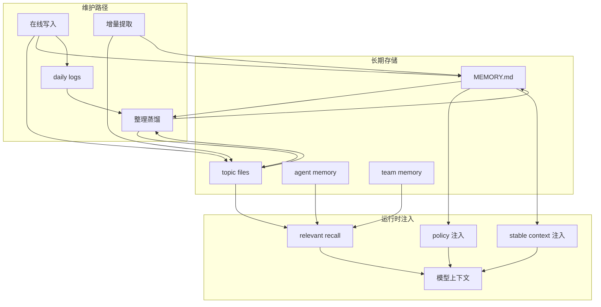

# Memory 架构

## 定位

本文说明 `oneclaw` 应如何借鉴 Claude Code 的 memory 体系。

核心结论只有一句：

**memory 不是聊天历史，也不是黑盒召回库，而是一个文件化、分作用域、受预算约束、可持续维护的长期上下文系统。**

## 边界

先把 memory 和几个相邻概念分开：

| 概念 | 作用 | 不应混淆为 |
|------|------|------------|
| `transcript` | 记录与恢复会话过程 | 长期知识 |
| `task` | 描述当前工作的拆解、进度、owner | 长期偏好或背景 |
| `plan` | 保存当前任务的实施方案 | 跨任务稳定事实 |
| `memory` | 保存跨会话、跨任务仍有价值的知识 | 当前过程状态 |

推荐原则：

- 能从代码直接推导出的事实，不优先写入 memory
- 当前任务待办、临时计划、瞬时工具输出，不应直接写入 memory
- 适合进 memory 的通常是偏好、背景、决策理由、协作经验、非代码可推导事实

## 设计目标

1. 跨会话保留高价值知识
2. 让记忆可见、可审计、可删除
3. 避免长期上下文污染
4. 兼容默认多 Agent 和异构模型
5. 不引入重型检索基础设施作为前提
6. 支持持续整理、纠错和去重

## 五层结构

推荐把 `oneclaw` 的 memory 子系统拆成五层：

### 1. 长期存储层

用于承载 durable memory：

- `MEMORY.md`
- topic files
- user memory
- project memory
- local memory
- agent memory
- team memory

### 2. 日志层

用于快速落下新信号，而不是立即精修 memory：

- daily logs
- background observation logs

### 3. 在线写入层

由前台 agent 在任务中直接写入：

- 用户明确要求记住
- 用户偏好被确认
- 项目背景被揭示
- 某次纠正未来仍然有价值

### 4. 增量提取层

专门从最近消息中补漏：

- 只看最近 turn
- 对照已有索引
- 批量读、批量写
- 尽量避免重复

### 5. 整理蒸馏层

定期回看 memory 与日志，做：

- consolidation
- 去重
- 纠错
- 收缩索引
- 更新 topic 组织

## 存储模型

### `MEMORY.md` 只做索引

`MEMORY.md` 应是高频入口文件，但不是正文仓库。

它负责：

- 给出当前作用域 memory 地图
- 列出 topic files
- 给每个 topic 一个简短钩子

它不应承载：

- 大段正文
- 全量历史
- 详细推理过程

### topic files 承载正文

topic files 负责保存具体内容，例如：

- 用户偏好
- 项目背景
- 决策理由
- 协作反馈
- 外部系统入口

### daily logs 承担快写职责

这类存储更偏：

- 先快写
- 后整理

它不是最终 memory 形态，而是 write-optimized 层。

## 作用域模型

推荐至少支持五种 scope：

| scope | 适合存什么 |
|-------|------------|
| `user` | 跨项目仍成立的偏好与习惯 |
| `project` | 当前仓库专属背景、约束、决策 |
| `local` | 本机私有环境信息，不一定进版本控制 |
| `agent` | 某类 agent 的角色经验 |
| `team` | 多个协作 agent 共享的长期背景 |

## 三路注入

Claude Code 最值得借鉴的一点，是不要把所有 memory 都混成同一路输入。

`oneclaw` 推荐采用三路注入：

### 1. policy 注入

进入 `system`，用于告诉模型：

- memory 在哪里
- 应该怎么保存
- 什么不该保存

### 2. stable context 注入

进入 `messages` 开头的 meta message，承载：

- 项目规则
- 用户长期约束
- 稳定索引摘要

### 3. relevant recall 注入

作为 attachment 或等价结构注入，承载：

- 基于当前问题召回的相关 topic
- 当前任务真正需要的补充证据

这三层不要混在一起。

## 召回策略

relevant recall 不应每轮全量注入，而应：

1. 根据当前任务或最近用户输入触发
2. 优先读取 `MEMORY.md` 索引，再决定展开哪些 topic
3. 只注入和当前问题真正相关的片段
4. 避免与已在上下文中的内容重复

这意味着 recall 是补充证据，而不是第二条长期消息流。

## 维护路径

推荐把写入维护拆成三条路径：

### 在线写入

前台 agent 直接沉淀高确定性信息。

### 增量提取

由专门的 extraction 流程从最近 turn 中补漏。

### 整理蒸馏

由后台 consolidation 流程回看：

- `MEMORY.md`
- topic files
- daily logs
- 必要时少量 transcript

再进行合并、修正和收缩。

## 预算与去重

如果不控制，memory 很容易退化成上下文垃圾堆。

推荐至少做四层控制：

1. `MEMORY.md` 字节和行数上限
2. 已注入路径去重
3. relevant recall 去重
4. surfaced bytes 上限

核心原则是：

**memory 是高价值补充，不是无限历史。**

## 对 `oneclaw` 的直接建议

1. 继续坚持文件化优先，不以向量库作为第一前提
2. 把 `MEMORY.md` 定义为索引，而不是正文
3. 在 `ADR-004` 中把 memory 从单一“会话记忆层”拆成 policy / stable context / recall 三层
4. 在默认自进化文档中补上“在线写入 / 增量提取 / 整理蒸馏”三条维护路径
5. 为 `agent` 和 `team` 预留独立 memory scope

## 一个推荐模型

