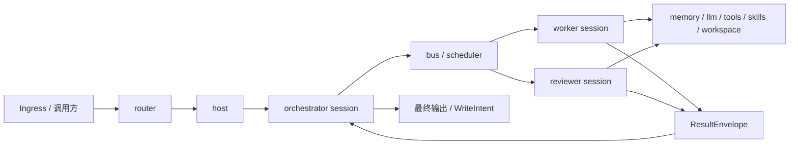
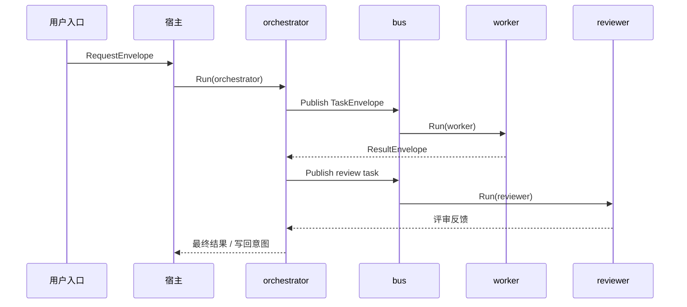

# 运行时与会话模型

本文解释 `oneclaw` 的默认运行时主路径：请求如何进入 `orchestrator`，如何拆成任务树，如何在多个执行会话中运行，以及为什么这套模型既适合默认多 Agent，也适合持续学习和成长。

## 运行时主路径

## 核心对象

| 对象 | 作用 |
|------|------|
| `RequestEnvelope` | 对外入口视角的请求外壳 |
| `TaskEnvelope` | 运行时内部任务单元 |
| `SessionID` | 执行会话隔离键 |
| `bus` | 按会话串行投递并承载任务调度 |
| `host` | 组装 `router + bus + loop + scheduler` 的宿主 |
| `RunInput` | `Loop.Run` 的本轮输入 |
| `ResultEnvelope` | 结构化任务结果与反馈 |

## 为什么默认是多会话

`oneclaw` 默认不是一个主线程包打天下，而是：

1. 一个 `orchestrator` 会话负责拆解和汇总。
2. 若干 worker 会话负责执行专精任务。
3. 至少一个独立 `reviewer` 会话负责质量判断。

这样设计有三个直接收益：

- 不同角色可以选用不同模型。
- 执行和评价天然分离，避免自评闭环。
- 子问题的上下文、权限和工具面更容易隔离。

## 为什么仍然按会话串行

这里采用更严格也更容易实现的约束：

- **同一 `SessionID` 内始终串行**
- **子 agent 如果允许异步执行，就必须创建新的 `SessionID`**

也就是说，同一 `SessionID` 内不应并发跑多个 `Loop`，因为这会带来：

- 同一会话上下文竞态
- 记忆、摘要和工具结果追加顺序不稳定
- `trace_id`、`task_id` 与 transcript 更难审计
- resume、sidechain transcript 和后台任务恢复更脆弱

更推荐的模型是：

- `orchestrator` 和用户当前交互会话走前台同步路径
- 同步子任务可以复用当前任务链路，但仍按会话串行推进
- 异步或后台子任务必须派生新的 `SessionID`，再由新会话独立执行

因此，并发边界明确落在“跨 `SessionID`”层，而不是在单个会话内部做并发。

不同 `SessionID` 之间仍可以并行。

## 一次请求里发生什么

1. 调用方提交请求，宿主构造 `RequestEnvelope`
2. `router` 或 `host` 选择默认 `orchestrator` profile
3. `orchestrator` 会话进入自己的 `Loop.Run`
4. 宿主或 `orchestrator` 生成一组 `TaskEnvelope`
5. `bus / scheduler` 把子任务投递到不同 worker 会话
6. worker 运行各自的 `Loop.Run`，返回 `ResultEnvelope`
7. `reviewer` 会话读取结果并产出评审反馈
8. `orchestrator` 汇总执行结果与评审结论，决定：
   - 直接返回
   - 派发修复任务
   - 生成写回意图

## 任务、会话与角色的区别

运行时里最容易混淆的是三件事：

| 概念 | 解决的问题 |
|------|------------|
| 请求 | 用户或外部系统想让 `oneclaw` 完成什么 |
| 任务 | 系统为完成请求拆出的执行单元 |
| 会话 | 某个执行线程的上下文边界 |

推荐约束：

- 一个请求可以产生多个任务
- 一个任务通常绑定一个主要执行会话
- 一个会话可以跨多轮执行同一任务，但不应丢失任务树关系

## 默认角色布局

推荐至少保留下面几类默认 profile：

- `orchestrator`：拆解任务、选择模型、汇总结果
- `researcher`：探索、检索、收集事实
- `coder`：实现修改和局部验证
- `tool-operator`：高吞吐工具调用、环境操作
- `summarizer`：生成压缩摘要和可写回结论
- `reviewer`：独立评审，仅返回问题与建议

其中 `reviewer` 默认只有评审权，不直接做最终修复。

## 为什么这条模型适合持续学习

持续学习依赖“可稳定读写外部化载体”，而不是一次性上下文技巧。

按任务与会话分离的模型更容易做到：

- 记忆追加顺序明确
- 不同角色沉淀不同类型的经验
- 评审结论与执行结论分开归档
- 高风险写回可按 `trace_id + task_id + profile_name` 审计

## 与异构模型的关系

默认多 Agent 运行时应允许至少两类模型策略：

- **高智商模型**：用于 `orchestrator`、`reviewer`、高风险 `coder`
- **低时延模型**：用于 `researcher`、`tool-operator`、低风险整理类任务

这意味着路由不仅决定“把任务给谁”，也决定“这类角色应该用什么模型族”。

## 工作负载分级

随着 `background_agent`、自动化事件与任务树编排引入，运行时不应把所有任务视为同权。

推荐至少区分：

- `interactive`：用户主路径
- `orchestration`：拆解、分发、汇总、评审回流
- `background`：后台分析、长期整理、周期性学习

优先级与队列隔离建议见 [ADR-005：工作负载分级与队列优先级](./adr-005-workload-classes-and-priority.md)。

## 一个典型时序

## 维护建议

遇到运行时设计讨论时，优先检查以下问题：

1. 新能力是在宿主层扩展，还是在内核里破坏主路径？
2. 它是否仍然保留按会话串行的确定性？
3. 它是否强化了默认多 Agent 分工，而不是把所有职责重新塞回一个 agent？
4. 它是否继续保证执行与评价分离？
5. 它是否让记忆、知识、SOP、Skills 的写回更容易审计？

## 相关文档

- [Agent Runtime 与学习闭环总览](./agent-runtime-and-learning-loop.md)
- [ADR-001：模块边界与接口形态](./adr-001-module-boundaries.md)
- [ADR-003：任务编排信封与类型化元数据](./adr-003-orchestration-envelope.md)
- [ADR-005：工作负载分级与队列优先级](./adr-005-workload-classes-and-priority.md)
- [默认自进化能力](../concepts/default-evolution.md)
- [Agent Profile 与任务路由](../concepts/agent-profiles-and-routing.md)
- [运维速查与排错](../reference/runbook-troubleshooting.md)
