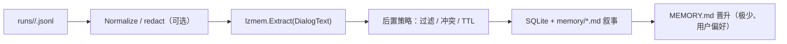
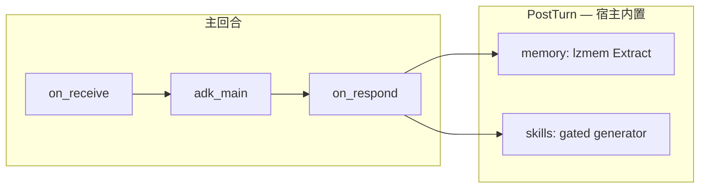

# PostTurn 内置演进方案（方案 1）：记忆 + Skills

本文给出 **「演进不设独立 Agent」** 的一体化口径：**回合结束后**，宿主用 **确定性流水线 +（必要时）单次结构化模型调用**，在同一套证据源上完成 **记忆抽取** 与 **Skills 提炼/创建**。  

适用于想把默认路径收窄为 **简单、可测、低耦合**：新人只需理解「本会话的 Run Journal」「结构化记忆」「`skills/` 树」，而不必先掌握 **`memory_extractor` / `skill_generator` 子 Agent**。

**阅读关系**：Run Journal / lzmem / 文件真源细节见 [memory-and-session.md](memory-and-session.md)；演进曾仅用 workflow `agent_task` 的描述见 [requirements.md](requirements.md) FR-FLOW-05、[workflows-spec.md](workflows-spec.md)；能力与 **`skill-creator`** 的产品语境见 [simplicity-roadmap.md](simplicity-roadmap.md)。

---

## 1. 文档定位

| 维度 | 说明 |
|------|------|
| **本文回答什么** | 默认产品上「演进」如何 **内置**：证据从哪来、记忆与 Skills **各自的流水线**、与 **`skill-creator`** 目录契约如何对齐、编排层 **删掉异步 Agent** 后怎么占位 |
| **本文不回答什么** | 不设 Harness Policy / staging / PR；不写具体 HTTP/SDK 字段（随上游 lzmem / Chat API 变更） |
| **与现状对齐** | **记忆**：主回合 **`structuredmem`（`on_respond` 后）→ `lzmem.Extract`** + journal/md/sqlite + `MEMORY.md` 晋升路径 **已实现**，可按本文收敛异步 **`memory_extractor`**。**Skills**：当前仍以 **`skill_generator` Agent + workflow** 为主流之一；下文 §5 给出 **内置形态的推荐契约**，便于实现时在 **`runner/wfexec/structuredmem` 旁增设一条 Skill 流水线** |

---

## 2. 目标与非目标

### 2.1 目标

- **单一真源**：每轮 **`runs/<agent>/<correlation_id>.jsonl`**（含 `user_message`、`tool_call`、`tool_result`、`assistant_message`、`run_complete` 等）作为 **记忆与 Skills 的共同证据**；参见 [memory-and-session.md §3.3](memory-and-session.md)。
- **进程内闭环**：PostTurn 在宿主 goroutine（同步阻塞用户下一轮可选 / **async fire-and-forget** 仍可由 workflow **`noop`/Lambda** 触发同一 Go API）完成；**不再默认拉起第二个 ChatModelAgent + tool ReAct** 来做两件雷同的事。
- **Skills 与记忆解耦又同源**：同一输入可以 **分叉两条流水线**（记忆 lzmem；Skills 另一 Prompt/schema），或 **一次结构化输出**（见 §5.2）；共用门禁（budget、敏感字段剔除）。
- **可渐进**：先用内置接管默认路径；保留 **`agents/memory_extractor.md` / `agents/skill_generator.md`** 为高级用户或调试 overrides（可选）。

### 2.2 非目标

- **不为 Skills 在内置路径默认放开任意 shell / MCP**：写入范围仍守 **`UserDataRoot/skills/<id>/`** 与白名单扩展名（与现有工具策略一致）。
- **不把 transcript.jsonl 当演进主证据**：跨轮摘要仍可只用 user/assistant；**演进语义以 Run Journal 为准**（含 tool）。

---

## 3. 统一证据输入（Run Journal）

每一宿主回合产出一份 JSONL（每行一个 **`session.RunEvent`**），字段语义固定：

| Phase（示例） | 用途 |
|---------------|------|
| `run_start` / `run_complete` | 生命周期与机型、workflow、`correlation_id` |
| `user_message` | 本轮用户句 |
| `tool_call` / `tool_result` | **工具名、参数摘要、结果摘要**（写入 lzmem 前的原文证据） |
| `assistant_message` | 对用户可见最终答复 |

**原则**：内置演进 **只消费这份 JSONL 文本**（或等价 []byte），不要再拼「第二条叙事 transcript」，避免双轨漂移。

---

## 4. 记忆演进（内置）

### 4.1 流水线（推荐）



与实现对齐要点：

- **入口**：`wfexec.extractStructuredMemoryFromMainTurn` → **`structuredmem.AppendExtractJournal`**（详见仓库 `structuredmem/*.go`）。
- **输入**：优先 **整文件读取 Run Journal**；缺失时回落 `User: …\nAssistant: …`（不应依赖常态）。
- **后置**：在 SQLite / markdown journal 之前可做 **类型门禁、冲突消解、瞬时条目剔除**（见 `structuredmem/extract_postprocess.go` 一类逻辑）。

### 4.2 落盘与检索（不改 PRD 路径）

- **结构化**：`memory/structured_sqlite.db`（lzmem）+ **Isolation**（tenant/session/agent）。
- **叙事**：`memory/<UTC-yyyy-mm>/<UTC-yyyy-mm-dd>.md`（便于人类审计）。
- **短注入**：`MEMORY.md`（≤2048B）仅承载 **高置信、长期、用户显式偏好**。

### 4.3 与异步 `memory_extractor` 的关系

| 方式 | 说明 |
|------|------|
| **收敛默认** | `default.turn` **去掉** `memory_agent` 异步枝；记忆只靠内置。
| **保留开关（可选）** | `config` 或 workflow 条件节点：**debug / 实验** 再挂上 Agent，用于对比 Prompt。

---

## 5. Skills 演进（内置）

Skills 的目标不是「再聊天」，而是 **把重复成功的路径固化成 `skills/<id>/SKILL.md`（+ 可选脚本）**，供下一轮 PreTurn / 工具加载。**skill-creator** 提供的 **`SKILL.md` 结构、触发词与安全边界** 应视为 **产出契约的范本**（见 `setup/templates/skills/skill-creator/`）。

### 5.1 何时触发（门禁，必选）

内置路径必须 **克制**，避免每轮都写 skill。门禁分为 **「新建 / 泛化固化」** 与 **「已有 Skill 改进」** 两条（满足其一且未被否决时再调用 Skills LLM）。

#### 5.1.1 新建或从零固化（默认要严格）

**硬门槛**：统计 **`runs/<agent>/<correlation_id>.jsonl`** 中 **`phase == tool_call`** 的行数（一次调用一行）；**至少 ≥ 5** 才允许进入「创建新 Skill / 把本轮规程写成新 skill」的生成链路。

- **语义**：「本轮」= **与该 `correlation_id` 绑定的单次宿主回合**（一次用户发起的主 Agent Run）；计数来源于 Run Journal，**与 transcript 是否折叠无关**。
- **常量**：`5` 为产品常量（建议 **`config` / Catalog 可配**，文档层默认写死为 5）。

未达到 5 次 tool 调用：**默认不**自动生成新 Skill（噪音大、容易把半成品写成规程）。

#### 5.1.2 已有 Skill 使用受阻 → 改进 / 迭代（可豁免次数）

当本轮存在 **「用过 Skill，但需要改进」** 的证据时，**不要求**满足 §5.1.1 的 5 次调用下限即可允许「更新现有 Skill」类链路。

典型信号（实现时用启发式 + 可选用户一句话确认即可）：

- PreTurn 注入过 **`skills/`** 摘要或本轮上下文标明 **`skill_id`**，且后续 **`tool_result`** 带 **`[tool_error]`** / 连续修正同类路径；
- 用户明确表示：**步骤不对、环境变了、Skill 过时、请求改写 SKILL**；
- 助手回复中承认：**规程缺步骤 / 与当前仓库不符**（可作弱信号，需防误判）。

此类场景的产出应以 **`skill_id` 不变、`SKILL.md` 补丁式修订** 为主，避免新建泛滥。

#### 5.1.3 显式口令（兜底）

用户明确口令（如「写成 skill」「固化」「改进某某 skill」）时：**可走单独门禁**——要么仍需 §5.1.2（改进既有）；若是「凭空新建」，建议仍要求 **≥5 次 tool** **或** 用户提供足够材料（例如粘贴完整步骤），由 Prompt 约束模型不要随便扩张 scope。

#### 5.1.4 小结

| 目标 | 与 §5.1.1（≥5 tool_call）关系 |
|------|-------------------------------|
| **新建 Skill** | 一般 **必须满足** |
| **改进已有 Skill** | **豁免**：依赖 §5.1.2 |
| **用户显式** | **兜底**：见 §5.1.3 |

默认：**不满足上表任一适用分支 → 不调用 Skills LLM**。

### 5.2 产出契约（推荐）

二选一（由实现选型）：

**A. 独立第二次调用（与记忆对称）**

- 输入：同上 Run Journal（可加现有 digest：`skills/` 索引摘要）。
- 输出：**严格 JSON**（或其它 schema），例如：`skill_id`（slug）、`title`、`when_to_use`、`steps`、`safety_notes`、`files_to_write[]`。
- 宿主校验：`skill_id` 合法字符、路径不落库外、体积上限。

**B. 单次结构化多输出**

- 一次 Chat Completions `response_format`/tool schema，同时产出 **`memories[]`** + **`skill_candidates[]`**。
- 优点：省一次 RTT；缺点：Prompt 更重，失败时要整体重试。

无论 A/B，**写入磁盘**建议仍走 **与 `write_file` 相同校验层**（或共用一小段「atomic write tree」库函数），避免内置路径绕过 Harness。

### 5.3 落盘布局（与 skill-creator 对齐）

推荐最小落盘：

```text
UserDataRoot/skills/<skill_id>/
  SKILL.md              # frontmatter + 正文（与 skill-creator 示例一致）
  scripts/              # 可选
  reference/            # 可选
```

可选：`skills/<skill_id>/_meta.json` 记录来源 `correlation_id`、生成时间、模型版本，便于审计与回滚。

### 5.4 与异步 `skill_generator` Agent 的关系

| 方式 | 说明 |
|------|------|
| **收敛默认** | `default.turn` **去掉** `skill_agent` 异步枝；固化仅内置触发。
| **Agent 改为高级** | 仅在「用户要打补丁」「要多工具浏览仓库」时启用（仍可读到 Run Journal）。 |

---

## 6. 编排层取舍（`default.turn`）

**方案 1 推荐默认图**：



与当前模板差异：**去掉** `memory_agent`、`skill_agent` 两个 **`async: true` + `agent_task`** 节点（或合并为一个 **`async` Lambda**，内部顺序调用 `ExtractMemory` → `MaybeExtractSkills`）。

异步语义保持不变：**不阻塞**对用户响应时可 fire-and-forget；失败 **slog + 指标**，不重试拖垮主进程（与 FR 异步一致性一致）。

---

## 7. 观测、调试与安全

| 项 | 建议 |
|----|------|
| **关联键** | 全程携带 **`correlation_id`**；Skills meta 可写入 `_meta.json` |
| **日志** | `structuredmem.*`、`skill_extract.*`（预留）与现有 `wfexec.run_journal.*` 同级 |
| **隐私** | Run Journal 写入 tool 前已在条目侧截断；内置流水线入口可再加一层脱敏（路径 token、PII） |
| **回滚** | Skills 写入采用「先写临时再 rename」或 git；记忆侧沿用 lzmem 审计/TTL（以上游能力为准） |

---

## 8. 分阶段落地建议

| 阶段 | 内容 |
|------|------|
| **P0** | 默认 workflow **关闭**异步 `memory_extractor`（若与内置重复）；文档与用户指引指向 Run Journal + structuredmem |
| **P1** | 实现 **Skills 内置门禁 + JSON 契约 + 写 `skills/<id>/SKILL.md`**；CLI `--dry-run` 打印候选 |
| **P2** | 合并 Prompt（单次结构化输出）或接入用量驱动的触发；Dashboard / `config` 开关 |

---

## 9. 风险与何时保留独立 Agent

| 风险 | 缓解 |
|------|------|
| **内置 Prompt 迭代变慢**（相对「用户改 `agents/*.md`」） | 提供 **`prompts/post_turn_skill.md`** 纯文本覆盖 + 热更新；或保留 Agent 为可选 |
| **复杂仓库导航**（Skills 需多读文件） | 内置路径只做「生成 SKILL.md」；**深度重构**仍可走交互式主 Agent + `skill-creator` 工具 |
| **双写回归** | 集成测试固定：**一轮只产生一种演进写入路径**（默认） |

---

## 10. 相关文档

- [memory-and-session.md](memory-and-session.md) — Run Journal、lzmem、MemoryRecall、`MEMORY.md`
- [simplicity-roadmap.md](simplicity-roadmap.md) — skill-creator 与能力固化产品语境
- [requirements.md](requirements.md) — FR-FLOW-05（演进编排）
- [workflows-spec.md](workflows-spec.md) — PostTurn、`agent_task` 约定
- [appendix-data-layout.md](appendix-data-layout.md) — `UserDataRoot` / `skills/` 路径

---

## 11. 修订记录

| 日期 | 说明 |
|------|------|
| 2026-05-05 | 初版；§5.1 Skills 门禁：**新建**须本轮 Run Journal 内 **tool_call ≥ 5**；**改进既有 Skill**（用过且遇阻）豁免次数；显式口令兜底 |
