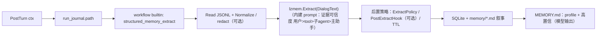
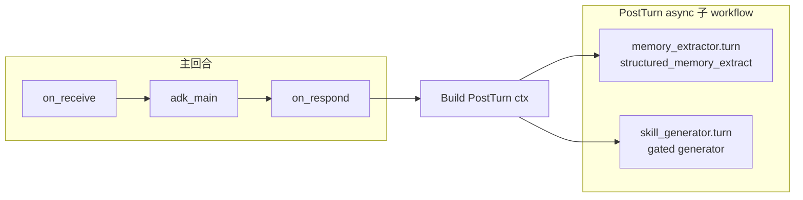

# PostTurn 内置演进方案（方案 1）：显式 ctx + 记忆 + Skills

本文给出 **「演进逻辑内置，编排仍交给 workflow」** 的一体化口径：**回合结束后**，宿主把本轮 **PostTurn ctx** 显式传给子 workflow；子 workflow 用 **确定性内置节点 +（必要时）单次结构化模型调用**，在同一套证据源上完成 **记忆抽取** 与 **Skills 提炼/创建**。

适用于想把默认路径收窄为 **简单、可测、低耦合**：新人只需理解「显式 PostTurn ctx」「本会话的 Run Journal」「结构化记忆」「`skills/` 树」。`memory_extractor` / `skill_generator` 仍可作为 **子 workflow 宿主** 存在，但默认不依赖第二个 ChatModelAgent 自行 ReAct 判断是否读 journal / 是否调用工具。

**阅读关系**：Run Journal / lzmem / 文件真源细节见 [memory-and-session.md](memory-and-session.md)；演进曾仅用 workflow `agent_task` 的描述见 [requirements.md](requirements.md) FR-FLOW-05、[workflows-spec.md](workflows-spec.md)；能力与 **`skill-creator`** 的产品语境见 [simplicity-roadmap.md](simplicity-roadmap.md)。

---

## 1. 文档定位

| 维度 | 说明 |
|------|------|
| **本文回答什么** | 默认产品上「演进」如何 **内置**：PostTurn ctx 怎么显式传给所有子 Agent、证据从哪来、记忆与 Skills **各自的流水线**、与 **`skill-creator`** 目录契约如何对齐、编排层如何保留异步 workflow 但去掉不确定 ReAct |
| **本文不回答什么** | 不设 Harness Policy / staging / PR；不写具体 HTTP/SDK 字段（随上游 lzmem / Chat API 变更） |
| **与现状对齐** | **记忆**：**`memory_extractor.turn`** 内 **`structured_memory_extract` → `structuredmem.AppendExtractJournal` → `lzmem.Extract`** + journal/md/sqlite + `MEMORY.md` 晋升路径 **已实现**；宿主 **`$runtime.post_turn.ctx`** 传入 Run Journal 路径。**Skills**：当前仍以 **`skill_generator` Agent + workflow** 为主流之一；下文 §5 给出 **内置形态的推荐契约**，便于实现时让 `skill_generator.turn` 复用同一份 PostTurn ctx |

---

## 2. 目标与非目标

### 2.1 目标

- **单一真源**：每轮 **`runs/<agent>/<correlation_id>.jsonl`**（含 `user_message`、`tool_call`、`tool_result`、`assistant_message`、`run_complete` 等）作为 **记忆与 Skills 的共同证据**；参见 [memory-and-session.md §3.3](memory-and-session.md)。
- **显式 ctx 传递**：宿主在 `agent_task` 触发 PostTurn 子 workflow 时，显式传入同一份 **PostTurn ctx**（host agent、correlation、session、run journal 路径等）；**所有子 Agent 都能拿到**，避免子 Agent 依赖 `subs/` 自身 session 去猜宿主上下文。
- **确定性闭环**：PostTurn 可继续用 workflow 的 **`async: true` fire-and-forget** 承载，但记忆抽取默认由 builtin 节点直接执行；**不再默认拉起第二个 ChatModelAgent + tool ReAct** 来判断是否读取 journal / 是否调用抽取工具。
- **Skills 与记忆解耦又同源**：同一输入可以 **分叉两条流水线**（记忆 lzmem；Skills 另一 Prompt/schema），或 **一次结构化输出**（见 §5.2）；共用门禁（budget、敏感字段剔除）。
- **可渐进**：先用内置接管默认路径；保留 **`agents/memory_extractor.md` / `agents/skill_generator.md`** 为高级用户或调试 overrides（可选）。

### 2.2 非目标

- **不把显式 ctx 当权限放大器**：ctx 可携带路径、ID、大小等运行元数据，但不携带 secret；读取文件仍要做路径白名单与规范化校验。
- **不为 Skills 在内置路径默认放开任意 shell / MCP**：写入范围仍守 **`UserDataRoot/skills/<id>/`** 与白名单扩展名（与现有工具策略一致）。
- **不把 transcript.jsonl 当演进主证据**：跨轮摘要仍可只用 user/assistant；**演进语义以 Run Journal 为准**（含 tool）。

---

## 3. 统一证据输入（Run Journal）

每一宿主回合产出一份 JSONL（每行一个 **`session.RunEvent`**），字段语义固定：

| Phase（示例） | 用途 |
|---------------|------|
| `run_start` / `run_complete` | 生命周期与机型、workflow、`correlation_id` |
| `user_message` | 本轮用户句 |
| `tool_call` / `tool_result` | **工具名、参数摘要、结果摘要**（写入 lzmem 前的原文证据） |
| `assistant_message` | 对用户可见最终答复 |

**原则**：内置演进 **只消费这份 JSONL 文件**（或等价 []byte），不要再拼「第二条叙事 transcript」，避免双轨漂移。

### 3.1 PostTurn ctx（显式传给所有子 Agent）

PostTurn 子 workflow 的入口不应只拿一个不透明字符串（例如单独的 `correlation_id`），而应拿到宿主显式构造的 ctx。ctx 是 **运行元数据契约**，不是模型 prompt 契约；既可以被渲染成 YAML/JSON 文本传给 `on_receive`，也可以由 workflow runtime 作为结构化字段提供给后续节点。

推荐最小字段：

```yaml
post_turn_ctx:
  correlation_id: "<current turn correlation id>"
  host_agent_id: "<main catalog agent id>"
  session_segment: "<logical session segment>"
  session_root: "<absolute host session root>"
  instruction_root: "<absolute instruction root>"
  user_data_root: "<absolute user data root>"
  run_journal:
    scope: current_turn
    dir: "<session_root>/runs/<host_agent_id>"
    path: "<session_root>/runs/<host_agent_id>/<correlation_id>.jsonl"
    size_bytes: 1234
```

约束：

- **所有 PostTurn 子 Agent 使用同一份 ctx**：`memory_extractor`、`skill_generator` 或未来其它演进子 workflow 都从这里取 `run_journal.path`、`host_agent_id`、`correlation_id`。
- **ctx 必须描述宿主回合**：即使子 Agent 运行在 `subs/<subRunID>/` 下，记忆与 Skill 演进仍读取宿主 `session_root/runs/<host_agent_id>/<correlation_id>.jsonl`，不要读取子 Agent 自己的 run journal。
- **路径只作能力输入，不作安全豁免**：builtin 节点读取 `run_journal.path` 前必须 `Clean`/`EvalSymlinks`（可用时）并校验其位于 `session_root/runs/<host_agent_id>/` 下。

---

## 4. 记忆演进（内置）

### 4.1 流水线（推荐）



推荐实现要点：

- **入口**：新增 workflow builtin 节点（建议名 **`structured_memory_extract`** 或 **`extract_structured_memory`**），由 `memory_extractor.turn` 显式调用；节点内部复用 `structuredmem.AppendExtractJournal`（详见仓库 `structuredmem/*.go`）。
- **输入**：只接收 **Run Journal 文件路径**（来自 PostTurn ctx 的 `run_journal.path`），节点自行读取文件内容并传给 lzmem；默认不再把整段 JSONL 放进模型 prompt。
- **回退策略**：不要把 `User: …\nAssistant: …` 作为常态回退。若 `run_journal.path` 缺失、越权或为空，节点应返回软失败（warn + 指标）或可配置硬失败，而不是拼第二套 transcript。
- **宿主上下文**：抽取落盘与 isolation 使用 ctx 里的 `session_segment` / `host_agent_id` / `instruction_root`，不要使用子 Agent 的 `subs/` session root 推导宿主路径。
- **后置**：**瞬时类 transient** 由 lzmem **`ExtractPolicy`**（`structuredmem.AppendExtractJournal` 默认开启）；**同批次事实冲突**由 lzmem **`PostExtractHook`** 或 future **槽位模型**（§10 P2）处理，**不在** oneclaw 写死短语规则。

`memory_extractor.turn` 推荐形态：

```yaml
workflow_spec_version: 2
id: memory_extractor.turn
description: PostTurn memory workflow; receives explicit post_turn_ctx from host.
meta:
  transcript_mode: summary
nodes:
  receive:
    use: on_receive
    input: $start.user_prompt
  extract:
    use: structured_memory_extract
    input: $nodes.receive
    depends_on: [receive]
  summarize:
    use: noop
    input: $nodes.extract
    depends_on: [extract]
end: summarize
```

宿主把 PostTurn ctx 放进 `agent_task` 侧送入子 workflow 的 **`$start.user_prompt`**（多为 YAML/JSON 文本或单行 `run_journal.path`）。`on_receive` 归一化后输出由 **`$nodes.receive`** 传给 `structured_memory_extract`；节点从该字符串解析 `run_journal.path`，或在单行模式下直接把整段当作绝对路径。后续若模板支持结构化 `$start.*` 字段，仍可改为直传 path，但默认依赖 **`receive → extract`** 的数据流即可。

### 4.2 落盘与检索（不改 PRD 路径）

- **结构化**：`memory/structured_sqlite.db`（lzmem）+ **Isolation**（tenant/session/agent）。
- **叙事**：`memory/<UTC-yyyy-mm>/<UTC-yyyy-mm-dd>.md`（便于人类审计）。
- **短注入**：`MEMORY.md`（≤2048B）自动区块同步 **`profile`** 且 **`confidence`≥宿主阈值**（默认 0.80）的条目，**无**关键字过滤 ——筛选责任在内建抽取 Prompt（**`prompt-default-v3`**）。

### 4.3 与异步 `memory_extractor` 的关系

| 方式 | 说明 |
|------|------|
| **推荐默认** | `default.turn` 保留 `memory_agent` 异步枝，但它运行的是 **确定性 `memory_extractor.turn` workflow**：接收 PostTurn ctx → 调 builtin 抽取 → noop/摘要收口。 |
| **禁用主链路内置抽取** | 主回合 `on_respond` **不再**同步调用结构化抽取（原 `extractStructuredMemoryFromMainTurn` 已移除），避免阻塞用户响应与双写。 |
| **调试开关（可选）** | `config` 或 workflow 条件节点可切回 LLM 版 `memory_extractor`，用于对比 Prompt，但默认不走模型 ReAct。 |

---

## 5. Skills 演进（内置）

Skills 的目标不是「再聊天」，而是 **把重复成功的路径固化成 `skills/<id>/SKILL.md`（+ 可选脚本）**，供下一轮 PreTurn / 工具加载。**skill-creator** 提供的 **`SKILL.md` 结构、触发词与安全边界** 应视为 **产出契约的范本**（见 `setup/templates/skills/skill-creator/`）。

### 5.1 何时触发（门禁，必选）

内置路径必须 **克制**，避免每轮都写 skill。门禁分为 **「新建 / 泛化固化」** 与 **「已有 Skill 改进」** 两条（满足其一且未被否决时再调用 Skills LLM）。

#### 5.1.1 新建或从零固化（默认要严格）

**硬门槛**：统计 **`runs/<agent>/<correlation_id>.jsonl`** 中 **`phase == tool_call`** 的行数（一次调用一行）；**至少 ≥ 5** 才允许进入「创建新 Skill / 把本轮规程写成新 skill」的生成链路。

- **语义**：「本轮」= **与该 `correlation_id` 绑定的单次宿主回合**（一次用户发起的主 Agent Run）；计数来源于 Run Journal，**与 transcript 是否折叠无关**。
- **常量**：`5` 为产品常量（建议 **`config` / Catalog 可配**，文档层默认写死为 5）。

未达到 5 次 tool 调用：**默认不**自动生成新 Skill（噪音大、容易把半成品写成规程）。

#### 5.1.2 已有 Skill 使用受阻 → 改进 / 迭代（可豁免次数）

当本轮存在 **「用过 Skill，但需要改进」** 的证据时，**不要求**满足 §5.1.1 的 5 次调用下限即可允许「更新现有 Skill」类链路。

典型信号（实现时用启发式 + 可选用户一句话确认即可）：

- PreTurn 注入过 **`skills/`** 摘要或本轮上下文标明 **`skill_id`**，且后续 **`tool_result`** 带 **`[tool_error]`** / 连续修正同类路径；
- 用户明确表示：**步骤不对、环境变了、Skill 过时、请求改写 SKILL**；
- 助手回复中承认：**规程缺步骤 / 与当前仓库不符**（可作弱信号，需防误判）。

此类场景的产出应以 **`skill_id` 不变、`SKILL.md` 补丁式修订** 为主，避免新建泛滥。

#### 5.1.3 显式口令（兜底）

用户明确口令（如「写成 skill」「固化」「改进某某 skill」）时：**可走单独门禁**——要么仍需 §5.1.2（改进既有）；若是「凭空新建」，建议仍要求 **≥5 次 tool** **或** 用户提供足够材料（例如粘贴完整步骤），由 Prompt 约束模型不要随便扩张 scope。

#### 5.1.4 小结

| 目标 | 与 §5.1.1（≥5 tool_call）关系 |
|------|-------------------------------|
| **新建 Skill** | 一般 **必须满足** |
| **改进已有 Skill** | **豁免**：依赖 §5.1.2 |
| **用户显式** | **兜底**：见 §5.1.3 |

默认：**不满足上表任一适用分支 → 不调用 Skills LLM**。

### 5.2 产出契约（推荐）

二选一（由实现选型）：

**A. 独立第二次调用（与记忆对称）**

- 输入：同一份 PostTurn ctx 指向的 Run Journal（可加现有 digest：`skills/` 索引摘要）。
- 输出：**严格 JSON**（或其它 schema），例如：`skill_id`（slug）、`title`、`when_to_use`、`steps`、`safety_notes`、`files_to_write[]`。
- 宿主校验：`skill_id` 合法字符、路径不落库外、体积上限。

**B. 单次结构化多输出**

- 一次 Chat Completions `response_format`/tool schema，同时产出 **`memories[]`** + **`skill_candidates[]`**。
- 优点：省一次 RTT；缺点：Prompt 更重，失败时要整体重试。

无论 A/B，**写入磁盘**建议仍走 **与 `write_file` 相同校验层**（或共用一小段「atomic write tree」库函数），避免内置路径绕过 Harness。

### 5.3 落盘布局（与 skill-creator 对齐）

推荐最小落盘：

```text
UserDataRoot/skills/<skill_id>/
  SKILL.md              # frontmatter + 正文（与 skill-creator 示例一致）
  scripts/              # 可选
  reference/            # 可选
```

可选：`skills/<skill_id>/_meta.json` 记录来源 `correlation_id`、生成时间、模型版本，便于审计与回滚。

### 5.4 与异步 `skill_generator` Agent 的关系

| 方式 | 说明 |
|------|------|
| **推荐默认** | `default.turn` 保留 `skill_agent` 异步枝，但它接收与 `memory_extractor` 相同的 **PostTurn ctx**，先按 §5.1 门禁判断是否需要调用 Skills LLM。 |
| **确定性优先** | 门禁、路径校验、写入 `skills/<id>/` 由宿主 builtin / Go 服务执行；LLM 只负责生成候选内容，不负责决定文件系统权限。 |
| **Agent 改为高级** | 仅在「用户要打补丁」「要多工具浏览仓库」时启用交互式 Agent（仍从 ctx 读到宿主 Run Journal）。 |

---

## 6. 编排层取舍（`default.turn`）

**方案 1 推荐默认图**：



与当前模板差异：

- **保留** `memory_agent`、`skill_agent` 两个 **`async: true` + `agent_task`** 节点，作为 PostTurn 子 workflow 的承载点。
- `agent_task` 的输入不再只是 `$runtime.run_journal.current_turn_metadata` 这类不透明字符串，而是宿主构造的 **PostTurn ctx**；至少包含 `run_journal.path`。
- `memory_extractor.turn` 默认不再是 `on_receive -> llm -> on_respond`，而是 `on_receive -> structured_memory_extract -> noop/summary`。

异步语义保持不变：**不阻塞**对用户响应时可 fire-and-forget；失败 **slog + 指标**，不重试拖垮主进程（与 FR 异步一致性一致）。

推荐 `default.turn` 形态（示意）：

```yaml
memory_agent:
  use: agent_task
  async: true
  agent_type: memory_extractor
  input: $runtime.post_turn.ctx
  depends_on: [respond]
skill_agent:
  use: agent_task
  async: true
  agent_type: skill_generator
  input: $runtime.post_turn.ctx
  depends_on: [respond]
```

实现过渡期若只支持字符串模板，可让 `$runtime.post_turn.ctx` 渲染为 YAML/JSON 文本；后续再升级为结构化 `NodeInput.Data`，保证节点无需从自然语言 prompt 里猜路径。

---

## 7. 观测、调试与安全

| 项 | 建议 |
|----|------|
| **关联键** | 全程携带 **`correlation_id`**；Skills meta 可写入 `_meta.json` |
| **日志** | `structuredmem.*`、`skill_extract.*`（预留）与现有 `wfexec.run_journal.*` 同级 |
| **ctx 审计** | 记录传给子 Agent 的 ctx 摘要（不含 secret），至少包含 `correlation_id`、`host_agent_id`、`run_journal.path`、`size_bytes` |
| **隐私** | Run Journal 写入 tool 前已在条目侧截断；builtin 读取入口可再加一层脱敏（路径 token、PII） |
| **回滚** | Skills 写入采用「先写临时再 rename」或 git；记忆侧沿用 lzmem 审计/TTL（以上游能力为准） |
| **路径安全** | `structured_memory_extract` 只允许读取 ctx 指定 session 的 `runs/<host_agent_id>/*.jsonl`，拒绝任意路径与 symlink 越界 |

---

## 8. 分阶段落地建议

| 阶段 | 内容 |
|------|------|
| **P0** | 实现 **PostTurn ctx** 构造与传递；所有 `agent_task` 子 workflow 都能拿到宿主 `run_journal.path`、`host_agent_id`、`correlation_id` |
| **P1** | 新增 **`structured_memory_extract` workflow builtin**：接收 Run Journal 文件路径，校验路径，读取 JSONL，复用 `structuredmem.AppendExtractJournal`；关闭主回合 `on_respond` 同步抽取，避免双写 |
| **P2** | 将 `memory_extractor.turn` 模板改成确定性流水线；实现 **Skills 内置门禁 + JSON 契约 + 写 `skills/<id>/SKILL.md`**；CLI `--dry-run` 打印候选 |
| **P3** | 合并 Prompt（单次结构化输出）或接入用量驱动的触发；Dashboard / `config` 开关 |

---

## 9. 风险与何时保留独立 Agent

| 风险 | 缓解 |
|------|------|
| **子 Agent 读错 session**（读到 `subs/` journal） | 所有 PostTurn 子 workflow 只读显式 ctx 的宿主 `run_journal.path`；builtin 做路径白名单校验 |
| **双写回归** | 集成测试固定：主回合 `on_respond` 与 `memory_extractor.turn` **只启用一种**结构化记忆写入路径 |
| **内置 Prompt 迭代变慢**（相对「用户改 `agents/*.md`」） | 提供 **`prompts/post_turn_skill.md`** 纯文本覆盖 + 热更新；或保留 Agent 为可选 |
| **复杂仓库导航**（Skills 需多读文件） | 内置路径只做「生成 SKILL.md」；**深度重构**仍可走交互式主 Agent + `skill-creator` 工具 |

---

## 10. 模块边界：`github.com/lengzhao/memory` 与 oneclaw

下文假定 **`lengzhao/memory`（lzmem）** 由同一维护者演进，目标是把 **「可复用的记忆语义」** 放进库，把 **「Claw/oneclaw 产品与编排」** 留在应用仓。

### 10.1 宜放在 `lengzhao/memory`（库）

| 类别 | 内容 | 说明 |
|------|------|------|
| **存储与检索** | SQLite schema、迁移、`Recall`/FTS、Isolation（tenant/user/session/agent）、TTL、软删、审计字段 | 任何宿主都应同一套数据语义 |
| **抽取内核** | `Extractor`、`ExtractRequest`（`DialogText`、`MinConfidence`、`DryRun`）、默认 **抽取 Prompt / JSON schema**、与模型 HTTP 的最小适配 | 避免每个宿主复制一套「对话→条目」 |
| **条目语义** | `Namespace`、confidence/importance、幂等键、合并与版本字段 | 库内定义「记忆是什么」 |
| **通用后置策略（推荐下沉）** | **置信度门槛过滤**、**按 namespace 丢弃规则**（如默认弱化纯瞬时时间类 `transient`）、**通用冲突模型**（实体 + 槽位 + `supersedes`/版本链） | **置信度 + transient 噪声**：已实现 **`ExtractPolicy` / `PostExtractHook`**（§10.3 P1）；**通用槽位冲突**仍为 P2；**`profile` 语义与助手/用户边界**在内建 Prompt（**`prompt-default-v3`**）；oneclaw **`MEMORY.md`** 仅按 **`profile` + 模型 confidence 阈值** 同步，无短语规则 |
| **可观测** | 抽取耗时、token、错误分类（不含宿主 slog 前缀） | 便于库独立演进 |

原则：**不依赖** `session.RunEvent`、`wfexec`、`paths.SessionRoot`、`MEMORY.md` 字节上限等 **Claw 专有类型与路径**。

### 10.2 宜留在 oneclaw（当前项目）

| 类别 | 内容 | 说明 |
|------|------|------|
| **证据采集与形状** | Run Journal 写入（`tool_call`/`tool_result`/…）、`TurnRunJournalPath`、`correlation_id`、PostTurn ctx 构造与子 Agent 传递 | 编排与会话目录布局是产品决策 |
| **模型配置接线** | `config.ModelProfile` → lzmem `LLMConfig`（API Key、base URL、模型名） | 绑定 oneclaw `config`/`catalog` |
| **文件真源落地** | `memory/<yyyy-mm>/<yyyy-mm-dd>.md` 叙事追加、`MEMORY.md` **≤2048B** 自动区块与 **晋升文案规则**（如仅「用户显式称呼偏好」） | PRD §3.4.1 / 阶段 6 路径 |
| **Skills 全线** | §5 门禁（≥5 tool、skill 遇阻）、写 `UserDataRoot/skills/<id>/`、与 `skill-creator` 对齐 | **不属于**通用记忆库职责 |
| **强产品启发式** | 特定会议名 / 组织缩写等冲突 | **不进**默认 oneclaw：做成 **宿主 `PostExtractHook`** 或 lzmem **槽位模型**（P2） |

原则：**库输出「结构化 ExtractResult + 持久化行」**；**宿主决定「额外写哪些 md、注入哪些块、何时跑抽取」**。

### 10.3 迁移优先级建议（给你维护两仓时用）

1. **P1（高收益）**：在 lzmem 增加 **`ExtractPolicy` 或 `MemoryExtractHooks`**（过滤 transient、最小置信度、可选冲突消解钩子），oneclaw 删冗长 `filter*` / 部分 `detect*` 或改为注册默认策略。  
   - **已实现（2026-05-06）**：lzmem **`ExtractPolicy`**、**`PostExtractHook`**、**`prompt-default-v3`**（**`profile`** 用户边界）；oneclaw **`StructuredMemoryExtractRequest`**；**`MEMORY.md`** 仅 **`profile`+confidence 阈值**，无短语。**不设**内置短语冲突消解（宿主 Hook / P2）。  
2. **P2**：库内 **通用槽位冲突**（`entity_type` + `slot` + `value` + `supersedes_id`），产品专用短语只做「槽位填充」适配层。  
3. **P3**：Markdown 渲染 `FormatExtractResultMarkdown` ——可留在 oneclaw（展示格式产品相关），或在 lzmem 提供 **`render/memory_journal.md.tmpl`** 可选包。

### 10.4 Skills 与 lzmem

**Skills 创建/改进不进 `lengzhao/memory`**：它与「用户长期事实记忆」生命周期不同（目录在 `skills/`、门禁不同、评审不同）。若将来要共用「一次 LLM 出 memories + skill_candidates」，可在 **oneclaw** 做一个薄 **`PostTurnEvolution`** 服务，内部分别调 **lzmem.Extract** 与 **SkillGenerator（Go）**；不必把 Skill 表并进记忆 SQLite。

---

## 11. 相关文档

- [memory-and-session.md](memory-and-session.md) — Run Journal、lzmem、MemoryRecall、`MEMORY.md`
- [simplicity-roadmap.md](simplicity-roadmap.md) — skill-creator 与能力固化产品语境
- [requirements.md](requirements.md) — FR-FLOW-05（演进编排）
- [workflows-spec.md](workflows-spec.md) — PostTurn、`agent_task` 约定
- [appendix-data-layout.md](appendix-data-layout.md) — `UserDataRoot` / `skills/` 路径

---

## 12. 修订记录

| 日期 | 说明 |
|------|------|
| 2026-05-05 | 初版；§5.1 Skills 门禁：**新建**须本轮 Run Journal 内 **tool_call ≥ 5**；**改进既有 Skill**（用过且遇阻）豁免次数；显式口令兜底 |
| 2026-05-05 | §10：**lzmem vs oneclaw** 职责边界与迁移优先级 |
| 2026-05-06 | §4.1 / §10.3：**`prompt-default-v3`**（profile 用户边界）、**ExtractPolicy** / **PostExtractHook**；**`StructuredMemoryExtractRequest`**；**`MEMORY.md`** 完全信任模型 **`profile`+confidence** |
| 2026-05-06 | §3 / §4 / §6：改为 **显式 PostTurn ctx 传给所有子 Agent**；`memory_extractor.turn` 推荐使用 **Run Journal 路径 + `structured_memory_extract` builtin** 确定性抽取，主回合不再同步双写 |
| 2026-05-06 | 代码落地：**`$runtime.post_turn.ctx`**、**`structured_memory_extract`**、`memory_extractor.turn` / `default.turn` 模板对齐；移除 **`on_respond` 同步结构化抽取** |
