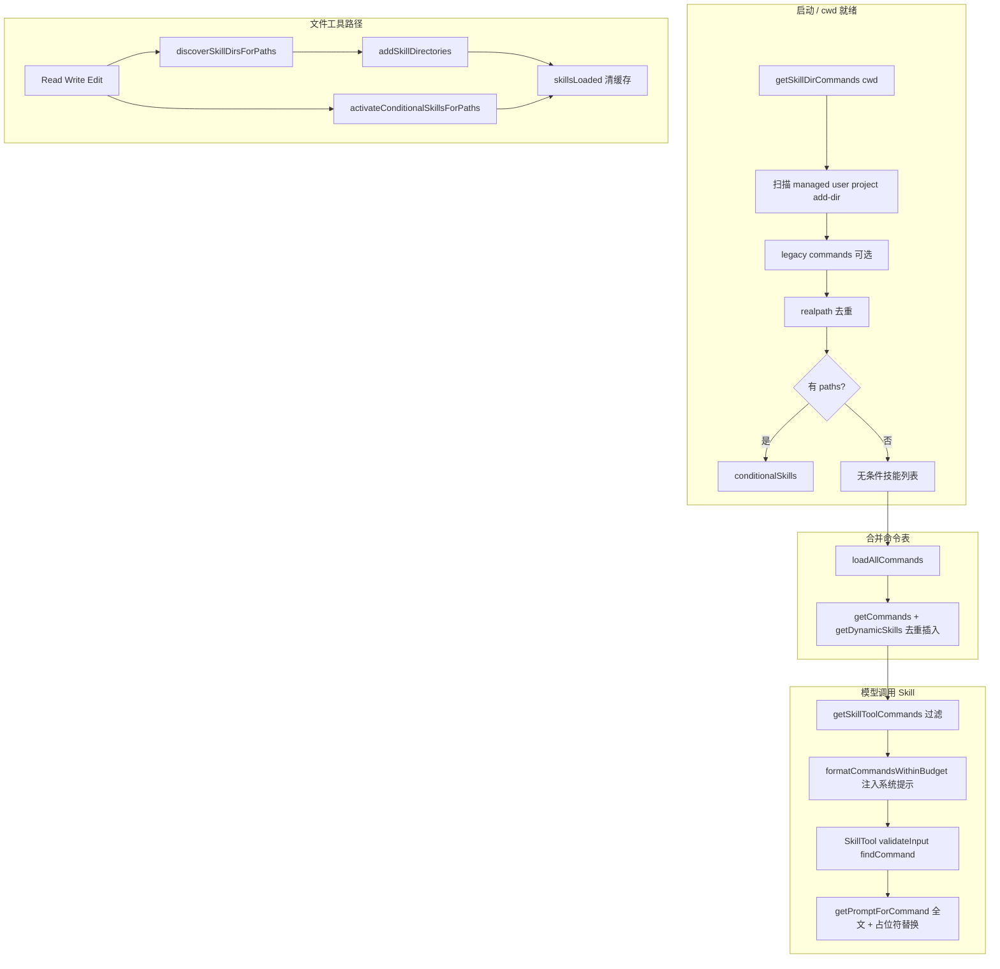

# Claude Code Skills 机制（源码对照）

本文基于参考实现 **`claude-code-2026-03-31/src`** 中与 Skills 相关的模块，整理**目录约定、扫描顺序、去重、动态发现、条件加载、与 Skill 工具的衔接及列表预算**。供 **oneclaw** 在实现「可发现的能力包 / 渐进式披露」时**直接复用设计逻辑**（不必对齐其具体路径名，见文末「与 oneclaw 对齐」）。

---

## 1. 核心结论（可先读这段）

| 维度 | 行为摘要 |
|------|----------|
| **磁盘形态** | 标准形态为 **`<skills-root>/<skill-name>/SKILL.md`**；`/skills/` 根下**不支持**单独的平铺 `foo.md`。 |
| **技能名** | 默认等于 **目录名** `skill-name`（不是 frontmatter 里的 `name` 决定调用名；`name` 多为展示用 `displayName`）。 |
| **何时读全文** | 注册阶段解析 **frontmatter + 可建索引的元数据**；**完整 Markdown 正文**在 **`getPromptForCommand` / 用户或模型调用技能时**再展开（配合列表预算，见 §7）。 |
| **来源层级** | 托管策略目录、用户主目录、沿 cwd 向上的项目 `.claude/skills`、legacy `.claude/commands`、插件、内置打包（bundled）、MCP、会话中动态目录。 |
| **去重** | 对技能文件路径做 **`realpath` 规范化**后按「先出现者优先」去重，避免 symlink / 多父目录重复加载。 |
| **动态发现** | 在 **Read/Write/Edit** 等文件工具触及某路径后，从该文件目录**向上走到 cwd（不含 cwd 本层）**，探测嵌套的 `<dir>/.claude/skills`；**gitignore 内的目录跳过**。 |
| **条件技能** | frontmatter **`paths`**（gitignore 风格）匹配到**被操作的相对路径**时，才把该技能从「待激活」移入可用列表。 |

---

## 2. 文件与命名约定

### 2.1 `.claude/skills/`（推荐路径）

实现：`skills/loadSkillsDir.ts` 中 `loadSkillsFromSkillsDir`。

- 根路径下每一项必须是**目录或指向目录的符号链接**。
- 仅当存在 **`SKILL.md`**（大小写不敏感匹配在 legacy commands 里另有规则；skills 目录内为固定文件名 `SKILL.md`）时才视为一个技能。
- **忽略**根目录下单独的 `.md` 文件（与 legacy `commands` 不同）。

### 2.2 Legacy：`.claude/commands/`

实现：同文件 `loadSkillsFromCommandsDir` + `transformSkillFiles`。

- 某子目录若含 **`skill.md` / `SKILL.md`**（`isSkillFile`），则**只加载该文件**，技能名为**父目录名**，并支持 **命名空间**（嵌套子目录用 `:` 拼接，如 `subdir:my-skill`）。
- 无 `SKILL.md` 时，普通 `*.md` 仍按「自定义 slash command」加载；`loadedFrom` 记为 `commands_DEPRECATED`。

**oneclaw 复用建议**：若只实现一种形态，优先 **`skills/<name>/SKILL.md`**，与 Claude Code 主路径一致；legacy 可后续兼容。

---

## 3. 扫描路径与策略开关

### 3.1 `getSkillsPath` / 各类根目录

实现：`getSkillsPath(source, 'skills' | 'commands')`。

- **policy（托管）**：`<managedRoot>/.claude/skills`
- **user**：`<claudeConfigHome>/skills`（注意：user 的 skills 在 `getSkillDirCommands` 里是 `join(getClaudeConfigHomeDir(), 'skills')`，即 **直接在 config home 下的 `skills`**，与 project 的 `.claude/skills` 路径结构不同）
- **project**：每个候选目录为 **`<walk-dir>/.claude/skills`**

### 3.2 项目侧：沿 cwd 向上收集

实现：`getSkillDirCommands` 调用 `getProjectDirsUpToHome('skills', cwd)`（定义在 `utils/markdownConfigLoader.ts`）。

- 从 **cwd** 逐级向父目录遍历，收集**存在**的 `.claude/skills` 路径。
- **停止边界**：默认在 **git 根**（含 worktree / 子模块等边界修正逻辑 `resolveStopBoundary`），避免把仓库外的 `~/projects/.claude` 泄漏进子仓库。
- **不与 user 的 home 重复检查**：循环中若当前目录等于 user home 则 **break**（user 技能由单独路径加载）。

### 3.3 并行加载顺序（合并前）

`getSkillDirCommands` 并行加载：

1. **Managed**（可被 `CLAUDE_CODE_DISABLE_POLICY_SKILLS` 关闭）
2. **User**（需 `userSettings` 启用且非 plugin-only 锁）
3. **Project**（多个 `getProjectDirsUpToHome` 结果各加载一次）
4. **Additional `--add-dir`**：每个 add-dir 下 `.claude/skills`
5. **Legacy commands**：`loadSkillsFromCommandsDir(cwd)`（skills 锁定时整块跳过）

### 3.4 `--bare` 模式

- **跳过**上述自动发现（managed/user/project/legacy）。
- **仅当**存在 **`--add-dir`** 且 **projectSettings 未被禁、且未 skills 锁** 时，从每个 add-dir 的 `.claude/skills` 加载。

### 3.5 Plugin-only 与设置源

- `isRestrictedToPluginOnly('skills')` 为真时：跳过 user/project/additional 及 legacy commands 技能加载。
- `isSettingSourceEnabled('projectSettings')` 控制 project 与 add-dir 是否参与。

---

## 4. 去重、条件技能与动态技能

### 4.1 按真实路径去重

合并 `managed + user + project + additional + legacy` 后，对每条技能的 `filePath` 取 **`realpath`**；同一 canonical 文件只保留**第一次**出现的条目，并打调试日志。

### 4.2 条件技能（`paths` frontmatter）

- `parseSkillPaths` 解析 frontmatter **`paths`**，语义与 **CLAUDE.md 条件规则**一致；`**` 或全匹配视为不限制。
- 带 `paths` 且尚未激活的技能**不进入**「无条件可用列表」，而是进入 **`conditionalSkills` Map**。
- 在 **`activateConditionalSkillsForPaths(filePaths, cwd)`** 中：用 **`ignore`（gitignore 风格）** 对 **相对 cwd 的路径** 做匹配；匹配成功则移入 **`dynamicSkills`** 并触发 `skillsLoaded` 信号。

### 4.3 动态目录发现

实现：`discoverSkillDirsForPaths` + `addSkillDirectories`。

- 对每个 **filePath**，从其 **父目录** 开始向上，直到 **cwd 以下**（**不包含 cwd 自身**，因 cwd 级已在启动时加载）。
- 探测路径：`<current>/.claude/skills`；**已探测过的路径记入 Set**，避免重复 stat。
- 若 `currentDir` 在 **gitignore** 中（相对 `resolvedCwd` 检查），**跳过**该 skills 目录。
- **排序**：路径**更深者优先**，加载时再通过**逆序合并**让浅层被深层覆盖（同名技能后者覆盖）。

动态加载受 **`projectSettings` + 非 plugin-only** 约束；加载完成后 **`skillsLoaded.emit()`**，供其他模块清缓存（如命令列表 memo）。

---

## 5. 与总命令表合并（`getCommands`）

实现：`commands.ts` 中 `loadAllCommands` / `getCommands`。

**静态合并顺序**（数组拼接顺序，影响同名时谁先被 `findCommand` 命中需注意：通常后文覆盖前文取决于 `findCommand` 实现，此处以源码拼接为准）：

1. `bundledSkills`
2. `builtinPluginSkills`
3. `skillDirCommands`（含 §3 扫描结果中的**无条件**技能；不含仍挂在 conditional 的）
4. `workflowCommands`（feature）
5. `pluginCommands`
6. `pluginSkills`
7. 内置 `COMMANDS()` 列表

**动态技能**：`getDynamicSkills()` 在 `getCommands` 每次调用时合并进列表；与已有 **同名** 技能去重时 **保留已存在的 base，不覆盖**。插入位置：尽量插在 **内置 COMMANDS 之前**（通过查找第一个 built-in 命令名的索引）。

**缓存**：`loadAllCommands` 按 **cwd** memoize；动态技能变化时需 **`clearCommandMemoizationCaches`**（并注意外层 skill index 若另有 memo 也要清）。

---

## 6. Skill 工具（模型侧调用）

实现：`tools/SkillTool/SkillTool.ts`。

- **可用技能集合**：`getAllCommands` = `getCommands(projectRoot)` **并上** AppState 里 **`loadedFrom === 'mcp'` 的 prompt 型 MCP skills**（去重按 `name`）。
- **校验**：`findCommand` 命中、`type === 'prompt'`、且未设 **`disable-model-invocation`**。
- **执行**：多数走 `processPromptSlashCommand`（与 slash 命令同源）；**`context: fork`** 时走子 Agent **`runAgent`**。
- **权限**： deny/allow 规则、`skillHasOnlySafeProperties` 自动放行、否则 ask。
- **远程 / 实验能力**（`EXPERIMENTAL_SKILL_SEARCH` 等）与 oneclaw 无强绑定，可忽略或单独产品化。

**正文展开时的占位符**（`createSkillCommand` → `getPromptForCommand`）：

- 若有 **`baseDir`**，前缀：`Base directory for this skill: <baseDir>`
- **`${CLAUDE_SKILL_DIR}`** → 技能目录（Windows 下规范化 `/`）
- **`${CLAUDE_SESSION_ID}`** → 当前会话 ID
- **非 MCP** 来源：可对正文做 **`!` / 反引号 shell** 类展开（`executeShellCommandsInPrompt`）；**MCP 技能禁止**此类内联执行（不可信远程内容）。

---

## 7. 列表与预算：「渐进式披露」在 Claude Code 里的落点

### 7.1 Skill 工具描述里的列表

实现：`tools/SkillTool/prompt.ts` 中 `formatCommandsWithinBudget`、`getCharBudget` 等。

- 默认预算约为 **上下文窗口 token 的 1% × 4 字符/token**（可用环境变量覆盖）。
- 每条列表项格式：`- <name>: <description>`，其中 `description` 优先组合 **`description` + `when_to_use`**。
- **单条描述硬上限** `MAX_LISTING_DESC_CHARS`（如 250），避免 turn-1 浪费。
- 超出总预算时：**bundled** 技能描述优先完整保留，其余按预算**截断描述**或退化到 **仅名称**。

### 7.2 上下文明细中的 token 估算

实现：`loadSkillsDir.ts` 的 `estimateSkillFrontmatterTokens`；在 `analyzeContext.ts` 等处参与统计。

- 估算仅基于 **`name` + `description` + `whenToUse`** 拼接，**不把整篇 SKILL.md 算进「发现阶段」**。

**oneclaw 复用建议**：发现链只注入 **摘要**；全量在 **invoke** 或 **显式 Read** 技能文件时再加载。

---

## 8. Frontmatter 字段（与技能行为相关）

解析入口：`parseSkillFrontmatterFields`（`loadSkillsDir.ts`）。

| 字段 | 作用 |
|------|------|
| `name` | 展示名 `displayName`（调用名仍为目录名） |
| `description` | 描述；缺省时从正文首段抽取 |
| `when_to_use` / `whenToUse` | 使用场景，进入列表与 token 估算 |
| `allowed-tools` | 展开 prompt 时合并进 permission 上下文 |
| `arguments` / `argument-hint` | 参数说明与替换 |
| `user-invocable` | `false` 时 `isHidden`，默认 `true` |
| `model` / `disable-model-invocation` | 模型覆盖与是否允许 Skill 工具调用 |
| `hooks` | 校验后挂到 Command |
| `context: fork` | 子 Agent 执行 |
| `agent` | 关联 agent 定义 |
| `effort` | 努力度档位 |
| `shell` | prompt 内 shell 执行配置 |
| `paths` | 条件技能路径模式（gitignore 风格） |
| `version` | 元数据 |

---

## 9.  bundled 与插件技能（简要）

- **Bundled**：`skills/bundledSkills.ts` 在进程内 `registerBundledSkill`；可选 `files` 首次调用时解压到安全目录并带 `Base directory` 前缀。
- **Plugin**：`loadPluginCommands.ts` 等扫描插件包内 skills 目录，形态仍为 **`.../SKILL.md`**（含直接放在 skills 根下或子目录等分支，与核心 `.claude/skills` 扫描略有扩展）。

---

## 10. 端到端数据流（便于对照实现）



---

## 11. oneclaw 拟定策略：最近使用记录 + 预算内摘要 / 预算外仅名

> 与 Claude Code 默认策略的差异：参考实现优先保证 **bundled** 完整描述，再对其余条目截断或退化为仅名（见 §7）。下面为 **oneclaw 侧产品化约定**。

### 11.1 目标

1. **去重之后**，让 **近期实际用过的技能** 在索引里排在前面，提高「可发现性」；**不依赖 `SKILL.md` 的 mtime**（文件时间往往反映的是偶发保存、批量 touch、拷贝仓库等，与「是否常用」弱相关）。
2. 使用 **单独落盘文件** 记录 **最近使用** 的若干条技能（下文以 **20** 为例），按 **最后使用时间从新到旧** 排列；每次 **成功 invoke**（或等价：Skill 工具命中并执行）时更新该文件。
3. 注入系统提示（或技能索引块）时若有 **总字符 / token 预算**，靠前的技能使用 **名称 + 摘要**；**预算用尽后的后续技能**只注入 **skill name**，保证全集仍可被扫到。

### 11.2 最近使用记录文件（推荐主排序依据）

**是否单独放文件**：**建议要。** 理由：与磁盘内容解耦、语义是「使用热度 / 新鲜度」、可审计、可备份；比 mtime 更贴近「模型和用户真的在用的能力」。

| 项 | 建议 |
|----|------|
| **容量** | 固定 **最多 20 条**（可配置）；超出时丢弃最久未用的记录（LRU 语义：新一次使用把该 skill 提到队首并去重）。 |
| **键** | 使用去重、合并来源后的 **规范 skill name**（与 `findCommand` / 工具入参一致），避免同名歧义。 |
| **值** | 至少 **最后一次使用时间**（UTC Unix 秒或 RFC3339）；可选附带 **使用次数** 做次要排序或观测。 |
| **存放位置（二选一或配置）** | **用户级**：如 `~/.oneclaw/skills-recent.json`（跨项目复用习惯）；**项目级**：如 `<repo>/.oneclaw/skills-recent.json`（不同仓库隔离）。团队可约定默认，复杂场景可支持「先项目、再用户 merge」并文档化优先级。 |
| **更新时机** | 在 **技能执行成功** 后写入（避免 validate 失败、权限拒绝仍刷榜）；**原子写**（写临时文件再 rename）防止中断损坏 JSON。 |
| **缺失文件** | 视为空列表，全体技能走 **§11.4 兜底排序**。 |

示例形状（实现可自由调整字段名）：

```json
{
  "version": 1,
  "entries": [
    { "name": "pdf", "last_used_at": "2026-04-05T12:00:00Z", "use_count": 14 },
    { "name": "commit", "last_used_at": "2026-04-04T09:30:00Z", "use_count": 3 }
  ]
}
```

`entries` 在文件内建议已按 **last_used_at 降序** 存储，便于调试；运行时仍以当前已加载技能集做过滤（见下节）。

### 11.3 最终列表排序（在已去重的技能集合上）

设当前会话有效技能集合为 `S`（canonical 去重后），最近使用文件解析为有序列表 `R`（最多 20 个 name，新 → 旧）：

1. **第一段**：按 `R` 的顺序，取出 **`name ∈ S`** 的技能，**保持 R 中的相对次序**（最近用过的在最前）。
2. **第二段**：`S` 中 **不在 R 中出现** 的技能，按 **§11.4 兜底键** 排序（例如 `name` 字典序，或「发现顺序」稳定排序）。
3. **内置 / 托管**：若需始终显眼，可将它们 **固定置于第一段最前**（仍参与 R 更新），或 **单独子预算**（见 §11.6）。

这样：**频繁使用的技能自然长期留在 R 里并靠前**；偶尔用的会淡出 20 条窗口，但仍在第二段出现，不会从系统里消失。

### 11.4 兜底排序（无记录或新技能）

当某技能从未进入过 `skills-recent`、或已被挤出 Top20 时：

- **不推荐**单独用 **`SKILL.md` mtime** 作为主键（你提到的不可靠性）；若仍想用文件时间，仅可作为 **tie-break**。
- 更稳的兜底：**字典序 `name`**，或 **扫描/合并来源时的稳定顺序**（与测试和 diff 友好）。

可选：frontmatter **`updated`** 仅作展示或分析，不强制参与排序。

### 11.5 预算填充算法（与排序解耦）

在 **§11.3 得到的有序列表** 上，总预算 `B`（字符或估算 token）：

1. 按顺序遍历每个技能。
2. **完整行** `full_i` = 「名称 + 描述 / 适用场景」（可设单条硬顶，对齐 §7）。
3. **仅名行** `name_i` = 如 `` `- {name}` ``。
4. 若 `used + len(full_i) ≤ B` → 输出 `full_i`；否则若 `used + len(name_i) ≤ B` → 输出 `name_i`；否则 **停止追加**（或打日志）。

**频繁使用的技能因排在前面，更常拿到完整摘要**；长尾技能在预算紧时多为仅名，但仍保留名字可检索。

### 11.6 与内置 / 托管技能的衔接（实现提示）

- **A**：内置 / 托管 **固定列表最前**，再拼接 **§11.3** 的「最近使用 + 其余」；
- **B**：参与统一排序，但对内置 / 托管设 **单独子预算**，避免被挤成仅名。

### 11.7 与 Claude Code 的对照

| 项目 | Claude Code（§7） | oneclaw 拟定（本节） |
|------|-------------------|----------------------|
| 排序 | 未强调全局时间序；合并顺序由扫描来源决定 | **最近使用文件（≈20）** 优先，其余兜底稳定序；**不用 mtime 作主排序** |
| 超预算 | bundled 保全文，其余截断描述或仅名 | 列表前段优先完整摘要，**后段仅名** |
| 全文技能 | invoke / Read 时再加载 | 仍建议 **invoke 时再注入 SKILL 正文** |
| 持久化 | 无（每次按磁盘与扫描） | **skills-recent 类文件** 记录使用轨迹 |

---

## 12. 与 oneclaw 对齐时可映射的要点

- **目录语义**：可将 **`.claude`** 映射为项目约定的 **`.oneclaw`**（或配置中的 `skills_root`），但保持 **`<name>/SKILL.md`** 不变，便于工具链与文档互通。
- **发现顺序**：建议保留 **managed → user → repo 内由深到浅** 或 **浅到深 + 明确覆盖规则**，并在文档中写清**同名冲突策略**（Claude Code 动态层对已有名不覆盖 base）。
- **安全**：条件路径与 **gitignore** 过滤、MCP/远程内容与本地 **shell 展开分离**，应在 oneclaw 侧同等对待。
- **预算**：Skill 列表与上下文分析分开——列表用 **短描述 + 硬顶**，全文 **仅在 invoke 时**进入消息；**列表排序与超预算退化**可采用 **§11**。
- **最近使用**：用 **独立 JSON（或等价）** 记录约 **20** 条 LRU 式轨迹（见 **§11.2**），成功 invoke 后更新；**勿用 SKILL.md mtime 作主排序**。

---

## 13. 主要源码索引（参考树内路径）

| 主题 | 路径 |
|------|------|
| 加载、去重、条件、动态 | `src/skills/loadSkillsDir.ts` |
| 命令合并、Skill 工具用过滤 | `src/commands.ts` |
| Skill 工具本体 | `src/tools/SkillTool/SkillTool.ts` |
| 列表预算与提示文案 | `src/tools/SkillTool/prompt.ts` |
| 内置打包技能 | `src/skills/bundledSkills.ts` |
| 项目目录向上遍历 | `src/utils/markdownConfigLoader.ts`（`getProjectDirsUpToHome`） |
| 文件工具触发发现 | `src/tools/FileReadTool/FileReadTool.ts` 等 |

---

*文档版本：与 `claude-code-2026-03-31` 源码快照对照整理；若上游行为变更，以对应文件为准。*
