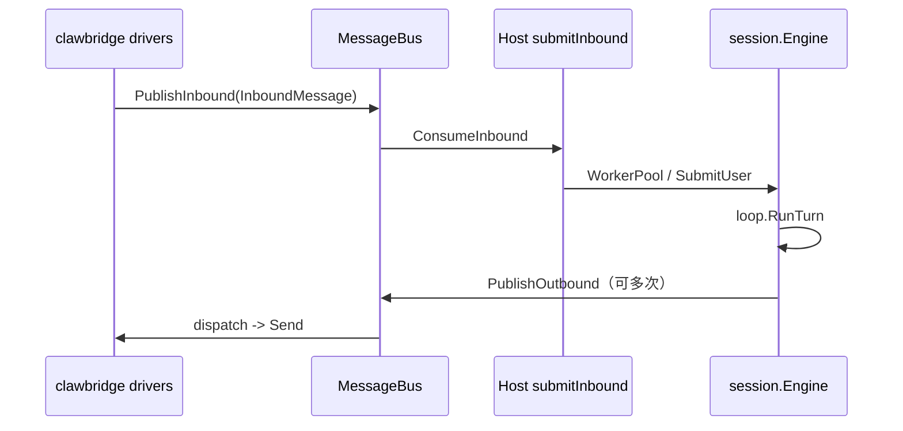

# clawbridge 与 oneclaw I/O 契约

[`github.com/lengzhao/clawbridge`](https://github.com/lengzhao/clawbridge) 提供进程内 **MessageBus**、**IM driver**、**`bus.InboundMessage` / `bus.OutboundMessage`**。**`cmd/oneclaw`** 通过 **`clawbridge.New`**、**`PublishOutbound`**、**`UpdateInboundStatus`** 与 **`session.Engine`** 对接。

**配套文档**：[inbound-routing-design.md](inbound-routing-design.md)（入站合并、`WorkerPool`）、[outbound-events-design.md](outbound-events-design.md)（出站与可选 JSON 观测草案）、[runtime-flow.md](runtime-flow.md)（主路径）。

---

## 1. 目标与范围

### 1.1 目标

- **单一 I/O 边界**：入站、出站、媒体路径以 clawbridge（**MessageBus**、drivers、**`media.Backend`**）为统一出口。
- **Host 职责**：oneclaw 侧保留 **`session.Engine`** + **`loop.RunTurn`** 与 **YAML → clawbridge `config.Config`** 的映射（见 `config` 包与 `cmd/oneclaw`）。

### 1.2 出站语义

- **非流式协议**：不向渠道强绑「一条 SSE token 流」；不依赖 `Record.seq` 类序号作为内核契约。
- **单次用户交互**：一次 **`SubmitUser`** / **`RunTurn`** 对应一轮处理；该轮内可 **零次或多次** **`PublishOutbound`**，每条为完整 **`OutboundMessage`**。
- **多次响应**：由 **`PublishOutbound`** 逐条发出；各 **driver** 按平台能力表现为多条聊天消息、多次 post、或编辑同一条。

### 1.3 非目标

- **内核**不强制将 `loop` 内每一步映射到总线上的「工具开始/结束」观测事件（调试可用 **slog**、**transcript**、**notify 审计**）。
- e2e 覆盖与手动多平台验证见 CI / 发布 checklist。

---

## 2. 核心类型（代码真源）

| 用途 | 类型 / 入口 |
|------|-------------|
| 入站 | **`bus.InboundMessage`** |
| 出站 | **`bus.OutboundMessage`**，经 **`Engine.PublishOutbound`** |
| 桥接 | **`clawbridge.Bridge`**，`Start` / `Stop` |
| 工具上下文合并 | **`toolctx.Context.ApplyTurnInboundToToolContext`**、`mergeTurnInbound` |

---

## 3. 入站：`InboundMessage` 首层字段

**clawbridge v0.2+** 首层字段包括：`ClientID`、`SessionID`、`MessageID`、`Sender`（**`SenderInfo`**）、`Peer`、`Content`、`MediaPaths`、`ReceivedAt`、`Metadata` 等。

**约定**：oneclaw 优先使用上述首层字段（及子结构）；**不为** `session_key`、`locale` 等单独定义 **oneclaw 专用 `Metadata` 键** 作为核心契约——若需扩展，优先在 **clawbridge** 增加首层字段或按其文档约定。

| 文档 / 产品概念 | `InboundMessage` 用法 |
|------------------|-------------------------|
| 渠道实例 | **`ClientID`**：与 **`clawbridge.clients[].id`** 一致，用于 driver 与出站 **`OutboundMessage.ClientID`**。 |
| 用户正文 | **`Content`**。 |
| 附件 / 媒体 | **`MediaPaths`** + **`media.Backend`**（细节以 clawbridge 为准）。 |
| 会话键 | **`SessionID`**：driver 提供的稳定键；**`session.InboundSessionKey`** 优先取 `SessionID`，否则回退 **`Peer.ID`** 等。 |
| 用户标识 | **`Sender`**：业务主键优先 **`CanonicalID`**，否则 **`PlatformID`**（与 driver 约定一致）。 |
| 租户 / 工作区 | 通常由 **`SessionID`**、**`ClientID`** 与 **`Sender`** 字段组合表达；按平台填入子结构。 |
| 关联 id | 与平台消息强相关时复用 **`MessageID`**；内部 trace 用日志/追踪，不强行塞进 Host 契约。 |

**ToolContext 合并**：**`toolctx.Context.ApplyTurnInboundToToolContext`** + **`mergeTurnInbound`**（`toolctx/context.go`）：非空覆盖、`Content` 不合并、`MediaPaths` 空则清空。

---

## 4. 出站：单次交互、多条消息

### 4.1 行为

- 本轮内可多次 **`PublishOutbound`**，每次构造完整 **`OutboundMessage`**：
  - **`ClientID`**：与入站一致。
  - **`To`（`Recipient`）**：与入站 **`Peer`** / 平台约定一致，保证回到正确会话。
  - **`Text` / `Parts`**：至少其一非空（遵循 clawbridge 校验）。
  - **`ReplyToID` / `ThreadID`**：按平台选填。

- **无流式契约**：「一条长回复」由 **driver** 选择多条消息或编辑等能力完成。

### 4.2 与 `loop` / 回合结束

- 助手文本通过 **`loop.Config.OutboundText`** → **`PublishOutbound`**（见 `session/turn_prepare.go`）。
- 回合结束以 **`RunTurn` 返回** 与 **transcript** 为准；可选 **`UpdateInboundStatus`**（若 driver 支持）。

### 4.3 工具代发（`SendMessage`）

- 构造 **`OutboundMessage`** 时遵守 **`ClientID` + `Recipient`**；路由从当前轮 **`InboundMessage`**（**`Peer`** / **`Sender`**）推导（见 **`send_message`** 工具实现）。

---

## 5. 进程结构与生命周期

- **启动**：**`cmd/oneclaw`**：`clawbridge.New(cfg)` → **`Bridge.Start`**；入站回调进入 **`submitInbound` → `WorkerPool.SubmitUser`**（见 `cmd/oneclaw/main.go`）。
- **停止**：signal → **`Bridge.Stop`** → 等待资源回收。

---

## 6. 配置

- YAML 与 clawbridge **`config.Config`** 的映射由 **`config.Resolved.ClawbridgeConfigForRun`** 等提供（**`clients`**、媒体根等）。
- **版本**：以 **`go.mod`** 中 **`github.com/lengzhao/clawbridge`** 为准；升级时 **`go get`** / **`go mod tidy`**。

---

## 7. 与 [outbound-events-design.md](outbound-events-design.md) 的关系

- **主路径**：**`OutboundMessage`** + **`PublishOutbound`**（见该文档 §1）。
- **§2 `seq` / `kind` / `done`**：可选 **JSON 观测载荷**草案，**不是** `loop` 内核强制协议。

---

## 8. 验收清单（持续）

- [ ] `go test ./...`（按仓库惯例排除需密钥的 e2e）通过。
- [ ] 关键 IM：至少手动验证一轮对话与多段助手回复表现符合预期。

---

## 9. 修订记录

| 日期 | 说明 |
|------|------|
| 2026-04-08 | 初稿：非流式、多次 `PublishOutbound`；首层字段与 Metadata 约定。 |
| 2026-04-12 | `InboundMessage` 字段更名：`Channel`→`ClientID`、`ChatID`→`SessionID` 等。 |
| 2026-04-19 | 重写为 **现行 I/O 契约**；与 [inbound-routing-design.md](inbound-routing-design.md)、[outbound-events-design.md](outbound-events-design.md) 对齐。 |
