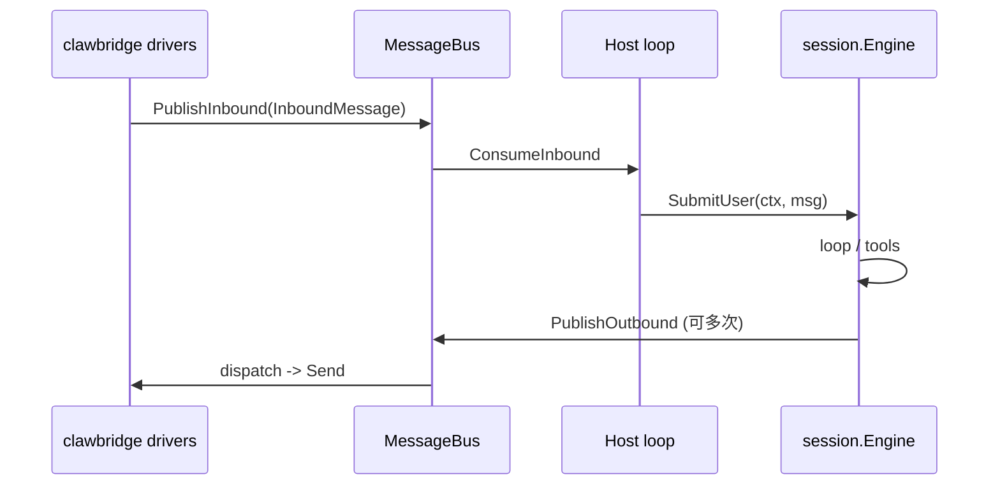

# oneclaw → clawbridge 统一 I/O 设计（非流式、多次响应）

本文描述用 [`github.com/lengzhao/clawbridge`](https://github.com/lengzhao/clawbridge) **替代**本仓库内 **`channel/*` 与 `routing/*`** 的架构约定。与历史文档 [inbound-routing-design.md](inbound-routing-design.md)、[outbound-events-design.md](outbound-events-design.md) 的关系见 §7。

---

## 1. 目标与范围

### 1.1 目标

- **单一 I/O 边界**：进程内入站、出站、媒体路径统一走 clawbridge（`MessageBus`、drivers、`media.Backend`）。
- **删除平行抽象**：不再维护 `channel.Connector` / `IO`、全局 `routing.Sink` 注册表、`routing.Record` 流、`routing.Emitter` 序号流等。
- **可演进**：HTTP、CLI 等渠道后续在 clawbridge 侧增加 driver；oneclaw 只保留 **Host**（会话引擎 + loop）与 **薄适配**（配置映射、§3 字段对齐）。

### 1.2 出站语义（显式约束）

- **不支持「流模式」**：不向渠道暴露「一条逻辑上的 SSE/分片 token 流」协议；不依赖 `Record.seq` 或同类增量序号语义。
- **默认单次交互**：一次用户入站（一次 `SubmitUser` / 等价调用）对应 **一轮** Host 处理；该轮内可以发出 **零条或多条** 出站消息。
- **多次响应**：一轮内允许 **多次** `PublishOutbound`（或 clawbridge 暴露的等价 API），每条为完整的 `OutboundMessage`（或后续扩展类型）。各 driver 按平台能力表现为多条聊天消息、多次 post、或编辑同一条（若平台支持且 driver 实现）。

### 1.3 非目标（本阶段）

- 与旧 `routing.KindTool` / `KindDone` **逐事件对齐**的观测协议（调试可依赖日志与 transcript，不强制映射到总线）。
- 全面恢复 e2e：可先整体跳过或单独 tag，后续再补。

---

## 2. 核心类型映射

| 原 oneclaw | 迁移后（clawbridge） |
|------------|----------------------|
| `routing.Inbound` | `bus.InboundMessage`（§3 首层字段映射） |
| `routing.Attachment` / 媒体 | `MediaPaths`、`MediaPart` + `media.Backend`；细节以 clawbridge 为准 |
| `routing.Sink` / `SinkRegistry` | **删除**；出站直接 `Bus().PublishOutbound`（或由 Engine 注入的窄接口包装） |
| `routing.Record` / `routing.Emitter` | **删除**；改为 **多条** `OutboundMessage`（§4） |
| `channel.*` Connector | clawbridge drivers + `Bridge` 生命周期 |

---

## 3. 入站：原 `Inbound` 与 `InboundMessage` 首层字段对齐

`bus.InboundMessage` 已有字段：`Channel`、`ChatID`、`MessageID`、`Sender`（`SenderInfo`）、`Peer`、`Content`、`MediaPaths`、`ReceivedAt`、`Metadata`。

**约定**：oneclaw 所需语义 **优先只使用上述首层字段**（及 `SenderInfo` / `Peer` 子结构），**不为** `session_key`、`user_id`、`tenant_id`、`correlation_id`、`locale` 等再定义 `Metadata` 键；driver 在入站时负责填好 clawbridge 模型。`Metadata` 保留给 **平台特有、Host 不依赖** 的扩展，或由 clawbridge 文档另行约定，**不**作为 oneclaw 核心契约的一部分。

| 原 `routing.Inbound` | `InboundMessage`（及子结构）用法 |
|----------------------|----------------------------------|
| `Source` | `Channel`：与配置里 **client id**（原 `channels[].id`）一致，用于 driver 选择与出站 `OutboundMessage.ClientID`。 |
| `Text` | `Content`。 |
| `Attachments` | `MediaPaths`（+ `media.Backend` 解析）；内联类附件的表达方式以 clawbridge / driver 约定为准。 |
| `SessionKey` | **`Peer`**：逻辑线程/话题用 `Peer.Kind` + `Peer.ID` 表达（与各 IM driver 的平台语义对齐，如线程 ts、话题 id）。无独立线程时 `Peer` 可为空，会话边界由 `ChatID` 决定。 |
| `UserID` | **`Sender`**：业务主键优先 **`CanonicalID`**，否则 **`PlatformID`**（Host 与 driver **固定一种优先级**，写在 clawbridge 或本文补充说明中）。 |
| `TenantID` | **租户/工作区**：通常已由 **`ChatID`**（及多账号时的 **`Channel`**）在平台侧限定作用域；若必须显式工作区/团队 id，由 driver 填入 **`Sender.Platform`** / **`Sender.PlatformID`** 的组合语义（按平台文档约定，例如团队级 id 走 `PlatformID`）。 |
| `CorrelationID` | 与**本条平台消息**强相关时复用 **`MessageID`**；若为与消息 id 无关的内部 trace，**不**经 `Metadata` 塞进 oneclaw 契约，可依赖日志/追踪；若未来需要稳定入 Host，应在 **clawbridge 为首层增加字段**。 |
| `Locale` | 当前 `InboundMessage` **无**对等首层字段：**不**用 `Metadata` 承载；Host 使用配置默认语言，或由 **clawbridge 后续增加**可选字段（如 `Locale string`）后统一使用。 |
| `RawRef` | 同上：不定义 oneclaw 专用 `Metadata`；若 Host 必须持有句柄，在 **clawbridge 扩展首层字段** 或接受「本轮不传递、仅日志」。 |

**ToolContext 合并**：原 `routing.MergeNonEmptyRouting` 改为对 **`InboundMessage` 各首层字段** 的合并规则（非空覆盖、`Content` 不参与合并、`MediaPaths` / 附件规则与上表一致）。

---

## 4. 出站：单次交互、多条消息

### 4.1 行为

- Host（`session` / `loop`）在本轮内可 **任意次** 调用 `PublishOutbound`，每次构造完整的 `OutboundMessage`：
  - `ClientID`：与入站 `Channel` 一致。
  - `To`：`Recipient`（`ChatID`、`Kind`、`UserID` 等）须与入站 `Peer`/平台约定一致，保证消息回到正确会话。
  - `Text` / `Parts`：至少其一非空（遵循 clawbridge 现有校验）。
  - `ReplyToID` / `ThreadID`：按平台语义选填。

- **无流式契约**：不保证渠道端「拼接顺序」或「同属一块流」；若产品需要「看起来像一条长回复」，由 **driver** 层选择「多条消息」或「EditMessage」等能力（clawbridge 已具备编辑/状态接口的可选路径）。

### 4.2 与旧 `Emitter.Text` / `Done` 的对应关系

| 旧行为 | 新行为 |
|--------|--------|
| 多次 `Emitter.Text` 拼片段 | 由调用方 **合并为一次 `Text`** 或 **多次 `PublishOutbound`**（产品决定）；本设计不强制片段协议 |
| `Emitter.Done` / `KindDone` | **不映射到总线**；回合结束以 `SubmitUser`/`RunTurn` 返回及内部 transcript 为准；IM 侧可选 `UpdateStatus`（若 driver 支持） |

### 4.3 工具代发（`SendMessage`）

- 构造 `OutboundMessage` 时同样遵守 `ClientID` + `Recipient`；路由信息从 **当前轮的 `InboundMessage`（首层字段 + `Peer`/`Sender`）** 推导，规则与旧 `SendMessage` 一致，仅类型替换。

---

## 5. 进程结构与生命周期

- **启动**：`main` 中 `clawbridge.New(cfg)` → `Start(ctx)`；启动 **一个或多个** goroutine：`for { msg, err := bus.ConsumeInbound(ctx); …; eng.SubmitUser(ctx, msg) }`（错误与取消策略与现 `channel.submitLoop` 对齐）。
- **停止**：signal → `Bridge.Stop` → 等待 outbound dispatch 结束；与现 errgroup  teardown 目标一致。

**定时/维护入站**（若原依赖 `channel` 内 poller）：迁到 Host 侧或 clawbridge 扩展事件，避免静默丢失功能（实现时单独 checklist）。

---

## 6. 配置

- oneclaw 现有 YAML 与 clawbridge `config.Config` 的映射在实现 PR 中落地（channels → clients、媒体根目录等）。
- 版本钉定：当前 `go.mod` 使用 **`github.com/lengzhao/clawbridge v0.1.0`**（与 [config.example.yaml](https://github.com/lengzhao/clawbridge/blob/main/config.example.yaml) 对齐）。上游发布 `v0.1.1` 后可抬版本并 `go mod tidy`。

---

## 7. 与历史文档的关系

- [inbound-routing-design.md](inbound-routing-design.md) 中 **`Inbound` 字段语义**仍可作为 **向 `InboundMessage` 首层字段映射** 的参考；**按来源选 Sink**、**context 透传 Inbound** 等实现路径被 **clawbridge 入站 + 注入的 Outbound 能力**替代。
- [outbound-events-design.md](outbound-events-design.md) 中 **`Record` 流、`Kind*`、`Emitter.seq`** 在目标架构下 **废弃**；观测与 CLI/SSE 若后续重新引入，应在 **clawbridge 或独立观测层** 重新定义，本文不预设。

---

## 8. 迁移检查清单（实现阶段）

- [ ] `session.Engine` 入参/字段不再引用 `routing.*`
- [ ] `loop.RunTurn` 与 `toolctx`、`usageledger`、`send_message` 工具全部改为 `InboundMessage` 首层字段约定（§3）
- [ ] 删除 `routing/`、`channel/` 及 `main` 中的 side-effect 注册
- [ ] `go test ./...`（排除已标记跳过的 e2e）通过
- [ ] 至少手动验证：Slack / Feishu 各一轮对话，多段助手回复表现为多条出站或等价体验

---

## 9. 修订记录

| 日期 | 说明 |
|------|------|
| 2026-04-08 | 初稿：非流式、单次交互、允许多次 `PublishOutbound`；§3 仅复用 clawbridge 首层字段，不定义 oneclaw 专用 Metadata 键 |
| 2026-04-08 | 实现落地：移除 `channel/`、`routing/`；`go.mod` 钉 `clawbridge v0.1.0`（`v0.1.1` 待上游 tag）；e2e 默认 `//go:build e2e` |
