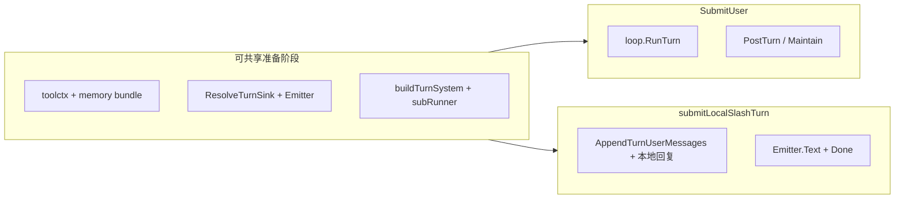

# 代码简化机会梳理（oneclaw）

本文档对当前仓库做一次**只读架构审视**，列出可减轻认知负担、减少重复或收紧边界的改进方向。**不包含具体补丁**，实施前请结合 [inbound-routing-design.md](inbound-routing-design.md)、[outbound-events-design.md](outbound-events-design.md) 与相关实现再定优先级。

---

## 1. 摘要：建议优先级

| 优先级 | 主题 | 预期收益 |
|--------|------|----------|
| P0 | `SubmitUser` 与 `submitLocalSlashTurn` 共享的前半段抽出 | **已实现**：`session/turn_prepare.go` 中 `prepareSharedTurn` |
| P0 | ~~明确本地 slash 与维护流水线关系~~ **已决议**：旁路、不跑 `PostTurn` / 维护（见 [memory-maintain-dual-entry-design.md](memory-maintain-dual-entry-design.md) §2.4） | 文档与实现一致 |
| P1 | `subagent` 中 `RunAgent` / `RunFork` 前置校验与 registry 过滤 | **已实现**：`validateNestedHost` / `validateNestedParent` / `stripMetaForNested`（`subagent/run.go`） |
| P1 | `toolctx` 字段分组（Host / 执行环境）；可选 `context.Value` 未做 | **已实现**：`SessionHost` 嵌入 + `ApplyTurnInboundToToolContext`；`context.Value` 仍见 §8 |
| P2 | 多 connector 消费 `OutboundChan` 的共用助手 | **已实现**：`channel.DrainTextReply`，`statichttp` 已迁移 |
| P2 | `memory.PostTurn` 与 `MaybePostTurnMaintain` 的重复入参 | **已实现**：`SubmitUser` 尾部共用 `pti` |
| P3 | 预留字段与全局注册表文档化 | 减少「死字段 / 隐式全局」噪音 |

---

## 2. Session：`Engine` 与两条回合路径

### 2.1 重复：`SubmitUser` vs `submitLocalSlashTurn`

`session/engine.go` 中两条路径在以下步骤上**高度重叠**：

- `budget.FromEnv()`、`toolctx.New`、`UserHomeDir`、`memOK` 判定  
- `memory.DefaultLayout` → `BuildTurn` → `ApplyTurnBudget`、更新 `RecallState`、`MemoryWriteRoots`  
- `routing.ResolveTurnSink`、`routing.NewEmitter`（条件创建）  
- `buildTurnSystem`、`subagent.LoadCatalog`、`*subRunner` 赋给 `tctx.Subagent`

**实现**：`(*Engine).prepareSharedTurn`（`session/turn_prepare.go`）返回 `sharedTurnPrep`；`SubmitUser` 传 `wireSendMessage=true`，本地 slash 传 `false`。

### 2.2 语义：本地 slash 与 memory 收尾（**已选：旁路**）

完整模型回合在 `SubmitUser` 末尾会调用 `memory.PostTurn` 与 `memory.MaybePostTurnMaintain`。**本地 slash**（`submitLocalSlashTurn`）**刻意不调用** `PostTurn`、`MaybePostTurnMaintain`，也不触发回合后维护流水线。

**产品语义**：slash 为**旁路**——无模型调用、无工具轨迹、无「本回合可蒸馏」的增量信号；若仍写 daily log 或跑近场维护，会与双入口设计中的「Current turn snapshot」前提不符，且易产生噪声维护。详细约定见 [memory-maintain-dual-entry-design.md](memory-maintain-dual-entry-design.md) §2.4。

### 2.3 `Emitter` 使用的 `context`（**已对齐**）

`submitLocalSlashTurn` 与 `loop.RunTurn` defer：**`Text` 用回合 `ctx`（可随用户取消）；`Done` 用 `context.Background()`**（取消后仍发出 `KindDone`，释放 HTTP 等 waiter）。见 `session/engine.go` `submitLocalSlashTurn` 与 `loop/runner.go` defer 注释。

---

## 3. `toolctx` 与工具依赖

### 3.1 职责分组（**已实现**）

- **`toolctx.SessionHost`**（嵌入 `Context`）：`TurnInbound`、`SendMessage`、`Subagent`；`ChildContext` 整组拷贝 `SessionHost`。工具仍通过提升字段访问 `tctx.TurnInbound` 等，无需改调用方。
- **其余字段**：CWD、Abort、读缓存、MemoryWriteRoots、子 agent 深度、延迟 user 消息等，仍为「执行环境」。

### 3.2 预留字段（**已移除**）

`NestedMemoryPaths` 已从 `Context` 删除（仓库内无写入）；设计参考仍可见 [claude-code-subagent-system.md](claude-code-subagent-system.md)。

### 3.3 路由合并规则（**已落地**）

- **`toolctx.Context.ApplyTurnInboundToToolContext`**：`loop.RunTurn` 入口调用，内部 **`routing.MergeNonEmptyRouting`**。
- 设计说明见 [inbound-routing-design.md](inbound-routing-design.md) §2.1；`MergeNonEmptyRouting` 的 godoc 与实现对齐。

---

## 4. Routing 与全局状态

### 4.1 `DefaultRegistry` 进程单例

`routing/default_registry.go` 使用包级 `defaultRegistry`，由各 channel 的 `init` 注册 sink。与 [inbound-routing-design.md](inbound-routing-design.md) 中「按来源选实例」一致，但**测试与多实例**需注意隐式全局。

**简化方向**（非必须）：文档中明确「进程级一张表」；或长期提供显式 `Registry` 注入 main，默认仍指向共享 map。

### 4.2 `SinkFactory` 与主程序

`Engine` 同时支持 `SinkRegistry` 与 `SinkFactory`；`cmd/oneclaw/main.go` 当前主要设置 `SinkRegistry`。能力已预留，读者易困惑「该用哪一个」。**简化方向**：在 `config.md` 或 inbound 设计文档中加一句「默认路径 vs 高级 per-turn 绑定」。

---

## 5. Channel 与出站消费

### 5.1 `OutboundChan` 聚合逻辑（**已实现**）

- `channel/cli/repl.go`：`printOutbound` 仍流式打印（无需拼单条 reply）。  
- **`channel.DrainTextReply`**：`statichttp` `handleChat` 已改用；新 connector 可复用。

签名：`DrainTextReply(ctx, outbound <-chan routing.Record, turnDone <-chan error) (reply string, err error)`（`turnDone` 可 nil）。

### 5.2 多用户与 `SessionResolver`

`session/resolver.go` 仍提供按 `SessionHandle` 懒创建并**复用** `Engine`（测试等场景）。**`cmd/oneclaw/main.go`** 使用 **`session.WorkerPool`**：固定 **`sessions.worker_count`** 个 goroutine，按 session 哈希分片串行；每任务 **新建 `Engine` 后丢弃**，转写/recall 依赖落盘，避免 worker 与会话对象无限增长。详见 [config.md](config.md)「会话与多通道」。

---

## 6. Subagent

### 6.1 `RunAgent` 与 `RunFork` 重复前置逻辑（**已实现**）

共享：`validateNestedHost`、`validateNestedParent`、`nestingDepthLimited`、`stripMetaForNested`（`run_agent` 路径始终 strip meta；`fork_context` 仅在 `SubagentDepth >= 1` 时 strip）。差异仍在各自分支：catalog / `FilterRegistry` vs `ParentSystem` 与 `wrapConservative`。

### 6.2 工具集规则分散

子 agent 可见工具由 **YAML catalog**（`FilterRegistry`）与 **代码层 meta-tool 剥离**（`WithoutMetaTools`）共同决定。简化主要是**文档**：在 [claude-code-subagent-system.md](claude-code-subagent-system.md) 或 `subagent` 包注释中画一张「最终工具表 = catalog ∩ 过滤 − meta」的说明。

---

## 7. Memory 与 `PostTurnInput`（**已实现**）

`SubmitUser` 尾部构造一次 **`pti`**，`memory.PostTurn` 与异步 `MaybePostTurnMaintain` 共用（goroutine 按值捕获 `pti`）。若字段继续增长可再引入 builder。

---

## 8. 与「全局 Engine / `SendMessage`」讨论的关系

此前结论（未写入独立文档时，以本节为准）：

- `Engine.SendMessage` 依赖 **CWD、SinkRegistry/SinkFactory、SessionID**，不是无状态包级接口。  
- 进程级单例仅在「永远单会话」前提下省事；多 Engine / 并发回合需要 TLS 或 `context`，复杂度未必更低。  
- 较稳妥的简化是：**收窄接口 + 分组 `toolctx`**，或 **`context` 挂载窄 `OutboundSender` 接口**，而非把整个 `Engine` 全局化。

详见 [inbound-routing-design.md](inbound-routing-design.md) §3 对 `context` 透传与不宜塞入 whole Engine 的说明。

---

## 9. 包边界与注册表（保持现状的理由）

- `memory` 不 import `tools/builtin`，由 `builtin.ScheduledMaintainReadRegistry()` 提供只读 registry，属于刻意的**依赖倒置**，简化时勿随意打通造成循环。  
- `tools/registry.go` + `ConcurrencySafe` 与 `loop` 批处理策略已经集中，改动优先级低。

---

## 10. 建议实施顺序（路线图）

1. ~~**抽取共享准备**~~ **已完成**：`prepareSharedTurn` / `sharedTurnPrep`。  
2. ~~裁定 slash 与维护~~ **已完成**：slash 旁路，见 memory 文档 §2.4。  
3. ~~**`subagent` 前置逻辑去重**~~ **已完成**（见 [`todo.md`](todo.md) **#19**）。4. ~~**`toolctx` 分组**~~ **已完成**（`SessionHost`、`ApplyTurnInboundToToolContext`）；**ctx 挂载窄接口**仍为可选（**#27**），与全局 Engine 讨论见 §8。  
5. ~~**`channel` 出站 drain**~~ **已完成**（**#20**）；~~**PostTurnInput**~~（**#21**）、~~**Emitter ctx**~~（**#22**）已落地；其余文档项见 **#23–#26**（`docs/todo.md`）。

---

*文档版本：与仓库审查同步；若实现某条请在本文件或 PR 描述中勾选/链接，避免清单与代码长期脱节。*
