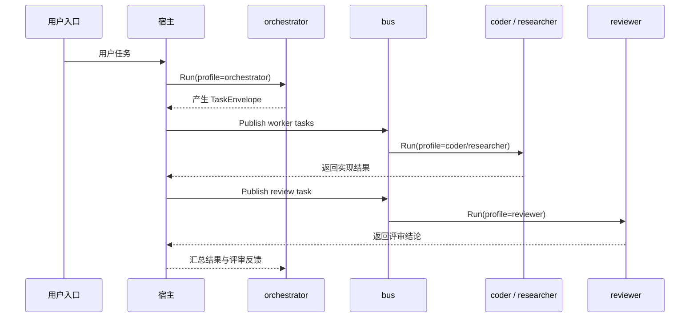

# Agent Profile 与任务路由

## 定位

本文说明 `oneclaw` 的默认心智模型：多 Agent 不是附加功能，而是默认运行形态；但这并不意味着无限制地动态生成 agent，而是围绕**一组受控的 Agent Profile**展开。

推荐默认形态是**混合型多 Agent**：

- 固定少数核心角色维持主流程稳定
- 按任务动态派生专精角色
- 通过角色分离避免执行者自评

## 核心判断

1. Agent 应首先被建模为配置剖面，而不是 Go 类型爆炸。
2. Profile 的主要差异应落在 `SystemPrompt`、Skills、Tools、权限、模型族和记忆分区。
3. 路由应优先由显式规则和元数据驱动，LLM 分类只是补充。
4. 多 Agent 的价值在于专业化、异构模型分工和评价隔离，而不在于“数量越多越聪明”。

## 推荐心智模型

一个 `AgentProfile` 可包含：

- `Name`：逻辑角色，如 `orchestrator`、`researcher`、`coder`、`reviewer`
- `SystemPrompt` 差分
- `DefaultSkillNames`
- `Tools` 子集或独立注册表
- `ModelClass` 或模型选择约束
- `PermissionMode`
- 可选 `MemoryPartition`

因此，“切换 Agent”本质上是“切换一套运行时配置和治理边界”。

## 默认角色布局

推荐至少固定以下核心 profile：

| Profile | 主要职责 | 默认约束 |
|---------|----------|----------|
| `orchestrator` | 接收请求、拆解任务、选择模型、汇总结果 | 不做重度执行，不直接自评 |
| `researcher` | 搜索、检索、资料整理、事实收集 | 倾向只读工具与低时延模型 |
| `coder` | 修改代码、局部验证、形成实现结果 | 允许写操作，但不负责最终裁决 |
| `tool-operator` | 批量工具调用、环境探测、自动化操作 | 倾向低时延与受限能力面 |
| `summarizer` | 摘要、压缩、可写回结论整理 | 偏短文本整理和成本控制 |
| `reviewer` | 评审实现、指出风险、回归检查 | 默认只有评审权，不直接修复 |

## 为什么要异构模型

不同角色适配不同模型是默认前提，不是优化选项。

推荐原则：

- `orchestrator` 和 `reviewer` 优先保证判断质量
- `researcher`、`tool-operator`、轻量 `summarizer` 优先保证低时延
- `coder` 根据任务复杂度在更强模型和更快模型之间切换

这类异构分工的目标是：

1. 把高成本模型用在真正需要判断的地方
2. 把低时延模型用在检索、搬运和执行辅助上
3. 避免所有步骤都走同一条最贵、最慢的路径

## 为什么要把执行与评价分开

默认禁止“执行 agent 给自己做最终评价”，原因很直接：

- 自评容易退化成自我辩护
- 风险判断会和实现偏好耦合
- 很难形成稳定的审计证据

因此推荐约束：

1. `coder` 产出实现结果
2. `reviewer` 独立读取结果并给出 critique
3. `orchestrator` 根据评审结论决定是否重新派发修复任务

`reviewer` 默认只有评审权，不直接闭环修复。

## 混合型路由模型

推荐把路由分成两层：

### 固定核心角色

这些角色默认存在：

- `orchestrator`
- `coder`
- `reviewer`

### 动态派生角色

当任务具有明确子问题时，再派生：

- `researcher`
- `tool-operator`
- `summarizer`
- 领域专精 profile

这就是“默认多 Agent + 按需扩容”的混合模式。

## 三种实现选项

| 方案 | 做法 | 优点 | 注意点 |
|------|------|------|--------|
| **多 `Loop` 实例** | 每个 profile 一个 `Loop` | 隔离彻底 | 资源占用更高 |
| **单 `Loop` + 每轮剖面** | 每轮按 `RunInput` 注入 profile 差分 | 实现较轻 | 不适合重度共享可变状态 |
| **子会话二次投递** | `orchestrator` 通过 `bus` 发布子任务 | 易观测，符合任务树语义 | 需要保留父子任务与评审回流 |

## 推荐路由优先级

1. **显式元数据**：最稳定、最可审计。
2. **规则引擎**：按来源、风险级别、任务类型、租户或通道映射。
3. **轻量 LLM 分类**：用于补充规则，而非替代规则。

默认不要把全部路由交给单一主模型自由决定。

## 一个典型流程

## 与默认自进化的关系

多 Agent 的价值，在于让不同角色分别沉淀不同类型的进化结果：

- `coder` 写任务结果与实现知识
- `researcher` 写资料整理与事实库
- `summarizer` 写摘要与长期记忆候选
- `reviewer` 写 critique、风险和回归点
- `orchestrator` 决定是否触发新的任务、评审或写回

但这些都建立在“写回载体受控、可审计、可回滚”的前提上。

## 非目标

- 不追求在内核里动态创建无限多运行时类型。
- 不要求首版实现重度 UI 或复杂可视化编排。
- 不让 `reviewer` 默认直接执行修复。
