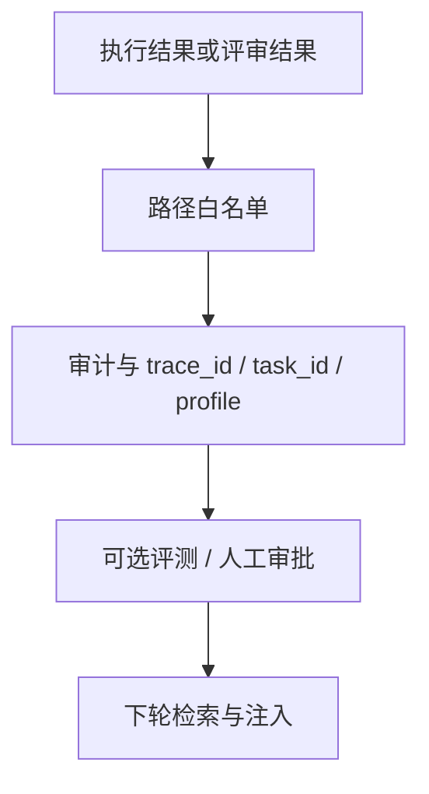

# 默认自进化能力

## 定位

本文定义 `oneclaw` 的推荐默认能力模型：系统应在尽量少配置、尽量低心智负担的前提下，持续积累可复用的信息与流程约束。

这里的“自我进化”特指**推理期 / 配置期**的行为与知识更新，不包含模型权重训练。

## 设计目标

1. 默认就能沉淀有价值的信息，而不是每次从零开始。
2. 进化结果必须外部化、可审计、可回滚。
3. 低风险进化应尽量自动化，高风险进化应受控。
4. 默认多 Agent 协作应直接参与学习闭环，而不是把学习压在单个 agent 身上。

## 默认进化闭环

这条闭环强调三件事：

- 进化的核心不是“模型自己变聪明了”，而是“系统把经验留了下来”。
- 执行结果和评审结果都应成为学习信号，而不是只保留最终文本回答。
- 写回结果必须能在下一轮以稳定方式被再次读取，而不是停留在一次性上下文里。

## 四类可进化载体

| 载体 | 典型内容 | 默认风险级别 | 推荐进化方式 |
|------|----------|--------------|--------------|
| **记忆** | 对话轮次、摘要、用户偏好、任务结论 | 低 | 追加 turn、压缩摘要、长期记忆检索 |
| **知识** | 工作区文档、项目事实、设计说明 | 中 | 工具写文件、批量同步、片段注入 |
| **SOP** | 排障步骤、发布流程、检查清单 | 高 | 受控写入、纳入 git 管理、审计与回滚 |
| **Skills** | 能力说明、风格约定、工具使用规则 | 中 | 增删改 Markdown 后重载 registry |

## 记忆边界

要让默认自进化稳定工作，必须先把 memory 的边界说清楚。

memory 不等于：

- `transcript`：会话过程记录与恢复
- `task`：当前工作的拆解、进度与 owner
- `plan`：当前任务的实施方案

适合进 memory 的通常是：

- 用户偏好
- 项目背景
- 决策理由
- 协作经验
- 不能从代码直接推导出的上下文

而这些内容通常不该直接进入 memory：

- 当前任务待办
- 一次性临时上下文
- 可以从代码或工具结果直接重建的事实

## 记忆维护路径

借鉴 Claude Code，默认自进化不应只有“在线写入”一种路径，而应至少有三种维护方式：

### 在线写入

前台 agent 在高确定性时直接沉淀。

### 增量提取

从最近消息中做近场补漏，补充遗漏的长期知识。

### 整理蒸馏

后台流程回看 memory 索引、topic files 和日志，做：

- 去重
- 纠错
- 合并
- 收缩索引

这意味着 memory 不是 append-only 日志，而是可维护知识库。

### 为什么优先外部化载体

- 易于解释：维护者能看到系统到底学到了什么。
- 易于治理：可以做白名单、评测、审批，并直接通过 git 管理变更与回滚。
- 易于迁移：可在不同模型、不同宿主之间复用。
- 易于多 Agent 共享：经验不属于某个临时 agent，而属于整个运行时。

## 默认行为建议

### 应默认开启的低风险能力

- 对话轮次持久化。
- 达到阈值后的上下文压缩。
- 从工作区与 Skills 目录读取已有知识与规则。
- 从 memory 索引中发现 topic，并按任务相关性做 recall。
- 在安全路径内追加低风险分析产物，例如摘要、经验记录、待人工确认的建议。
- 保存执行结论与评审结论的结构化摘要，供后续路由和检索使用。

### 应默认支持但受控开启的高风险能力

- 改写 `AGENTS.md`、核心 SOP、组织级规则。
- 覆盖已有工作区知识，而非仅追加。
- 自动启用新的高权限 Skills。
- 影响生产流程的高风险多 Agent 自主编排与回写。

“傻瓜式使用”不等于“无治理地自动改一切”，而是指用户不需要先理解复杂内部结构，也能得到稳定的默认收益。

## 与现有实现的映射

| 能力 | 现状 / 入口 |
|------|-------------|
| 对话记忆 | `memory.ConversationStore` |
| Skills 选择 | `Metadata["skills"]` 与 `Loop.DefaultSkillNames` |
| 工作区知识 | `workspace` 目录中的 `IDENTITY.md`、`SOUL.md`、`AGENTS.md`、`USER.md` |
| 压缩与后台分析 | `oneclaw.json` 中的 `compaction`、`background_agent` |

当前实现已经具备“外部化载体”的主方向；后续演进重点不是继续往 `agent.Loop` 塞职责，而是完善写回治理、长期记忆、角色分工和默认策略。

## 与多 Agent 的关系

多 Agent 不是放大器，而是默认前提。

推荐原则是：

1. 由 `orchestrator` 统一理解任务和选择角色。
2. 由执行型 agent 产出事实、实现和过程结果。
3. 由独立 `reviewer` 输出 critique、风险和回归点。
4. 由运行时而非某个单独 agent 决定哪些内容应被写回长期载体。

因此，“默认自进化”和“默认多 Agent”是同一条主线的两个侧面。

## 风险控制

最低要求：

- 写路径必须白名单化。
- 高风险文件必须可追踪操作者、`trace_id`、`task_id` 和 `profile_name`。
- 重要写回必须可通过 git 回滚。
- 推荐把“默认自动写回”限制在低风险目录与追加型内容。

## 非目标

- 不把模型权重训练称为“自我进化”。
- 不要求首版就有完整可视化控制面。
- 不要求所有角色都拥有写回权。
- 不把所有组织治理策略硬塞进 `agent` 内核。

