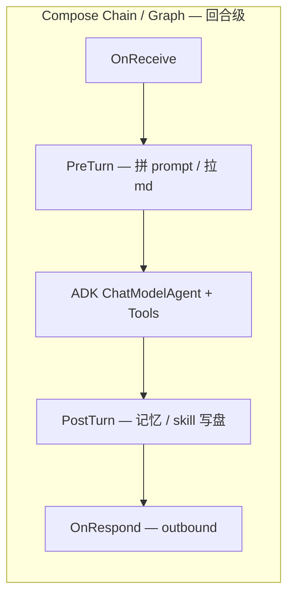

# Eino 加深 + 全 MD 管理 + 用户可扩展 Workflow（DAG）

**套件内位置**：[README.md](README.md)（复制指南）、[architecture.md](architecture.md)（主流程与生命周期图）、[workflows-spec.md](workflows-spec.md)（**`workflows/*.yaml` 规格**）、[glossary.md](glossary.md)（术语）、[reference-architecture.md](reference-architecture.md)（架构原则）、[eino-integration-surface.md](eino-integration-surface.md)（**Eino 接口/包清单**）、[harness-governance-extensions.md](harness-governance-extensions.md)（Harness 治理扩展与预留）。

前置语境：**Claw** 类运行时以「自动化完成用户需求」为目标——模型负责推理与规划，宿主负责工具、渠道与持久化；本文是该目标下 **首选 Eino 做编排内核** 的技术方案。

本文描述：**深度使用 Eino**、**模板/prompt/允许工具/skills 尽量由 md/声明式文件管理**、**在收消息/处理/响应等节点挂用户 Workflow（Compose Graph）**，并保持 **Go 代码尽量只做装配**。要点与 [CloudWeGo Eino](https://github.com/cloudwego/eino) 文档中的 **Compose Graph/Chain**、**ADK ChatModelAgentMiddleware**、**callbacks** 对齐。

---

## 1. 目标拆分

| 诉求 | 推荐承载 |
|------|----------|
| 模板 / system / 分段说明 | 纯 `.md`（或大模板拆成多文件再拼接） |
| Skills 目录与索引 | `skills/<name>/SKILL.md` + 可选「索引 md」 |
| 允许使用的 tools | **声明式清单**（工具名列表或 tag），运行时解析成对 `Registry` 的子集或过滤函数，避免在 Go 里维护长名单 |
| 深度用 Eino | **ADK** 管「模型 + 工具 ReAct」；**compose** 管「回合外的确定性流水线」；**middleware** 管「回合内模型前后」；**callbacks** 管观测 |

**Eino 编排层（概念）**：**Chain** = 线性序列；**Graph** = 带分支的 DAG；**Workflow** = 更高层对 Graph 的封装。图上可使用 `AddLambdaNode`、`AddChatModelNode`、`AddEdge`，编译为 `Runnable` 后 `Invoke`（见官方 README / llms.txt）。

**ADK**：`ChatModelAgentMiddleware` 可在 `BeforeAgent`、`BeforeModelRewriteState`、`AfterModelRewriteState`、`WrapModel` 等扩展；`Handlers` 传入 `NewChatModelAgent`。

**callbacks**：嵌入 `callbacks.BaseHandler`，用 `compose.WithCallbacks` 或 `AppendGlobalHandlers` 做日志/指标，与 **业务 workflow 图节点** 分离。

---

## 2. 「全 MD」建议：目录 + 机器可读清单

仅靠散落 md，代码里会到处是路径拼接。要保持 **代码简洁**，建议 **以用户主目录 `UserDataRoot`（默认 `~/.<app>`）为锚点** 固定布局 + **一个入口 manifest**（YAML 或带 frontmatter 的 md）。下列树 relative to **`UserDataRoot`**（与 [appendix-data-layout.md](appendix-data-layout.md) 一致）：

```text
~/.<app>/                          # UserDataRoot（默认可配置）
  config.yaml
  .agent/
    manifest.yaml                  # 默认 agent、引用 prompts、workflow 引用、模型别名等
    prompts/
      system.md                    # 全局默认说明（可被 per-agent 覆盖或拼接）
      memory_block.md              # 可选静态模板；演进真源在各会话 InstructionRoot 的 MEMORY.md / memory/
    tools.allowlist.yaml
    skills/                        # SKILL.md 树（全局）
    agents/                        # 多 Agent 定义（全局 Catalog）
      coding.md
      explore.md
    workflows/
      default.turn.yaml
  sessions/<session_id>/           # SessionRoot = InstructionRoot（推荐主会话默认）
    AGENT.md
    MEMORY.md   或   memory/
    workspace/
    transcript*.json               # 位置以实现为准
```

**原则**：

- **叙述与规范 prose** 放 md；**列表 / 顺序 / 开关** 放 yaml（或 md 的 `---` frontmatter）。
- **Tool 允许集**：解析成 `[]string` 或 tag → 装配层对 `tools.Registry` 做 `Filter`；主路径仍是 `adk.NewChatModelAgent` + 绑定工具列表。
- **多 Agent**：所有**业务 Agent 的配置集中在 `UserDataRoot/agents/`**（或 manifest 声明的路径），不在代码里硬编码角色；宿主 **先加载内置条目，再加载用户目录；同名则用户覆盖内置**（与 FR-AGT-04 一致）。

---

## 3. 用户 Workflow：三层挂钩

「记忆提取 / 基于会话自动生成 skills」等与 **多步 tool 循环** 节奏不同，建议拆成三层，避免与 ADK 内置 ReAct 打架。



### 3.1 回合外：compose.Chain / Graph（确定性）

- **OnReceive**：校验、脱敏、附件落盘、写入 `TurnContext`。
- **PreTurn**：读 md → 生成 `Instruction`、`[]*schema.Message` 前缀、tool allowlist。
- **PostTurn**：记忆提取、skill 候选生成 —— 通常各绑定 **独立 `agent_type`**（与主对话区分），以 **`NewChatModelAgent` + 收窄工具集** 运行；每次运行 **落盘执行记录**。**不得**在「抽取 / 生成」类 Agent 完成后再次调度 PostTurn 演进（见 §5.6）。
- **OnRespond**：格式化、裁剪、写 transcript、触发 bus。

用户定义的 workflow = **一张 DAG（或线性 `steps` 糖）上的命名节点**；每个节点在 Go 里仅为薄适配器（读 manifest 参数 + 调接口）。**YAML 字段、内置 `use`、manifest 引用规则** 见 [workflows-spec.md](workflows-spec.md)。

### 3.2 回合内：ADK ChatModelAgentMiddleware

适合：**每步模型请求前改 messages**、动态注入技能摘要、限流、审计。

典型用法：`BeforeModelRewriteState` 挂载到 `ChatModelAgentConfig.Handlers`，在多轮 tool 间插入 user 片段、TurnHub insert 等场景下改写 `messages`。

用户扩展 = **按 manifest 顺序追加 Middleware**。

### 3.3 观测：callbacks

不等同于业务链：用 `callbacks` 承接 `notify`、`exec_journal`，避免把业务写进 OnStart/OnEnd。

### 3.4 `memory` 包：窄接口与 Session（实现草图）

**与 Eino / `lengzhao/memory` 的区分**（必读细化）：官方第三章「Memory / Session」是 **对话历史的业务层存盘示例**；`CheckPointStore` 是 **中断恢复**；**`github.com/lengzhao/memory`** 是 **可选 SQLite 结构化记忆库**。与 oneclaw **文件型真源**如何并排或替换，见 **[memory-and-session.md](memory-and-session.md)**。

**定位**：承载 [requirements.md](requirements.md) 里的 **MEMORY / 抽取事实**（文件或等价存储真源），与 Eino ADK 的 **会话消息列表、History、Middleware** 互补 —— **不把「演进事实库」与「模型 messages」混成同一类型**；前者偏 **可审计、可合并的陈述**，后者偏 **对话轨迹**（可按预算裁剪或摘要）。

**Session / 根路径解析**（与 [appendix-data-layout.md](appendix-data-layout.md) 一致）：

- 每个用户回合在 `TurnContext`（或等价结构）中携带稳定 **`session_id`**（及可选 **`agent_id`**）。
- **`InstructionRoot`**：扁平模式下等于 `UserDataRoot`；会话隔离模式下等于 `SessionRoot`。**`AGENT.md` 与 `MEMORY.md`（或 `memory/`）始终相对于当前回合的 InstructionRoot**。
- `memory` 包 **只依赖解析后的根路径 + session 元数据**，不反向耦合渠道或 Bus。

**建议窄接口**（命名可调整；语义优先）：

| 职责 | 调用方 | 行为 |
|------|--------|------|
| **注入快照** | PreTurn（或拼 Instruction 的节点） | 读取 `MEMORY.md` / `memory/*.md` 及 sidecar，产出 **一块或多块「记忆块」**（纯文本或结构化条目列表），并附带 **预估 token/字节** 供上层 **budget** 裁剪；尊重 manifest / Agent 的 `omit_memory_injection`。 |
| **抽取写入** | PostTurn（`memory_extract_llm` 节点或 Lambda） | 输入为本回合 **可见 transcript 摘要 + 工具结果引用**（非必须全长 messages）；输出为 **候选事实列表 + 每条引用锚点**；经 **写入策略**（合并、去重、版本、人工确认门槛）后调用 **Store** 追加/修订文件与 sidecar。 |
| **只读枚举（可选）** | Skills 管线、调试 CLI | 列出当前会话 InstructionRoot 下的记忆文件与条目 id，供 `skill_suggest_llm` 引用。 |

**Store 抽象**（便于日后 Redis/DB 替换默认文件实现）：

- `LoadSnapshot(ctx, InstructionRoot, opts) → MemorySnapshot`
- `ApplyPatch(ctx, InstructionRoot, patch ExtractPatch, policy WritePolicy) error`

其中 `ExtractPatch` 含事实条目、`provenance`（回合 id、消息或工具调用 id）、可选 **置信度/需复核** 标记；`WritePolicy` 对应 PRD 中的全自动 vs 仅草案 vs 路径白名单等。

**与 Eino 的接点**：PreTurn/PostTurn **Lambda 或 ChatModel 节点**内调用上述接口；ADK **Session** 仍负责本轮执行内的消息与事件 —— **仅在需要时将 MemorySnapshot 拼成 system 后缀或 user 前缀消息**，避免在 `memory` 包内 `NewChatModelAgent`。

#### 3.4.1 oneclaw 阶段 6 已定布局（实现口径）

下列条款优先于本节上文泛化「staging / WritePolicy」草图（后者保留作日后 Harness / 策略扩展参考）：

| 事项 | 约定 |
|------|------|
| **`MEMORY.md`** | 相对当前 **`InstructionRoot`**；仅 **规则与最重要摘要**；硬上限 **2048 字节**（超出时截断或报错由实现选定，须在代码中注明）。 |
| **抽取事实落盘** | **`InstructionRoot/memory/yyyy-mm/*.md`**；目录名 **`yyyy-mm`** 使用 **UTC** 历年月，实现须固定时区并注释。 |
| **Skills 落盘** | **`UserDataRoot/skills/*`**（全局 skills 树，与 [`paths.CatalogRoot`](../paths/paths.go) = `UserDataRoot` 一致）。 |
| **`write_behavior_policy`** | **阶段 6 不实现**；路径与安全边界由工具与工作目录规则先行约束。 |
| **异步与一致性** | PostTurn 演进 **默认异步**；**不**阻塞用户回复；**不**实现「reply 前 flush」或跨回合强一致。 |
| **编排与 Workflow** | 主 turn 的 YAML **仅通过 `use: agent`** 指向演进类型；**不在 Catalog 增加**专用于演进的 **`workflow` 字段**。演进 Agent 若需 **独立 DAG**，使用 **`workflows/<agent_type>.yaml`**（与 Catalog **`agent_type` 同名**，沿用既有解析规则）。 |
| **staging** | **不使用**任何 **`.staging`** 路径；演进写入直达上表约定位置。 |

---

## 4. 「最少 Go」的插件契约（建议）

定义窄接口，由 manifest 驱动注册：

- **内置节点**：`load_prompt_md`、`filter_tools`、`if`（条件分支 + 出边 `branch`）、`noop`、`agent`（`params.agent_type` 指向 Catalog）、`memory_extract_llm`、`skill_suggest_llm` 等；**回合后记忆/Skills** 典型用 **`use: agent`** + **`async: true`**（节点 id 约定见 [workflows-spec.md](workflows-spec.md) §4.3）。
- **用户扩展**：manifest 里写节点名 + 参数；启动时 `RegisterPlugin(name, factory)`。
- **重逻辑**：节点类型 `command` + manifest 中的 `argv`，由宿主统一 `exec`（需与主进程安全策略一致：路径、超时、资源上限）。

**深度用 Eino 的落点**：一幅 **Compose 图（回合外壳）** + **一个 ADK Agent（内核）** + **Middleware 列表**；Go 只保留装配与注册表。

---

## 5. 多 Agent 与 `agents/` 配置

### 5.1 目录约定

- **`agents/*.md`**：一层扁平 md（与子目录方案二选一；实现简单）。
- 每个文件 = 一个可被选中的 **Agent 定义**（类型名来自 frontmatter 的 `agent_type` 或 `name`，否则取自文件名去扩展名）。

### 5.2 文件格式（frontmatter + 正文）

建议字段如下（frontmatter + 正文）：

| 字段 | 含义 |
|------|------|
| `agent_type` / `name` | 稳定 id（`run_agent`、路由、`toolctx.AgentID` / 观测） |
| `description` | 工具 schema / Catalog 列表展示用 |
| `tools` | 允许的工具名列表；与父 `Registry` 求交并去掉元工具 |
| `max_turns` | 子循环最大轮次（若适用） |
| `model` | 非空则覆盖宿主默认模型 |
| `omit_memory_injection` | 为 true 时可跳过 **当前 InstructionRoot** 记忆块注入（探索类 Agent） |
| `inherit_parent_memory` | 默认 **false**。子 Agent 为 **true** 时，PreTurn 可把 **父会话** MEMORY 摘要注入（仍受 budget 约束）；滥用会削弱隔离，建议仅协作型角色开启 |
| `workspace` | 默认 **`shared`**：文件/exec 类工具的 cwd **与当前主 Agent 回合相同**（宿主解析，一般为会话 `<InstructionRoot>/workspace`）。**`private`**：使用该 Agent **独占**目录（如 `sessions/<...>/subs/<sub_run>/workspace`），避免与主会话互相读写干扰 |

**正文**：该 Agent 的 **Instruction / system prompt**（注入 `ChatModelAgentConfig.Instruction` 或与全局 `prompts/system.md` 拼接，产品二选一）。

### 5.3 与 Workflow、工具、路由的关系

- **默认 Agent**：`manifest.yaml` 中 `default_agent: <agent_type>`；无则退回内置 `general-purpose` 等价物。
- **按渠道/会话切换**：入站 `Metadata`（或会话首次绑定）写入 **`agent_id`**，PreTurn 节点根据 id 从 Catalog 取 Definition，再 **`FilterRegistry`** + 拼 Instruction。
- **Per-agent Workflow（推荐约定）**：若存在 **`workflows/<agent_type>.yaml`**（与当前 Catalog 的 **类型 id** 同名），宿主 **自动选用**；否则回落 manifest 的 **`default_turn`**。若需 **共用非同名文件** 或临时覆盖，再在 frontmatter 写 **`workflow: <id>`**（可选别名 **`chain:`**，见 [workflows-spec.md](workflows-spec.md) §3）。**演进管线 Agent**（如 `memory_extractor` / `skill_generator`）不要求 Catalog 额外字段即可挂上 **同名** `workflows/<agent_type>.yaml`（见 §3.4.1）。
- **嵌套**：子 Agent 仍可声明自己的 `tools`；避免在子定义里放开 `run_agent` / `fork_context` 除非明确需要（防深度爆炸）。

### 5.4 子 Agent 默认：**会话隔离 + 上下文隔离**（已定）

与 [appendix-data-layout.md](appendix-data-layout.md) §3.1 一致，摘要如下：

| 维度 | 默认行为 |
|------|----------|
| **上下文** | 子循环 **独立 messages**；**不**附带主会话 transcript；**不**加载主 MEMORY，除非 `inherit_parent_memory: true` |
| **会话 / 落盘** | 子运行使用 **派生命名空间**（如 `sessions/<parent>/subs/<sub_run>/`）或等价隔离，避免与父 SessionRoot 无区分混写 |
| **Workspace** | 工具 cwd：**默认与主 Agent 当前回合共享**（`workspace: shared`）；若声明 **`private`** 则仅用子目录，避免文件工具踩同一棵树 |
| **handoff** | 若需把结果写回用户可见历史，由宿主 **显式**生成结构化摘要（工具返回或单独 outbound），而非静默拼接全长父上下文 |

### 5.5 Eino 侧含义

- **MVP**：每个用户回合仍是一个 **`NewChatModelAgent`**；换 Agent = 换 **Instruction + Tools + Model + Middleware 列表**。子 Agent **再起一行** ADK 实例（或独立子图），默认 **空上文 + 当前任务描述**。
- **进阶**：多 Agent 协作可用 Eino Examples 中的 **host / supervisor / 多 Agent 图** 表达；`agents/` 仍是一条 md 一条配置，由 Facade 决定实例化单 Agent 还是子图。

### 5.6 专用管线 Agent、执行记录与演进编排

**角色拆分**：主对话、PostTurn **记忆抽取**、PostTurn **Skills 生成** 可使用 **三个（或更多）不同 `agent_type`**，在 manifest / `workflows/*.yaml` 中写明；各自 **Instruction、`tools`、`model`** 独立。

**执行记录落盘**：每一次 ADK 运行（含 PostTurn 异步任务）写入 **可追溯文件**（推荐 JSONL），字段至少含：`run_id`、`agent_type`、`session_id`、父 `run_id`（若有）、起止时间、与 transcript 的引用锚点。路径建议：`sessions/<session_id>/runs/<agent_type>/…` 或与 [requirements.md](requirements.md) §5「审计」目录合并 schema。

**与 oneclaw 实现对齐（FR-FLOW-05 [requirements.md](requirements.md)）**：

- **配置真源在 workflow**：主会话通过 **`workflows/*.yaml`** 在 **`on_respond` 之后**声明 **`async: true`** 的 **`use: agent`** 枝（常见节点名 **`memory_agent`**、**`skill_agent`**），`params.agent_type` 默认为 **`memory_extractor` / `skill_generator`**（**嵌入内置 Catalog**，用户 **`agents/`** 同名 md **覆盖**）。
- **当前实现** **未**做「演进专用 workflow 不得再挂同类 async 枝」的加载期校验；**未**在 **`TurnContext`** 上维护演进嵌套剖面或深度阈值。**`handleAgent`** 与普通子 Agent 路径一致。

---

## 6. 实现侧收口（建议）

- **Runtime Facade**：将 ADK、Compose Graph（workflow 外壳）、Middleware、catalog 加载与 `TurnContext` 装配收口到少量模块，避免 prompt 拼装与执行内核散落在多处。
- **与本文的映射**：`prepareSharedTurn` / `buildTurnSystem` 一类逻辑宜逐步变为 **PreTurn 节点子图** 的输出；子 Agent **复用同一套节点类型**，换 **`agents/<type>.md` + 可选 workflow**，且 **默认隔离上下文**（见 §5.4）。
- **命名**：`Engine`、`SubmitUser`、`toolctx`、`notify` 等以实现仓库为准；本文不绑定具体源码路径或包名。

---

## 7. 设计注意

1. **PostTurn 记忆/skill**：优先 **异步 + 失败不影响用户回复**（或 Fire-and-forget 分支），必要时 recover。
2. **与 ADK 步进的关系**：多轮 tool 间插入新 user 内容，使用 **`BeforeModelRewriteState`** 改写本轮 `messages`（见 §3.2）。
3. **工具白名单**：全局 Manifest + **每 Agent `tools`** 取交集（或 Agent 覆盖）；skill 是「说明」，invoke 后仍受 allowlist 约束。
4. **用户 workflow 若含外部命令**：必须与主进程 `exec` 策略一致（沙箱、超时、审计）。
5. **`agent_type` 唯一性**：**内置 Catalog 先加载，用户 `UserDataRoot/agents/` 后加载；同名则后者覆盖前者**（用户覆盖内置）。
6. **Harness 治理扩展**：工具调用与状态写入宜预留 **统一 policy 挂钩**；Manifest 可为 `harness:` / `policy:` 等预留命名空间（未知子键忽略）。详见 [harness-governance-extensions.md](harness-governance-extensions.md)。
7. **演进编排**：由 **`workflows/*.yaml`** 声明；病态闭环依赖设计与后续可选校验（见 FR-FLOW-05 条款现状）。

---

## 8. Harness 治理（扩展）

一期实现以 PRD 为准；**三层治理**（行为 / 运行 / 输出与状态）、**生命周期安全**（输入过滤、调用前校验、最小权限执行、状态检查点/回滚）及 **staging、审计 schema 版本化** 等，作为增强 backlog 与初期预留扩展性说明，见 **[harness-governance-extensions.md](harness-governance-extensions.md)**。本条仅作交叉引用，不重复展开。

---

## 9. 参考链接

- Eino：`https://github.com/cloudwego/eino`
- Eino Examples（ADK、编排、多 Agent）：`https://github.com/cloudwego/eino-examples`

文档撰写时可结合 Context7 `/cloudwego/eino` 查询 Compose、Middleware、Callbacks、多 Agent 示例的最新说明。完整的 **包路径与符号列表** 见 [eino-integration-surface.md](eino-integration-surface.md)。

---

## 10. 修订记录（本节与套件）

| 日期 | 说明 |
|------|------|
| 2026-05-02 | 增补 §8 Harness 治理交叉引用、§7 设计注意第 6–7 条、参考链接顺延；§3.4 `memory` 包草图；§2 树锚定 `UserDataRoot`；§5 `inherit_parent_memory`、`workspace` 等；§5.4 Workspace；§5.5 Eino 侧；§5.6 多 Agent 管线、执行记录、演进防递归；§6 实现收口；§7 Catalog 顺序；交叉引用 [reference-architecture.md](reference-architecture.md)；§3.1/§4 PostTurn 与内置节点；套件位置与 §3.1 指向 [workflows-spec.md](workflows-spec.md)；Claw 侧 **workflow / DAG** 命名取代纯 chain |
| 2026-05-03 | §4 / §5.2 / §5.6 / §7：**演进仅靠 workflow（`async` + `use: agent`）**；删除 **`suppress_post_turn_evolution`**。**§3.4.1 / §5.3**：阶段 6 已定路径；**§3.4** 交叉引用 [memory-and-session.md](memory-and-session.md)。与实现对齐：内置 Catalog + 默认 turn；无演进专用加载期校验、无 `TurnContext` 演进剖面 |
