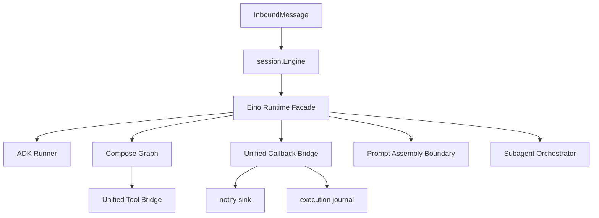

# 使用 Eino 对 oneclaw 直接大重构方案（Deep Refactor）

## 1. 重构目标与策略

**目标**：一次性将运行时核心从“自研 OpenAI 强耦合 loop”切换到“Eino ADK + Compose 主导”，并在一个主分支重构窗口内完成主链路替换。  
**策略**：采用“**单窗口大迁移 + 严格门禁 + 可应急回滚**”，不再以 POC 并存为主路径。

---

## 2. Eino 核心能力（与 oneclaw 相关）

基于 Eino 官方文档、仓库与示例，和当前 oneclaw 结构对照，最有价值的能力如下：

1. **ADK Agent 抽象**：统一代理执行与事件流，减少手写 ReAct 循环。  
2. **Compose 图编排**：可把“模板 -> 模型 -> 工具 -> 汇总”显式建图，替代散落在 `loop` 的流程分支。  
3. **Tool 生态统一接口**：支持工具 schema + 执行，适合桥接现有 `tools.Registry`。  
4. **Callbacks/观测切面**：可承接当前 `notify` + `exec_journal` 的生命周期事件。  
5. **多 Agent 协作模式**：支持 host/supervisor/loop 等模式，适合替换当前 `subagent` 的部分手工补丁逻辑。  
6. **Interrupt/Resume 机制**：可覆盖会话级中断恢复诉求，减少定制状态机代码。

---

## 3. 当前项目复杂点（调研摘要）

以下复杂度热点直接影响“可维护性”和“改造风险”：

- `session.Engine` 职责过重：会话编排、路由、通知、落盘、模型参数集中在单体对象。  
- `loop.RunTurn` 强绑定 OpenAI 类型：`openai.ChatCompletionMessageParamUnion`、tool_calls 编解码深度内嵌。  
- `tools.Registry` 以 **Eino 工具绑定**为主路径；若保留 OpenAI 兼容导出，宜收敛为少量适配函数而非散落重复的 schema 构造。  
- `subagent` 依赖消息裁剪/修补函数维持一致性，语义复杂。  
- 生命周期事件同时写 `notify` 和 `execution jsonl`，有字段重复与演进负担。  
- `workspace` 路径策略（flat/isolate/instructionRoot）跨模块渗透，测试和迁移成本高。  

---

## 4. 目标架构（大重构后）

关键点：
- `session.Engine` 仅保留会话编排与状态管理，执行内核下沉到 `Eino Runtime Facade`。
- 不再维护 legacy/eino 双运行时并存路径，避免长期双轨成本。
- 工具、子代理、生命周期统一走 Eino 语义与适配层。

---

## 5. 大重构执行计划（单窗口）

## Wave 0：冻结与基线（2 天）

- 冻结 runtime 相关新需求（`session`/`loop`/`subagent`/`tools`/`notify`）。  
- 建立行为基线：固定一组 golden transcript + e2e case + 性能基线（时延/成本/成功率）。  
- 定义上线门禁：任一关键指标劣化超阈值即禁止合入。

## Wave 1：内核替换（4-6 天）

- 移除 `loop.RunTurn` 作为主链路执行器，改为 `Eino Runtime Facade` 直连 ADK Runner。  
- 在 `session/engine.go` 保留输入准备和结果回写，但模型调用与 tool round 全部下沉到 Eino。  
- 要求：主链路（普通问答 + 多工具调用）必须可用。

## Wave 2：工具与提示词重接线（4-5 天）

- 将 `tools.Registry` 从 OpenAI schema 导向改为中立结构，Eino tool 为唯一执行出口。  
- 迁移 prompt 组装边界：system/user/attachment/memory 注入由 Facade 统一编排。  
- 删除或废弃仅服务 OpenAI loop 的工具封装代码。

## Wave 3：子代理体系替换（5-7 天）

- 将 `subagent/run.go` 的消息修补逻辑迁移到 Eino 多代理模式（host/supervisor/loop）表达。  
- 保留 oneclaw 业务策略：深度限制、workspace 隔离、sidechain 落盘。  
- 目标：显著减少 `trim/drop/strip` 类补丁函数。

## Wave 4：观测与落盘统一（3-4 天）

- 生命周期事件统一来源改为 Eino callbacks，再路由到 `notify` 与 `exec_journal`。  
- 收敛 event schema 与 trace 关联字段，减少重复拼装。  
- 完成旧通道兼容清理与文档更新。

---

## 6. 代码落点建议（大重构范围）

- `session/engine.go`：瘦身为“输入编排 + 输出提交 + 会话状态落盘”。  
- `loop/runner.go`：退出主链路（保留短期应急分支，最终下线）。  
- `session/eino_runtime_facade.go`（新增）：承接 ADK/Compose 组装与运行。  
- `tools/registry.go` + `tools/tool.go`：改为中立工具描述与 Eino adapter。  
- `subagent/run.go` + `session/subrunner.go`：迁移到 Eino 多代理编排。  
- `session/notify_lifecycle.go` + `session/exec_journal.go`：统一 callback 事件源。

---

## 7. 大重构风险与控制

- **风险1：一次替换导致全链路回归面过大**  
  控制：按 Wave 设置硬门禁；每个 Wave 必须通过基线再进入下个 Wave。

- **风险2：流式输出与中断恢复语义偏差**  
  控制：将 streaming/interrupt 作为专项回归集，独立压测与故障演练。

- **风险3：子代理决策路径变化引发行为漂移**  
  控制：针对 `subagent` 建立任务级金标样本，按语义一致性验收。

- **风险4：重构期间定位问题困难**  
  控制：强制埋点统一 trace_id/turn_id/tool_use_id，先补观测再切换主链路。

- **风险5：重构窗口过长影响主干研发**  
  控制：设置时间盒，超时则触发“收敛版范围裁剪”（优先保主链路）。

---

## 8. 验收标准（Go/No-Go）

1. 主链路 e2e 通过率 >= 98%，且阻断级缺陷为 0。  
2. `loop/runner.go` 不再承担生产主路径执行。  
3. OpenAI 直绑类型仅保留在 provider 适配层，不再渗透到会话编排层。  
4. 子代理关键用例语义一致率 >= 95%。  
5. `notify` 与 `exec_journal` 共享统一事件模型与关联 ID。  
6. 相比基线，P95 时延和单轮 token 成本劣化不超过预设阈值（建议 <= 10%）。

---

## 9. 大重构交付物清单

- **配置 / 内核**：已移除 **`legacy` 并行运行时**与 **`MainAgentRuntime()`**；内核固定 **`einoTurnRunner`**；`agent.runtime` 不再出现在 **`config.File`**（旧 YAML 中的键可被解析器忽略）。无 **`openai.api_key`** 时不再回退 **`loop.RunTurn`**，模型回合直接失败。`session.NewEngine` 须提供非 nil `Registry`。
- 新运行时架构文档（本文件）与迁移后 runtime-flow 更新。  
- Eino Runtime Facade + Tool Bridge + Callback Bridge 代码落地。  
- 子代理迁移后的行为回归报告。  
- 上线前 Go/No-Go 检查单与回滚手册。  
- 旧逻辑退役计划（含删除窗口与兼容策略）。

---

## 10. 可直接派工任务清单（按文件拆分）

## Wave 0（冻结与基线）

- **任务 W0-1：建立行为基线数据集**  
  - 文件：`test/e2e/CASES.md`、`test/e2e/CASES_LIVE.md`、`test/e2e/helpers_test.go`  
  - 产出：核心场景清单（问答/多工具/子代理/异常恢复）与 golden transcript 样本。  
  - 完成定义：基线测试可一键运行并产出可比对结果。

- **任务 W0-2：建立性能与成本基线**  
  - 文件：`session/engine.go`（如需 token/成本统计另立观测入口）  
  - 产出：P50/P95 时延、每轮 token 成本、工具调用成功率基线。  
  - 完成定义：形成基线报告并纳入 Go/No-Go 检查单。

## Wave 1（内核替换）

- **任务 W1-1：新增 Eino Runtime Facade**  
  - 文件：`session/eino_runtime_facade.go`（新增）  
  - 产出：封装 ADK Runner + Compose 入口，提供统一 `RunTurn` 风格调用。  
  - 完成定义：普通问答与单次工具调用可完整跑通。

- **任务 W1-2：瘦身 Engine，剥离执行内核**  
  - 文件：`session/engine.go`、`session/engine_notify.go`、`session/notify_lifecycle.go`  
  - 产出：`Engine` 仅负责 turn 准备、调用 facade、结果提交与状态持久化。  
  - 完成定义：`engine.go` 不再直接依赖 OpenAI completion 调用路径。

- **任务 W1-3：legacy loop 退主链路**  
  - 文件：`loop/runner.go`  
  - 产出：标记为“应急回滚路径”，从主流程调用点移除。  
  - 完成定义：生产路径不再进入 legacy loop。

## Wave 2（工具与提示词重接线）

- **任务 W2-1：重构工具注册抽象**  
  - 文件：`tools/tool.go`、`tools/registry.go`、`tools/builtin/default.go`  
  - 产出：中立 Tool Descriptor + Eino Tool Adapter。  
  - 完成定义：内置工具均可由 Eino 路径调用，权限与校验逻辑保持一致。

- **任务 W2-2：迁移 prompt 组装边界**  
  - 文件：`session/system.go`、`prompts/prompts.go`、`prompts/prompts_test.go`  
  - 产出：system/user/attachment/memory 组装规则由 facade 统一接入。  
  - 完成定义：关键 prompt 测试通过，输出结构与旧版语义对齐。

- **任务 W2-3：更新运行时流程文档**  
  - 文件：`docs/runtime-flow.md`、`docs/prompts/README.md`（`runtime-flow` / `docs/README` / `agent-runtime-golang-plan` 已对齐 Eino 主路径；`prompts/README` 按提示词变更再扫）  
  - 产出：迁移后流程图与边界说明。  
  - 完成定义：文档与代码路径一致，无旧路径误导描述。

## Wave 3（子代理体系替换）

- **任务 W3-1：子代理执行迁移到 Eino 多代理编排**  
  - 文件：`subagent/run.go`、`session/subrunner.go`、`subagent/notify_emit.go`  
  - 产出：host/supervisor/loop 模式映射 oneclaw 子代理执行。  
  - 完成定义：常见子代理用例通过，深度限制与工具裁剪仍有效。

- **任务 W3-2：保留并对齐 sidechain 与会话隔离策略**  
  - 文件：`session/notify_lifecycle.go`、`workspace/paths.go`、`session/exec_journal.go`  
  - 产出：sidechain 记录、workspace 隔离、execution log 路径与旧约束兼容。  
  - 完成定义：日志可回溯，路径布局无破坏性变化。

## Wave 4（观测与落盘统一）

- **任务 W4-1：统一 callback 事件模型**  
  - 文件：`notify/event.go`、`notify/sink.go`、`session/notify_lifecycle.go`、`session/exec_journal.go`  
  - 产出：单一事件结构（含 trace_id/turn_id/tool_use_id）并分发到 notify/journal。  
  - 完成定义：事件字段稳定，排障可跨通道关联。

- **任务 W4-2：测试与回归收口**  
  - 文件：`session/*_test.go`、`subagent/*_test.go`、`notify/*_test.go`、`test/e2e/*`  
  - 产出：全量回归结果与 Go/No-Go 结论。  
  - 完成定义：满足第 8 节所有门禁后允许发布。

---

## 11. 建议分工（并行）

- **运行时主线组**：`session/engine.go`、`session/eino_runtime_facade.go`、`loop/runner.go`  
- **工具与提示组**：`tools/*`、`session/system.go`、`prompts/*`  
- **子代理与观测组**：`subagent/*`、`notify/*`、`session/exec_journal.go`、`session/notify_lifecycle.go`  
- **验证与发布组**：`test/e2e/*`、回归报告、Go/No-Go 检查单与回滚手册

---

## 12. 参考资料

- Eino GitHub 仓库：[cloudwego/eino](https://github.com/cloudwego/eino)  
- Eino 官方文档入口：[cloudwego.io/docs/eino](https://www.cloudwego.io/docs/eino/)  
- Eino 示例仓库：[cloudwego/eino-examples](https://github.com/cloudwego/eino-examples)
