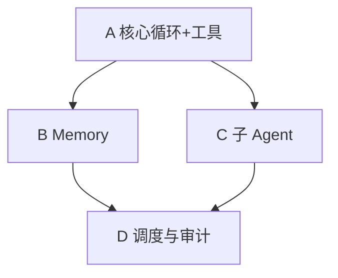

# Go Agent Runtime 开发计划（执行版）

本文档是 [`agent-runtime-golang-plan.md`](agent-runtime-golang-plan.md) 的排期细化。设计真源均为本目录下 `claude-code-*.md` 与 `prompts/`；**本仓库不再依赖** `claude-code-2026-03-31` 子目录。

若需对照原 TypeScript 实现，请自行保留或克隆参考仓库；下列「TS 参考路径」均指该源码树中的相对路径，仅作语义映射提示。

---

## 1. 仓库与工程约定

- **Go 实现**：独立仓库；日志使用 **`log/slog`**；不强制使用 `internal` 包。
- **每次新功能**：先读本 `docs/` 下对应设计文再改代码（与团队规范一致）。

---

## 2. 建议包布局

| 职责 | 建议包 | 原 TS 语义参考（路径相对原 Claude Code `src/`） |
|------|--------|--------------------------------------------------|
| 会话与入口 | `session` / `orchestrator` | `QueryEngine.ts`、`utils/processUserInput/processUserInput.ts` |
| 主循环 | `agent` / `loop` | `query.ts` |
| 工具运行时 | `tools` | `Tool.ts`、`services/tools/toolOrchestration.ts`、`services/tools/toolExecution.ts` |
| 消息模型 | `message` / `types` | `types/message.js`、`utils/messages.ts` |
| Memory | `memory` + 注入 `context` | `memdir/memdir.ts`、`utils/attachments.ts`、`utils/memoryFileDetection.ts` |
| 子 Agent | `subagent` | `tools/AgentTool/runAgent.ts`、`utils/forkedAgent.ts`、`utils/swarm/inProcessRunner.ts` |
| 系统前缀 | `context` | `utils/queryContext.ts`、`context.ts`、`constants/prompts.ts` |

---

## 3. 阶段 A：最小闭环

**目标**：Transcript + 主 query 循环 + 一种模型后端 + 最小工具集（读/写/grep/可选 shell），权限与保守并发。

| 序号 | 任务 | 要点 |
|------|------|------|
| A1 | 统一消息模型 | user / assistant / tool_use / tool_result / attachment；compact boundary 可先占位 |
| A2 | 会话编排 | 每轮输入 → 追加 transcript → 进入 query 循环；跨轮状态（messages、usage、abort） |
| A3 | query 循环 | 模型 → tool_use → 执行 → tool_result 回灌 → 直至无 tool 或达上限/预算 |
| A4 | 模型后端 | 一种供应商 + 流式 + tool 块解析 |
| A5 | 工具注册与执行 | schema、按名查找、权限钩子；只读工具可批量并行、写串行 |
| A6 | 最小工具 | Read / Write 或 StrReplace / Grep、Bash（cwd/超时/策略） |
| A7 | `ToolUseContext` | abort、只读缓存、权限上下文；为 B/C 预留 nested memory 等字段 |
| A8 | 测试与 CLI | 消息往返单测；简单多轮对话入口 |

**验收**：同 session 多轮 + 多轮工具调用；Abort 可停；transcript 可序列化/持久化。

---

## 4. 阶段 B：Memory 全链路

**目标**：发现、注入、recall、在线写入；extract / dream 入口。设计对照 [`claude-code-memory-system.md`](claude-code-memory-system.md)。

| 序号 | 任务 | 要点 |
|------|------|------|
| B1 | 存储与路径 | 各 scope；`MEMORY.md` 索引；topic；daily log append |
| B2 | `MEMORY.md` 截断 | 行数 + 字节双上限、截断说明 |
| B3 | 发现层 | 向上查找 `AGENT.md`、`.oneclaw/rules`、`memory` 根 |
| B4 | `@include` | **不实现**（仅磁盘正文） |
| B5 | 注入与 recall | system 前缀；recall → attachment；字节上限与路径去重 |
| B6 | 在线更新 | 工具写 topic / `MEMORY.md` / daily log |
| B7 | extract / dream | 窄上下文子任务 + 触发策略；合并去重可先简化 |

**验收**：切换目录/scope 发现正确；下一轮能注入更新后的 memory；recall 可控不爆 token。

---

## 5. 阶段 C：子 Agent 与隔离

**目标**：独立 agentId、裁剪上下文、独立 transcript；fork 与完整子 Agent；权限收缩。对照 [`claude-code-subagent-system.md`](claude-code-subagent-system.md)、[`prompts/20-subagent.md`](prompts/20-subagent.md)、[`prompts/30-fork-agent.md`](prompts/30-fork-agent.md)。

| 序号 | 任务 | 要点 |
|------|------|------|
| C1 | Agent 定义加载 | 目录或配置驱动 |
| C2 | 嵌套调用 | 子 Agent 内独立 query；默认隔离 `ToolUseContext` |
| C3 | Fork | 共享 system 前缀 + 裁剪 messages |
| C4 | sidechain transcript | 与主线程分离，可选合并 |
| C5 | 权限 | 子 Agent 侧默认更保守（如避免交互式授权） |

**验收**：主 transcript 不被子任务撑爆；fork 与全量子 Agent 两条路径行为符合设计文。

---

## 6. 阶段 D：运维与可选向量

| 序号 | 任务 | 要点 |
|------|------|------|
| D1 | 维护调度 | dream / extract 的定时或事件触发；slog 记录失败 |
| D2 | 变更审计 | memory 写入可追溯（git 或 append-only log） |
| D3 | 向量 recall（可选） | 插件化；文件仍为真源 |

---

## 7. 依赖顺序

---

## 8. 风险与刻意后置

- 第一期不做：完整 MCP、复杂 compact UI、全量遥测。
- 尽早做 token/字节预算，避免 B 阶段大改。
- 并发策略：**只读并行、写串行**，与 [`claude-code-main-flow-analysis.md`](claude-code-main-flow-analysis.md) 中工具层语义一致。
