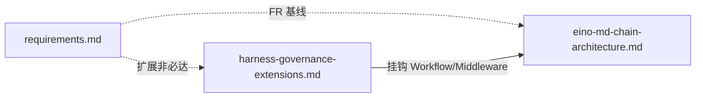

# Harness 治理与扩展方向（增强 / 非一期必做）

本文档收集 **执行 Harness** 相关的工业实践与学术架构，作为本项目的 **增强与扩展 backlog**；**不**改变 [requirements.md](requirements.md) 中一期验收的必达范围。架构挂钩方式与 [eino-md-chain-architecture.md](eino-md-chain-architecture.md) 中的 **Workflow（Compose Graph）** / Middleware / 插件契约对齐。

**Harness**：包住模型的运行时层——上下文拼装、工具编排、状态持久化、预算与停止条件、校验与审计等；模型仅是其中一个组件。本项目中的 Manifest、`workflows/*.yaml`、工具白名单、子 Agent 工具子集、记忆/Skills 写入策略与观测，均属 harness 范畴。

---

## 1. 初期设计：预留扩展性与兼容性

以下为 **MVP 仍可简化实现**、但建议在装配与配置层 **预先留出** 的能力，避免日后大改：

| 方向 | 建议 |
|------|------|
| **统一策略执行点** | 工具调用与文件/记忆写入尽量经过同一套 **policy 接口**（实现可先为规则 + allowlist）；日后可替换为分层校验、外部 judge，而调用方不变。 |
| **Manifest 命名空间** | 在 `manifest.yaml`（或等价）中为治理预留顶层键（如 `harness:` / `policy:`），**未识别的子键忽略而非报错**，便于向后追加字段。 |
| **Workflow 节点注册表** | 用户 workflow 节点按「名称 → 工厂」注册；内置节点与未来将加的 `*_guard`、`*_verify` 同类扩展，不占硬编码分支。 |
| **审计事件 schema** | 演进与工具副作用日志采用 **带版本字段** 的结构化记录（如 `audit_schema_version`）；字段只增不减，旧读者跳过未知字段。 |
| **来源（Provenance）字段** | 记忆事实、RAG 块、Skills 草案从一期起预留 **来源引用**（turn id、片段 id、路径）；可为空，但字段位保留，便于接入下文 L1/L2 类过滤。 |
| **演进单次触发** | PostTurn 调度与 **`suppress_post_turn_evolution`** 一致：抽取/生成类 Agent 运行内 **禁止**再次入队同类演进，防止死循环（与 [requirements.md](requirements.md) FR-FLOW-05、[eino-md-chain-architecture.md](eino-md-chain-architecture.md) §5.6 对齐）。 |
| **Eino 适配边界** | ADK / Compose / Middleware 的装配集中在 Facade；治理逻辑以 **可注入的 Hook** 形式挂接，避免与 Eino 类型深度耦合，便于跟上游 API 演进。 |

---

## 2. 工业侧：三层治理（Harness Engineering）

生产级 Agent 常见 **三层治理**，与 PRD 中的工具、预算、审计条目天然对应：

| 层次 | 含义 | 本项目映射 |
|------|------|------------|
| **行为治理** | 可调用的工具、可访问的数据、条件约束 | 工具白名单、子 Agent Registry 子集、MCP 前缀、知识库路径根目录限制 |
| **运行治理** | 步数、token、超时、重试、成本包络 | `max_steps` / `max_tokens`、异步演进任务退避与熔断 |
| **输出 / 状态治理** | 对外输出校验、高风险确认门闩、schema、审计 | 记忆/Skills「草案 + 确认」、演进溯源、RAG 带来源 |

**扩展方向**：将策略 **声明式** 写入 YAML（Policy-as-code），与「少代码、多配置」一致；校验发生在 **工具调用前后** 与 **状态落盘前后**，与 PreTurn / PostTurn / Middleware 挂钩。

---

## 3. 学术 / 系统侧：生命周期集成安全（SafeHarness 等）

[SafeHarness: Lifecycle-Integrated Security Architecture for LLM-based Agent Deployment](https://arxiv.org/abs/2604.13630) 将防御嵌入 **输入处理 → 决策 → 执行 → 状态更新** 四阶段，并强调 **跨层联动**（异常时提高验证强度、收紧权限、回滚），针对「仅在外围做 guardrail、看不见工具观测污染」等问题。

与本文档概念映射（**按需分阶段实现**）：

| 阶段 / 层 | 机制概要 | 扩展落地思路 |
|-----------|-----------|----------------|
| **输入 / 上下文（Inform）** | 对外部进入上下文的内容过滤与 **来源标注** | OnReceive / PreTurn：bridge 入站、检索片段、工具返回进入 messages 前可走同一 sanitization 管道 |
| **决策（Verify）** | 对拟执行工具调用分级校验（规则 → 更强 judge） | Middleware 或 ADK 前：按工具 risk tier 决定是否追加校验 |
| **执行（Constrain）** | 风险分层、能力令牌（次数/时效）、工具完整性 | 子 Agent 工具子集 + 每会话/每工具配额；注册表完整性校验（可选） |
| **状态更新（Correct）** | 检查点、回滚、渐进降级 | 记忆/Skills 写入 staging、异常时禁止晋升或收紧自动写入 |

---

## 4. 其他互补方案（Backlog）

- **威胁建模**：OWASP LLM / Agent 相关清单；间接注入、工具滥用、记忆污染等 → 用作设计评审与默认威胁假设。
- **双轨与暂存**：自主演进内容默认 **staging**，策略或人工晋升 → 降低模型写坏真源风险。
- **多 Agent 职责分离**：规划 / 执行 / 审查分工；执行侧收紧工具，审查侧只读 transcript（成本与延迟需权衡）。
- **轻量验证环**：对高影响工具在 harness 内做 **schema 或二次核对**（不必引入完整 ML judge）。
- **Harness 性能调优**：模块化 harness、自动合成 workflow（图）等研究方向 → 在 `workflows/*.yaml` 与观测数据成熟后，用于优化上下文预算与节点顺序。

---

## 5. 实施优先级建议（扩展路线）

1. **骨架**：三层治理在配置中可表达 + **统一拦截工具与写路径** + 演进审计（与 PRD 重合部分优先交付）。
2. **短期增益**：记忆/Skills **staging + 晋升策略**；RAG/事实 **强制可追溯引用字段**。
3. **安全加深**：工具观测再过滤、风险 tier + 配额、状态回滚与降级模式（对齐 §3）。
4. **资料**：工业叙事可参考 [Harness Engineering](https://harness-engineering.ai/blog/what-is-harness-engineering/) 系列；纵深对照表可用 SafeHarness 威胁向量。

---

## 6. 与套件内其他文档的关系

---

## 7. 修订记录

| 日期 | 说明 |
|------|------|
| 2026-05-02 | 首版：Harness 治理与 SafeHarness 映射、扩展 backlog、初期预留扩展性建议；§1 增补「演进单次触发」（对齐 FR-FLOW-05 / eino §5.6） |
