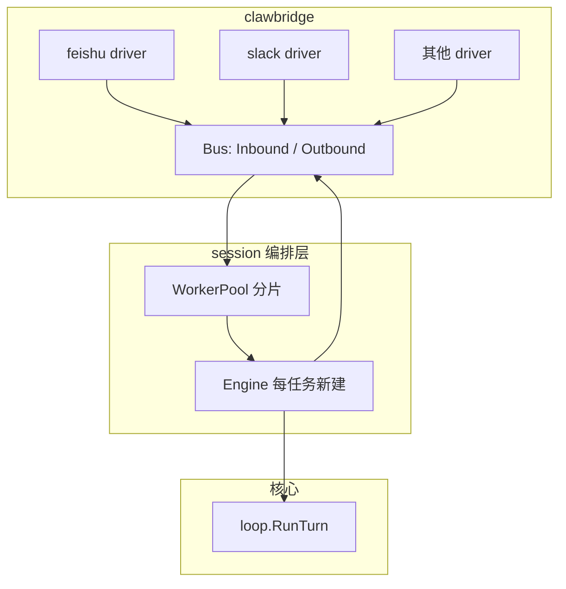
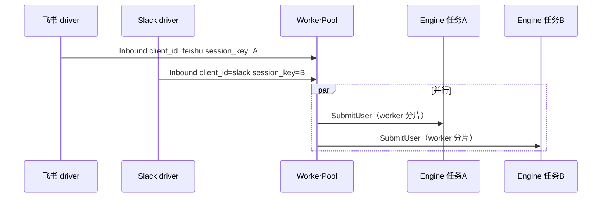

# IM 多通道技术方案

> **目标**：在保持核心（`session` / `loop` / 工具链）稳定的前提下，实现**模块隔离、可插拔**的 IM 接入；支持**多种 IM 同时在线**、**同一 IM 下多会话并行**，并预留**多媒体**能力。  
> **依据**：[`inbound-routing-design.md`](inbound-routing-design.md)、[`outbound-events-design.md`](outbound-events-design.md)、[`picoclaw-channel.md`](picoclaw-channel.md)（外部项目分层调研）。  
> **主路径**：**`cmd/oneclaw`** + **`github.com/lengzhao/clawbridge`**；入站 **`bus.InboundMessage`** → **`session.WorkerPool`** → **`Engine.SubmitUser`** → **`loop.RunTurn`**；出站 **`Engine.PublishOutbound`**（**`bus.OutboundMessage`**）。

---

## 1. 目标与约束

| 需求 | 技术含义 |
|------|----------|
| **模块隔离、通用** | IM 适配代码独立包、只依赖稳定契约；核心不 import 飞书/Slack SDK。 |
| **多 IM 并行** | 进程内可同时跑多个 channel 实例（多 goroutine / 多连接），入站互不阻塞；出站按「来源 + 会话」路由到正确连接。 |
| **同 IM 多 session 并行** | 同一 `Source`（如 `feishu`）下，不同群/单聊/线程对应不同对话状态，可**并发**处理多路用户轮次，数据隔离。 |
| **多媒体** | 用户可发图/文件/语音；助手可发文件或带链接的回复；与模型输入能力对齐（URL、base64、本地路径等策略可配置）。 |

**非目标（首版可不做）**：跨 IM 会话合并、全局单线程串行所有用户、完整 Picoclaw 级占位/打字态编排。

---

## 2. 设计原则

1. **单向依赖**：**clawbridge** 各 driver → **`bus.InboundMessage`** → `session` / `loop`；**禁止** `loop` / `tools` → 具体 IM SDK（SDK 仅在 clawbridge 与驱动侧）。
2. **契约稳定**：入站以 **`github.com/lengzhao/clawbridge/bus.InboundMessage`** 为统一形状（概念字段表见 [`inbound-routing-design.md`](inbound-routing-design.md) §2）；出站以 **`bus.OutboundMessage`** 经 **`PublishOutbound`** 为主（见 [`outbound-events-design.md`](outbound-events-design.md) §1）；**`notify`** 审计等为并行路径。
3. **实例与注册**：IM 侧由 **clawbridge 配置 `clients`** 注册多路连接；若需「每轮绑定 chat / thread 句柄」，可在 **`OutboundMessage`** 构造侧演进（参见 [`inbound-routing-design.md`](inbound-routing-design.md) §4 可选演进）。
4. **会话是第一条隔离边界**：并行与持久化策略以 **`session.SessionHandle`**（`Source`/`ClientID` + `SessionKey`）为粒度；**生产路径**下每个 turn **新建 `Engine`**，状态以落盘为准（见 [`config.md`](config.md)「会话与多通道」）。
5. **与平台互通**：与 PicoClaw 类似，**在 clawbridge driver 内**使用官方/社区 SDK 建链；**不**把「自建 HTTP 网关」当作唯一主路径（Webhook 类平台可作为例外，在 driver 或独立 handler 中实现）。

---

## 3. 总体架构



**数据路径简述**

- **入站**：driver 内 SDK 回调 → 映射为 **`bus.InboundMessage`**（含 `ClientID`、`SessionKey`、`MediaPaths` 等）→ **`session.WorkerPool.SubmitUser` → `Engine.SubmitUser` → `loop.RunTurn`**。
- **出站**：`session.Engine` 经 **`PublishOutbound`** 将 **`bus.OutboundMessage`** 送到 **clawbridge 总线**，由对应 **driver** 发到平台（见 [`outbound-events-design.md`](outbound-events-design.md) §1）。

---

## 4. 模块隔离与目录约定（当前 oneclaw）

```text
github.com/lengzhao/clawbridge   # Bridge、Bus、YAML 配置、各 IM driver（独立模块）
cmd/oneclaw/                     # config、WorkerPool、MainEngineFactory、clawbridge.New + Start、submitInbound
session/                         # Engine、SubmitUser、turn 编排、WorkerPool
```

**接口边界**

| 概念 | 职责 | 与 oneclaw 关系 |
|------|------|----------------|
| **clawbridge `Bridge`** | 生命周期、`Start`/`Stop`、挂载 drivers | `cmd/oneclaw` 中 `clawbridge.New` + `SetDefault` |
| **driver** | 平台 SDK → **`bus.InboundMessage`**；出站消费总线 | 在 **clawbridge** 模块中实现 |
| **按来源出站解析（可选）** | 注册表或工厂封装 **`OutboundMessage`** | 演进选项，见 [`inbound-routing-design.md`](inbound-routing-design.md) §4 |

核心 **`session.Engine`**：**一次 `SubmitUser` = 一轮 `loop.RunTurn`**；**生产路径**下每个 worker 任务 **新建 `Engine`**，并行通过 **多 worker + 多会话分片** 实现，而不是长期驻留「每会话一个 Engine 对象」。

---

## 5. 多 IM 并行

**5.1 来源维度（与 PicoClaw 相同思路）**

- 为每种 IM 在 **clawbridge 配置**中区分 **`client_id`**（映射到 `bus.InboundMessage.ClientID`），与出站路由、日志一致。
- **多个 channel 同时 `Start`**：每个子包在进程内 **各起一套 SDK 客户端**（飞书 `larkws.Start`、Slack `socketClient.Run`、企业微信/钉钉各自 SDK 等），**并行阻塞在各自的 goroutine**，事件回调线程安全地投递到 **`SubmitUser` 路径**。这是 **内嵌模式**：不依赖本进程对外暴露统一 `http.ServeMux`，也**不需要**边车进程转发。**例外**：若某平台**仅**支持 Webhook 入站，再在该子包内实现小型 HTTP handler（可单独 `Listen` 或日后与可选管理面 mux 合并），与 PicoClaw 的 `WebhookHandler` 可选能力一致。

**5.2 出站路由**

- **当前**：**`PublishOutbound`** 发出的 **`OutboundMessage`** 由 **clawbridge** 按总线规则投递给对应 **driver**。
- **演进**：若某平台需要在线程级闭包 token，可在 **driver** 或 **`OutboundMessage` 填充层**按 `SessionID` / `Peer` 等绑定，避免在 `Engine` 内维护全局可变 map。

**5.3 并发模型**

- 入站经 clawbridge 进入 **`WorkerPool.SubmitUser`**：按 **`SessionHandle` 哈希**落到固定 worker，**同一会话内串行**；不同会话可并行。重叠轮次由 **`inflight` 取消槽**等策略约束（见 `session/worker_pool.go`）。



---

## 6. 同 IM 多 session 并行

**6.1 会话键（逻辑隔离）**

- 使用 **`bus.InboundMessage`** 中的会话相关字段（含 **`SessionID`**、**`Peer`** 等；`session.InboundSessionKey` 从消息派生），由 **driver** 填充，例如：
  - 飞书：`chat_id` + 可选 `thread_id`
  - Slack：`channel_id` + `thread_ts`（线程即独立会话）
- **`Engine.SessionID`**：由 **`session.StableSessionID(SessionHandle)`** 从 **`ClientID` + session key** 派生，保证 transcript / memory 文件路径**不冲突**。

**6.2 WorkerPool**

职责要点：

1. 输入：**`bus.InboundMessage`** → 构造 **`session.SessionHandle`**。
2. **按 handle 哈希**选择 worker；队列内 **新建 `Engine`（`MainEngineFactory`）→ `SubmitUser` → 丢弃**，持久化以 sqlite / 转写文件为准，**不做**长驻「每会话一个 Engine 指针 map」。
3. **`CancelInflightTurn`** 等与 **`/stop` 类** slash 协同，取消进行中的回合。

**6.3 与单 CLI 模式兼容**

- `SessionKey` 为空时：视为默认会话（与测试里单 `Engine` 行为一致）。
- 测试与 REPL：`ClientID` 为对应 client 实例 id（如默认 `cli`）+ 空 session key。

**6.4 并发与顺序**

| 场景 | 策略 |
|------|------|
| 不同 SessionKey | 允许并行 `SubmitUser`。 |
| 相同 SessionKey | 建议 **FIFO 单 worker**（或显式 reject 重叠轮次），避免 transcript 与 tool 状态交错。 |

---

## 7. 多媒体

**7.1 入站（用户 → 模型）**

- 扩展 **`bus.InboundMessage`** 的媒体与元数据（或旁路 `Metadata`），避免把大文件塞进 **`Content`**：
  - **Attachment**：`MIME`、`Name`、**本地路径**或 **`media://` 引用**、可选 `Caption`、平台 `file_id`。
- **Driver 职责**：下载媒体到 **MediaStore**（临时目录 + scope），只把**引用**和简短说明经 **`InboundMessage`** 交给 `SubmitUser`。
- **Engine / loop**：在调用模型前，将附件转为当前模型支持的格式（例如多模态模型的 image URL、或工具 `read_file` 可读路径）；具体策略可放在 **`loop` 前适配层** 或 **memory bundle** 构建阶段，保持 `loop` 仍主要是「消息列表 + 工具」。

**7.2 出站（助手 → 用户）**

- 主路径：**`bus.OutboundMessage`**（见 [`outbound-events-design.md`](outbound-events-design.md) §1）。若需 **JSON 行观测**，可选用该文档 §2 的 **`kind`** 草案（含可扩展的 **`media`** 载荷），由接入层自行实现。
- **Driver**：将媒体 `ref` 经 MediaStore `Resolve` 后调用平台上传 API；不支持则降级为链接或纯文本。

**7.3 安全与配额**

- 下载大小上限、MIME 白名单、病毒扫描（可选）在 **driver** 或 **MediaStore** 层统一做，不进入 `loop`。

---

## 8. 分阶段落地（建议）

| 阶段 | 内容 | 验收 |
|------|------|------|
| **P0** | **clawbridge** 多 `client` + **`WorkerPool`**；单 IM 多 SessionKey 并行 | 同 IM 两群同时对话互不串 transcript |
| **P1** | 第二 IM 子包并联运行（各自内嵌 SDK `Start`）；文档化 Source 常量 | 飞书 + Slack 同时在线 |
| **P2** | `InboundMessage` 附件 + MediaStore；出站媒体字段或与 §2 JSON 草案对齐 | 用户发图进入模型或工具链；助手能回图片 |
| **P3** | 会话 TTL、监控指标、每 session 队列长度上限 | 长期运行内存可控 |

---

## 9. 风险与未决项

- **多路出站策略**：若引入「注册表 + 工厂」封装 `OutboundMessage`，需与 **`MainEngineFactory`** 注入的 **`PublishOutbound`** 职责划分清晰，避免双重发送。
- **Memory / transcript 与多会话**：`memory.Layout` 是否按 `SessionKey` 分子目录需在实现时统一约定，避免多会话写同一文件。
- **异步 job**：若接入「先 ack、后推送结果」，**`ClientID` + 会话键**须在入站与出站侧一致，以便 clawbridge 将异步结果路由到正确连接。

---

## 10. 修订记录

| 日期 | 说明 |
|------|------|
| 2026-04-05 | 初稿：模块边界、多 IM、同 IM 多会话、多媒体与分阶段路线。 |
| 2026-04-19 | 与 **clawbridge + `WorkerPool`** 主路径对齐全文。 |
