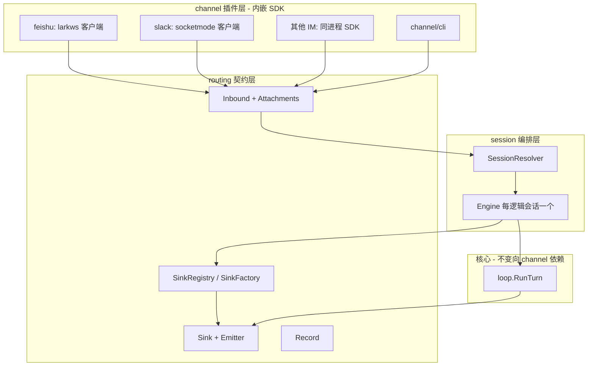
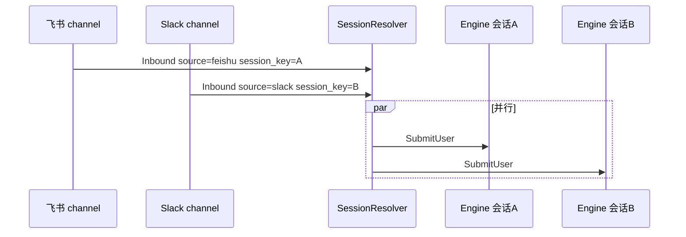

# IM 多通道技术方案

> **目标**：在保持核心（`session` / `loop` / 工具链）稳定的前提下，实现**模块隔离、可插拔**的 IM 接入；支持**多种 IM 同时在线**、**同一 IM 下多会话并行**，并预留**多媒体**能力。  
> **依据**：[`inbound-routing-design.md`](inbound-routing-design.md)、[`outbound-events-design.md`](outbound-events-design.md)、[`picoclaw-channel.md`](picoclaw-channel.md)（其中 §2 说明 PicoClaw **内嵌 SDK** 与平台互通的主路径）。

---

## 1. 目标与约束

| 需求 | 技术含义 |
|------|----------|
| **模块隔离、通用** | IM 适配代码独立包、只依赖稳定契约；核心不 import 飞书/Slack SDK。 |
| **多 IM 并行** | 进程内可同时跑多个 channel 实例（多 goroutine / 多连接），入站互不阻塞；出站按「来源 + 会话」路由到正确连接。 |
| **同 IM 多 session 并行** | 同一 `Source`（如 `feishu`）下，不同群/单聊/线程对应不同对话状态，可**并发**处理多路用户轮次，数据隔离。 |
| **多媒体** | 用户可发图/文件/语音；助手可发文件或带链接的回复；与模型输入能力对齐（URL、base64、本地路径等策略可配置）。 |

**非目标（首版可不做）**：跨 IM 会话合并、全局单线程串行所有用户、完整 Picoclaw 级占位/打字态编排。

---

## 2. 设计原则

1. **单向依赖**：`channel/*` → `routing` / 小范围 `session` 门面；**禁止** `loop` / `tools` → `channel`。
2. **契约稳定**：入站用 **`routing.Inbound` 的扩展**（见 §6 会话键、§7 多媒体），出站沿用 **`Record` + `Sink.Emit`**；需要新事件时用新 `Kind` 或 `data` 字段，避免破坏现有 CLI。
3. **实例与注册**：参考 PicoClaw 的**工厂 + 名字注册**；oneclaw 可增加 **`SinkFactory`**（设计文档已提）以支持「每轮绑定 chat / thread 句柄」。
4. **会话是第一条隔离边界**：所有并行与持久化策略以 **SessionHandle**（见 §6）为粒度，而不是以进程或单个 `Engine` 为唯一假设。
5. **与平台互通**：**直接对标 PicoClaw**——在 `channel/*` 子包内 **import 官方/社区 Go SDK**，`Start` 里启动 SDK 的**客户端连接**（如飞书 `larkws`、Slack **Socket Mode**）。**不**把「自建 HTTP 服务 / 边车 / 独立 WS 网关」当作默认架构；仅在个别平台只提供 Webhook 时，再按需实现对外回调（与 PicoClaw 的 `WebhookHandler` 一样，是**例外**而非主路径）。

---

## 3. 总体架构



**数据路径简述**

- **入站**：子包内 SDK 回调收到平台事件 → 映射为 **`Inbound`**（含 Source、SessionKey、多媒体元数据）→ **`SessionResolver` → `SubmitUser`**。
- **出站**：`loop` 经 **`Emitter` → `Sink`** 写 `Record`；IM 侧 `Sink`（或闭包了会话的实例）通过 **SDK 的 REST/消息 API** 发回平台（及后续 `media`），**与是否在本机 Listen 无关**。

---

## 4. 模块隔离与目录约定（建议）

```text
routing/              # 仅类型与注册表、Emitter、Record（已有）
channel/              # 运行时 Registry、Connector、IO、与 Engine 的 submit 循环（已有）
channel/feishu/       # 飞书：lark SDK + ws，注册为 channel.Spec（对标 picoclaw pkg/channels/feishu）
channel/slack/        # Slack：slack-go + socketmode，注册为 channel.Spec（对标 picoclaw pkg/channels/slack）
cmd/oneclaw/          # 组装：blank import 注册 IM 包 + channel.StartAll
```

**接口边界（建议形态，实现可分阶段）**

| 概念 | 职责 | 与现有关系 |
|------|------|------------|
| **`Channel`（可选）** | `Start` / `Stop`、**内嵌 SDK** 连平台收事件、持有 `*lark.Client` / `socketmode.Client` 等 | 与 PicoClaw 一致；**默认不**为入站单独起本机 HTTP 服务 |
| **`InboundAdapter`** | `[]byte` 或平台 DTO → `routing.Inbound` | 各 IM 子包实现 |
| **`Sink` / `SinkFactory`** | `Emit(Record)` 或 `NewSink(ctx, in)` 闭包平台回复上下文 | 对齐 [`inbound-routing-design.md`](inbound-routing-design.md) §4.2 |

核心 **`session.Engine`** 保持「一次 `SubmitUser` = 一轮 `RunTurn`」；并行通过**多个 Engine 实例**实现，而不是在 Engine 内部堆全局锁串行所有用户。

---

## 5. 多 IM 并行

**5.1 来源维度（与 PicoClaw 相同思路）**

- 为每种 IM 定义 **`routing.Inbound.Source` 常量**（如 `feishu`、`slack`），与 **`SinkRegistry`** 的键一致。
- **多个 channel 同时 `Start`**：每个子包在进程内 **各起一套 SDK 客户端**（飞书 `larkws.Start`、Slack `socketClient.Run`、企业微信/钉钉各自 SDK 等），**并行阻塞在各自的 goroutine**，事件回调线程安全地投递到 **`SubmitUser` 路径**。这是 **内嵌模式**：不依赖本进程对外暴露统一 `http.ServeMux`，也**不需要**边车进程转发。**例外**：若某平台**仅**支持 Webhook 入站，再在该子包内实现小型 HTTP handler（可单独 `Listen` 或日后与可选管理面 mux 合并），与 PicoClaw 的 `WebhookHandler` 可选能力一致。

**5.2 出站路由**

- **静态 Sink**：若某 IM 仅需「进程级单连接推送」，可 `SinkFor("feishu")` 返回共享实例（内部再按 chat 多路复用）。
- **有状态 Sink（推荐用于机器人回线程）**：实现 **`SinkFactory`**：`NewSink(ctx, in)` 根据 `in` 中的 **`SessionKey` / `RawRef`** 绑定该 chat 的 reply_token、thread_ts 等，**每轮** `SubmitUser` 前构造专用 `Emitter`，避免全局 map 竞态。

**5.3 并发模型**

- 每条入站事件（SDK 回调线程）在**独立 goroutine** 中解析并调用 `SubmitUser`；**同一会话**内若需严格顺序（同一用户连发），在 **SessionResolver** 侧对该 SessionHandle 加 **单飞队列**（mutex 或每 session 一个 buffered chan worker）。



---

## 6. 同 IM 多 session 并行

**6.1 会话键（逻辑隔离）**

- 使用并强化已有字段：**`Inbound.SessionKey`**，由 channel 填充，例如：
  - 飞书：`chat_id` + 可选 `thread_id`
  - Slack：`channel_id` + `thread_ts`（线程即独立会话）
- **`Engine.SessionID`**：建议与 **SessionKey 派生**（哈希或规范拼接 + 短 id），保证 transcript / memory 文件路径**不冲突**。

**6.2 SessionResolver（新建组件）**

职责：

1. 输入：`Inbound`（至少 `Source` + `SessionKey`）。
2. 输出：该逻辑会话对应的 **`*session.Engine`**（懒创建）、以及本轮 **Sink / Emitter 绑定策略**。
3. 可选：**TTL 淘汰**长期无消息的 Engine，防止内存泄漏；持久化 transcript 时以磁盘为准，内存可重建。

**6.3 与单 CLI 模式兼容**

- `SessionKey` 为空时：视为默认会话（与当前 CLI 单 `Engine` 行为一致）。
- 测试与 REPL：`Inbound.Source` 为对应 channel 实例 id（如默认 `cli`）+ 空 `SessionKey`。

**6.4 并发与顺序**

| 场景 | 策略 |
|------|------|
| 不同 SessionKey | 允许并行 `SubmitUser`。 |
| 相同 SessionKey | 建议 **FIFO 单 worker**（或显式 reject 重叠轮次），避免 transcript 与 tool 状态交错。 |

---

## 7. 多媒体

**7.1 入站（用户 → 模型）**

- 扩展 **`routing.Inbound`**（或子结构体 `Attachments []Attachment`），避免把大文件塞进 `Text`：
  - **Attachment**：`MIME`、`Name`、**本地路径**或 **`media://` 引用**、可选 `Caption`、平台 `file_id`。
- **Channel 职责**：下载媒体到 **MediaStore**（临时目录 + scope，可参考 PicoClaw 的 `MediaScope = channel:chat:message`），只把**引用**和简短说明交给 `SubmitUser`。
- **Engine / loop**：在调用模型前，将附件转为当前模型支持的格式（例如多模态模型的 image URL、或工具 `read_file` 可读路径）；具体策略可放在 **`loop` 前适配层** 或 **memory bundle** 构建阶段，保持 `loop` 仍主要是「消息列表 + 工具」。

**7.2 出站（助手 → 用户）**

- 在 [`outbound-events-design.md`](outbound-events-design.md) 的扩展表中落地 **`kind: media`**（或 `text.data.attachments`），例如：

```json
{ "seq": 3, "kind": "media", "data": { "parts": [ { "type": "image", "ref": "media://uuid", "caption": "" } ] } }
```

- **`Sink` 实现**：IM 插件将 `ref` 经 MediaStore `Resolve` 后调用平台上传 API；不支持则降级为发链接或纯文本说明。

**7.3 安全与配额**

- 下载大小上限、MIME 白名单、病毒扫描（可选）在 **Channel** 或 **MediaStore** 层统一做，不进入 `loop`。

---

## 8. 分阶段落地（建议）

| 阶段 | 内容 | 验收 |
|------|------|------|
| **P0** | `SinkFactory` + `SessionResolver` 骨架；配置多 `Source`；单 IM 多 SessionKey 并行 | 同 IM 两群同时对话互不串 transcript |
| **P1** | 第二 IM 子包并联运行（各自内嵌 SDK `Start`）；文档化 Source 常量 | 飞书 + Slack 同时在线 |
| **P2** | `Inbound` 附件 + MediaStore；`Record` 增加 `media` | 用户发图进入模型或工具链；助手能回图片 |
| **P3** | 会话 TTL、监控指标、每 session 队列长度上限 | 长期运行内存可控 |

---

## 9. 风险与未决项

- **`SinkFactory` 与全局 `SinkRegistry` 并存**：需在 `session.Engine.SubmitUser` 中明确优先级（建议：Factory 非 nil 时优先，否则 `SinkFor(source)`）。
- **Memory / transcript 与多会话**：`memory.Layout` 是否按 `SessionKey` 分子目录需在实现时统一约定，避免多会话写同一文件。
- **异步 job**：已有 `job_id` 字段；若某接入方式采用「先 ack、后推送结果」，需同一套 `Record` 流，SessionResolver 应能按 job 找到订阅 Sink（与现有异步设计对齐即可，**不依赖** HTTP 形态）。

---

## 10. 修订记录

| 日期 | 说明 |
|------|------|
| 2026-04-05 | 初稿：模块边界、多 IM、同 IM 多会话、多媒体与分阶段路线。 |
| 2026-04-05 | 修订：多 IM 并行不强制经过 `http.ServeMux`，传输由插件自选（WS/轮询/边车等）。 |
| 2026-04-05 | 修订：与 PicoClaw 对齐——**内嵌 SDK** 为与平台互通主路径；HTTP/边车仅为 Webhook 类例外。 |
