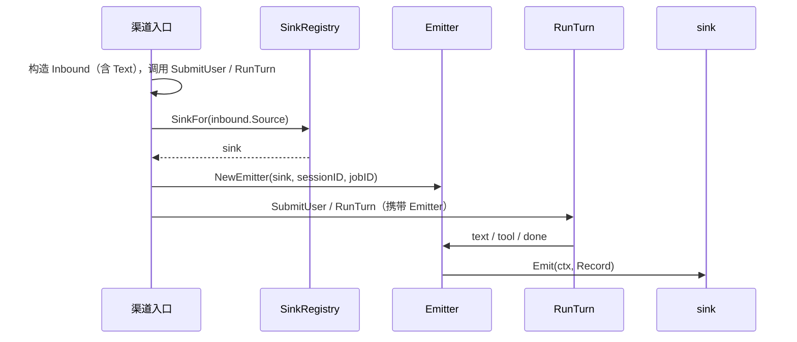

# 入站封装、`ctx` 透传与按来源出站（设计）

与 [outbound-events-design.md](outbound-events-design.md) 配套：**入站**统一形状 + **按来源从注册表选取出站实现**。可选地再通过 **`context` 透传** `Inbound`（见 §3，当前仓库未实现）。本文描述约定与接口形态，实现可渐进落地。

---

## 1. 目标

- 所有渠道（CLI / HTTP / 飞书 / Slack …）的**用户侧输入**先变成同一种 **入站封装** `Inbound`（`SubmitUser` / `RunTurn` 的参数）。
- **出站**仍使用统一的 **`Record` 流**（见出站文档）；**本轮开始时**根据入站里的**来源**，从**注册表**解析出对应的 **`Sink`（或等价 `Responder`）**，由 **`Emitter` 写入**该实例。避免每条 `Record` 再查表（异步 job 可在 worker 启动时查一次）。
- 若 `Sink.Emit` 或工具需要线程 id、用户 id 等而又拿不到 `Inbound` 引用，可再引入 **`context` 挂载**（§3）或 **`SinkFactory.NewSink(ctx, in)`** 把 `in` 闭包进 `Sink`。

---

## 2. 入站封装 `Inbound`（字段表）

建议独立类型名：`Inbound`（或 `TurnEnvelope`）。**核心与渠道 SDK 解耦**，各 Connector 只负责填充。

| 字段 | 类型（概念） | 必填 | 说明 |
|------|----------------|------|------|
| `source` | 枚举或字符串 | 是 | 渠道标识，与注册表键一致，如 `cli`、`http`、`feishu`、`slack` |
| `text` | string | 是（当前实现） | 用户消息正文，由 `SubmitUser` 写入对话；仅附件等场景可后续放宽 |
| `user_id` | string | 否 | 平台用户 id，供审计 / 配额 / 工具代发 |
| `tenant_id` | string | 否 | 工作区 / 租户 |
| `session_key` | string | 否 | 逻辑会话键（IM 线程、话题）；CLI 单进程可省略或用固定值 |
| `correlation_id` | string | 否 | 请求级 id、飞书 challenge 关联、Slack `event_id` 等，**不进模型** |
| `raw_ref` | 任意 | 否 | 指向原始请求的轻量引用（如 request id），**勿把整包 body 长期塞在 struct** |

需要时再增加：`attachments`、`locale`、`reply_token`（IM 即时回复用）等，仍放在 `Inbound` 或子结构中，**不扩散到 `Record`**，除非产品明确要求观测字段出现在事件流里。

---

## 3. `context` 约定（可选扩展，当前未实现）

当 **`Sink` 或工具**需要从调用链上读取「本轮 `Inbound`」、又不想改 `Emit` / `Execute` 签名时，可增加：

- **`routing.WithInbound(ctx, in)`** + **`InboundFromContext(ctx) (Inbound, bool)`**（非导出 `context` key），并在 **`loop.RunTurn` 开头**写入一次，使 `Emit(ctx, …)` 内可读。
- 替代方案：**`SinkFactory.NewSink(ctx, in)`** 在构造 `Sink` 时捕获 `in`，无需 `context.Value`。

### 3.1 放什么、不放什么

| 适合放入 `ctx` | 不适合 |
|----------------|--------|
| 不可变的本次请求元数据（来源、用户 id、correlation、trace id） | 大段正文副本重复存储（已有 `Inbound.text` 即可） |
| 供工具/Sink 使用的**句柄 key**（如「到密钥库的 lookup key」） | 密钥明文、长期 access token 本体（除非短期且明确生命周期） |
| 与取消/超时相关的仍用 `ctx` 自带的 `Deadline` / `Done` | 把 `Engine` 或整条消息历史塞进 `Value` |

**说明**：`context` 在 Go 中还会被用于取消信号；若启用透传，业务元数据与取消语义并存时仍用**子 ctx** 衍生（例如 `toolctx` 已绑定工作目录与取消）。

---

## 4. 出站路径：按来源选实例 + `Emitter`

### 4.1 推荐主路径（每轮查一次）



- **`Record` 形状不变**（见出站文档）；**路由信息不依赖每条 Record 自带 `source`**，而是由**本轮绑定的 `sink`** 决定写往何处。
- **`ctx` 传入 `Emit`**：若实现了 §3 的透传，飞书等 `Sink` 可在 `Emit` 内从 `ctx` 取 `Inbound`；否则用 **`SinkFactory` 闭包 `in`**。

### 4.2 可选：多路 `Sink`（Demux）

若希望**单一注册表入口**且实现类集中：

```text
type SinkRegistry interface {
  SinkFor(source string) (Sink, error)
}
```

或注册 **工厂**，在知道 `Inbound` 后构造带状态的 `Sink`（例如绑定 HTTP `ResponseWriter`）：

```text
type SinkFactory interface {
  NewSink(ctx context.Context, in Inbound) (Sink, error)
}
```

**CLI**：子包 `channel/cli` 在 `init` 调用 **`channel.RegisterDefault(Spec)`**；实现 **`channel.Connector`**，只通过 **`IO.InboundChan` / `IO.OutboundChan`** 与运行时交互；**`channel` 包**在 **`StartAll`** 内挂 **`chanSink` + `SubmitUser` 循环**；**仅出站、无 Connector** 时仍可单独 **`routing.RegisterDefaultSink`**；**飞书 / Slack**：同样 **`RegisterDefault(Spec)`**，**`Spec.Source`** 与 **`routing.Inbound.Source`** 对齐。

---

## 5. 注册表与渠道实例接口

### 5.1 最小集合

- **`Sink`**：`Emit(ctx context.Context, r Record) error`（与现有一致）。
- **`SinkRegistry`**：按 `inbound.source`（或等价枚举）返回 **`Sink`** 或 **`SinkFactory`**。

渠道「实例」**即 `Sink` 的实现类型**；无需再单独定义 `OutboundChannel` 接口，除非某渠道除 `Emit` 外还有 **HealthCheck**、**WebhookVerify** 等，可放在同一包的 `Connector` 上，与 `Sink` 并列注册。

### 5.2 注册方式（进程级）

- **简单**：`main` 初始化 `map[string]Sink` 或 `map[string]SinkFactory`，启动时注入。
- **多实例同渠道**（多机器人）：注册表键可为 **`source + ":" + bot_id`**，或由 `Inbound` 增加 `instance_id` 再参与 lookup。

---

## 6. 与出站文档的关系

- **事件协议**：仍以 [outbound-events-design.md](outbound-events-design.md) 的 **`Record` / `kind` / `seq`** 为准。
- **本文增量**：**入站 `Inbound` + 按来源选 `Sink`**（可选 **`ctx` 透传 `Inbound`**），实现「多对接、核心不变」。

---

## 7. 实现状态

- **当前仓库**：`routing` 核心 + **`channel` 运行时**（**`StartAll`**：`Spec.Source` 非空则注册 **`chanSink`**，**`submitLoop`** 读 **`InboundTurn` → `SubmitUser`**）；**`channel/cli`** 仅 **`Connector.Run(IO)`**；`main`：**`StartAll(ctx, Bootstrap{Engine, Config})`**；**`SubmitUser` / `loop.RunTurn`** 同上；**未**实现 `WithInbound` / `InboundFromContext`。
- **后续**：HTTP / 飞书 / Slack 等新增 `Source*` 常量、注册对应 `Sink`；需要时再加 **`ctx` 透传**或 **`SinkFactory`**。
