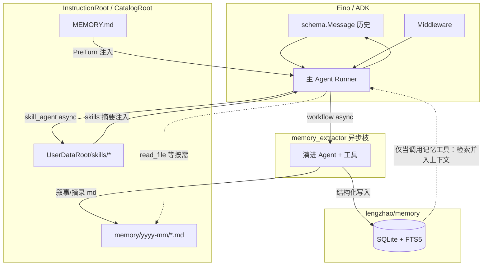

# 记忆与会话：Eino、`github.com/lengzhao/memory` 与 oneclaw 文件真源

本文细化三类不同对象：**框架里的「对话消息怎么进模型」**、**可选的结构化记忆库（SQLite）**、以及 **oneclaw PRD 中的文件型 MEMORY / 演进落盘**（见 [eino-md-chain-architecture.md](eino-md-chain-architecture.md) §3.4、§3.4.1）。三者名称里都可能出现 “memory”，职责不同，勿混用。

---

## 1. 职责对照（先看这张表）

| 层次 | 典型载体 | 存什么 | 谁负责 |
|------|-----------|--------|--------|
| **A. Eino ADK 回合内上下文** | `[]*schema.Message`、ADK `ChatModelAgentState` | 当前 Agent **多轮对话消息**（user/assistant/tool） | 运行时拼装；**持久化格式由应用决定** |
| **B. Eino 文档中的「Memory / Session」（参考实现）** | 例如每会话一个 **JSONL** 文件 | **同上**：对话历史的 **追加读写到磁盘** | **业务层示例**（非 `eino` 核心包强制组件） |
| **C. ADK `CheckPointStore`（可选）** | 检查点存储后端 | **中断 / 恢复**、HITL 等流程的状态快照 | `adk.Runner` + `compose` 检查点机制 |
| **D. `github.com/lengzhao/memory`** | **SQLite**（GORM + FTS5） | **结构化记忆条目**（namespace、版本、去重、TTL、审计、LLM 抽取等） | 独立 Go 模块；与 Eino 无强制绑定 |
| **E. oneclaw 文件真源（阶段 6 口径）** | `MEMORY.md`、`memory/yyyy-mm/*.md`、`UserDataRoot/skills/*` | **短规则 + 抽取事实 md + Skills** | `memory` 包 / `preturn` / 工具与 workflow 编排 |

**要点**：Eino 官方明确：**「Memory、Session、Store」在快速入门第三章中是业务层概念，不是框架核心组件**——框架负责「如何处理消息」，**消息落哪里由宿主实现**。见官方文档：[第三章：Memory 与 Session（持久化对话）](https://www.cloudwego.io/zh/docs/eino/quick_start/chapter_03_memory_and_session/)。

---

## 2. Eino 侧：如何使用「会话 / 持久化对话」

### 2.1 推荐心智模型

**回合内（单次 Run）**：模型与 ToolsNode 之间仍需要 **完整的 user / assistant / tool 调用 / tool 结果** 消息链，这一点由 ADK 状态保证，不因持久化策略而改变。

**回合结束 → 供下一轮加载的「会话摘要」**（oneclaw 偏好）：写入长期会话存储、下次再组装进 `[]*schema.Message` 时，**可以省略中间的 tool 明细**——只保留 **用户原话** + **本轮最终对用户的助手答复**（必要时一句极短的事实摘要）。理由是：下一轮的推理应依赖 **结论与语境**，而不是重复上一轮的中间工具名与原始工具输出；这样上下文更干净，也更接近「自主完成任务」而不是「复现调用链」。若某轮结论本身依赖工具产物中的关键数据，应已被助理写进最终回复（或落入 `MEMORY.md` / `memory/` / 结构化记忆），而不是依赖原始 `tool` 消息复活。

**流程上仍可概括为**：

1. 从存储加载 **上一轮起可用的** 历史 → `[]*schema.Message`（多为 user/assistant 对；策略见上）。
2. 追加本轮用户消息。
3. 调用 **`adk.Runner`**（或等价 API）处理当前列表；**本轮中途**照常产生完整 tool 轨迹。
4. **持久化到下一轮**：折叠为「用户消息 + 最终助手消息」（及可选摘要），**不**把本轮 tool 调用链写入跨轮上下文；**审计 / transcript / runs** 仍可单独保留 **全量** 轨迹供排查，与「模型输入历史」分离。

官方第三章示例是「逐条 Append 全消息」的参考实现；接入 oneclaw 时应在 **步骤 4** 用上述策略 **重写或压缩** 再落盘，而非照搬示例把每条 tool 消息都进入下一轮。

官方示例代码位置（可复制到自己的仓库改路径）：

- 入口：[eino-examples `quickstart/chatwitheino/cmd/ch03/main.go`](https://github.com/cloudwego/eino-examples/blob/main/quickstart/chatwitheino/cmd/ch03/main.go)
- JSONL `Store` / `Session` 参考实现：[eino-examples `quickstart/chatwitheino/mem/store.go`](https://github.com/cloudwego/eino-examples/blob/main/quickstart/chatwitheino/mem/store.go)

文中出现的 `mem.NewStore(sessionDir)`、`session.GetOrCreate`、`session.Append`、`session.GetMessages()` 均来自 **该示例工程**，不是 `go get eino` 后自带的全局单例 API。

### 2.2 JSONL 形状（示例）

每会话一个文件，首行可为 session 元数据，后续每行一条消息（与官方文档一致）。**若采用 §2.1 的跨轮折叠**，持久化文件里通常只见 **user / assistant** 交替，**不含** `tool` 角色行（与示例演示的「全量追加」不同）：

```json
{"type":"session","id":"083d16da-...","created_at":"2026-03-11T10:00:00Z"}
{"role":"user","content":"你好，我是谁？"}
{"role":"assistant","content":"你好！我暂时不知道你是谁..."}
```

### 2.3 与 ADK Middleware 的关系

- **持久化**：仍在业务层 `Append` / `Load`；**提交给下一轮的历史**可在 Run 结束后由宿主做一次 **compress**（去掉 tool 链，仅留对外可见对话）。
- **回合内动态改写**：用 **`ChatModelAgentMiddleware.BeforeModelRewriteState`** 等调整即将送给模型的 `state.Messages`（摘要、插入片段、budget 裁剪），与「磁盘上的 Session 文件」解耦。

oneclaw 当前以 **自有机会话 / transcript / runs** 为主；若接入 Eino 第三章 JSONL 模式，属于 **显式设计选择**，与 PRD 文件型 MEMORY 并行存在时需分清边界（见 §5）。**检查点**（`CheckPointStore`、中断恢复）与 **会话 JSONL** 的分工已在 §1 表 **B / C** 行区分；细分链接仍见 [eino-integration-surface.md](eino-integration-surface.md) §8。

---

## 3. `github.com/lengzhao/memory`：如何使用

模块仓库：[github.com/lengzhao/memory](https://github.com/lengzhao/memory)；Go 参考：[pkg.go.dev/github.com/lengzhao/memory](https://pkg.go.dev/github.com/lengzhao/memory)。

### 3.1 定位

- **本地优先**、**单文件 SQLite**、**FTS5 全文检索**、**GORM**。
- 面向 **Agent 内嵌**：多 **namespace**（如 transient / profile / action / knowledge）、乐观锁、幂等键、TTL、软删与审计事件、可选 **OpenAI 兼容 API** 做对话抽取。

### 3.2 接入步骤（概念顺序）

1. **`go get github.com/lengzhao/memory`**（版本以 go.mod 为准）。
2. 打开 **SQLite** 连接后执行 **`Migrate`**（或子包 `store` 提供的迁移）：创建业务表、`fts_memory` 虚表与触发器（详见上游 README：**Schema 仅通过 Migrate 初始化**）。
3. 使用 **`service`** 层 API（具体函数名以上游 `service` 包与 `docs/memory.md` 为准）完成 **写入 / 查询 / 抽取 / 合并策略**。
4. **LLM 抽取**：配置 OpenAI 兼容环境变量（如 `OPENAI_API_KEY`，或 `OPENAI_BASE_URL` 指向 Ollama）；运行上游 `examples/08_extract_demo` 对照行为。

### 3.3 与 oneclaw 的关系（规划用语）

- **`memory_extractor` 可同时写两套**：调用 **`github.com/lengzhao/memory`**（SQLite 条目）**并且** 写入 **`memory/yyyy-mm/*.md`**（§3.4.1）。二者 **不是互斥真源二选一**，而是 **分工**：见 §5。
- **`memory/yyyy-mm/`**：默认 **不** 自动塞进 PreTurn；主 Agent 通过 **`read_file` 等工具按需打开** 某月目录下的 md，适合长事实、笔记型材料。
- **`lengzhao/memory`**：通过为workflow暴露的 **工具**（如检索、按 namespace 拉取）调用时，**必然会走召回路径**（查 SQLite / FTS），适合结构化条目、去重、TTL、审计等与模型协作的「入口」。
- **不负责**：替代 Eino 的 **`schema.Message` 列表**；对话轨迹仍由 transcript / ADK 状态或 §2 的 Session 策略承载。
- **隔离**：SQLite 文件路径仍建议按 **会话或用户** 分库；与 md 树 **内容互补** 时，抽取逻辑需约定 **同一事实是否双写摘要**（避免两处长期漂移可依赖 extractor 单次管线原子写入两侧）。

---

## 4. oneclaw 文件真源（与 §1 的 E / D 对齐）

落地路径与字节上限以 **[eino-md-chain-architecture.md §3.4.1](eino-md-chain-architecture.md)**、[appendix-data-layout.md §6](appendix-data-layout.md) 为准：

- **`MEMORY.md`**：规则与最重要摘要，≤2048 字节（PreTurn 常注入）。
- **`memory/yyyy-mm/*.md`**：由 **`memory_extractor`**（或等价演进枝）写入的抽取事实（UTC `yyyy-mm`）；**主 Agent 按需自读**，不默认注入。
- **`UserDataRoot/skills/*`**：`skill_generator` 写入的全局 Skills 树。
- **并行：`lengzhao/memory`**：同一演进枝可把结构化条目 **写入 SQLite**；主 Agent **仅在调用相应记忆工具时召回**，与是否打开某 md 文件无关。

---

## 5. 组合方式建议（避免混层）



- **横轴**：同一轮模型推理仍在 **消息列表 + Middleware** 闭环。
- **纵轴读取**：**`MEMORY.md`**（短）+ **skills 摘要** 可走默认注入；**`memory/yyyy-mm/`** 由 Agent **按需读文件**，不默认灌上下文。
- **纵向召回**：**`lengzhao/memory`** 仅在 Agent **发起约定工具调用** 时检索 SQLite（**必然召回**）；与是否读过某 md 无关。
- **纵向写入**：**`memory_extractor`** 可对 **SQLite + `memory/yyyy-mm/`** 双写，由演进管线保证同一轮抽取两侧一致或互补（字段级约定由实现细化）。

---

## 6. 上游文档链接（查阅最新 API 时请优先打开）

| 主题 | 链接 |
|------|------|
| Eino 第三章 Memory / Session（业务层参考实现） | [cloudwego.io 文档](https://www.cloudwego.io/zh/docs/eino/quick_start/chapter_03_memory_and_session/) |
| Eino ADK ChatModelAgent / Middleware | [Agent 实现](https://www.cloudwego.io/zh/docs/eino/core_modules/eino_adk/agent_implementation/chat_model) |
| Eino 检查点 / 中断 | [checkpoint_interrupt](https://www.cloudwego.io/zh/docs/eino/core_modules/chain_and_graph_orchestration/checkpoint_interrupt/) |
| `lengzhao/memory` README / 示例 | [GitHub](https://github.com/lengzhao/memory) · [pkg.go.dev](https://pkg.go.dev/github.com/lengzhao/memory) |

实现 oneclaw 时可用 Context7：`/websites/cloudwego_io_zh_eino`、`/cloudwego/eino` 查询 Eino 最新章节标题与接口名迁移。

---

## 7. 修订记录

| 日期 | 说明 |
|------|------|
| 2026-05-03 | 首版；§2.1–§2.3（跨轮省略 tool、审计分离）；无 §2.4；§3.3–§5：`memory_extractor` 双写 SQLite + `memory/yyyy-mm/`；md 按需读、记忆工具检索入上下文；§5 图与上游链接 |
