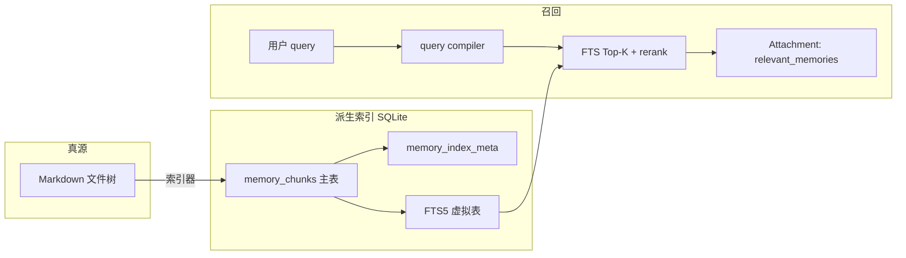
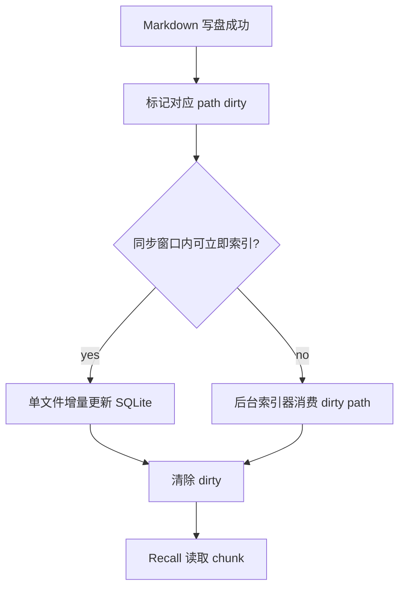

# Memory 片段索引与召回（SQLite FTS）

本文约定：**在保留 Markdown 文件为真源**的前提下，用 **SQLite + FTS5** 管理「记忆片段」的**倒排索引**与**召回**。本地实现**仅**全文检索（**FTS-only**），**不**在进程内引入向量扩展（如 `sqlite-vec`）、**不**为索引调用 Embedding API。若需语义召回或混合检索，**后续通过对接外部 RAG**（独立服务或托管向量库 + 编排层）扩展，不在本文本地 SQLite 范围内展开。

实现栈：**Go + `modernc.org/sqlite`**（与 `sessdb` 一致），依赖 SQLite 内置 **FTS5**，无需动态加载 `.so`。

**状态**：设计规格；目标是稳定替换当前 `memory.SelectRecall` 的「逐文件扫描 + `tokenizeRecall` + `scoreRecall`」路径。与「维护双入口」写 episodic / 规则文件的关系见 §8。

**相关**：[memory-maintain-dual-entry-design.md](memory-maintain-dual-entry-design.md)（LLM 维护写文件）、[config.md](config.md)（`memory.recall.*` 速查）、[prompts/50-memory.md](prompts/50-memory.md)（policy / context / recall 分层）。

---

## 1. 目标与非目标

| 目标 | 说明 |
|------|------|
| **可维护的召回** | 相对「全目录扫 `.md`」，用 FTS 稳定支持关键词/短语级命中与排序，并把召回单位从“整文件”收敛到“片段”。 |
| **单机、同进程** | 索引与业务共进程；库文件可随用户数据根备份。 |
| **纯 Go、无向量依赖** | 不加载向量扩展、不调用 `/v1/embeddings`；本地路径行为可完全离线复现。 |
| **可回退** | 索引未就绪、查询编译失败、或一致性存疑时，能安全回退到现有 `scan` 路径。 |

| 非目标 | 说明 |
|--------|------|
| 替代文件真源 | 索引是**派生数据**；仍以磁盘上的 `MEMORY.md`、topic、日文件等为准，索引可全量重建。 |
| 本地语义 / 混合检索 | **不在本地 SQLite 层实现**；见 §10「后续：外部 RAG」。 |
| 跨设备实时同步 | 不做多主同步；多机场景以「各端重建索引」或文件同步后再重建为主。 |
| 改写 memory 生产链路 | `PostTurn` / `RunScheduledMaintain` 仍只写 Markdown，不直接写 SQLite。 |

---

## 2. 设计原则

1. **仅 FTS5**：`CREATE VIRTUAL TABLE ... USING fts5`，查询侧 `MATCH` + `bm25()`；不引入向量列。
2. **chunk 是召回单位**：排序、去重、预算裁剪都以片段为中心，不再把“整文件”当唯一 recall 粒度。
3. **文件为真源、索引为缓存**：SQLite 丢失、损坏、版本升级都应能通过重扫 Markdown 重建。
4. **查询与索引同构规范化**：尤其中文，查询 token 化与入库 token 化必须同构，避免 `scan` -> `sqlite` 后召回行为突变。
5. **新鲜度优先于纯异步**：刚写入的 memory 在下一轮 recall 中应尽量可见；若索引明显落后，优先回退而不是静默返回旧结果。
6. **兼容迁移**：在 `memory.recall.backend=sqlite` 稳定前，`scan` 仍是权威回退路径。

---

## 3. 总体架构



- **索引器**：扫描 `Layout` 下可索引路径（与当前 `listMemoryMarkdownFiles` 范围对齐），将 Markdown 切为稳定 chunk，写入主表并维护 FTS。
- **query compiler**：把用户输入转为安全、可控、与索引同构的 `MATCH` 子句。
- **召回器**：FTS 检索后做轻量 rerank，再应用 `budget.recall_max_bytes` 与 chunk 级 `RecallState`，最终格式化为现有 `Attachment: relevant_memories` 文本块。

### 3.1 `RecallBackend` 抽象

为支持按需替换 / 扩展 recall 实现，建议只在**召回后端**这一层抽象接口，而**不**抽象 Markdown 真源本身。

原因：

- 当前 `PostTurn`、`RunPostTurnMaintain`、`RunScheduledMaintain`、`AppendMemoryAudit` 都明显依赖文件路径、日文件、规则文件与审计落盘语义；
- 若过早抽象统一 `MemoryStore`，会把“文件为真源”的设计约束打散，导致接口要么过宽、要么充满特判；
- recall 是天然可替换的消费侧：`scan`、`sqlite`、未来外部 RAG 都可以共享同一调用面。

建议接口形状：

```go
type RecallBackend interface {
	Name() string
	MarkDirty(ctx context.Context, paths []string) error
	Sync(ctx context.Context, layout Layout, paths []string) error
	Recall(ctx context.Context, req RecallRequest) ([]RecallHit, *RecallState, error)
}

type RecallRequest struct {
	Layout Layout
	Query  string
	Budget int
	State  *RecallState
}

type RecallHit struct {
	Path        string
	HeadingPath string
	Text        string
	Score       float64
	ByteStart   int
	ByteEnd     int
}
```

约定：

- `RecallBackend` 返回**结构化命中结果**，不直接输出 `Attachment: relevant_memories` 文本；
- prompt 注入格式化由外层统一完成，避免 backend 和 prompt/UI 耦合；
- `MarkDirty` / `Sync` 仅服务于需要索引的新鲜度管理；`scan` backend 可为空实现或 no-op；
- `Layout` 仍是 backend 的输入之一，因为 recall 作用域、路径过滤、审计上下文都建立在现有文件布局之上。

### 3.2 内置 backend 边界

| backend | 职责 | 特点 |
|---------|------|------|
| `scan` | 直接扫描 Markdown 文件并打分 | 零索引、可解释、是默认回退路径 |
| `sqlite` | 基于 SQLite FTS 的 chunk 召回 | 可增量同步、可排序、适合作为默认实现 |
| `external_rag` | 预留给未来外部召回 provider | 不改变文件真源；只替换 recall 实现 |

约束：

- `scan` 与 `sqlite` 都读取同一批 Markdown 真源；
- `external_rag` 若引入，也应实现 `RecallBackend`，而不是倒逼维护链路改写为外部存储；
- 若后续需要“多后端融合召回”，应在 `RecallBackend` 之上再包一层聚合器，而不是把聚合逻辑塞回各 backend。

---

## 4. Chunk 模型与切分规则

SQLite FTS 的成败，很大程度取决于 chunk 边界是否稳定。本设计把 chunk 规则视为 contract，而不是实现细节。

### 4.1 设计目标

| 目标 | 说明 |
|------|------|
| **边界稳定** | 文件小改动不应导致整文件 chunk 全漂移。 |
| **可解释** | 召回结果应能带出 heading / 路径，而不只是裸 offset。 |
| **足够细** | 避免“整篇日记一个 chunk”导致 recall 命中粗糙。 |
| **不过碎** | 避免每行一个 chunk 导致索引爆炸与上下文割裂。 |

### 4.2 规范切分

1. **先去 frontmatter / BOM**：与现有 `BodyStartByteOffset` 对齐。
2. **一级切分按 Markdown heading**：
   - 以 heading 作为自然边界；
   - `heading_path` 记录层级，如 `Auto-maintained / Tooling / Git`。
3. **二级切分按段落与字节阈值**：
   - 单 heading 块若超过阈值（如 `chunk_max_bytes`），再按段落切；
   - 段落仍过长时，按字节窗口切，并允许小 overlap。
4. **空块与纯噪声块不入库**：
   - 空白、纯标题、极短分隔线、模板占位语跳过；
   - 根 `MEMORY.md` 仍按现有规则不作为 recall 普通候选，避免与规则注入重复。

### 4.3 稳定标识

每个 chunk 至少包含以下稳定维度：

| 字段 | 说明 |
|------|------|
| `path` | 源文件绝对路径 |
| `chunk_index` | 同一文件内的稳定顺序号 |
| `heading_path` | 标题层级路径 |
| `byte_start` / `byte_end` | 相对文件起点的 UTF-8 字节范围 |
| `chunk_sha256` | chunk 正文哈希 |

约定：

- `chunk_index` 是**同一版文件内**的稳定顺序，不承诺跨版本永久不变；
- 跨版本识别以 `path + heading_path + chunk_sha256` 为主，`chunk_index` 为辅；
- recall 输出优先展示 `path + heading_path`，`offset` 仅作调试 / 审计辅助。

---

## 5. 逻辑数据模型

表名可带前缀（如 `oc_memory_chunk`）以避免冲突。

### 5.1 主表 `memory_chunks`

| 列 | 类型 | 说明 |
|----|------|------|
| `id` | INTEGER PK | 自增；与 FTS `rowid` / `content_rowid` 对齐 |
| `path` | TEXT NOT NULL | 源文件绝对路径 |
| `scope` | TEXT NOT NULL | 来源作用域，如 `user` / `project` / `team_user` / `auto` |
| `memory_kind` | TEXT NOT NULL | 如 `daily` / `topic` / `note`；便于后续 rerank |
| `day` | TEXT | 若来自日文件，记录 `YYYY-MM-DD` |
| `chunk_index` | INTEGER NOT NULL | 同一文件内片段序号 |
| `heading_path` | TEXT | Markdown 标题层级路径 |
| `byte_start` | INTEGER NOT NULL | chunk 起始 UTF-8 字节偏移 |
| `byte_end` | INTEGER NOT NULL | chunk 结束 UTF-8 字节偏移 |
| `text` | TEXT NOT NULL | 原始 chunk 正文 |
| `fts_text` | TEXT NOT NULL | 写入 FTS 的规范化文本 |
| `chunk_sha256` | TEXT NOT NULL | chunk 正文哈希 |
| `file_sha256` | TEXT NOT NULL | 整文件正文哈希 |
| `source_mtime_unix` | INTEGER NOT NULL | 文件落盘 mtime |
| `indexed_at_unix` | INTEGER NOT NULL | 入索引时间 |

建议唯一约束：

- `UNIQUE(path, chunk_index)`
- 普通索引：`path`、`day`、`scope`、`memory_kind`

### 5.2 元数据表 `memory_index_meta`

用于管理索引新鲜度，而不是把 freshness 逻辑分散在业务代码里。

| 列 | 类型 | 说明 |
|----|------|------|
| `path` | TEXT PK | 源文件绝对路径 |
| `file_sha256` | TEXT NOT NULL | 最近一次入库时的文件哈希 |
| `source_mtime_unix` | INTEGER NOT NULL | 最近一次入库时的文件 mtime |
| `chunk_count` | INTEGER NOT NULL | 当前文件 chunk 数 |
| `last_indexed_at_unix` | INTEGER NOT NULL | 最近一次成功同步时间 |
| `dirty` | INTEGER NOT NULL | 是否待同步 |
| `last_error` | TEXT | 最近一次索引错误，便于诊断 |

### 5.3 FTS5

- 使用 external content 模式，令 FTS 与主表解耦。
- 查询：`MATCH` + `ORDER BY bm25(memory_chunks_fts)`。
- tokenizer 固定一种，不能让不同进程或不同版本随意漂移。
- **中文建议**：不要直接依赖 `unicode61` 的默认切词；优先将 `fts_text` 作为“已规范化文本”，把中文按与 `tokenizeRecall` 接近的策略展开成可检索 token，再写入 FTS。

---

## 6. 索引写入与新鲜度 contract

### 6.1 新鲜度目标

本文明确的语义不是“最终一致即可”，而是：

> memory 写盘成功后，下一轮 recall 应尽量看见新内容；若 SQLite 尚未追平，也必须安全回退，而不是静默返回过期结果。

### 6.2 写入路径



### 6.3 增量更新规则

对单文件 `path`：

1. 读文件正文，计算 `file_sha256` 与 `mtime`；
2. 若与 `memory_index_meta` 相同，跳过；
3. 否则重新切 chunk；
4. 单事务内：
   - 删除该 `path` 旧 chunk；
   - 插入新 chunk；
   - 重建该文件对应 FTS 行；
   - 更新 `memory_index_meta`；
5. 成功后清 `dirty`。

### 6.4 Recall 前一致性检查

在 `memory.recall.backend=sqlite` 时，召回前至少检查：

1. 索引库是否存在；
2. 本轮候选范围中是否存在 `dirty=1` 的文件；
3. `mtime` / `file_sha256` 是否明显落后于磁盘；
4. 若发现索引未追平：
   - **优先**尝试同步少量热点文件；
   - 无法快速同步时，**回退 `scan`**。

约定：**冷启动、损坏恢复、schema 不兼容**三类场景都回退 `scan`；不允许“返回空 recall 但不报错”作为默认策略。

---

## 7. 查询策略

### 7.1 Query compiler

不能把用户输入直接拼到 `MATCH`。需要显式编译步骤：

1. 截断超长输入；
2. 统一大小写与空白；
3. 去掉危险或无意义语法碎片；
4. 生成与 `fts_text` 同构的 token；
5. 输出保守的 `MATCH` 子句。

建议策略：

| 场景 | 编译策略 |
|------|----------|
| 短 query（2-6 个 token） | token 间 `AND` |
| 连续短语明显 | 优先保留 quoted phrase，再补 token |
| 中文 | 用与索引同构的 bigram / 规范化 token |
| 编译失败 | 回退到更保守的 literal-safe token 查询 |

禁止：

- 直接把原始用户文本原样塞入 `MATCH`；
- 允许用户注入 FTS 特殊语法改变查询语义；
- 查询 token 化与索引 token 化不一致。

### 7.2 排序与 rerank

初版不追求复杂模型，只做轻量 rerank：

`final_score = bm25_score + scope_boost + recency_boost + filename_or_heading_boost`

建议：

- `project` / `user` 可略高于 `team_*` / `auto`；
- 最近日文件可小幅加权；
- `heading_path` / 文件名命中可加权；
- 同一文件多 chunk 命中时，不应无脑全放出，需做 chunk 聚合与去重。

### 7.3 RecallState

当前 `RecallState` 是**文件级**去重，不适合 chunk recall。迁移后改为：

| 字段 | 说明 |
|------|------|
| `SurfacedChunkKeys` | 已展示 chunk 集合，避免重复片段反复注入 |
| `SurfacedPaths` | 保留轻量文档级统计，用于惩罚而非绝对屏蔽 |
| `SurfacedBytes` | 已占用 recall 字节预算 |

约定：

- 去重以 **chunk** 为主，不再以 path 一刀切；
- 同一文件允许多个高价值 chunk 入选，但要受预算和多样性约束；
- 仍沿用 `budget.recall_max_bytes` 作为最终裁剪边界。

说明：`RecallState` 属于 `RecallBackend` 的跨轮调用状态，但其**序列化与注入语义**仍由外层控制；backend 只消费并返回更新后的状态，不自行决定 session 持久化格式。

### 7.4 输出格式

为降低 UI / prompt 变更成本，继续输出：

- `Attachment: relevant_memories`
- 每条包含：
  - `Memory: <path>`
  - `heading_path` 或相近定位信息
  - 片段正文（必要时截断）

初版建议不再把“纯 offset”作为主要展示信息；offset 仅保留在调试或审计路径中。

---

## 8. 与维护流水线、真源文件的关系

- **PostTurn / Scheduled 维护**仍只写 **Markdown**（见 [memory-maintain-dual-entry-design.md](memory-maintain-dual-entry-design.md)）。
- SQLite 是**派生层**：不能成为维护写入的真源。
- `RecallBackend` 抽象只覆盖**召回消费层**；不覆盖维护写盘、审计落盘、路径布局解析。
- 维护写盘成功后，应至少做两件事：
  1. 标记对应文件 `dirty`；
  2. 在安全时机触发单文件或小批量增量建索引。
- 写盘临界区与现有互斥策略一致；索引更新可以在临界区外执行，但 recall 必须识别 dirty / stale 状态并决定是否回退。

---

## 9. 与当前 `SelectRecall` 的迁移路径

| 阶段 | 行为 |
|------|------|
| **当前** | `memory.SelectRecall`：枚举 `.md` + `tokenizeRecall` + `scoreRecall`。 |
| **阶段 1** | 抽出 `RecallBackend` 接口；把当前实现包成 `scan` backend。 |
| **阶段 2** | 引入 SQLite schema、索引器与 `sqlite` backend，但默认仍走 `scan`。 |
| **阶段 3** | 增加 `memory.recall.backend=sqlite`；召回前有 freshness 检查，失败可回退 `scan`。 |
| **阶段 4** | 默认切到 `sqlite`，保留 `scan` 作为 debug / fallback。 |

迁移要求：

1. 冷启动必须可自动全量建索引；
2. 建索引期间 recall 不应静默退化为空；
3. 中文 query 在 `scan` 与 `sqlite` 之间召回行为不能出现大幅不可解释漂移；
4. `RecallState` 从 path 级迁到 chunk 级时，需补会话级兼容逻辑；
5. backend 切换不应影响外层 attachment 格式与预算语义。

---

## 10. 后续：外部 RAG（不在本地 SQLite 范围）

语义相似、跨语种、或与知识库统一的混合检索，建议通过**独立 RAG 服务**或**托管向量库 + HTTP/gRPC** 对接：oneclaw 侧保留「文件真源 + 本地 FTS 召回」作为轻量默认，外部 RAG 作为可选 **provider**（配置 URL、鉴权、注入策略），与 `relevant_memories` 附件合并策略在后续专文约定。

本地 SQLite 方案的边界到此为止：

- 不在本地库中保存 embedding；
- 不把本地 recall schema 设计成“以后兼容向量列”的混合怪物；
- 外部 RAG 若引入，也应作为独立 `RecallBackend` provider，而不是污染 FTS-only 主路径。

---

## 11. 配置约定（YAML）

设计用键名；落地以 `config` 包与 `docs/config.md` 为准。

| YAML 路径 | 说明 |
|-----------|------|
| `memory.recall.backend` | `RecallBackend` 选择器；当前内置 `scan` / `sqlite`，未来可扩展。 |
| `memory.recall.sqlite_path` | 索引库路径；相对路径相对 `UserDataRoot()`；例如 `memory/recall_index.sqlite`。 |
| `memory.recall.fts.top_k` | FTS 初筛候选条数上限。 |
| `memory.recall.chunk_max_bytes` | heading 块超长后的二级切分阈值。 |
| `memory.recall.chunk_overlap_bytes` | 超长 chunk 二级切分的 overlap。 |
| `memory.recall.force_scan_on_stale` | 检测到索引落后时是否强制回退 `scan`。 |

**预算**：`budget.recall_max_bytes` 仍为最终注入上限；`RecallState` 改为 chunk 级去重，但总预算语义不变。

---

## 12. 风险与测试要点

| 项 | 说明 |
|----|------|
| **中文分词** | 需固定查询 / 入库同构策略，不能只依赖默认 tokenizer。 |
| **索引漂移** | chunk 规则若不稳定，会导致增量更新与去重失真。 |
| **一致性** | 文件刚写入但索引未追平，需验证回退链路。 |
| **排序质量** | 需验证 `bm25 + 轻量 rerank` 是否优于当前扫描打分。 |

建议测试覆盖：

1. **chunk 切分单测**：heading、长段落、中文、frontmatter、空块；
2. **索引增量单测**：单文件更新、删除、重命名、损坏恢复；
3. **query compiler 单测**：中英混合、特殊字符、超长输入、短语；
4. **召回集成测试**：`scan` 与 `sqlite` 在代表性语料上的行为对比；
5. **freshness 测试**：写盘后立即 recall、dirty 文件回退、冷启动建库期间 recall。

---

## 13. 小结

| 原则 | 说明 |
|------|------|
| 本地仅 FTS | SQLite 层只做全文索引与检索。 |
| 文件为真源 | 索引可重建；维护与工具仍写 Markdown。 |
| 仅抽 recall backend | 扩展点在 `RecallBackend`，不抽象统一 `MemoryStore`。 |
| chunk 是 recall 基本单位 | 排序、去重、预算裁剪都围绕 chunk，而非整文件。 |
| freshness 有明确 contract | 索引落后时优先补齐，否则安全回退 `scan`。 |
| 语义扩展走外部 RAG | 不在本地引入 vec / embedding 管线。 |

---

*实现落点（预期）：`memory/` 下新增索引与查询编译子模块；与 `memory/recall.go` 的 `SelectRecall` 经 `memory.recall.backend` 切换；`RecallState` 从 path 级去重演进到 chunk 级去重。*
