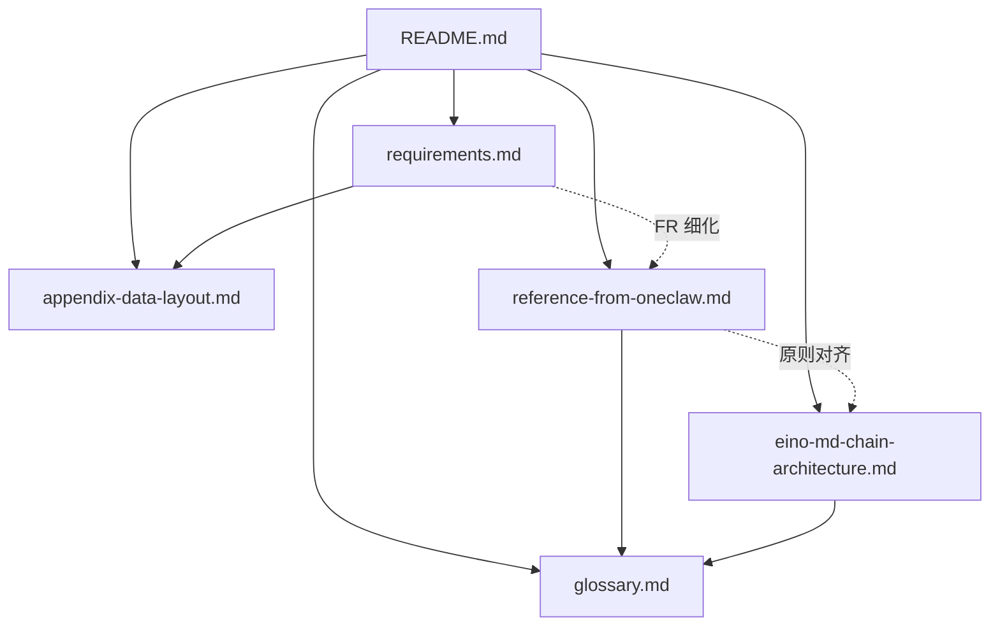

# Claw / Agent 运行时 — 设计套件（`docs/new_design`）

本目录是一套**可整体复制**的文字规格：产品简介、抽象架构、目标技术栈（Eino + MD + Chain）、**参考实现需求基线（oneclaw）**、术语与数据布局附录。**套件内部交叉引用仅使用本目录内相对路径**，复制到其他仓库后不依赖 oneclaw 其余 `docs/` 即可读懂主干。

---

## 项目简介

**Claw** 这一类产品的目标：**用 Agent 运行时连接模型、工具与渠道，把用户意图落成可重复的自动化**——读写工作区、执行命令、调度提醒、多轮推理与子 Agent 委派，在对话或集成界面**交付结果**，而不止于单次问答。

**oneclaw** 是该范式的一种 **Go 参考实现**（与 **clawbridge** 等渠道配套）。本目录既服务 oneclaw 演进，也服务**新开仓库**：抽象部分可直接当 PRD/架构草案；需求基线可作为验收清单模板。

---

## 文档一览与依赖关系

| 文件 | 角色 | 复制到新项目时 |
|------|------|----------------|
| [README.md](README.md) | 本索引与复制指南 | **必留** |
| [glossary.md](glossary.md) | 术语统一 | **建议保留**（可与 README 合并） |
| [appendix-data-layout.md](appendix-data-layout.md) | UserDataRoot / InstructionRoot / 隔离策略摘要 | **建议保留**（落地路径设计时对照） |
| [reference-from-oneclaw.md](reference-from-oneclaw.md) | 与实现无关的架构原则 + PRD 条目 + 里程碑 | **绿场核心** |
| [eino-md-chain-architecture.md](eino-md-chain-architecture.md) | Eino + 全 MD + `agents/` + 用户 Chain | **选 Go+Eino 时核心** |
| [requirements.md](requirements.md) | **oneclaw 当前实现**的需求 ID 与追溯 | **对照验收 / 分叉 oneclaw 时保留**；纯绿场可删或改为自家 FR |

---

## 推荐阅读顺序

1. **[glossary.md](glossary.md)**（首次阅读扫一遍术语）
2. **[reference-from-oneclaw.md](reference-from-oneclaw.md)** — 边界、架构块、PRD、落地顺序  
3. **[eino-md-chain-architecture.md](eino-md-chain-architecture.md)** — 若技术栈含 Go + Eino  
4. **[appendix-data-layout.md](appendix-data-layout.md)** — 定目录与隔离策略时  
5. **[requirements.md](requirements.md)** — 仅在与 oneclaw 对齐或 fork 时需要  

---

## 复制到其他新项目时的说明

1. **整目录拷贝**：将 `new_design/` 原样放入目标仓库的 `docs/design/`（或任意路径），保持相对链接有效即可。
2. **纯新产品（不基于 oneclaw）**：可删除 **[requirements.md](requirements.md)**，并把 [reference-from-oneclaw.md](reference-from-oneclaw.md) 末尾「附录：oneclaw 上游文档索引」一节删掉或替换为你们自己的 Wiki 链接。
3. **非 Go / 不用 Eino**：保留 [reference-from-oneclaw.md](reference-from-oneclaw.md) + [glossary.md](glossary.md) + [appendix-data-layout.md](appendix-data-layout.md)；[eino-md-chain-architecture.md](eino-md-chain-architecture.md) 可作「若将来迁移到 Eino」存档或删除。
4. **自洽性**：本套件中对外部仓库的路径引用仅出现在 **requirements.md §7** 与 **reference-from-oneclaw.md 附录**，并已标注为「可选对照」；其余链接均为本目录内 `.md`。

---

## 与 oneclaw 仓库其他文档的关系

- **不在 `new_design/` 内的** `docs/runtime-flow.md`、`docs/config.md` 等：属于 oneclaw **实现手册**。需要深挖实现时再打开 oneclaw 源码仓；**不应**要求复制套件时必须带上那些文件。
