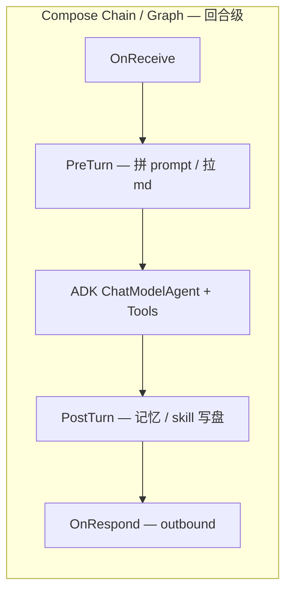

# Eino 加深 + 全 MD 管理 + 用户可扩展 Chain

**套件内位置**：[README.md](README.md)（复制指南）、[glossary.md](glossary.md)（术语）、[reference-from-oneclaw.md](reference-from-oneclaw.md)（与实现无关的原则）。文中 `session/eino_*.go`、`subagent` 等路径仅用于与 **oneclaw 参考实现**对齐；独立新项目可无该代码树。

前置语境：**Claw** 类运行时以「自动化完成用户需求」为目标——模型负责推理与规划，宿主负责工具、渠道与持久化；本文是该目标下 **首选 Eino 做编排内核** 的技术方案。

本文描述：**深度使用 Eino**、**模板/prompt/允许工具/skills 尽量由 md/声明式文件管理**、**在收消息/处理/响应等节点挂用户 Chain**，并保持 **Go 代码尽量只做装配**。要点与 [CloudWeGo Eino](https://github.com/cloudwego/eino) 文档中的 **Compose Graph/Chain**、**ADK ChatModelAgentMiddleware**、**callbacks** 对齐。

---

## 1. 目标拆分

| 诉求 | 推荐承载 |
|------|----------|
| 模板 / system / 分段说明 | 纯 `.md`（或大模板拆成多文件再拼接） |
| Skills 目录与索引 | `skills/<name>/SKILL.md` + 可选「索引 md」 |
| 允许使用的 tools | **声明式清单**（工具名列表或 tag），运行时解析成对 `Registry` 的子集或过滤函数，避免在 Go 里维护长名单 |
| 深度用 Eino | **ADK** 管「模型 + 工具 ReAct」；**compose** 管「回合外的确定性流水线」；**middleware** 管「回合内模型前后」；**callbacks** 管观测 |

**Eino 编排层（概念）**：**Chain** = 线性序列；**Graph** = 带分支的 DAG；**Workflow** = 更高层对 Graph 的封装。图上可使用 `AddLambdaNode`、`AddChatModelNode`、`AddEdge`，编译为 `Runnable` 后 `Invoke`（见官方 README / llms.txt）。

**ADK**：`ChatModelAgentMiddleware` 可在 `BeforeAgent`、`BeforeModelRewriteState`、`AfterModelRewriteState`、`WrapModel` 等扩展；`Handlers` 传入 `NewChatModelAgent`。

**callbacks**：嵌入 `callbacks.BaseHandler`，用 `compose.WithCallbacks` 或 `AppendGlobalHandlers` 做日志/指标，与业务 Chain 分离。

---

## 2. 「全 MD」建议：目录 + 机器可读清单

仅靠散落 md，代码里会到处是路径拼接。要保持 **代码简洁**，建议固定目录 + **一个入口 manifest**（YAML 或带 frontmatter 的 md）：

```text
.agent/   （或 ~/.yourapp/agent/）
  manifest.yaml          # 可选：默认 agent、引用 md、chain 顺序、模型别名
  prompts/
    system.md            # 主会话默认说明（可被 per-agent 覆盖或拼接）
    memory_block.md
  tools.allowlist.yaml   # 或 tools.md：front matter + 列表体（全局默认）
  skills/                # SKILL.md 树
  agents/                # 多 Agent：每个 *.md 一条角色定义（见 §5）
    coding.md
    explore.md
  chains/
    default.chain.yaml   # 用户定义节点序列（可按 agent 分文件，manifest 引用）
```

**原则**：

- **叙述与规范 prose** 放 md；**列表 / 顺序 / 开关** 放 yaml（或 md 的 `---` frontmatter）。
- **Tool 允许集**：解析成 `[]string` 或 tag → 装配层对 `tools.Registry` 做 `Filter`；主路径仍是 `adk.NewChatModelAgent` + 绑定工具列表（与 oneclaw `session/eino_executor_adk.go` 思路一致）。
- **多 Agent**：所有**业务 Agent 的配置集中在 `agents/`**，不在代码里硬编码角色；宿主只负责扫描、解析、合并内置条目。

---

## 3. 用户 Chain：三层挂钩

「记忆提取 / 基于会话自动生成 skills」等与 **多步 tool 循环** 节奏不同，建议拆成三层，避免与 ADK 内置 ReAct 打架。



### 3.1 回合外：compose.Chain / Graph（确定性）

- **OnReceive**：校验、脱敏、附件落盘、写入 `TurnContext`。
- **PreTurn**：读 md → 生成 `Instruction`、`[]*schema.Message` 前缀、tool allowlist。
- **PostTurn**：记忆提取、skill 候选生成 —— 可为一次额外 `ChatModel` 节点，或纯 Lambda。
- **OnRespond**：格式化、裁剪、写 transcript、触发 bus。

用户定义的 chain = **一串命名节点**；每个节点在 Go 里仅为薄适配器（读 manifest 参数 + 调接口）。

### 3.2 回合内：ADK ChatModelAgentMiddleware

适合：**每步模型请求前改 messages**、动态注入技能摘要、限流、审计。

oneclaw 已有同类实现：`BeforeModelRewriteState` 挂载到 `ChatModelAgentConfig.Handlers`（用于 TurnHub insert 等场景）。

用户扩展 = **按 manifest 顺序追加 Middleware**。

### 3.3 观测：callbacks

不等同于业务链：用 `callbacks` 承接 `notify`、`exec_journal`，避免把业务写进 OnStart/OnEnd。

---

## 4. 「最少 Go」的插件契约（建议）

定义窄接口，由 manifest 驱动注册：

- **内置节点**：`load_prompt_md`、`filter_tools`、`memory_extract_llm`、`skill_suggest_llm` 等。
- **用户扩展**：manifest 里写节点名 + 参数；启动时 `RegisterPlugin(name, factory)`。
- **重逻辑**：节点类型 `command` + manifest 中的 `argv`，由宿主统一 `exec`（需与主进程安全策略一致：路径、超时、资源上限）。

**深度用 Eino 的落点**：一幅 **Compose 图（回合外壳）** + **一个 ADK Agent（内核）** + **Middleware 列表**；Go 只保留装配与注册表。

---

## 5. 多 Agent 与 `agents/` 配置

### 5.1 目录约定

- **`agents/*.md`**：一层扁平 md（与子目录方案二选一；扁平与 oneclaw `subagent.LoadCatalog` 一致，实现简单）。
- 每个文件 = 一个可被选中的 **Agent 定义**（类型名来自 frontmatter 的 `agent_type` 或 `name`，否则取自文件名去扩展名）。

### 5.2 文件格式（frontmatter + 正文）

与 oneclaw `subagent.ParseAgentFile` 对齐，便于迁移：

| 字段 | 含义 |
|------|------|
| `agent_type` / `name` | 稳定 id（`run_agent`、路由、`toolctx.AgentID` / 观测） |
| `description` | 工具 schema / Catalog 列表展示用 |
| `tools` | 允许的工具名列表；与父 `Registry` 求交并去掉元工具 |
| `max_turns` | 子循环最大轮次（若适用） |
| `model` | 非空则覆盖宿主默认模型 |
| `omit_memory_injection` | 为 true 时可跳过主会话记忆块注入（探索类 Agent） |

**正文**：该 Agent 的 **Instruction / system prompt**（注入 `ChatModelAgentConfig.Instruction` 或与全局 `prompts/system.md` 拼接，产品二选一）。

### 5.3 与 Chain、工具、路由的关系

- **默认 Agent**：`manifest.yaml` 中 `default_agent: <agent_type>`；无则退回内置 `general-purpose` 等价物。
- **按渠道/会话切换**：入站 `Metadata`（或会话首次绑定）写入 **`agent_id`**，PreTurn 节点根据 id 从 Catalog 取 Definition，再 **`FilterRegistry`** + 拼 Instruction。
- **Per-agent Chain（可选）**：frontmatter 增加 `chain: nightly` 或在 `chains/<agent_type>.yaml` 固定路径加载，实现「同一宿主，不同 Agent 挂不同 PreTurn/PostTurn」。
- **嵌套**：子 Agent 仍可声明自己的 `tools`；避免在子定义里放开 `run_agent` / `fork_context` 除非明确需要（防深度爆炸）。

### 5.4 Eino 侧含义

- **MVP**：每个用户回合仍是一个 **`NewChatModelAgent`**；换 Agent = 换 **Instruction + Tools + Model + Middleware 列表**。
- **进阶**：多 Agent 协作可用 Eino Examples 中的 **host / supervisor / 多 Agent 图** 表达；`agents/` 仍是一条 md 一条配置，由 Facade 决定实例化单 Agent 还是子图。

---

## 6. 与 oneclaw 参考实现的映射（可选）

下列文件名相对于 **oneclaw 源码树**；无该仓库时可忽略本节。

- 当前主路径：`adk.NewChatModelAgent` + `GenModelInput` + `ToolsConfig` + 可选 `Handlers`（`session/eino_executor_adk.go`）。
- **演进方向**：将 `prepareSharedTurn` / `buildTurnSystem` 的产物改为 **PreTurn 节点链** 的输出；子 agent 共享同一套节点类型但换 **`agents/<type>.md` + 可选 chain**。
- **多 Agent 存量**：`subagent.LoadCatalog` + `agents/*.md`（`subagent.Definition`）；路由默认 **`Engine.RootAgentID`**，嵌套时覆盖子 `agent_id`（见 `toolctx`、`notify`）。
- oneclaw 仓库内长篇对照：`docs/eino-migration-research-plan.md`（**Eino Runtime Facade + Compose**、**Prompt Assembly Boundary**）。

---

## 7. 设计注意

1. **PostTurn 记忆/skill**：优先 **异步 + 失败不影响用户回复**（或 Fire-and-forget 分支），必要时 recover。
2. **与 ADK 步进的关系**：多轮 tool 间插入新 user 内容，继续用 **BeforeModelRewriteState**（oneclaw 已验证）。
3. **工具白名单**：全局 Manifest + **每 Agent `tools`** 取交集（或 Agent 覆盖）；skill 是「说明」，invoke 后仍受 allowlist 约束。
4. **用户 chain 若含外部命令**：必须与主进程 `exec` 策略一致（沙箱、超时、审计）。
5. **`agent_type` 唯一性**：Catalog 内同名后加载覆盖先加载，需在文档中写清优先级（用户覆盖内置）。

---

## 8. 参考链接

- Eino：`https://github.com/cloudwego/eino`
- Eino Examples（ADK、编排、多 Agent）：`https://github.com/cloudwego/eino-examples`

文档撰写时可结合 Context7 `/cloudwego/eino` 查询 Compose、Middleware、Callbacks、多 Agent 示例的最新说明。
