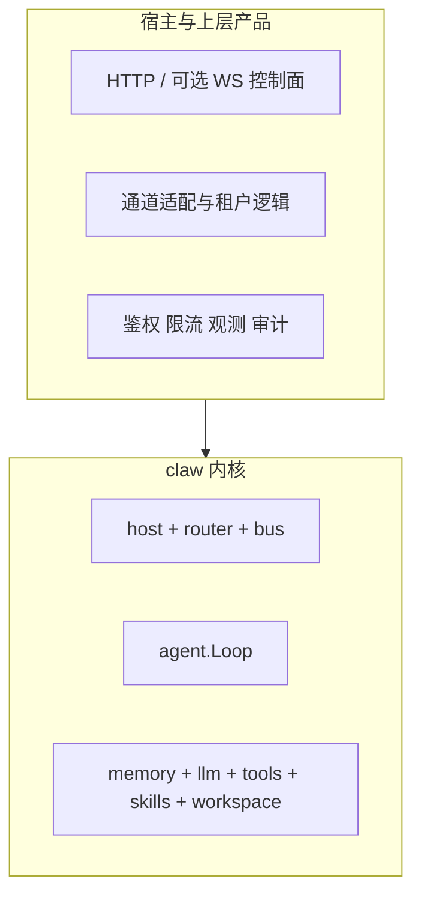

# 路线图与长期方向（非承诺）

本文描述 `oneclaw` 的长期定位与可能的演进方向，供规划和对外说明使用。

它不是排期承诺，也不覆盖已采纳的架构边界。

## 一句话定位

`oneclaw` 的长期目标是成为**可嵌入的 Go Agent 运行时内核**：默认支持外部化、可审计的自我进化能力，并允许宿主按需扩展控制面、通道和多 Agent 编排。

## 长期分层

## 主题级方向

### 1. 运行时与工具

- 补全 MCP 与静态 `Registry` 的组合规则。
- 扩展真实 LLM Provider 与超时/重试策略。
- 增强流式输出与上下文压缩。
- 补工作负载分级与优先级隔离，避免后台任务反噬交互路径。

### 2. 默认自进化

- 从“能写入外部化载体”进化到“有默认治理策略”。
- 增强长期记忆与检索式注入。
- 为低风险自动沉淀提供更稳的默认路径。
- 将写回治理从文档原则下沉为显式 `WriteIntent` 流水线。

### 3. 默认多 Agent

- 以混合型多 Agent 为默认运行形态，固定 `orchestrator / coder / reviewer` 等核心角色。
- 允许按任务动态派生更多专精 profile，并支持异构模型分工。
- 把父子任务、profile、评审反馈与结果汇总从自由 `Metadata` 提升为类型化协议。

### 4. 控制面与集成

- 提供自定义 HTTP API。
- 按需求评估可选 WebSocket，而不追求与外部产品协议兼容。

### 5. 安全与运维

- 对 Webhook / 公开入口补足鉴权、签名、限流与配额策略。
- 增强结构化日志、指标与 trace 贯通。
- 扩展诊断与 runbook。
- 补上下文装配预算、冲突处理与来源优先级规则。

## 与 OpenClaw 的长期关系

| 维度 | 立场 |
|------|------|
| 会话隔离、工具、记忆可插拔、自动化事件形状 | 借鉴概念 |
| Gateway WebSocket / 节点配对等具体协议 | 不作为内核默认目标 |
| 多通道、Dashboard、沙箱、Secrets | 可由宿主或子项目承担 |

## 相关文档

- [默认自进化能力](../concepts/default-evolution.md)
- [Agent Profile 与任务路由](../concepts/agent-profiles-and-routing.md)
- [范围与非目标](../concepts/scope-and-non-goals.md)
- [ADR-002：写回治理与 `WriteIntent` 流水线](../architecture/adr-002-write-governance.md)
- [ADR-003：任务编排信封与类型化元数据](../architecture/adr-003-orchestration-envelope.md)
- [ADR-004：上下文装配流水线](../architecture/adr-004-context-assembly-pipeline.md)
- [ADR-005：工作负载分级与队列优先级](../architecture/adr-005-workload-classes-and-priority.md)
- [OpenClaw 能力对照与启示](./openclaw-capabilities-and-design-notes.md)
