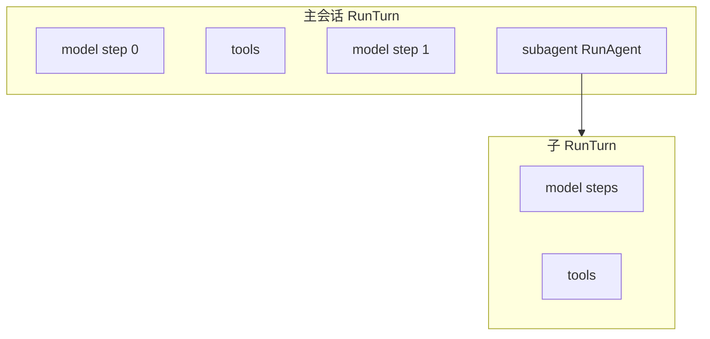
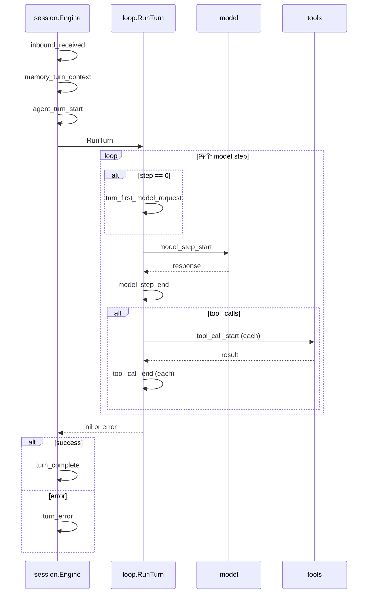

# 通知 Hook 技术设计（Agent 生命周期观测）

## 1. 背景与目标

### 1.1 需求

在 **不阻塞主推理路径** 的前提下，向外部系统（可观测性、审计、Webhook、内部编排）推送结构化通知，覆盖至少以下时刻：

| 阶段 | 说明 |
|------|------|
| 用户数据入站 | 渠道已解析、附件落盘/校验完成后的「业务层」用户输入 |
| Agent 入口 | 本轮即将进入模型循环（或本地 slash 等旁路） |
| 每次交互（模型步） | 每一轮 `model request → response`（含 `finish_reason`、usage 摘要） |
| 工具调用 | 模型产生 `tool_calls` 后，**执行前**（名称、id、参数摘要） |
| 工具响应 | 单次工具 **执行结束**（成功/拒绝/未知/错误，与现有 `ToolTraceEntry` 语义对齐） |
| 子 Agent | `run_agent` / `fork_context` 等嵌套循环 **开始与结束** |
| 正常结束 | 本轮 `RunTurn` 成功返回（最终 user-visible 状态已收敛） |
| 异常 | 模型错误、超时、`ctx` 取消、`max steps`、入站校验失败等 |

### 1.2 与现有能力的关系

- **[outbound-events-design.md](outbound-events-design.md)**：面向**终端用户可见**的 `text` / `tool` / `done` 流，偏「产品侧输出」。
- **本设计**：面向**运维/集成/审计**的 **Hook / Notify**，字段可更全（含失败原因、内部 step、子 agent 嵌套、`agent_id`），且可与 outbound **并行存在**，通过 **correlation** 关联同一会话、同一入站消息、同一嵌套 run、**当前执行业务 Agent**。

当前代码中已有可复用锚点：

- `session.Engine.SubmitUser`：入站准备、`loop.RunTurn` 前后、转写落盘、`PostTurn`（见 `session/engine.go`）。
- `loop.RunTurn`：每步 `model.CompleteWithTransport`、工具批处理（见 `loop/runner.go`）。
- `loop.Config.OnToolLogged` + `ToolTraceEntry`：工具结束后同步回调（仅 end，无独立 start 事件；并行 batch 时顺序为完成顺序）（见 `loop/tool_trace.go`）。
- `subagent.RunAgent`（及 fork 路径）：嵌套循环入口（见 `subagent/run.go`）。

### 1.3 非目标（第一版可明确不做）

- 不保证 Hook 与模型 token 流 **字节级**同步（流式 delta 仍由 outbound/SSE 等通道负责）。
- 不把完整 tool 原始入参/出参默认写入 Hook 载荷（默认摘要 + 可配置脱敏）。
- 不强制实现 HTTP Webhook 重试队列（可先同步调用 + 可选异步 worker）。

---

## 2. 概念模型

### 2.1 事件（Event）

每条通知是一个 **不可变** 的结构化记录，建议统一为：

- **顶层**：`schema_version`、`event`（类型枚举）、`ts`（**int64，Unix 毫秒 UTC**）、`severity`（可选：`info` / `warn` / `error`）。
- **关联（correlation）**：`session_id`、`agent_id`（见下）、`correlation_id`（如 `InboundMessage.MessageID`）、`turn_id`（可选，见下）、`parent_run_id` / `run_id`（子 agent 树）；嵌套执行时建议同时带 `parent_agent_id`（触发子循环时父级的 `agent_id`）。
- **载体（payload）**：按 `event` 分型的 `data` 对象（JSON 子对象）。

**`agent_id`（必选语义，实现可允许空串表示「默认主 Agent」）**：标识**当前这条通知所描述的执行上下文**属于哪一个业务 Agent（与编排配置、`.oneclaw/agents`、路由上的 Agent 绑定一致）。消费方（Webhook、规则引擎、多租户路由）可按 `agent_id` **分流**：不同 Agent 使用不同处理逻辑、告警策略、采样率或下游 topic。**主会话**整段 `RunTurn` 内 `agent_id` 一般不变；**子 Agent** 在 `subagent_start` 起切换为子定义对应的稳定 id（可与 `agent_type` 相同，或单独配置 `id` 字段以避免改名影响）。

**`turn_id` 建议**：在 `SubmitUser` 成功通过校验并准备调用 `RunTurn` 时生成一次 **ULID 或 UUID**，贯穿该次 `RunTurn` 内所有 model step 与 tool 事件，便于日志检索；与 `correlation_id`（渠道消息 id）并存。

### 2.2 嵌套与 `run_id`



- 主线程：`subagent_depth = 0`，`run_id` 可与 `turn_id` 相同或 `turn_id` + 后缀；`agent_id` 为当前会话绑定的主 Agent。
- 子 agent：新建 `run_id`，`parent_run_id` 指向触发 `run_agent` 的父 `run_id`，`subagent_depth` 递增（与 `toolctx.Context` 一致）；**`agent_id` 切换为子 Agent 的 id**，`parent_agent_id` 填父级 id，便于观测上区分「主从」两条业务策略。

### 2.3 Hook 接口形态（实现选型）

| 形态 | 适用场景 | 备注 |
|------|----------|------|
| **Go：`NotifySink` / `LifecycleHook` 函数组** | 进程内插件、测试、桥接到 MQ | 与 `loop.Config` / `Engine` 字段注入一致；日志用 `slog` |
| **HTTP Webhook** | 外部 SaaS、无代码集成 | 独立包或 `channel` 适配；需签名、超时、payload 大小上限 |
| **文件 / JSONL** | 本地审计 | notify audit sinks（`.oneclaw/.../audit/...`） |

**MVP 已选**：进程内 **`notify.Sink`** + **`notify.Multi`**；Webhook / JSONL 文件 sink **未实现**，可自行用 `FuncSink` 写文件或调 HTTP。

**多个 notify / 默认 Multi**：`NewEngine` 已初始化 **`Engine.Notify` 为空的 `notify.Multi`**（无 handler 时零开销）。向 **`notify` 注册** handler 推荐：

```go
eng.Notify.Register(myJSONL, notify.FuncSink(func(ctx context.Context, ev notify.Event) error { /* … */ return nil }))
// 或等价：eng.RegisterNotify(myJSONL, …)
```

也可整体替换：`eng.Notify = notify.Multi{a, b}`。扇出顺序、nil 跳过、`EmitSafe` 行为同前。

---

## 3. 事件类型与载荷（建议枚举）

命名采用 `snake_case`，与 JSON 惯例一致。

### 3.1 `inbound_received`

用户数据在 session 层已就绪（附件处理、`prepareInboundFromBus` 成功之后）。

**`data` 建议字段**：`client_id`、`session_id`（若有）、`message_id`、`content_preview`（截断）、`attachment_count`、`has_media`。

### 3.2 `agent_turn_start`

即将执行本轮推理（`RunTurn` 前或刚进入 `loop.RunTurn` 第一条逻辑）。

**`data`**：`model`、`max_steps`、`cwd`（可选）、`user_line_preview`（截断）。

### 3.3 `memory_turn_context`

在 **`memory.BuildTurn`** 与 **`ApplyTurnBudget`** 完成之后、**`agent_turn_start`** 之前发出（主线程 `SubmitUser` 与 **local slash** 路径均会发）。用于审计本轮**实际注入**的 recall / agent-md / memory 系统块全文。

- **`data`**：
  - **`memory_enabled`**：是否走 memory 路径（用户主目录不可用或配置关闭时为 `false`，此时各块多为空串）。
  - **`recall_block`**：本轮 **recall 附件块全文**（与注入 `loop.Config.MemoryRecall` 一致；未命中则为 `""`）。
  - **`agent_md_block`**：**AGENT.md / rules / `<system-reminder>`** 等全文（与 `MemoryAgentMd` 一致）。
  - **`recall_block_bytes`** / **`agent_md_block_bytes`**：UTF-8 字节长度。
  - 当 **`memory_enabled`** 为真时另带 **`memory_system_prompt_block`**（`TurnBundle.SystemSuffix`，即主线程 system 模板中的 **File-based memory** 说明段）及 **`memory_system_prompt_block_bytes`**。

子 Agent 内层 `RunTurn` **不**发本事件（嵌套循环不单独做 `BuildTurn`；由父轮记录）。

> **隐私**：载荷可能含路径与笔记正文；落盘与 Webhook 需按合规保留与脱敏。

### 3.4 `turn_first_model_request`（每用户轮仅一次）

在 **`step == 0`**、即将发起本轮**第一次** Chat Completions 请求时发出，用于标记「当前用户输入对应的首个模型请求」。

- **`data`**：
  - **`messages`**：发往 API 的**完整**消息列表（JSON 数组；元素为 OpenAI `ChatCompletionMessageParamUnion` 的 JSON 形态，含 system + 截至该步的 history）。
  - **`message_count`**：上述数组长度。
  - **子 Agent**：嵌套 `RunTurn` 时额外带 **`subagent_depth`**（与 `model_step_start` 一致）。

序列化失败时**跳过**该事件并记 `slog` 警告；不影响 `model_step_start` / 模型调用。

> **隐私**：载荷可能含 recall、附件摘要、长 system；落盘审计与 Webhook 消费方需按合规控制保留与脱敏。

### 3.5 `model_step_start` / `model_step_end`

每个模型步一对（与 `loop` 中 `step` 索引一致）。

- **start**：`step`、`tool_definitions_count`、**`last_message`**（本步请求中**最后一条**消息的完整 JSON，即 API `messages` 数组的最后一项；空列表时不发该字段）。**不再**携带 `request_message_count`（完整列表见同轮首步的 **`turn_first_model_request`**；后续步若需上下文请关联 `turn_id` + 前序 tool 审计或可见 transcript）。
- **end**：`step`、`finish_reason`、`duration_ms`、`usage`（`prompt_tokens` / `completion_tokens` / `total_tokens` 摘要）、`tool_calls_count`。

错误时：可发 **`model_step_end`** 且 `ok: false` + `error`，或单独 **`error`** 事件（二选一在实现期固定，文档写死）。

**`ctx` 在步进开头已取消**：仍发 **成对** `model_step_start` / `model_step_end`（与正常步相同的 `step` 与 tool 计数；预算已对本步执行 `ApplyHistoryBudget`）。若 `step == 0`，在 `model_step_start` **之前**先发 **`turn_first_model_request`**（若序列化成功）。`model_step_end` 中 `ok: false`，`error` 为 `ctx.Err()`，并带 **`cancel_before_request: true`**（未发起模型请求）。

### 3.6 `tool_call_start` / `tool_call_end`

- **start**：在 `runOneTool` **通过** `CanUseTool` 且 **registry 命中**、即将 `Execute` 之前发出；若 denied / unknown，可只发 **end**（带 `phase` 或 `status`）以保持与现有「仅 end 回调」兼容。
- **end**：与 `ToolTraceEntry` 对齐并扩展：`tool_use_id`、`name`、`ok`、`err`、`args_preview`、`out_preview`、`duration_ms`、`model_step`。

> 说明：当前 `OnToolLogged` 仅在 end 调用；若产品需要严格的 start/end 对称，需在 `runOneTool` 开头增加一次 Hook（注意并发 batch 时 start 顺序可能与 end 交错）。

### 3.7 `subagent_start` / `subagent_end`

在 `subagent.RunAgent`（及 fork 变体）入口与返回处：

**`data`**：`agent_id`（子 Agent 稳定标识，与 correlation 顶层一致）、`parent_agent_id`、`agent_type`、`task_preview`、`inherit_context`、`subagent_depth`、`child_run_id`。

结束：`result_preview`（截断）、`ok`、`err`（若 `error` 非 nil）；`agent_id` 仍表示该子 run 所属 Agent。

### 3.8 `turn_complete`

`RunTurn` 返回 `nil` 且 session 已完成 user-visible 折叠与转写保存逻辑之后（或紧接 `RunTurn` 成功之后，由实现约定先后顺序，**须在文档与测试中固定**）。

**`data`**：`final_assistant_preview`（可选）、`tool_count`（本 turn）、`truncated_by_max_steps: false`。

### 3.9 `turn_error` / `error`

- **`turn_error`**：本轮失败（模型失败、工具批失败、`ctx.Err()`、`max steps` 等），在错误返回路径上发出一次。
- 全局 **`error`**（可选）：非 turn 边界错误（如配置错误），按需。

**`data`**：`code`（稳定枚举，如 `model`、`tool_batch`、`context_canceled`、`max_steps`、`validation`）、`message`（人读）、`cause_chain`（可选，调试）。

### 3.10 旁路：`local_slash` / `send_message`

- 本地 slash 不走 `RunTurn`：应发 **`agent_turn_start`（variant: local_slash）** 或单独 **`turn_bypass`**，避免监控系统误以为「无模型步」是异常。
- `SendMessage` 仅出站：可用 **`proactive_outbound`**，与推理生命周期区分。

---

## 4. 调用顺序（同步一轮，含工具）



---

## 5. 可靠性、性能与安全

### 5.1 默认策略

- **同步调用 Hook**：在关键路径上必须 **轻量**；禁止在 Hook 内长时间阻塞（建议总预算例如单事件 < 10ms，可配置）。
- **重逻辑**：Hook 内部应 **非阻塞投递** 到 channel，由独立 worker 写 Webhook / Kafka。
- **Hook  panic**：`defer recover` 打 `slog.Error`，**不影响** `RunTurn` 成功/失败语义。

### 5.2 失败语义

- **进程内 NotifySink**：返回 `error` 时，默认 **仅记录日志**，不翻转 turn 结果（与 `OutboundText` 失败类似，见 `loop.logOutboundEmit`）。
- **Webhook / 异步投递**（非 MVP）：若以后增加，再约定 `on_failure` 与重试；当前仅进程内 `Sink`。

### 5.3 隐私与合规

- 默认仅 **preview / 截断**；`tool` 参数中的路径、token、密钥字段通过 **可插拔 Redactor** 处理。
- `inbound_received` 的 `content_preview` 长度默认上限（如 512 runes）。

---

## 6. 配置（YAML 草案）

**MVP**：不在 YAML 中配置；`Engine.Notify` 默认为空 **`notify.Multi`**，用 **`Notify.Register` / `RegisterNotify`** 添加 `Sink`。**`NewEngine` 默认 `RootAgentID`（`session.DefaultRootAgentID` = `AGENT`）**，并在每轮写入 **`toolctx.Context.AgentID`**；子 Agent 在嵌套 `Context` 上为目录里的类型 id / `fork_context`。多路由场景可覆盖 `Engine.RootAgentID`。

与 [config.md](config.md) 风格对齐的远期草案（Webhook / 多 sink / 事件白名单等 **未实现**）：

```yaml
notify:
  enabled: true
  # 进程内：多个 sink
  sinks:
    - type: slog_jsonl
      path: .oneclaw/notify.jsonl
    - type: http_webhook
      url: https://example.com/hook
      timeout: 3s
      hmac_secret_env: NOTIFY_HOOK_SECRET
  events: # 可选白名单；缺省表示全开
    - inbound_received
    - memory_turn_context
    - agent_turn_start
    - turn_first_model_request
    - model_step_start
    - model_step_end
    - tool_call_start
    - tool_call_end
    - subagent_start
    - subagent_end
    - turn_complete
    - turn_error
  redact:
    tool_arg_keys: [api_key, token, password]
```

---

## 7. 代码落点（实现清单）

| 模块 | 建议插入点 |
|------|------------|
| **`notify`** | `Event` 常量含 **Phase 2**：`agent_turn_start`、`model_step_*`、`tool_call_start`、`subagent_*` 等；`Sink`、`EmitSafe`、`Multi`；**`loop.ToolTraceEntry.tool_use_id`** |
| `session` | **`Engine.Notify` / `AgentID`**：`prepareSharedTurn` 注入 **父 `turn_id` / `correlation_id`** 到 `subRunner`；`buildLoopLifecycle` / `nestedLoopLifecycle`；`SubmitUser`：`inbound_received` → **`memory_turn_context`** → `agent_turn_start` →（loop 内 model/tool 事件）→ `turn_complete` / `turn_error`；**本地 slash**：同上（含 `memory_turn_context`）+ `agent_turn_start`（`local_slash`）+ `turn_complete` |
| `session`（续） | `SendMessage` 旁路：**当前 MVP 不发 notify**（与推理生命周期无关，可按需后续加 `proactive_outbound`） |
| `loop` | **`LifecycleCallbacks`**：`OnModelStepStart(step, toolN, requestMessages)` / `OnModelStepEnd` / `OnToolStart`；`RunTurn` 在请求前后与失败路径调用；`runOneTool` 在 Execute 前调 `OnToolStart` |
| `subagent` | **`Host.Notify` / `OnNestedLifecycle` / 父 turn 关联字段**；`RunAgent`、`RunFork` 发 `subagent_*` 并为嵌套 `loop.Config` 注入 lifecycle |
| `cmd/oneclaw` 或 `config` | **MVP**：未接 YAML；编排侧 `eng.Notify.Register(…)` 或 `RegisterNotify` / `AgentID`。**远期**：解析 `notify` 段注入 `Engine` |

---

## 8. 分期建议

| 阶段 | 内容 |
|------|------|
| **MVP（已落地）** | 包 `notify` + 默认 **`Engine.Notify`（`notify.Multi`）** + `Register` / `RegisterNotify`；事件见上；**无 Webhook、无 YAML、无异步队列与背压** |
| **Phase 2（已落地）** | `agent_turn_start`、`model_step_*`、`tool_call_start`、`subagent_*`（见上）；**步进开头 `ctx` 已取消**时仍发成对 `model_step_*`，`data.cancel_before_request: true` |
| **Phase 3** | YAML 配置、可选 HTTP Webhook（HMAC）、redaction；**不包含**异步队列/背压除非产品明确要求 |

---

## 9. 验收标准

- 单测：`notify` 包单测已覆盖 `EmitSafe` / `Multi` / 载荷与错误码；会话级序列可在集成测试用 `notify.FuncSink` 录制（Phase 2 可补全工具链与子 agent）。
- 手工：对 `Engine` 挂接自定义 `Sink`，检查主线程与嵌套线程的 `correlation_id` / `turn_id` / `run_id` / `agent_id` / **`parent_agent_id` / `parent_run_id`** 一致。
- 性能：Hook 默认路径不引入可感知延迟（可用 benchmark 或集成测试采样）。

---

## 10. 开放问题

1. **`agent_id` 与 `agent_type` 是否合并**：若子 Agent 仅按类型区分，可令二者相等；若需配置改名不影响集成，应在 Agent 定义中增加稳定 **`id`**，与展示用 `type`/`name` 分离。
2. **`turn_id` 是否在多进程 / 多副本部署中要求全局唯一**：若仅单进程，UUID 足够；若需跨服务关联，是否引入上游 `trace_id` 透传字段。
3. **是否与 `outbound-events-design` §2 的 JSON 观测载荷合并**：短期可 **转换适配**（Hook → 行 JSON），长期是否统一为一种 envelope 需产品取舍；若合并，顶层需同步携带 `agent_id`。
4. **流式模型**：若未来每 step 内再拆 delta，是否新增 `assistant_delta` 事件或仍只依赖 outbound。
