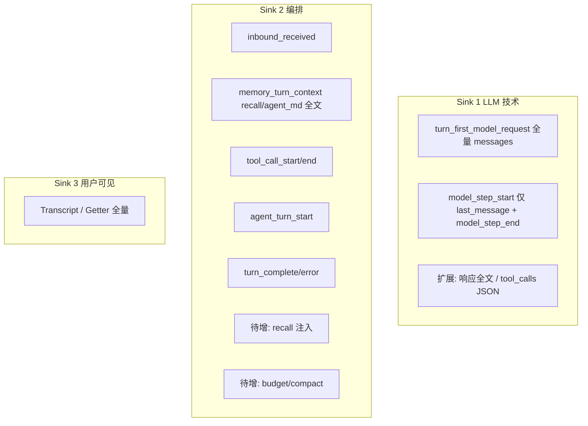
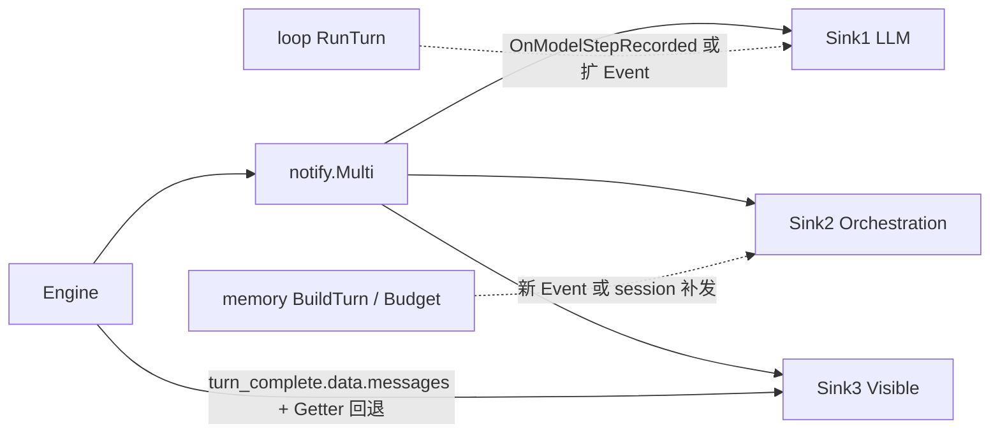

# 审计类 Notify Sink 技术方案

目标：三条**相互独立**的落盘通道，分别服务 **LLM 全量技术细节**、**回合编排与工具链（含 recall/压缩）**、**用户可见完整对话**，供 **maintain / 审计 / 优化** 使用。

设计前提见 [notification-hooks-design.md](notification-hooks-design.md)。

---

## 1. 三类职责（按产品语义，非实现名）

| # | 关注点 | 要记录什么 | 明确不要 / 弱化 |
|---|--------|------------|-----------------|
| **1** | **每轮内的 LLM 请求与响应（技术向、尽量完整）** | 该用户轮下**每一次** `model_step`：请求侧规模（消息条数、工具定义数等）、**响应侧**：`finish_reason`、usage、`tool_calls` 原始结构（若有）、**助手消息全文**（或 API 形态 JSON）、错误/取消；子 Agent 内步骤带 `run_id`/`parent_*` 区分 | 不把 **用户可见 Sink** 混在这里；不替代 **tool 执行器**日志（执行在 Sink 2） |
| **2** | **回合编排与中间过程（业务/排障向）** | **用户输入**（宜完整或高上限）、**中间 tool**：调用名、参数摘要/全文（可配置）、**执行结果**摘要/全文；后续可扩 **recall**（注入块摘要或全文、recall 字节数）、**压缩/预算**（是否触发 `ApplyHistoryBudget`、语义压缩摘要、丢弃消息数等） | **弱化详细 LLM**：可不存逐步 token 级 prompt、可与 Sink 1 用 `turn_id` 关联而非重复贴大段 completion |
| **3** | **仅用户侧可见、且要完整** | 与 `Transcript` / `ToUserVisibleMessages` **一致**：仅 **user + assistant** 成对历史，**全文**（不设 preview 为默认），可每轮追加或周期性写**全量快照** | **零 tool** 消息、**零** `<inbound-context>` 等注入、**零** system、**零**「模型思考中间态」——只保留用户在产品里能看到的字 |

三者通过 **`session_id` + `turn_id` + `correlation_id`** 关联；**文件/Topic 物理分离**。

---

## 2. 与现有 `notify.Event` 的映射与缺口



### 2.1 Sink 1：每轮 LLM 详细信息

- **已有**：
  - **`turn_first_model_request`**（仅 `step == 0`）：`messages` 为发往 API 的**完整** JSON 数组（system + history），`message_count`；子 run 带 `subagent_depth`。
  - **`model_step_start`**：`step`、`tool_definitions_count`、**`last_message`**（本步请求 `messages` 的**最后一条**完整 JSON）；不再写 `request_message_count`。
  - **`model_step_end`**：`usage`、`finish_reason`、`tool_calls_count`、`ok`、`error`、`cancel_before_request` 等。
- **缺口（要达到「请求+响应」更细）**：
  - **助手侧全文**（及逐步 **请求** 全量）：首步已由 **`turn_first_model_request`** 覆盖；后续步若需全量请求体仍属缺口，或依赖 **`model_step_start.last_message`** + tool 审计拼接。
  - 可选在 **`model_step_end`** 增加 `assistant_raw` / `message_json`，或专用回调 **`OnModelStepRecorded`**（避免所有消费者都扛超大 JSON）。
- **子 Agent**：同一 `turn_id` 下多段 `run_id`，Sink 1 按 **step + run_id** 全量保留即可。

### 2.2 Sink 2：用户输入 + tool + recall + 压缩（不要详细 LLM）

- **已有**：`inbound_received`（用户侧预览，可改为/并行 **完整 content** 字段需扩展）、**`memory_turn_context`**（`recall_block`、`agent_md_block` 全文及字节计数；`memory_enabled` 时含 `memory_system_prompt_block`）、`agent_turn_start`、`tool_call_start`（`args_preview`）、`tool_call_end`（`out_preview`、`ok`、`err`）、`subagent_start/end`、`turn_complete`（`tool_count` 等）。
- **缺口**：
  - **用户输入全文**：扩展 `inbound_received.data` 增加 `content`（或与 preview 并存 `content_full`），或由 **session** 在发事件前填完整文本（注意大附件用 path 引用）。
  - **tool 结果更完整**：`tool_call_end` 增加可选 **`output_full`**（上限由配置控制），默认仍 preview。
  - **压缩/预算**：在 **`ApplyHistoryBudget`**（及若存在语义压缩）之后发 **`history_budget_applied`**：`truncated`、`dropped_message_count`、`semantic_compact` 布尔、`summary_preview` 等。

### 2.3 Sink 3：用户可见且完整

- **权威数据源**：`Engine.Transcript`（与成功回合后 `ToUserVisibleMessages(Messages)` 对齐），**不是** notify 里拼 preview。
- **推荐实现**：`SessionVisibleSink` 在 **`turn_complete`**（及本地 slash 成功结束）时通过 **Getter** 读取当前 **整份** user-visible 列表，写入：
  - **方案 A（默认）**：每行一条 **`full_transcript`**（`messages: [{role, content}]` 全量），便于离线「完整回放」；
  - **方案 B**：仅追加本 turn 的 user+assistant **两条全文**，由下游拼完整（仍须保证 content **不截断**）。
- **硬约束**：序列化前必须经过 **`loop.ToUserVisibleMessages`** 同源逻辑，确保 **无 tool role、无注入 user 块**。

---

## 3. 建议落盘布局（相对 `cwd`）

**必须**在审计根下增加 **一层 Agent 分区**（`agent_segment`），避免多 Agent 共用同一 `cwd` 时审计数据混写。主路径仍为 `.oneclaw/audit/`；当 `Engine.SessionID` 非空（多 IM 会话 / `WorkerPool` 等）时，notify 三路审计改写在 **`.oneclaw/sessions/<session_id>/audit/`** 下，与 `transcript.json` 同会话目录并列，避免多 thread 混写同一 JSONL。

```text
.oneclaw/audit/<agent_segment>/                          # SessionID 为空时（单 Engine / 测试等）
  llm/YYYY/MM/YYYY-MM-DD.jsonl
  orchestration/YYYY/MM/YYYY-MM-DD.jsonl
  visible/YYYY/MM/YYYY-MM-DD.jsonl

.oneclaw/sessions/<session_id>/audit/<agent_segment>/     # SessionID 非空时
  llm/...
  orchestration/...
  visible/...
```

### 3.1 `agent_segment` 命名规则

| 规则 | 说明 |
|------|------|
| **来源** | 审计根目录默认用 **`Engine.EffectiveRootAgentID()`**（`RootAgentID`，未设则 `DefaultRootAgentID`=`AGENT`）。运行中「当前逻辑 Agent」在 **`toolctx.Context.AgentID`**（主线程由 session 从 Root 注入；子 Agent 为 catalog 类型 / `fork_context`）。若产品侧有单独 **展示名**，可覆盖 `RootAgentID`，或 Sink 的 **`AgentSegment string`**（优先级高于 `AgentID` 字段）。 |
| **空值** | `Options.AgentID` 为空时 segment 固定为 **`_default`**，禁止出现路径中空目录段。 |
| **文件系统安全** | 对 segment 做净化：仅保留 `[a-zA-Z0-9._-]`，其余替换为 `_`，长度上限（如 64），避免路径穿越。 |
| **子 Agent** | **目录层仍用主会话 Engine 的 `agent_segment`**，子 Agent 身份用 **JSON 行内** `agent_id` / `run_id` / `parent_*` 区分；若未来要强隔离子 Agent 文件，可在 v2 增加可选二级目录 `.../sub/<sub_agent_id>/`（非默认）。 |

实现侧：`notify/sinks` 在 `Options.AuditSessionID` 非空时使用 `sessions/<id>/audit/<agentSegment>/...`，否则 `audit/<agentSegment>/...`；**每个最终 JSONL 绝对路径一把写锁**，不同文件互不阻塞。

---

## 4. 行级 Schema 要点（JSONL）

### 4.1 Sink 1（`kind: audit_llm`）

- **`notify_event: turn_first_model_request`**（每用户轮首步一条，子 Agent 每段 nested run 的首步一条）：`data.messages` 为完整请求消息 JSON 数组；`data.message_count`。
- **`notify_event: model_step_start`**：`data.last_message` 为该步请求的最后一则消息（JSON 对象）；`data.step`、`data.tool_definitions_count`。
- **`notify_event: model_step_end`**：既有 usage / finish_reason / tool_calls 等。

远期可选（未实现）：`assistant_content`、`request_messages_sha256`、可配置体积上限与脱敏。

### 4.2 Sink 2（`kind: audit_orchestration`）

按事件分型多行共享 `turn_id`，例如：

- `notify_event: inbound_received`：`content` 预览等
- **`notify_event: memory_turn_context`**：`recall_block`、`agent_md_block`、`memory_system_prompt_block`（启用 memory 时）**全文**；`*_bytes` 长度字段
- `tool_call_*`、`agent_turn_start`、`turn_complete` 等
- 远期：`history_budget_applied` / 压缩摘要；`tool_call_*` 的 `args_full` / `output_full`（可配置上限）

**不包含**：逐步 LLM usage 长表（留给 Sink 1）。

### 4.3 Sink 3（`kind: audit_visible`）

- `messages`：与 `transcript.json` 相同形状，`[{ "role": "user"|"assistant", "content": "…" }]`，**仅本 turn 新增的用户可见轮次**（通常为该 turn 的用户行 + 最终助手可见回复），避免每行审计重复整段会话导致 JSONL 体积二次增长。
- 同行可选字段：`tool_count`、`final_assistant_preview`、`truncated_by_max_steps`、`local_slash`（与 `turn_complete` 一致）。
- 禁止出现 `tool` role 与非用户可见注入。
- 若 `turn_complete` 未带 `messages`（异常路径），Sink 3 最多回退写入当前 Transcript **末尾两条**可见记录，而非全量快照。

---

## 5. 与 Engine / memory 的关系



- **memory / maintain**：Sink 2 的 recall、budget 事件可直接被 **定时 maintain** 或 **PostTurn** 分析消费。
- **Sink 3** 与 **TranscriptPath** 内容语义一致时可对账；审计文件格式可为 JSONL 便于流式处理。

---

## 6. 实现与性能

- **Sink 1**：体积最大，建议 **按配置** 开关「是否存 request 全文」「assistant 全文上限」。
- **Sink 2**：tool/recall 全文建议 **单字段字节上限** + 溢出写 sidecar 或只留 hash。
- **Sink 3**：按 turn 追加 **增量** `messages`；若需整会话对账以 **TranscriptPath / transcript.json** 为准。远期可选显式 `MaxAssistantRunes` 与告警。
- **写盘**：**按 `(agent_segment, 日更文件路径)` mutex**（不同 Agent 分文件，不共锁）；失败 `error` + `EmitSafe` 日志，**不回滚**会话。

---

## 7. 分期

| 阶段 | 内容 |
|------|------|
| **v1** | Sink 1：在现有 `model_step_*` 上增加 **响应正文** 管道（扩 Event 或 `loop` 回调）；Sink 2：聚合 inbound + tool_* + subagent_*；Sink 3：Getter **全量** Transcript 写 `visible` |
| **v2** | Sink 2：`memory_turn_context`、`history_budget_applied`；tool/recall **可配置全文** |
| **v3** | YAML/rtopts 路径、按 `agent_id` 分卷、与 maintain 任务 schema 契约测试 |

**v1 代码入口**：`notify/sinks` 提供三个构造函数；`(*session.Engine).RegisterAuditSinks(llm, orchestration, visible)` 按布尔开关注册（`cmd/oneclaw` 默认从 `(*config.Resolved).NotifyAuditSinkPaths()` 取值，YAML 见 `features.disable_audit_*`，默认全开）。

---

## 8. 验收

- Sink 1：一轮多 step，每步有 usage + **助手正文** 与父轮 `turn_id` 一致。
- Sink 2：同轮有用户正文、tool 起止、**无**与 Sink 1 重复的 LLM 长字段（或仅交叉引用 `step`）。
- Sink 3：与磁盘 `Transcript` 经 `ToUserVisibleMessages` 后 **字节级或结构化等价**（无 tool role）。

---

## 9. 开放问题

1. Sink 1 是否持久化 **完整 multi-turn request messages**（仅 hash 是否足够做法务/调试）。
2. Sink 2 的 recall 块是否默认 **仅统计** 不落地全文（隐私）。
3. Sink 3 每行 **全量 transcript** 的存储膨胀：是否增加「按会话滚动文件 + 压缩归档」运维约定。
