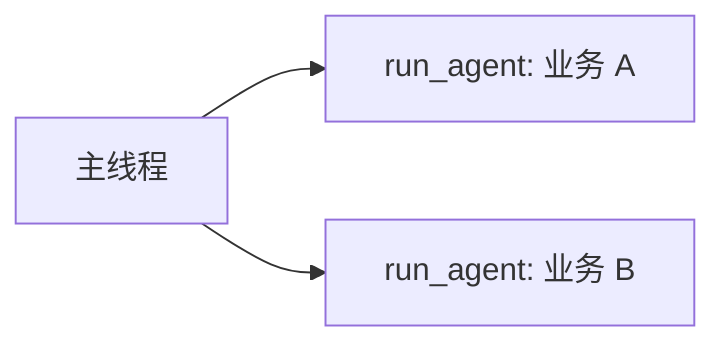

# 主编排与业务 Agent（Delegated agents）

本文约定：**主线程 Agent** 负责意图识别与分流，**业务 Agent**（`.oneclaw/agents/*.md` 定义的 `agent_type`）负责具体领域任务；业务 Agent 之间**不互相委派**，避免链式/循环调用。实现上见 `session`（system 注入）、`subagent`（目录渲染与嵌套约束）、`loop`（工具描述覆盖）。

---

## 1. 目标

| 目标 | 说明 |
|------|------|
| 主 Agent 可感知 | 每一轮主线程都能看到当前 cwd 下**可用**的 `agent_type` 与简短 `description`（来自 YAML frontmatter），用于选型与分流。 |
| 职责分离 | 主线程偏「路由、澄清、合并结果」；具体执行通过 **`run_agent`** 交给子 Agent。 |
| 子 Agent 隔离 | 由 **`run_agent` 启动的子循环**不再暴露 `run_agent` / `fork_context`，无法继续嵌套委派（与深度无关，见 §4）。 |
| 演进 | 后续可在此基础上增加 **异步 job、并行子任务**（见 §6），不改变「仅主线程（或未来的 orchestrator 角色）发起委派」的不变量。 |

---

## 2. 主线程如何获得目录

### 2.1 System prompt：`# Delegated agents (run_agent)`

- 数据来源：`subagent.LoadCatalog(cwd)`（内置 `general-purpose`、`explore` + `.oneclaw/agents/*.md` 覆盖同名）。
- 展示形态：与 Skills 索引类似，**每条一行**：`agent_type` + 截断后的 `description`；**不**注入各 Agent markdown 正文（正文仅在子循环 system 中使用）。
- 字节预算：与 **Skills 索引**共用同一套上限逻辑（`budget.Global.SkillIndexMaxBytes()`，来自 YAML `budget.skill_index_max_bytes` / `PushRuntime`），避免主 system 膨胀。

### 2.2 Tool：`run_agent` 的 description 动态附录

- 除上述 system 块外，每轮请求里的 **`run_agent` 工具定义**会附带「当前可用的 `agent_type` 列表」（同样带简短描述，独立字节上限，见代码常量）。
- 目的：模型在扫 tool 列表时也能看到可选类型，减少漏读 system 的情况。

### 2.3 编排话术（模板内）

主线程模板中增加简短规则，例如：优先用目录选型；`prompt` 应自包含任务与验收标准；需要父对话背景时使用 `inherit_context`。

---

## 3. 配置文件约定（`.oneclaw/agents/*.md`）

- **YAML**：`agent_type`（必填）、`description`（**必填用于分流**：建议写「何时选我」）、`tools`、`max_turns`、`omit_memory_injection` 等（与现有解析一致）。
- **正文**：子 Agent 的 system，专注**单一领域**，不要写「可以调用其他 agent」。
- **工具白名单**：业务 Agent 的 `tools` **不要**包含 `run_agent` / `fork_context`；运行时也会强制剥离（§4），双保险。

---

## 4. 子 Agent 不嵌套委派（实现不变量）

- **`RunAgent` 路径**：在按 `Definition.Tools` 过滤 registry 之后，**始终** `WithoutMetaTools(..., "run_agent", "fork_context")`，与 `SubagentDepth` 无关。这样第一层子 Agent 即使用户误配了工具名，也无法再开子委派。
- **`fork_context` 路径**：仍沿用既有逻辑（深度 ≥ 1 时剥离嵌套工具）。主线程直接 `fork_context` 时仍可能携带 `run_agent`（辅助推理场景）；若将来要求「仅主编排可委派」，可再收紧 fork 的工具面（见 §7）。

---

## 5. 与内置 Agent 的关系

- `general-purpose`、`explore` 始终出现在目录中（除非被同名的用户文件覆盖）。
- 用户自定义 `agent_type` 与内置并列展示，主线程按 `description` 分流即可。

---

## 6. 后续：异步与并行（仅规划）

| 方向 | 要点 |
|------|------|
| 并行 | 多个 `run_agent` 独立 `Messages` 切片与 `toolctx`；结果以**摘要**回灌主线程，控制 token。 |
| 异步 | `job_id` + 状态查询工具；主线程后续 turn 拉取结果；超时与取消策略单独定义。 |
| 不变量 | 并行/异步的执行单元仍由**主线程（或显式 orchestrator 角色）**创建，业务 Agent 不互相启动对方。 |

---

## 7. 已知边界

- **`fork_context`**：主线程发起时仍可能保留 `run_agent`（与「业务子 Agent」路径不同）。若产品上要完全禁止「fork 再委派」，需在 `RunFork` 工具面或 `CanUseTool` 层单独收紧。
- **预算**：Agent 目录与 Skills 共享 `SkillIndexMaxBytes`；若需独立旋钮，可新增 YAML 字段（如专用 catalog 上限，当前未实现）。

---

## 8. 源码对照

| 区域 | 文件 |
|------|------|
| 主线程 system 数据与渲染 | `session/system.go`，`prompts/templates/main_thread_system.tmpl` |
| 每轮加载 catalog、subRunner | `session/turn_prepare.go` |
| 目录行（主线程 system） | `subagent/catalog.go`（`PromptCatalogLines`）；`run_agent` 工具描述为静态 `RunAgentToolDescriptionBase`（`tools/builtin/run_agent.go`） |
| 嵌套工具剥离 | `subagent/run.go`（`RunAgent`） |

---

*文档版本：与实现同步；修改行为时请同时更新本节与 `test/e2e/CASES.md` 中相关用例。*
