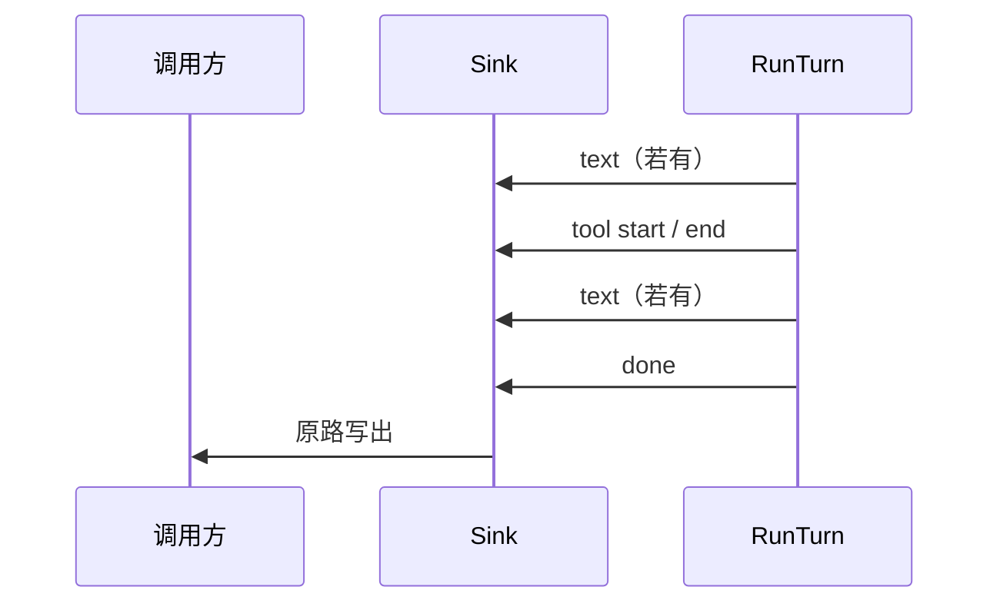

# 出站事件与 Sink（简化版）

目标：调用方**原路**收到结果——同步时一条连接里按顺序读；异步时同一 **job** 上继续读同一类事件，不引入过多类型与字段。

---

## 1. 思路：少字段、少类型

- **Envelope 只保留排序与分类**：`seq` + `kind` + `data`（对象）。需要时再在 `data` 里加字段，而不是堆在顶层。
- **第一版（MVP）三种 `kind` 就够**：
  - **`text`** — 助手给用户看的字（整段或流式多条的片段，由实现约定是否合并）。
  - **`tool`** — 工具开始/结束合并成一种：`{ "name", "phase": "start"|"end", "ok"?: bool }`。
  - **`done`** — 本轮结束：`{ "ok": bool, "error"?: string }`。

异步、多任务：**同一结构**，只是多一个可选字段 `job_id`（有则表示属于某任务；无则默认当前会话同步轮次）。

```json
{ "seq": 1, "kind": "text", "data": { "content": "你好！" } }
{ "seq": 2, "kind": "tool", "data": { "name": "read_file", "phase": "start" } }
{ "seq": 3, "kind": "tool", "data": { "name": "read_file", "phase": "end", "ok": true } }
{ "seq": 4, "kind": "text", "data": { "content": "文件里是……" } }
{ "seq": 5, "kind": "done", "data": { "ok": true } }
```

可选顶层字段（需要再加，不放进 MVP 也行）：

| 字段 | 说明 |
|------|------|
| `session_id` | 多会话时区分 |
| `job_id` | 异步任务时带上，事件与任务对齐 |
| `ts` | 时间戳，调试/审计用 |

**`seq`**：同一「逻辑流」内单调递增即可（同会话同步轮次，或同 `job_id`）。

---

## 2. Sink（实现约定）

```text
Emit(ctx, Record) error   // Record = seq + kind + data + 可选 job_id/session_id
```

- 默认提供 **`NoopSink`**（不写任何地方）。
- CLI / HTTP 各做一个 **适配器**：把 `Record` 打成「人读」或「JSON 行」。

不要求一上来就线程安全复杂队列：**可先单 goroutine 调 `RunTurn`，在 loop 里同步 `Emit`**；以后有并发再串行化。

---

## 3. CLI（怎么算友好）

- **stdout**：只打 **`text`** 的 `content`（和现在「最后助手回复」一致；若流式则连续打印片段）。
- **stderr**：继续 **slog**；**默认**每条 **`Record`** 再打一行 JSON（与下面 HTTP NDJSON 同形）；终端 sink（`routing/cli`）可把 `JSONEvents` 设为 `false`，则不再写 JSONL，成功结束时用一行 `(turn done)` 代替。
- **`done`**：`ok=false` 时 stderr 仍会打错误文案（可与 JSONL 并存）。

---

## 4. HTTP（怎么算友好）

- **一条长连接**：**SSE** 或 **NDJSON**，每行一个上面的 JSON（与 CLI 默认 stderr JSONL 同形）。
- **只要结果、不要流**：单独接口 **阻塞到 `done`**，响应体 `{ "text": "拼好的正文", "ok": true }`。
- **异步**：`202` 返回 `job_id` + 订阅 URL；订阅里仍是 **`text` / `tool` / `done`**，与同步同一套，只是带 `job_id`。

---

## 5. 以后再加什么（别一开始就写进协议）

| 需求 | 做法 |
|------|------|
| token 用量 | `done.data` 里加 `usage` |
| 流式 vs 整段 | 约定多条 `text` 即 delta；或加 `data.final: true` |
| 子 Agent / 多轨 | `data.lane` 或顶层 `run_id` |
| 与 OpenAI 对齐的 tool_call_id | `tool.data.id` |

---

## 6. 流程（同步一轮，含工具）



---

## 7. 和之前「复杂版」的关系

旧版里 `turn_started`、多种 `job_*`、`assistant_delta` 与 `assistant_message` 分开等，**能力更全**。若你更认同本页的 **三种 `kind`**，实现时以本页为准；需要观测性时再往 `data` 里加字段，而不是再拆一批事件名。

---

*实现状态（仓库内）：`routing` 核心；子包 **`routing/cli`**：`init` 注册 `SourceCLI`（默认 stderr JSONL）、**`RunREPL`** 收消息。`cmd/oneclaw` 组装 `Engine` 后调用 `cli.RunREPL`；飞书/Slack 可仿照增加子包（各自 `RunWebhook` / `RunSocketMode` 等）。HTTP/SSE 可 `RegisterDefaultSink` 或自建 `MapRegistry`。*

*入站统一封装、`context` 透传、按来源注册表选 `Sink`：见 [inbound-routing-design.md](inbound-routing-design.md)。*

