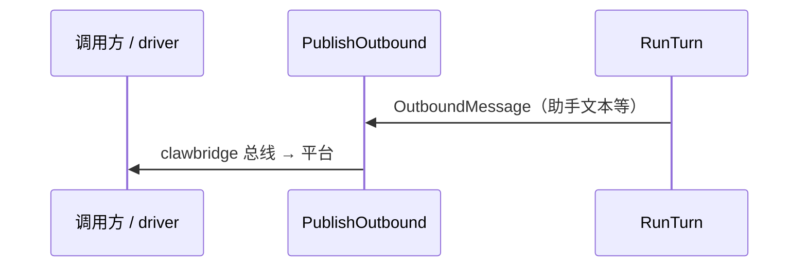

# 出站与事件

本文描述 **当前实现** 中的助手出站路径，以及可选的 **JSON 观测载荷** 草案（供 HTTP/CLI 等接入时参考，**不是** `loop` 内核强制协议）。

---

## 1. 当前实现（主路径）

- **类型**：出站消息为 **`github.com/lengzhao/clawbridge/bus.OutboundMessage`**（由 driver 发到 IM 等平台）。
- **桥实例**：**`session.Engine.Bridge`** 由 **`MainEngineFactoryDeps`** / 单测显式赋值，出站为 **`Bridge.Bus().PublishOutbound`**，入站状态为 **`Bridge.UpdateStatus`**（见 **`session/bridge.go`**、`session/turn_prepare.go`、`session/engine.go`）。
- **与 `loop` 的衔接**：**`loop.Config.OutboundText`** 在 **`session.prepareSharedTurn`** 中实现为：将助手可见文本封装为 **`OutboundMessage`** 再 **`Engine.publishOutbound`**；**`ErrNotInitialized`** 在闭包内吞掉，避免无桥时 **`loop.outbound.emit_failed`** 刷屏（见 `session/turn_prepare.go`）。
- **入站状态**：**`Bridge.UpdateStatus(ctx, inbound, state, metadata)`**（**`UpdateStatusState`**）；**`Bridge.EditMessage`** 基于 **`OutboundMessage`**（含 **`message_id`** 引用已发消息；**`Send`** 忽略该字段）。
- **通知**：**`notify`** 包内 **`notify.Sink`** 的 **`Emit`** 仍可用于其它订阅者。与 **`PublishOutbound`** 并行者**不是**同一套 `Record{seq,kind}` 协议。

---

## 2. 思路：少字段、少类型（可选观测层）

若某接入方式需要 **NDJSON / SSE** 或统一日志行，可采用下面 **三种 `kind`** 的载荷（实现可自行选择是否落地；**内核**仍以 **`OutboundMessage` + `PublishOutbound`** 为准）：

- **`text`** — 助手给用户看的字（整段或流式多条的片段，由实现约定是否合并）。
- **`tool`** — 工具开始/结束合并成一种：`{ "name", "phase": "start"|"end", "ok"?: bool }`。
- **`done`** — 本轮结束：`{ "ok": bool, "error"?: string }`。

异步、多任务：**同一结构**，可选顶层字段 **`job_id`**。

```json
{ "seq": 1, "kind": "text", "data": { "content": "你好！" } }
{ "seq": 2, "kind": "tool", "data": { "name": "read_file", "phase": "start" } }
{ "seq": 3, "kind": "tool", "data": { "name": "read_file", "phase": "end", "ok": true } }
{ "seq": 4, "kind": "text", "data": { "content": "文件里是……" } }
{ "seq": 5, "kind": "done", "data": { "ok": true } }
```

可选顶层字段：

| 字段 | 说明 |
|------|------|
| `session_id` | 多会话时区分 |
| `job_id` | 异步任务时带上 |
| `ts` | 时间戳，调试/审计用 |

**`seq`**：同一逻辑流内单调递增（同会话同步轮次，或同 `job_id`）。

---

## 3. CLI / HTTP（接入提示）

- **进程日志**：**`log/slog`** 输出到 stderr；具体格式由 [`config.md`](config.md) 的 `log.*` 与 CLI 标志控制。
- **一条长连接**：若需要 **SSE** 或 **NDJSON**，可在 **`statichttp`** 或独立 handler 中订阅与 `RunTurn` 同进程的事件源（需自行与 `OutboundText` / notify 等对接）；**仓库未**强制提供与 §2 逐行对应的内置 HTTP 端点。
- **只要结果、不要流**：可阻塞到本轮结束，聚合最终助手文本再响应。

---

## 4. 以后可加什么

| 需求 | 做法 |
|------|------|
| token 用量 | `done.data` 里加 `usage` |
| 流式 vs 整段 | 约定多条 `text` 即 delta；或加 `data.final: true` |
| 子 Agent / 多轨 | `data.lane` 或顶层 `run_id` |

---

## 5. 流程示意（同步一轮，含工具）



---

## 6. 相关文档

- 入站、`WorkerPool`、工具注册表：[inbound-routing-design.md](inbound-routing-design.md)
