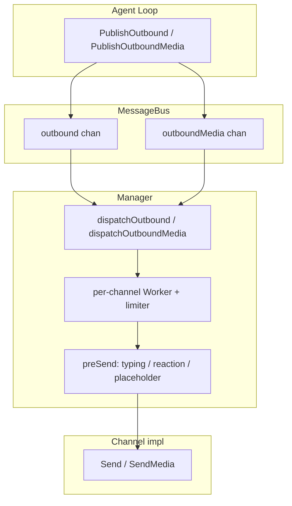

# PicoClaw Channel 抽象与接口（技术分析 + 源码对照）

> **目的**：支撑 [`todo.md`](todo.md) 第 7 项「通用 Channel 抽象」的技术调研；**不写实现代码**。  
> **参考仓库**：社区常说的 *picoclaw* 对应开源实现 **[github.com/sipeed/picoclaw](https://github.com/sipeed/picoclaw)**（Go，MIT）。与 todo 中「openclaw/picoclaw」名称可能混用；本文以 **sipeed/picoclaw 当前 main** 为准。  
> **对齐文档**：本仓库 [`inbound-routing-design.md`](inbound-routing-design.md)。  
> **接口逐项签名**：见本文 **附录**（`pkg/channels`、`pkg/bus` 源码对照）。

---

## 1. 设计目标（PicoClaw 侧在解决什么）

- **多 IM / 协议并存**：Telegram、Slack、飞书、Discord、Matrix、企业微信、LINE、OneBot 等，每个子包独立实现，**不**在 `Manager` 里写巨型 `switch` 构造各渠道（改用**工厂注册表**）。
- **核心与渠道解耦**：Agent 只面对统一的 **入站 / 出站消息类型** 与 **MessageBus**，不直接依赖各平台 SDK 细节。
- **横切能力集中**：限流、重试、长消息切分、占位消息与打字态/表情的生命周期，尽量放在 **Manager + BaseChannel**，避免每个渠道复制一套。

---

## 2. 与平台互通：内嵌 SDK 为主（非自建公网入口）

PicoClaw 的**默认形态**是：在 **one binary 进程内** 链接各平台 **Go SDK**，由 `Channel.Start` 启动 SDK 提供的**客户端连接或内置事件泵**，把平台事件转成 `InboundMessage`。**不要求**业务上先搭一层「本进程对外 `Listen` 的 HTTP/WS 服务」再收推送；那是少数渠道的可选实现（实现 `WebhookHandler` 挂到 Manager 的**可选**共享 HTTP）。

| 渠道 | PicoClaw 实际做法（便于 oneclaw 直接对标） |
|------|---------------------------------------------|
| **飞书** | 飞书开放平台 Go SDK：`larkws.NewClient` + `wsClient.Start(ctx)`，事件经 `EventDispatcher` 回调进业务逻辑（见 `pkg/channels/feishu/feishu_64.go`）；**未**走本进程 Webhook 路由 |
| **Slack** | `slack-go` 的 **`socketmode.Client`**：Socket Mode 长连接收事件（见 `pkg/channels/slack/slack.go`） |
| **钉钉** | SDK Stream / 长连接模式（README 注明非 HTTP webhook） |
| **Telegram / LINE 等** | 长轮询或 **可选** Webhook；若 Webhook 则实现 `WebhookHandler`，由 Manager 统一挂到共享 `http.Server` |

出站则统一走各 Channel 内持有的 **HTTP Client / SDK 方法**（如 `Send` 调平台 REST），与入站是否 Webhook **无关**。

---

## 3. 分层结构（概念地图）

| 层次 | 主要职责 | PicoClaw 典型位置 |
|------|----------|-------------------|
| **消息总线** | 入站 chan / 出站 chan / 出站媒体 chan；发布与订阅 | `pkg/bus/` |
| **Channel 契约** | 生命周期 + 出站发送 + 鉴权等**最小接口** | `pkg/channels/base.go`（`Channel`） |
| **共享基类** | 白名单、群组触发、统一 `HandleMessage` → 发布入站 | `BaseChannel` |
| **可选能力** | 打字、占位、编辑消息、Webhook、媒体发送等 | `interfaces.go`、`media.go`、`webhook.go` |
| **工厂注册** | `init()` 注册 `ChannelFactory`，按名字构造 | `registry.go` |
| **编排器 Manager** | 启停渠道、Worker 队列、dispatch、限流重试、`preSend`；**可选**共享 HTTP（仅 Webhook 类渠道需要） | `manager.go` |
| **身份与媒体** | 统一 `SenderInfo` / allowlist；媒体引用与 scope | `pkg/identity/`、`pkg/media/` |

---

## 4. 核心接口：`Channel` 与「能力接口」

### 4.1 必选：`Channel`

实现方必须提供：

- `Name()`、`Start` / `Stop`、`IsRunning`
- **`Send(ctx, OutboundMessage) ([]string, error)`**：出站文本；返回平台消息 ID 列表（可为空）
- **鉴权**：`IsAllowed`、`IsAllowedSender`（字符串与结构化两种入口）
- **`ReasoningChannelID()`**：可选路由「思考链」到指定会话（产品向能力）

### 4.2 可选：通过类型断言发现的能力

PicoClaw 不把一切塞进一个大接口，而是用**小接口 + Manager 运行时断言**：

| 能力 | 用途 |
|------|------|
| `MessageLengthProvider` | 声明单条消息最大长度，Manager 负责切分再 `Send` |
| `MediaSender` | 出站发图/文件/音视频 |
| `TypingCapable` / `ReactionCapable` / `PlaceholderCapable` | 入站后 UX：打字、表情、占位消息 |
| `MessageEditor` / `MessageDeleter` | 占位消息编辑为最终回复，或删除占位 |
| `StreamingCapable` | 流式更新（`Streamer` 定义在 `pkg/bus` 避免循环依赖） |
| `WebhookHandler` / `HealthChecker` | **可选**：仅 Webhook 型渠道挂到 Manager 的共享 HTTP Server |
| `CommandRegistrarCapable` | 向平台注册 Bot 命令菜单 |

**`PlaceholderRecorder`** 由 Manager 实现并注入到渠道：入站路径在 `BaseChannel.HandleMessage` 里自动调用各能力，把 `stop`/`undo`/placeholder id 登记到 Manager，出站时在 `preSend` 统一收尾。

---

## 5. 入站路径：BaseChannel.HandleMessage

各平台 **SDK 事件回调**（WebSocket 客户端、Socket Mode、长轮询等）收到消息后，经解析，最终调用 **`BaseChannel.HandleMessage`**：

1. **鉴权**：`IsAllowedSender` 或 `IsAllowed`
2. 构造 **`bus.InboundMessage`**：`Channel`、`SenderID`、`Sender`（结构化）、`ChatID`、`Content`、`Peer`、`MessageID`、`MediaScope`、`Metadata` 等（路由字段为一等公民，**不**再塞进杂项 map）
3. **可选 UX**：若注入了 `PlaceholderRecorder` 且 `owner` 实现了对应能力，则依次尝试：打字、对原消息加反应、发占位消息（与流式 finalize 协同，避免重复占位）
4. **`bus.PublishInbound`**

这与 oneclaw 的 **`Inbound` + 文本进模型** 在思想上一致：都是「渠道先变成统一形状再进核心」，但 PicoClaw 的入站结构更丰富（Peer、媒体 scope、SenderInfo 等）。

---

## 6. 出站路径：Bus → Manager → Worker → Channel.Send



要点：

- **按 `OutboundMessage.Channel` 字符串**路由到对应 Worker（与 oneclaw 按 `Inbound.Source` 选 `Sink` 是**同一类**「来源键路由」，只是 PicoClaw 出站消息里也带 `Channel` 字段）。
- **每条渠道独立队列 + `x/time/rate` 限流**，发送前 **`sendWithRetry`**：结合 **`errors.Is`** 识别 `ErrRateLimit`、`ErrTemporary`、`ErrNotRunning`、`ErrSendFailed` 等哨兵错误决定重试策略。
- **`preSend`**：停打字、撤销反应、若有占位则 **EditMessage**（或流式 finalize 后删占位），减少「每条 Record 再查表」的重复逻辑（与 oneclaw 设计文档里「每轮绑一次 Sink」的思路相近，只是 PicoClaw 把大量 UX 状态放在 Manager 的 `sync.Map` 里）。

---

## 7. 工厂注册与依赖注入

- **`RegisterFactory(name, func(cfg, bus) (Channel, error))`**，各子包 `init()` 注册；**Gateway 用空白 import** 触发注册。
- **`Manager.initChannel`**：`getFactory(name)` → 构造 → 可选注入：
  - `SetMediaStore`
  - `SetPlaceholderRecorder`（Manager 自身）
  - `SetOwner`（具体 `Channel`，供 `HandleMessage` 里对接口做类型断言）

**`initChannels`** 仍会根据 **配置布尔条件** 决定调用哪些 `initChannel("feishu", …)` 等——即：**启用列表在 Manager**，**构造方式在注册表**，二者分离。

---

## 8. 与 oneclaw [`inbound-routing-design.md`](inbound-routing-design.md) 的对照

| 维度 | oneclaw（当前设计与实现方向） | PicoClaw |
|------|-------------------------------|----------|
| 入站统一形状 | `routing.Inbound`（`Source`、`Text`、用户/租户/会话键等） | `bus.InboundMessage`（字段更多：Peer、MessageID、SenderInfo、Media…） |
| 出站统一形状 | `Record` 流 + `Sink.Emit` | `OutboundMessage` / `OutboundMediaMessage` + `Channel.Send` / `SendMedia` |
| 按来源绑定出站 | `SinkRegistry.SinkFor(in.Source)`，每轮一个 `Emitter` | 出站消息带 `Channel`，Manager dispatch 到对应实现 |
| 渠道可插拔 | `MapRegistry` 注册 `Sink`；**尚无**完整 Channel 生命周期包 | **完整**：`Start`/`Stop`、工厂、**内嵌 SDK**、按需共享 HTTP、Worker |
| 横切能力 | 设计文档提到可选 `ctx` 透传 `Inbound`、`SinkFactory` | Manager 内聚：限流、重试、切分、占位/打字、流式 hook |
| 配置 | 分散在各入口 | 集中 `config.Channels*` + Manager 内启用判断 |

**结论**：PicoClaw 的「Channel」≈ **入站适配器（SDK 内嵌为主）+ 出站发送器 + 可选 Webhook HTTP + 生命周期**，比 oneclaw 现阶段的 **`Sink` + `Inbound`** 更厚一层；oneclaw 若演进「通用 Channel」，需要明确：**哪些保留在轻量 `Sink`/`Inbound`，哪些升级为带 `Start`/`Stop` 的模块**（见下一节）。

---

## 9. 借鉴 PicoClaw 时的建议取舍（供后续实现讨论）

**值得对齐的思路**

1. **工厂注册 + 子包隔离**：新增飞书/Slack 时不改核心 `switch`，只注册构造器并空白 import。  
2. **小接口组合**：媒体、Webhook、占位等用可选接口，避免「上帝接口」。  
3. **哨兵错误 + 统一重试**：出站调用平台 API 时分类错误，由外层决定是否重试。  
4. **共享 HTTP（按需）**：仅当某渠道采用 Webhook 接收时再挂 Manager 的 mux；**主路径仍是内嵌 SDK 出站连接**，与 PicoClaw 一致。

**需慎选或简化的部分**

1. **MessageBus 双通道**：oneclaw 已有 `Record` 事件流；是否再引入独立 `chan` 总线，还是延续 `Emitter`→`Sink`，应一次架构决策，避免两套并行。  
2. **Manager 体量**：PicoClaw 的占位/打字/TTL janitor 与产品强相关；oneclaw 可按需渐进，先 **生命周期 + 注册 + 出站**，再补 UX。  
3. **身份模型**：`identity` 包与 allowlist 规则较重，可只在多租户/多用户场景引入。  
4. **与 `SinkFactory.NewSink(ctx, in)` 的关系**：设计文档已写工厂闭包 `in`；PicoClaw 更偏「渠道实例 + Manager 状态表」，合并时需统一「有状态出站」的归属（Factory vs Channel 实例字段）。

---

## 10. PicoClaw 关键文件索引（便于跳转阅读）

| 主题 | 路径 |
|------|------|
| Channel 接口与 BaseChannel | `pkg/channels/base.go` |
| 可选能力接口 | `pkg/channels/interfaces.go` |
| 工厂注册表 | `pkg/channels/registry.go` |
| Manager 编排 | `pkg/channels/manager.go` |
| Webhook / Health | `pkg/channels/webhook.go` |
| 媒体发送可选接口 | `pkg/channels/media.go` |
| 错误与分类 | `pkg/channels/errors.go`、`errutil.go` |
| 消息类型 | `pkg/bus/types.go` |
| 完整开发说明（英文） | `pkg/channels/README.md` |

---

## 附录：接口源码对照

> 下列签名与注释以 `pkg/channels`、`pkg/bus` 为准；`commands.Definition` 来自 `pkg/commands`。

### A.1 必选核心接口：`Channel`

**文件**：`pkg/channels/base.go`

```go
type Channel interface {
	Name() string
	Start(ctx context.Context) error
	Stop(ctx context.Context) error
	Send(ctx context.Context, msg bus.OutboundMessage) ([]string, error)
	IsRunning() bool
	IsAllowed(senderID string) bool
	IsAllowedSender(sender bus.SenderInfo) bool
	ReasoningChannelID() string
}
```

- `Send` 返回值为平台侧消息 ID 列表（可为空）；错误应配合 `pkg/channels` 的哨兵错误（`ErrNotRunning`、`ErrRateLimit` 等）供 `Manager` 重试策略使用。

### A.2 可选：消息长度（出站切分）

**文件**：`pkg/channels/base.go`

```go
type MessageLengthProvider interface {
	MaxMessageLength() int
}
```

- `MaxMessageLength() == 0` 表示不限制，由 `Manager` 按 rune 切分后再多次调用 `Send`。

### A.3 可选：打字 / 编辑 / 删除 / 表情 / 占位 / 流式 / 命令菜单

**文件**：`pkg/channels/interfaces.go`

```go
// 打字指示器；stop 必须幂等、可多次调用
type TypingCapable interface {
	StartTyping(ctx context.Context, chatID string) (stop func(), err error)
}

type MessageEditor interface {
	EditMessage(ctx context.Context, chatID string, messageID string, content string) error
}

type MessageDeleter interface {
	DeleteMessage(ctx context.Context, chatID string, messageID string) error
}

// 对入站消息加反应；undo 必须幂等
type ReactionCapable interface {
	ReactToMessage(ctx context.Context, chatID, messageID string) (undo func(), err error)
}

// 占位消息；通常需同时实现 MessageEditor 才能在出站时把占位改成正文
type PlaceholderCapable interface {
	SendPlaceholder(ctx context.Context, chatID string) (messageID string, err error)
}

// 流式展示；返回的 Streamer 定义在 pkg/bus
type StreamingCapable interface {
	BeginStream(ctx context.Context, chatID string) (Streamer, error)
}

// 与 bus.Streamer 等价，避免循环依赖
type Streamer = bus.Streamer

// 由 Manager 实现，注入到 Channel，入站时登记状态
type PlaceholderRecorder interface {
	RecordPlaceholder(channel, chatID, placeholderID string)
	RecordTypingStop(channel, chatID string, stop func())
	RecordReactionUndo(channel, chatID string, undo func())
}

type CommandRegistrarCapable interface {
	RegisterCommands(ctx context.Context, defs []commands.Definition) error
}
```

### A.4 可选：出站媒体

**文件**：`pkg/channels/media.go`

```go
type MediaSender interface {
	SendMedia(ctx context.Context, msg bus.OutboundMediaMessage) ([]string, error)
}
```

### A.5 可选：Webhook 与健康检查（共享 HTTP）

**文件**：`pkg/channels/webhook.go`

```go
type WebhookHandler interface {
	WebhookPath() string
	http.Handler // ServeHTTP(w http.ResponseWriter, r *http.Request)
}

type HealthChecker interface {
	HealthPath() string
	HealthHandler(w http.ResponseWriter, r *http.Request)
}
```

### A.6 可选：语音能力声明

**文件**：`pkg/channels/voice_capabilities.go`

```go
type VoiceCapabilities struct {
	ASR bool
	TTS bool
}

type VoiceCapabilityProvider interface {
	VoiceCapabilities() VoiceCapabilities
}
```

### A.7 `pkg/bus`：流式与委托（与 Channel 协同）

**文件**：`pkg/bus/bus.go`

```go
type StreamDelegate interface {
	GetStreamer(ctx context.Context, channel, chatID string) (Streamer, bool)
}

type Streamer interface {
	Update(ctx context.Context, content string) error
	Finalize(ctx context.Context, content string) error
	Cancel(ctx context.Context)
}
```

- `MessageBus.SetStreamDelegate` 通常注册 **`channels.Manager`**，Agent 通过 `GetStreamer` 拿到流式写入端。

### A.8 工厂类型（非 interface，属注册机制）

**文件**：`pkg/channels/registry.go`

```go
type ChannelFactory func(cfg *config.Config, bus *bus.MessageBus) (Channel, error)
```

- `RegisterFactory(name string, f ChannelFactory)` 在子包 `init()` 中调用。

### A.9 `Manager` 初始化时的「隐式接口」（duck typing）

**文件**：`pkg/channels/manager.go`（`initChannel` 内类型断言）

以下**未**在单独 `.go` 文件中声明为具名 `interface{}`，但 Channel 可实现这些方法以接收注入：

| 方法 | 作用 |
|------|------|
| `SetMediaStore(s media.MediaStore)` | 注入媒体存储 |
| `SetPlaceholderRecorder(r PlaceholderRecorder)` | 注入占位/打字登记（一般为 `*Manager`） |
| `SetOwner(ch Channel)` | 注入具体 Channel，供 `BaseChannel.HandleMessage` 对 `TypingCapable` 等做断言 |

### A.10 与 `BaseChannel` 的关系（非接口）

**文件**：`pkg/channels/base.go`

- `BaseChannel` 是**结构体**（嵌入具体字段 + `HandleMessage` 等），具体 Channel 通过 **嵌入 `*BaseChannel`** 并实现 `Channel` 剩余方法（主要是 `Start` / `Stop` / `Send`）。
- `BaseChannel` 已实现 `Name`、`IsRunning`、`MaxMessageLength`（若配置）、`ReasoningChannelID`、`IsAllowed`、`IsAllowedSender` 及入站 `HandleMessage` 逻辑。

---

## 修订记录

| 日期 | 说明 |
|------|------|
| 2026-04-05 | 初稿：基于 sipeed/picoclaw 浅克隆分析，对齐 oneclaw 入站/出站设计文档。 |
| 2026-04-05 | 补充 §2：与平台互通以**进程内嵌 SDK**为主；共享 HTTP 仅为 Webhook 类可选。 |
| 2026-04-05 | 合并 `picoclaw-channel-interfaces.md`：正文保留概念分析，附录收录接口源码对照。 |
