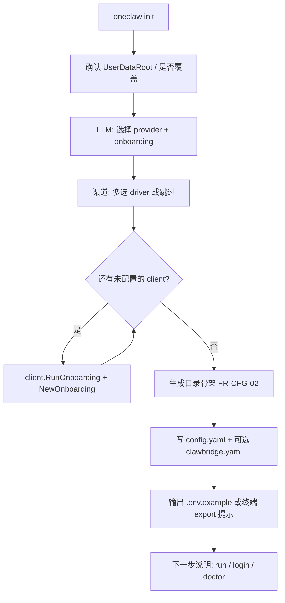

# 设计：`config.init` 交互引导（渠道 + LLM）

## 1. 目标

- **`oneclaw init`（或 `config init`）** 在绿场安装时给出 **分步引导**，生成可合并进用户数据根的 YAML（及可选 `.env.example`），而不是静默写死模板。
- **渠道（clawbridge）**：用户可选择 **飞书 / 微信 / Telegram / Slack / WebChat / noop** 等 driver，通过 **统一 Onboarding 入口** 填写各 driver 所需的 `options`（令牌、监听地址、allowlist 等），产出 **`clawbridge.config` 片段**（与 `github.com/lengzhao/clawbridge/config.Config` 对齐）。
- **LLM**：按 **提供商维度** 提供同等体验的 onboarding（API Key / Base URL / 默认模型名等），产出 **oneclaw 模型配置片段**，并与现有 **eino-ext OpenAI 兼容** 路径一致。

非目标：在 init 内启动完整的「常驻 bridge 进程」（init 只负责 **写出配置**；用户随后 `oneclaw run`）。**扫码 / OAuth** 可由 clawbridge `RunOnboarding` 在交互流程内完成（终端 QR / 浏览器页依赖 `OnboardingHooks`）。

---

## 2. 配置落盘形状（建议）

### 2.1 oneclaw 顶层仍锚 `UserDataRoot`

与 [docs/appendix-data-layout.md](../appendix-data-layout.md) 一致：`config.yaml` 在用户数据根（或 `-config` 指定）。其中增加两块 **可由 init 写入** 的字段：

```yaml
# 示例：形状仅供设计讨论，字段名以实现为准
model:
  provider: openai_compatible   # 枚举见 §4
  base_url: https://api.openai.com/v1
  api_key_env: OPENAI_API_KEY   # 真密钥只进 env（FR-CFG-01）
  default_model: gpt-4o-mini

clawbridge:
  # 方案 A：内联（小部署）
  media: {}
  clients:
    - id: main-feishu
      driver: feishu
      enabled: true
      options: { ... }

  # 方案 B：引用独立文件（多客户端、敏感分离）
  # config_file: .agent/clawbridge.yaml
```

- **方案 B**：`config_file` 相对 `UserDataRoot` 解析，内容为 **完整的** `clawbridge/config.Config` YAML，便于与官方 `examples/host` 一致、手工 merge。
- init 默认可选用 **A**；进阶用户选 **B**。

### 2.2 与 clawbridge 的类型对齐

直接使用（或嵌入）clawbridge 已暴露的结构体序列化结果，避免重复造轮子：

- `config.Config`：`Media`、`Clients[]`
- `config.ClientConfig`：`id`、`driver`、`enabled`、`options map[string]any`

driver 名与注册一致：`feishu`、`weixin`、`telegram`、`slack`、`webchat`、`noop`（见 `clawbridge/drivers`）。

---

## 3. clawbridge `v0.3.2` Onboarding API（实现依据）

**依赖版本**：`github.com/lengzhao/clawbridge v0.3.2`（`go.mod` 已对齐）。

**前提**：必须空白导入 `_ "github.com/lengzhao/clawbridge/drivers"`，各 driver 在 `init` 中调用 `client.RegisterOnboarding`，与 `RegisterDriver` 配套。

### 3.1 入口类型与执行函数

- **`client.NewOnboarding(driver, clientID string) Onboarding`**：构造规格；默认 `AllowFrom: ["*"]`。
- **链式选项**：`WithParams(map)`（传入 driver factory 的 YAML 风格参数）、`WithAllowFrom`、`WithStateDir`、`WithProxy`、`WithHooks(*OnboardingHooks)`、`Silent()`（无终端 QR/横幅）。
- **`client.RunOnboarding(ctx, o Onboarding) (OnboardingResult, error)`**：跑完 **Start → Wait**，合并出 **`config.Config`**（通常含 **单元素** `Clients`）。**不负责写盘**。
- **`OnboardingResult`**：
  - **`Phase`**：`OnboardingPhaseReady`（凭据已就绪）或 `OnboardingPhaseManual`（仅说明类 driver，返回 **disabled stub** client）。
  - **`Config`**：可直接与已有 clients **拼接** 后交给 `clawbridge.New`。
  - **`Ready()`**：`Phase==ready` 且首个 client `Enabled`。
  - **`Descriptor`、`SessionPayload`、`CredentialOpts`**：供 UI 摘要或调试（可用 **`client.ReportOnboarding`** 格式化输出）。

### 3.2 发现与元数据（init 菜单）

- **`client.ListOnboardingDrivers() []string`**：已注册 onboarding 的 driver 名（排序）。
- **`client.DescribeOnboardingDriver(driver) (OnboardingDescriptor, error)`**：`Kind`（`manual_paste` / `qr_poll` / …）、`DisplayName`、`Fields`、`ParamsHelp`、`HelpURL`，用于 **init 里展示「选飞书/微信」前的说明**。

### 3.3 UI 钩子

- **`client.DefaultTerminalOnboardingHooks()`**：stdout 提示 + 终端 QR（微信等）。
- **`client.SilentOnboardingHooks()`**：无输出（测试或嵌入自家 TUI 时用 **自定义 `OnboardingHooks`**，把 `Notify`/`ShowQR` 接到 oneclaw 的 `ConsoleUI`）。

### 3.4 oneclaw 集成方式

1. init 中用户 **多选 driver**（或逐个添加）：对每个 choice 生成唯一 **`clientID`**（如 `main-feishu`）。
2. 调用 **`RunOnboarding(ctx, client.NewOnboarding(driver, clientID).WithHooks(hooks))`**；可将 **oneclaw 终端 UI** 适配进 `OnboardingHooks`。
3. 将每次返回的 **`result.Config.Clients`** **append** 到同一个 `clawbridge.Config`；**`Media`** 按需合并（首次 onboarding 或单独一问）。
4. **YAML 落盘**：marshal 合并后的 `config.Config` → 写入 `config.yaml` 的 `clawbridge` 段或 **独立 `clawbridge.yaml`**（见 §2）。
5. **`OnboardingPhaseManual`**：提示用户补全 `options` 后将 `enabled: true`，或再次运行 init。

**无需**再维护自有的 `ChannelOnboarder` 手写问答 **除非** 某 driver 未注册 onboarding（`NewOnboardingFlow` 报错时再降级文档引导）。

---

## 4. LLM onboarding（提供商）

### 4.1 注册表

| provider id           | 典型用途           | 写入字段（概念） |
|-----------------------|--------------------|------------------|
| `openai_compatible`   | OpenAI / 多数兼容网关 | `base_url`、`api_key_env`、`default_model` |
| `volcengine_ark`      | 火山方舟           | `ark_api_key_env`、`endpoint_id` / 模型字段（与 eino-ext Ark 对齐） |
| `deepseek`            | DeepSeek OpenAI 兼容 | `base_url` 固定或可选、`api_key_env`、`default_model` |
| `azure_openai`        | Azure              | `endpoint`、`deployment`、`api_key_env`（若走单独 ChatModel 构造） |
| `skip_llm`            | 仅渠道 / dry-run   | 不写密钥，模型块注释说明 |

init 流程：**选择 provider → 问答必填项 → 生成 `model:` 块 + 打印 `export ...`**。

### 4.2 与 Eino 装配的边界

- onboarding **只负责配置真源**（YAML + env 名）；**`adkhost` 包**根据 `model.provider` 选择 `eino-ext` 的具体 `ChatModel` 构造函数（见 [docs/eino-integration-surface.md](../eino-integration-surface.md)）。
- 若某提供商尚无 eino-ext 实现：init 仍可写入 **OpenAI 兼容** 三元组，由统一 `openai` ChatModel + `base_url` 覆盖。

### 4.3 LLM 侧「同构 Onboarding」接口（可选）

与渠道对称，便于测试与插件化：

```go
type ModelOnboarder interface {
    ProviderID() string
    Run(ctx context.Context, ui ConsoleUI) (ModelConfigSlice, error)
}
```

`ModelConfigSlice` 为写入 `config.yaml` 的 `model` 树（结构体由 `config` 包定义）。

---

## 5. 用户流程（init）



- **顺序**：先 **LLM** 再 **渠道** 较自然（用户常先确认「能说话」）；也可支持 `--channels-first` flag。
- **跳过**：`--no-llm` / `--no-clawbridge` 仅生成骨架。
- **非交互**：`--defaults` 或从现有 YAML merge（CI / 容器）。

---

## 6. UI 与测试

- **ConsoleUI** 接口：`Printf`、`Confirm`、`Select(options []string)`、`ReadSecret(prompt)`（密钥不回显）。
- 单元测试：注入 fake `ConsoleUI`，断言生成的 YAML 与 `config.Config` / `model` 结构 round-trip。

---

## 7. 任务拆分（实现时）

| 序号 | 项 |
|------|----|
| 1 | 在 `config` 包定义 `RootConfig`（含 `model`、`clawbridge` 内联或 `config_file`） |
| 2 | 实现 `ConsoleUI` + init 状态机（`cmd/oneclaw init`） |
| 3 | 实现各 `ModelOnboarder`（至少 openai_compatible） |
| 4 | 渠道：`ListOnboardingDrivers` / `DescribeOnboardingDriver` 菜单；对每个 client 调用 **`client.RunOnboarding(ctx, client.NewOnboarding(...))`**，合并 `Clients`；未注册 onboarding 的 driver 再走文档式兜底 |
| 5 | 文档：`docs/config.md` 片段说明 env 与 YAML 关系 |

---

## 8. 待决问题

1. **`OnboardingHooks` 与 oneclaw `ConsoleUI` 的映射**：默认仍用 `DefaultTerminalOnboardingHooks`；长期是否统一为 **自定义 hooks** 仅走我们的 UI。
2. 是否提供 **`oneclaw channel onboard <driver>`** 子命令（封装单次 `RunOnboarding`），以便 **init 之外** 增补客户端而不重写配置。
3. `model` 是否拆 **多模型 profile**（主模型 vs 演进 Agent）—— 一期可单一默认 + TODO。

---

## 9. 追溯

- PRD：[requirements.md](../requirements.md) FR-CFG-01/02/03/04  
- clawbridge 示例：`examples/host` + `config.Config`  
- 仓库计划：[todo.md](../../todo.md) 阶段 1–5  
