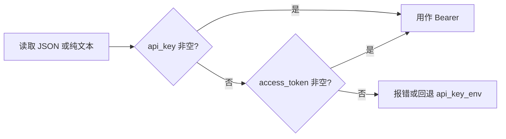

# 设计：统一多厂商模型鉴权（API Key / key_files）

## 1. 文档地位

- **本文**：约定「凭证如何落盘、`config` 如何引用」的**规格**，与 **`key_files/`**、**`ApplyUserDataSecrets`** 对齐；运行时 **`adkhost`** 仍只消费解析后的 **Bearer / API Key**。
- **实现**：**不提供 OAuth / refresh**：仅 **`api_key_env`**、明文 **`api_key`**（不推荐）、以及 **`models[].auth.token_file`** 指向的 **`key_files/*.json`**（见 §4）。
- **关联**：向导路径见 [weixin-alibaba-oauth-minimal-onboarding.md](./weixin-alibaba-oauth-minimal-onboarding.md)；通用 init 见 [2026-05-02-config-init-onboarding-design.md](./2026-05-02-config-init-onboarding-design.md)。

---

## 2. 目标与非目标

### 2.1 目标

1. **同一运行时路径**：构造 ChatModel 前 **`ApplyUserDataSecrets`** 把 **`ModelProfile.APIKey`** 填好；差异仅在 env vs 文件解析。
2. **统一落盘位置**：**`UserDataRoot/key_files/`**（目录 **0700**，文件 **0600**），由 **`models[].auth.token_file`**（相对 UserDataRoot）引用。
3. **统一 JSON 语义**：**`CredentialBundle`** 超集（§4）；**`Bearer()`**：**`api_key` > `access_token`**（兼容旧文件里遗留字段，**不做刷新**）。

### 2.2 非目标（本期）

- **RAM OAuth / Device Code / PKCE / refresh_token 自动刷新**：已移除；请使用各厂商**控制台 API Key**。
- 替代 LiteLLM、系统钥匙串：不占位实现。

---

## 3. 与当前实现对齐

| 组件 | 角色 |
|------|------|
| **`config.ModelAuth`** | 仅 **`token_file`**（相对 UserDataRoot） |
| **`keyfiles.CredentialBundle`** | §4 JSON 超集；**`ReadBearerSecret`** / **`MergeWriteAPIKey`** |
| **`ApplyAuthTokenFiles`** | **`keyfiles.ReadBearerSecret`** → **`ModelProfile.APIKey`** |
| **`ApplyUserDataSecrets`** | **`ApplyEnvSecrets`** 然后 **`ApplyAuthTokenFiles`** |

---

## 4. 凭证文件规范（`key_files/*.json`）

### 4.1 通用字段（超集）

| 字段 | 说明 |
|------|------|
| **`schema_version`** | 可选 |
| **`provider`** | 可选；冗余自查 |
| **`api_key`** | **推荐**：控制台静态密钥 |
| **`access_token`** | 可选；仅当无 **`api_key`** 时参与 Bearer（兼容旧落盘） |
| **`refresh_token` / `expires_at` / …** | 可存在于 JSON 中；**运行时忽略**，不触发刷新 |

### 4.2 Bearer 解析（运行时）



---

## 5. `config.yaml` 形状（`models[].auth`）

```yaml
models:
  - id: dashscope
    provider: qwen
    base_url: https://dashscope.aliyuncs.com/compatible-mode/v1
    auth:
      token_file: key_files/dashscope.json
```

**校验**：**`token_file`** 须相对 UserDataRoot、禁止 **`..`**（与现有 **Validate** 一致）。

**`models[].auth`** 在 YAML 中**仅允许** **`token_file`**；若出现 **`provider` / `grant` / `kind`** 或其它键，**加载配置会直接报错**。

---

## 6. 安全

| 项 | 说明 |
|----|------|
| 目录权限 | **`key_files`** **0700**，凭证文件 **0600** |
| 日志 | **禁止**在 info 日志打印 token |
| **`oneclaw config show`** | 只对 YAML 脱敏；不打印 **`key_files`** 全文 |

---

## 7. 模块边界（包结构）

```
keyfiles/          # UserDataRoot/key_files 约定 + CredentialBundle + ReadBearerSecret
config/secrets.go # ApplyEnvSecrets / ApplyAuthTokenFiles / ApplyUserDataSecrets
```

---

## 8. 验收

- [x] **`ModelAuth.token_file`** + **`CredentialBundle`** + **`ApplyAuthTokenFiles`** 与实现对齐  
- [x] 与 [user-guide.md](../user-guide.md) 一致：**仅 API Key**（文件或 env）

---

## 9. 追溯

- PRD：[requirements.md](../requirements.md) FR-CFG-01、FR-EINO-*  
- 数据布局：[appendix-data-layout.md](../appendix-data-layout.md)

---

## 10. 国内 LLM 备忘（鉴权形态）

| 平台 | 常见凭证 | oneclaw |
|------|-----------|---------|
| **阿里云 DashScope** | 控制台 **API Key** | **`key_files/*.json`** 写 **`api_key`** + **`auth.token_file`** |
| **其它 OpenAI 兼容** | **API Key** | 同上或 **`api_key_env`** |

若将来重新引入「需刷新的 access_token」，应在独立设计中新增 **`auth/<provider>`** 刷新层，并与本文 **§2.2** 显式对齐。
