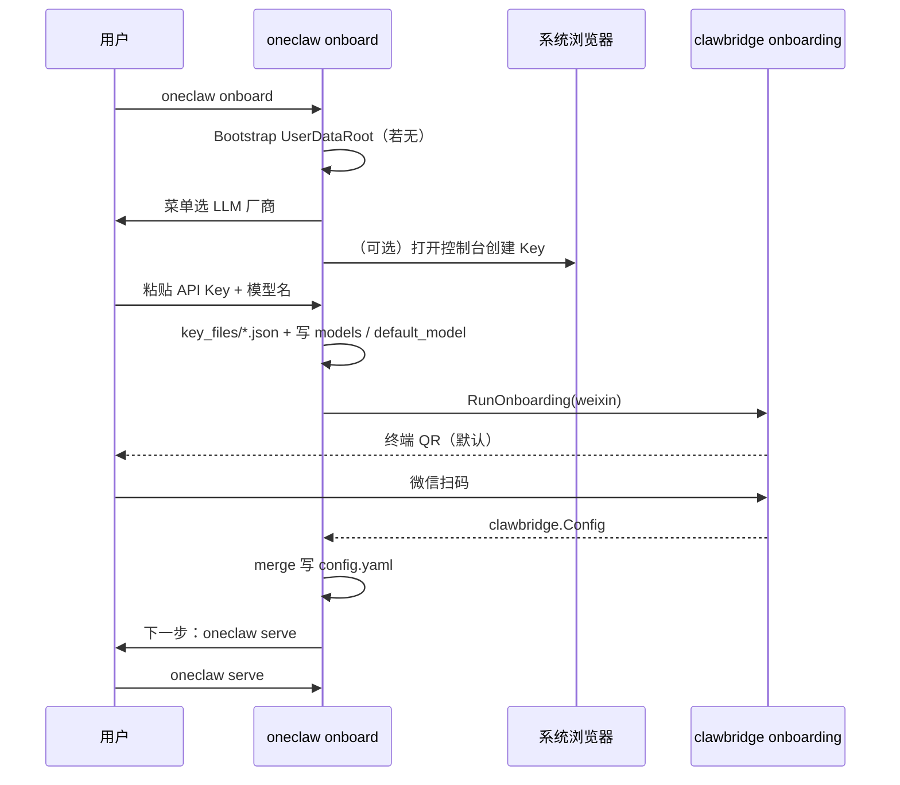

# 方案：微信扫码 + 阿里云 OAuth 极简初始化（对标 OpenClaw onboarding）

## 1. OpenClaw 初始化流程（摘要）

官方推荐入口为 **`openclaw onboard`**（交互向导），可选 **QuickStart（默认）** 与 **Advanced（全步骤）**。

典型 **Local 模式** 顺序（摘自 [OpenClaw Onboarding (CLI)](https://docs.openclaw.ai/start/wizard)）：

| 步骤 | 内容 |
|------|------|
| 1 | **Model/Auth**：选择提供商；支持 API Key、OAuth、厂商特有登录等；选定默认模型 |
| 2 | **Workspace**：工作区路径与引导文件种子 |
| 3 | **Gateway**：端口、绑定、鉴权、Tailscale 等 |
| 4 | **Channels**：Discord / Telegram / WhatsApp / 飞书等 IM 通道 |
| 5 | **Daemon**：后台服务（LaunchAgent / systemd / Windows 计划任务） |
| 6 | **Health check**：拉起 Gateway 并校验 |
| 7 | **Skills**：推荐技能与依赖 |

**快捷路径**：不传通道时可 **`openclaw dashboard`** 在浏览器内先聊（无需 IM）。

**与本文目标的差异**：OpenClaw 默认覆盖面广（Gateway + 多通道 + Daemon + Skills）；你希望 **极度收窄**——仅 **微信（扫码）** + **阿里云 LLM（浏览器 OAuth）**，省略 Workspace/Gateway/Daemon 等显性步骤（在 oneclaw 侧由「数据根 + `serve`」等价承载）。

---

## 2. 目标用户体验（用户故事）

1. 用户安装 oneclaw 后执行 **单一命令**（建议：`oneclaw onboard`，或与现有 `oneclaw init` 融合的 **`oneclaw init --guided`**）。
2. **渠道**：默认 **`driver: weixin`**；向导 **直接在终端展示 QR**（`DefaultTerminalOnboardingHooks`），用户 **扫码即完成** clawbridge 客户端写入 `config.yaml`（与现有 `oneclaw channel onboard weixin` 能力对齐）。**不默认**起浏览器监听页；若某环境终端无法展示 QR，再在 Advanced / flag 中提供 `http_listen` 等兜底。
3. **模型**：菜单自选 **OpenAI 兼容厂商**（含 DashScope）；必要时打开**控制台**页面，用户粘贴 **API Key**，CLI 写入 **`key_files/*.json`**，并合并 **`models`**（仅 **`auth.token_file`**）与根 **`default_model`**。**产品路径不包含 OAuth / refresh**（见 [unified-model-auth](./unified-model-auth.md)）。
4. **无需再选手工填 Key、workflow、多通道**；用户直接 **`oneclaw serve`**（或文档约定的常驻命令），即可 **在微信里对话并使用工具**。

非目标（一期）：飞书/Telegram 并列向导、多模型 profile 精细化、RAG/MCP 引导。

---

## 3. oneclaw 现状与差距

| 维度 | 现状 | 差距 |
|------|------|------|
| 初始化 | `oneclaw init` 仅 `setup.Bootstrap`：拷模板、`config.yaml` 合并缺键 | 无「两条 onboarding」串联；用户仍需自理密钥与 `channel onboard` |
| 微信 | `oneclaw channel onboard weixin` 已调用 **`clawbridge/client.RunOnboarding`**，合并 `clawbridge` | 未作为 **默认唯一路径** 嵌入 init/onboard |
| 模型配置 | `config.File.Models[]`：`models[].provider`（eino 驱动）+ `api_key_env` / `api_key` / `auth.token_file` | **仅 API Key**；**`models[].auth`** 只允许 **`token_file`**（见 unified-model-auth） |
| 常驻 | `oneclaw serve` + clawbridge | 文档需写明：**serve 即「网关」**，对标 OpenClaw 的 Gateway+Daemon 组合心智 |

已有设计重叠：[2026-05-02-config-init-onboarding-design.md](./2026-05-02-config-init-onboarding-design.md)（通用 init + LLM provider 注册表 + clawbridge onboarding）。**本文收窄默认**：仅 weixin + **多厂商 API Key onboard**（DashScope 为菜单首选项）。

---

## 4. 配置契约（建议形状）

> 下列 YAML 为 **方案级** 约定；字段名以实现时 `config` 包与 PRD 对齐为准。

### 4.1 `clawbridge`（微信默认）

与 clawbridge `config.Config` 一致；onboarding 成功后 **`clients`** 至少一条：

```yaml
clawbridge:
  media: {}
  clients:
    - id: weixin-1           # 可由 onboard 默认 weixin-1
      driver: weixin
      enabled: true
      options:                 # 由 RunOnboarding 产出，勿手写臆测
        # ...
```

### 4.2 `models`（OpenAI 兼容 + `key_files`）

在 **`openai_compatible` 兼容路径** 前提下（DashScope 兼容模式 URL 以阿里云文档为准），扩展 **鉴权来源**。

**约定（方案 A，统一落盘目录）**：各类模型的密钥 / OAuth token **一律**写在 **`UserDataRoot/key_files/`** 下（`bootstrap` 时创建目录，权限收紧见 §7），YAML 只引用 **相对 UserDataRoot 的路径**，便于后续接入其他厂商而同构处理。

**向导默认产出示例（选 DashScope / Qwen）**：

```yaml
default_model: dashscope/qwen-plus

models:
  - id: dashscope
    priority: 0
    provider: qwen
    base_url: https://dashscope.aliyuncs.com/compatible-mode/v1
    auth:
      token_file: key_files/dashscope.json
```

`oneclaw onboard` 将 **`api_key`** 写入所选路径（如 **`key_files/dashscope.json`**）。`config.ApplyUserDataSecrets` 通过 **`keyfiles.ReadBearerSecret`** 读取 **`api_key`（优先）或 `access_token`** 填入 **`ModelProfile.APIKey`**，**不做令牌刷新**。

**已实现**：交互菜单（DashScope / OpenAI / Moonshot / DeepSeek / 自定义）+ 控制台链接 + **API Key 粘贴**。**向导已移除 `--oauth`**。

---

## 5. 交互流程（极简向导）

建议新增 **`oneclaw onboard`**（或扩展 `init`），默认 **非 Advanced**：不出现菜单堆砌。



**顺序说明**：先 **LLM API Key** 再 **微信扫码**（先保证「能推理」再接通 IM）；若运维上必须先扫码，可使用 **`--channels-first`**。

---

## 6. 实现拆分

| 序号 | 项 | 说明 |
|------|----|------|
| 1 | **命令入口** | `onboard` 子命令：`--advanced` 暴露多 driver / API Key 路径 |
| 2 | **（已收窄）鉴权** | 产品路径仅为 **API Key** → **`key_files/*.json`**；若将来需要 OAuth，另起设计与 **`auth/<provider>`** 刷新层 |
| 3 | **adkhost / ChatModel** | 读取 token：Bearer 注入兼容 OpenAI 客户端；与 `eino-ext` 构造函数对齐（见 [eino-integration-surface.md](../eino-integration-surface.md)） |
| 4 | **微信** | 复用 `cmdChannelOnboard` 逻辑；默认 `driver=weixin`、`client-id=weixin-1`，**终端 QR**；仅进阶场景传 `-listen` 走浏览器扫码页 |
| 5 | **模板默认值** | `setup/templates/config.yaml` 可把 webchat 默认改为「向导完成后才被写入」；避免与纯微信路径混淆 |
| 6 | **文档与验收** | 用户指南一段：从安装到微信首条消息；烟测：**mock 模型跳过 OAuth** + **真实 OAuth 夜间流水线可选** |

---

## 7. 风险与待决

1. **阿里云「OAuth」具体形态**：控制台 API Key vs 真实 OAuth；决定文案与合规存储（token 加密 at-rest 是否要做）。
2. **微信 onboarding 网络**：需本机可达监听；NAT/服务器部署时要文档说明 **反向代理或 Tailscale**（若 clawbridge 支持）。
3. **`serve` 与进程常驻**：对标 OpenClaw Daemon；可提供 **可选** `oneclaw onboard --install-daemon`（二期）。
4. **安全**：**`key_files/`** 目录及内含 OAuth/API 引用文件权限（建议目录与敏感文件 **0700**）；微信会话文件同理；**tools.exec** 默认策略需在「微信直连用户」场景重申。

---

## 8. 追溯

- 通用 init 设计：[2026-05-02-config-init-onboarding-design.md](./2026-05-02-config-init-onboarding-design.md)
- 多厂商统一鉴权规格：[unified-model-auth.md](./unified-model-auth.md)
- clawbridge onboarding：`cmd/oneclaw/channel.go`，依赖 `github.com/lengzhao/clawbridge/client`
- PRD：[requirements.md](../requirements.md) FR-CFG-*  
- 仓库待办：[todo.md](../../todo.md)（P0 最短路径、P1 `config show` 可与 onboard 互补）
