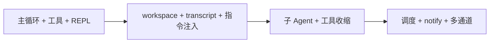

# 架构与需求参考

本文汇总 **Claw 类产品** 的边界、架构块与场景化 PRD 条目，供设计与实现对照使用。

**套件内位置**：术语见 [glossary.md](glossary.md)；**主流程与生命周期图**见 [architecture.md](architecture.md)；**`workflows/*.yaml`（DAG）规格**见 [workflows-spec.md](workflows-spec.md)；数据目录摘要见 [appendix-data-layout.md](appendix-data-layout.md)；若选型 Go + Eino + MD 驱动编排，见 [eino-md-chain-architecture.md](eino-md-chain-architecture.md)；逐条功能/验收见 [requirements.md](requirements.md)。

**Claw** 类产品面向：**让用户用自然语言（及附件、定时入站等）提出目标，由系统在受控权限内调用工具与模型，自动推进任务并给出可交付结果**——涵盖本地/常驻服务、IM、Webhook 等入口。

---

## 1. 产品定位与设计取向

**一句话**：用文件与工作区做「真源」，用 **预算 + 工具读盘** 补事实，建成 **可长期演进的 Agent 运行时**；不把全量对话塞进上下文，也不以向量库替代磁盘上的说明与记忆文件。

与上一段的衔接：**自动化完成用户需求**依赖可靠的会话编排、工具执行、记忆与出站通道；下面各节是把这套能力拆成可实现的架构约束。

**明确不做的事**（可作为新项目的反面清单）：

- 不训练/微调模型权重
- 不把无界历史无差别塞回上下文
- 不以向量检索替代「文件即真源」
- 不把自动 LLM 维护流水线当成默认心智模型（演进尽量 **显式**：用户/模型通过读写文件）

**三层心智模型**：

| 层 | 职责 |
|----|------|
| **Agent Runtime** | 会话编排、模型调用、主循环、工具执行 |
| **Memory Plane** | 多作用域记忆、说明文件注入、发现/recall、写回 |
| **Evolution Loop** | 执行任务 → 留下痕迹 → 提取规则 → 回写 memory/rules → 下轮再注入 |

**与目标 PRD 的表述关系**：下列「演进尽量显式」强调 **可审计、可关闭、文件真源仍可由用户直接编辑**；不排斥框架提供 **默认可开的抽取/Skills 流水线**（见 [requirements.md](requirements.md) §2.1 第 6 点）。二者需在配置层统一：**关闭演进时行为退化为「仅人工与工具写文件」**。

---

## 2. 架构上值得复用的设计

### 2.1 配置与数据根

- **单一配置源**：合并后的 YAML（可选用多层：用户主目录下默认文件 + 额外 `-config` 叠加）。**与 [requirements.md](requirements.md) FR-CFG-01 对齐时**：敏感项允许 **仅通过环境变量注入**，YAML 仍为合并后的业务真源；本文其余段落若写「密钥在 YAML」应理解为「亦可改为 env 注入」。
- **固定用户数据根** `UserDataRoot`：转写、会话目录、定时任务 JSON、日志相对路径等都锚在这里。
- **运行时扁平化**：合并配置后 `PushRuntime()` 推到进程内快照，让 `budget`、`loop` 等与 `config` 低耦合，避免循环依赖。

### 2.2 会话编排：TurnHub + 每轮新 Engine

- **TurnHub**：按 `SessionHandle`（渠道 + 会话键）维护 mailbox，**同会话入站串行**或有策略（serial / insert / preempt）。
- **每条入站任务新建 Engine，回合结束丢弃**：避免多 goroutine 共用一个 Engine、无界状态增长；持久状态依赖 **transcript / dialog_history** 等落盘。

### 2.3 入站 / 出站抽象

- **入站**：统一成 `InboundMessage`（正文、发送方、会话 id、附件路径、元数据）。
- **出站**：Engine → `publishOutbound` → Bus → 各渠道；与 **工具注册表** 正交。
- **ToolContext**：每轮把入站元数据合并进 `TurnInbound`（正文不参与合并；附件继承规则要明确），供工具和策略使用。
- **Go 接入**：常驻多通道（IM 等）优先使用 **`github.com/lengzhao/clawbridge`** 承载 Bus 与各 driver，运行时仅依赖上述消息形状；纯 CLI / 单次 HTTP 可无 clawbridge。

### 2.4 执行内核与工具

- **模型循环**：以 **ChatModel / Provider 抽象** 承载「消息列表 + 可选工具 + 流式/取消」语义，**对接具体后端**（HTTP、gRPC、进程内等）；**OpenAI Chat Completions 兼容** 常见且可作默认实现，但不应写死在架构边界里。工程上 **固定一条生产主路径**（如 Eino ADK），并保留 **精简循环或 Mock** 供测试、契约校验或与编排内核解耦。
- **工具注册表**：内置工具 + 可选 **MCP** 动态注册；子 agent 对工具集做 **过滤 / 收缩**（元工具剥离、名单交集）。

### 2.5 记忆与上下文

- **文件型注入**：`AGENT.md`、`MEMORY.md`、rules、skills 索引等按轮装配进 system/后缀块。
- **预算**：总 prompt 字节、历史字节、各块上限、`min_transcript_messages` 等 —— **宁可裁历史也不无声爆上下文**。
- **可见消息折叠**：对用户可见 transcript / working transcript 与内部 messages 分离，成功回合后落盘。

### 2.6 定时与合成入站

- 定时任务 **持久化 JSON**，poller 到期后构造 **合成 InboundMessage**，走与普通用户消息相同的路径（只能串行，避免干扰用户的任务）。

### 2.7 可观测性分层

- **用户可见流**：出站文本/状态更新（产品侧）。
- **运维/集成**：轻量 `notify` + 可选 **按轮 execution JSONL**。

### 2.8 多 Agent 与 `agents/` 目录

- **目录即目录**：每个 Agent 对应 **`agents/<name>.md`**（或约定统一扩展名），由宿主扫描加载成 **Catalog**（内置默认 + 用户文件覆盖同名）。
- **单文件格式**：可选 **YAML frontmatter** + **正文作为该 Agent 的 system/instruction**；frontmatter 携带 **`agent_type`/`name`、`description`、允许 **`tools` 列表、`max_turns`、可选 `model`** 等，避免在 Go 里按 Agent 分支。
- **调用方式**：主线程通过 **`run_agent`**（或路由层按渠道绑定默认 Agent）选中类型；子循环使用过滤后的工具集。
- **子 Agent 默认（已定）**：**会话隔离 + 上下文隔离** —— 独立子 transcript/命名空间（见 [appendix-data-layout.md](appendix-data-layout.md) §3.1）、独立 messages，**不**默认注入主会话 MEMORY；若需共享需在 Agent 定义中 **显式**开启（如 `inherit_parent_memory`）。
- **Workspace**：子 Agent / 后台管线 Agent 的工具工作目录 **默认与主 Agent 当前回合共享**（`workspace: shared`）；可选 **`private`** 独占目录，避免文件/exec 互扰（见 FR-AGT-06）。
- **管线角色**：用户消息处理、记忆抽取、Skills 生成 **可为不同 `agent_type`**；**每次执行落盘记录**。是否在用户回复后继续跑演进由 **`workflows/*.yaml`**（**`async` 枝叶**，如 **`memory_agent`**）声明（FR-FLOW-05 与实现对齐见 [requirements.md](requirements.md)）。
- **路由**：全局默认 Agent + 入站 **`Metadata`/会话** 绑定 `agent_id`（若产品需要多租户或多人格）。

---

## 3. 用户需求 / 场景（PRD 条目化）

1. **本地/常驻 Agent**：能连 OpenAI 兼容 API，多轮对话，支持流式/中止。
2. **文件化记忆与规则**：初始化能生成模板目录；说明文件可被每轮注入；对话与摘要落盘（transcript、dialog_history）。
3. **工具与环境**：安全可控的文件与 shell（超时、可选后台）、检索、任务列表；工作目录默认共享或可 **按会话隔离 workspace**。
4. **多通道**：CLI/IM/Webhook 等通过统一入站形状接入；回复与状态通过统一出站总线出去。
5. **子 Agent / 多 Agent**：在 **`agents/`** 下用 md 声明多个角色（工具白名单、模型覆盖等）；主会话可调起子 Agent；嵌套深度与上下文继承可配置。
6. **主动行为**：定时提醒、cron 类工具；**不经模型**的主动发消息。
7. **运维**：结构化日志、可选生命周期事件、导出会话快照。
8. **配置与密钥**：一层或多层 YAML，初始化合并补键不覆盖用户已有值。

---

## 4. 新项目「从零」建议的落地顺序

若采用 **Eino + 声明式 MD / Workflow（Graph）**，可将 §2 各块映射到 [eino-md-chain-architecture.md](eino-md-chain-architecture.md) 中的 PreTurn / ADK / **图后继（DAG 边）** 分层。

若技术栈不是 Go，仍可沿用：**数据根 + 分层配置 + 统一 Inbound/Outbound + 每回合短生命周期编排对象 + 文件真源 + 预算 + 合成入站** 这一套分工。
