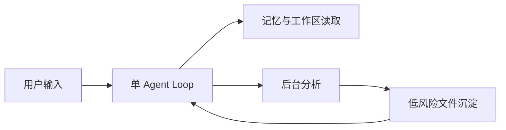

# 快速开始

本文面向第一次接触 `oneclaw` 的维护者，目标是用**最少配置**跑通一个默认可进化的单 Agent 实例。

如果你只想先建立整体认知，先看 [默认自进化能力](../concepts/default-evolution.md)。

## 最小心智模型

`oneclaw` 的默认使用方式不是先搭复杂多 Agent 编排，而是先让单 Agent 具备这四件事：

1. 记住对话
2. 读取工作区知识
3. 使用 Skills
4. 在安全路径里沉淀低风险分析结果

## 1. 准备环境

```bash
go test ./...
go run ./cmd/oneclaw -h
```

如果需要真实模型，设置：

```bash
export OPENAI_API_KEY="your-key"
```

## 2. 准备最小工作区

推荐准备一个目录，例如：

```text
workspace/
├── IDENTITY.md
├── SOUL.md
├── AGENTS.md
├── USER.md
├── memory/
│   └── insights.md
└── skills/
    ├── coding.md
    └── review.md
```

这些文件的详细职责见 [工作区布局](./workspace-layout.md)。

## 3. 准备最小配置

```json
{
  "openai": {
    "model": "gpt-4o-mini"
  },
  "workspace": {
    "root": "./workspace"
  },
  "compaction": {
    "enabled": true,
    "max_turns_before_compact": 40,
    "keep_recent_turns": 12
  },
  "background_agent": {
    "enabled": true,
    "debounce": "30s",
    "output_file": "memory/insights.md"
  }
}
```

这份配置对应的默认收益是：

- 从工作区加载知识与规则
- 会话变长时自动压缩上下文
- 把后台分析结果写到低风险文件

推荐把这类低风险结果优先写到 `workspace/memory/`，而不是直接覆盖高敏感规则文件。详见 [工作区布局](./workspace-layout.md)。

## 4. 启动原则

先按单 Agent 跑通，不要一开始就做：

- 复杂多 Agent 路由
- 高风险文件自动改写
- 重度控制面或 UI

默认推荐先验证这条闭环：



## 5. 如何判断“默认自进化”已经工作

至少满足以下现象：

- 多轮对话中能保留上下文
- 系统能读取工作区 Markdown 与 Skills
- 长会话发生压缩而不是直接失控增长
- 后台分析能稳定产出追加型结果

这时再考虑升级到 Profile、路由和子会话。

## 6. 下一步阅读

1. [默认自进化能力](../concepts/default-evolution.md)
2. [Agent Profile 与任务路由](../concepts/agent-profiles-and-routing.md)
3. [ADR-001：模块边界与接口形态](../architecture/adr-001-module-boundaries.md)
4. [工作区布局](./workspace-layout.md)
5. [配置参考](./config-reference.md)
