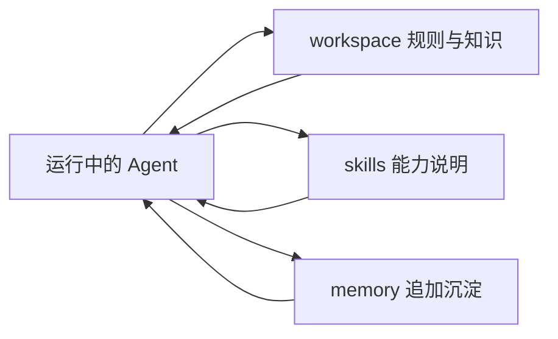

# 工作区布局

本文定义 `oneclaw` 推荐的工作区目录组织方式，用于承载默认自进化所依赖的外部化载体。

如果你希望系统“默认就能工作”，先把工作区写清楚，再考虑更复杂的 Profile、路由和控制面。

## 推荐目录

```text
workspace/
├── IDENTITY.md
├── SOUL.md
├── AGENTS.md
├── USER.md
├── memory/
│   └── insights.md
└── skills/
    ├── coding.md
    ├── review.md
    └── sop-release.md
```

## 文件职责

| 路径 | 作用 | 风险建议 |
|------|------|----------|
| `IDENTITY.md` | 系统身份、长期定位、长期不变的角色定义 | 高，默认人工维护 |
| `SOUL.md` | 风格、价值观、表达与协作偏好 | 中，谨慎改写 |
| `AGENTS.md` | 当前任务规则、执行约束、工作方式 | 高，默认受控改写 |
| `USER.md` | 用户偏好、租户约束、环境特定规则 | 中，允许受控追加 |
| `skills/*.md` | 能力说明、SOP、工具使用约定 | 中，适合直接纳入 git 管理 |
| `memory/*.md` | 低风险追加型沉淀，例如摘要、经验、改进点 | 低，适合默认自动写入 |

## 加载顺序

工作区文件拼接进 system 前缀时，推荐按以下顺序理解：

1. `IDENTITY.md`
2. `SOUL.md`
3. `AGENTS.md`
4. `USER.md`

这样做的原因是：

- 先定义“我是谁”
- 再定义“我怎么做事”
- 再定义“当前任务和约束”
- 最后补充用户或环境特定偏好

## `AGENTS.md` 与 `AGENT.md`

推荐统一使用 `AGENTS.md`。

当前实现可对 `AGENT.md` 做兼容回退，但它应仅作为兼容旧布局的兜底，而不是新的规范命名。

## `skills/` 如何组织

`skills/` 适合存放以下内容：

- 编码规范
- 代码审查规范
- 发布 SOP
- 排障清单
- 外部系统工具使用约定

推荐原则：

- 一个文件一个主题
- 文件名直接表达用途
- 偏“能力说明”的内容放 Skills
- 偏“必须按顺序执行”的流程，也可以放 Skills，但建议以 `sop-*.md` 命名
- 默认纳入 git，便于审计、review 与回滚

## `memory/` 如何使用

推荐把默认自动写入限制在 `memory/` 这类低风险目录。

适合写入：

- 对话摘要
- 已确认事实
- 待人工确认的改进建议
- reviewer 产出的 critique

不建议默认自动写入：

- 覆盖 `IDENTITY.md`
- 大幅改写 `AGENTS.md`
- 修改组织级 SOP 主文档

如果需要对中高风险文件做改写，默认应通过 git diff 可见、可审查、可回滚。

## 推荐写作方式

### `IDENTITY.md`

写稳定定义，不写短期任务。

### `SOUL.md`

写风格与原则，不写实现细节。

### `AGENTS.md`

写当前阶段最关键的执行规则，例如：

- 是否先提方案再动手
- 是否必须读 `docs/`
- 是否默认做验证

### `USER.md`

写用户偏好与环境差异，例如语言、输出习惯、仓库约定。

## 与默认自进化的关系

工作区不是装饰性目录，而是默认自进化的核心落点之一：

- `workspace/*.md` 承载静态知识与规则
- `skills/*.md` 承载可复用能力与 SOP
- `memory/*.md` 承载低风险追加型沉淀



## 相关文档

- [快速开始](./quickstart.md)
- [配置参考](./config-reference.md)
- [默认自进化能力](../concepts/default-evolution.md)
- [ADR-001：模块边界与接口形态](../architecture/adr-001-module-boundaries.md)
