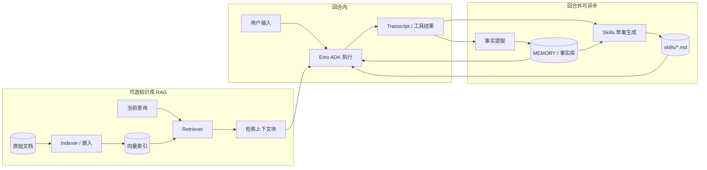

# 需求说明（Go / Eino / 多 Agent / MD 驱动 / 自主演进）

本文档描述 **目标产品** 的需求：对标 **OpenClaw / Hermes** 一类「长期自动化 Agent」体验，但以 **Go + CloudWeGo Eino** 实现 **薄框架**，用户主要通过 **Markdown/YAML 清单** 自定义流程与角色；**默认配置即可开箱使用**，并支持 **事实提取、记忆沉淀与 Skills 自动生成** 等自主演进能力。

- **与套件内其他文档**：主流程与生命周期见 [architecture.md](architecture.md)；架构原则见 [reference-architecture.md](reference-architecture.md)；MD 承载方式见 [eino-md-chain-architecture.md](eino-md-chain-architecture.md)；术语见 [glossary.md](glossary.md)；路径摘要见 [appendix-data-layout.md](appendix-data-layout.md)；**Harness 治理与扩展 backlog**（非一期必达）见 [harness-governance-extensions.md](harness-governance-extensions.md)。

---

## 1. 文档属性

| 项 | 说明 |
|----|------|
| 产品定位 | **Go Agent 框架运行时**：Eino ADK 为执行内核，多 Agent 协作，MD/YAML 声明流程；**IM/多通道** 接入 **`github.com/lengzhao/clawbridge`**，亦可选 HTTP/CLI；默认侧重「少代码、多配置」 |
| 参考范型 | OpenClaw / Hermes：**任务自动化**、子 Agent、工具与记忆协同；**不**要求 API 或目录与任一上游二进制兼容 |
| 追溯范围 | 本文件 + [eino-md-chain-architecture.md](eino-md-chain-architecture.md)；实现后以 `docs/config.md`、`docs/runtime-flow.md`（若存在）为配置与主路径真源 |
| 明确排除 | 训练/微调模型权重；将「全量对话历史」无预算注入上下文；**将向量索引当作唯一真源**（索引必须为可重建的派生物，原始文档/记忆文件仍为权威真源） |

---

## 2. 产品概述

### 2.1 价值主张（与用户目标对齐）

1. **语言与内核**：实现语言为 **Go**；模型↔工具主循环走 **Eino ADK**（与 `eino-ext` 等扩展对齐），Compose/Chain/Middleware 用于回合外与回合内扩展点。
2. **多 Agent**：支持 **主 Agent + 子 Agent**（或对等 Agent）定义与调度；定义以 **`agents/*.md`（及 manifest）** 为主，运行时可按任务路由或显式委托。**用户消息处理、记忆抽取、Skills 生成** 可配置为 **不同 `agent_type`**（各自 Instruction / 工具白名单 / 模型），由 **workflow 图节点**分别拉起。
3. **记忆与 Skills 演进**：能从对话与工具产物中 **抽取可复核事实**，写入约定记忆文件；在稳定重复模式上 **自动生成或更新 Skills**（含触发条件、边界与安全约束），形成 **自主演进** 闭环。演进 **仅在 `workflows/*.yaml` 中声明**（典型：`on_respond` 之后 **`async: true`** 的 **`use: agent`** 枝；默认内置 **`memory_extractor` / `skill_generator`** Catalog 条目可被用户 **`agents/*.md` 覆盖**）。产品层面仍应避免病态闭环编排；**当前 oneclaw** **未**做演进专用的加载期闭环校验（见 FR-FLOW-05）。
4. **框架优先、MD 驱动**：Go 代码 **仅实现框架能力**（加载、装配、执行、落盘、观测、扩展点）；**业务流程、提示词片段、工具白名单、Workflow（图）** 等由用户 **md/yaml** 提供，见 [eino-md-chain-architecture.md](eino-md-chain-architecture.md)。
5. **默认傻瓜式**：`init` 后 **最小 YAML** 即可跑通（含默认模型占位说明、默认工具集、默认记忆/skills 目录）；高级项可选。
6. **自主进化（默认开启或可一键开启）**：在默认配置下提供 **记忆提取** 与 **Skills 生成/修订** 的调度策略（如回合后异步、定时批处理或可配置触发），用户可通过 md **关闭或收紧** 行为。
7. **知识与 RAG（可选）**：对接 **Eino 的 `Embedding` / `Retriever` 抽象** 与 **eino-ext 的 Indexer/Retriever 实现**（如 Redis、Elasticsearch 等），支持将用户文档 **切分 → 嵌入 → 检索**，按查询注入上下文；**默认可关闭**，开启时用声明式配置指定数据源与后端，索引视为 **可重建缓存**。

### 2.2 与「仅文件记忆」范式的区别

| 维度 | 传统 Claw/仅工具写文件 | 本项目目标 |
|------|-------------------------|------------|
| 记忆维护 | 依赖模型/用户显式写文件 | **框架提供抽取流水线**，产出结构化事实与引用，写入约定路径 |
| Skills | 手工维护 `SKILL.md` | **草案生成 + 人工或策略确认**（可配置全自动仅限低风险模板） |
| 领域文档 | 仅靠 grep/read_file | **可选向量索引 + Retriever**（Eino 组件化 RAG），与下面「记忆」区分 |
| 编排 | 代码内固定较多 | **manifest + workflows/*.yaml（DAG）+ md** 为主 |

**MEMORY vs 知识库**：**MEMORY / 抽取事实** 偏 **会话与任务沉淀**（短、随任务演进）；**知识库** 偏 **用户提供的静态/半静态文档**（手册、规范、笔记）。二者可同时在 prompt 中占不同预算块，检索结果须 **带来源或片段 id** 便于核对。

### 2.3 自主演进闭环（概念流程）

图中「事实提取」「Skills 草案生成」可由 **独立 `agent_type`** 执行；各自运行 **落盘执行记录**；是否调度由 **workflow 图**（含 **`async`** 枝叶）决定（编排约束见 FR-FLOW-05）。

---

## 3. 功能性需求

### 3.1 配置与「开箱即用」

| ID | 需求描述 | 备注 |
|----|-----------|------|
| FR-CFG-01 | 提供 **合并后的单一配置真源**（如 YAML）；敏感项（API Key）允许环境变量 **仅作注入**，与业务默认值文档一致即可 | 与实现选型一致即可 |
| FR-CFG-02 | **`init`/`bootstrap`**：生成目录骨架、`config` 模板、`AGENT.md` / `MEMORY` 占位、`agents/`、`skills/`、`workflows/` 或等价 manifest | 已有配置时 **补全缺失键、不静默覆盖用户自定义** |
| FR-CFG-03 | **默认 profile**：单文件配置即可启动 REPL 或 HTTP demo；文档注明唯一必填项（通常为模型密钥与 endpoint） | 「傻瓜式」验收标准 |
| FR-CFG-04 | CLI：**日志级别/格式**、**配置路径**、导出会话快照（便于备份/迁移） | 与 NFR 可追溯 |

### 3.2 模型与 Eino 执行内核

| ID | 需求描述 | 备注 |
|----|-----------|------|
| FR-EINO-01 | 主会话 **默认** 使用 **Eino ADK**（`ChatModelAgent` + Tools）；OpenAI 兼容 Chat API 为 **默认模型后端** | 见 Eino 官方与 eino-ext |
| FR-EINO-02 | **每轮上限**：`max_steps` / `max_tokens`（或等价）可配置，默认值合理以防死循环 | |
| FR-EINO-03 | **扩展点**：Middleware / Callbacks / Compose Graph 在文档与代码中有 **稳定挂载点**，用户用 md/yaml 声明「使用哪个 workflow」 | 与 [eino-md-chain-architecture.md](eino-md-chain-architecture.md) 一致 |
| FR-EINO-04 | 保留 **非 ADK 或 mock 路径** 供测试；主路径文档明确默认 ADK | |

### 3.3 会话与多 Agent

| ID | 需求描述 | 备注 |
|----|-----------|------|
| FR-AGT-01 | **Agent 目录**：从 `agents/*.md`（或 manifest 指定路径）加载；frontmatter 含 `name`、`description`、`tools`、`max_turns`、`model` 覆盖等 | 术语见 [glossary.md](glossary.md) Catalog |
| FR-AGT-02 | **多 Agent 调度**：支持 **显式委托**（工具或内部调用）与 **可选路由策略**（由 md/yaml 配置规则，而非硬编码业务）；**子 Agent 默认会话隔离 + 上下文隔离**，放宽须配置或 Agent frontmatter 显式开启 | 见 [appendix-data-layout.md](appendix-data-layout.md) §3.1、[eino-md-chain-architecture.md](eino-md-chain-architecture.md) §5.4 |
| FR-AGT-03 | **工具隔离**：子 Agent 使用 **父 Registry 的子集**；元工具与安全敏感工具默认对子 Agent 收缩 | |
| FR-AGT-04 | **用户定义优先**：内置示例 agent 与用户文件同名时 **用户覆盖** | |
| FR-AGT-05 | **管线角色**：manifest / workflow 可将 **主对话**、**记忆抽取**、**Skills 生成** 绑定到 **不同 Catalog 条目**；每一次 Agent 执行（含上述后台管线）须落 **可追溯的磁盘执行记录**（结构化日志或 JSONL，含 `agent_type`、父 `session_id`、时间范围、provenance） | 与 FR-OBS、§5「审计」路径一致；细节见 [eino-md-chain-architecture.md](eino-md-chain-architecture.md) §5.6 |
| FR-AGT-06 | **Workspace（工具工作目录）**：子 Agent / 后台 Agent **默认 `shared`** —— 与 **当前主 Agent 回合** 使用同一工作目录（宿主解析后的 cwd，通常为会话 `workspace/`）；可选 **`private`**（独立目录）以防文件/exec 工具与主会话互扰 | frontmatter 见 [eino-md-chain-architecture.md](eino-md-chain-architecture.md) §5.2、[appendix-data-layout.md](appendix-data-layout.md) §3.1 |

### 3.4 MD/YAML 驱动的流程（框架职责边界）

| ID | 需求描述 | 备注 |
|----|-----------|------|
| FR-FLOW-01 | **Manifest**：入口描述默认 agent、引用的 system/memory 片段、**workflow** 引用、工具白名单路径 | 目录约定见 [eino-md-chain-architecture.md](eino-md-chain-architecture.md) §2 |
| FR-FLOW-02 | **Workflow 定义**：回合前/后及异步任务等为 **声明式 DAG**（`workflows/*.yaml`，可选线性 `steps` 糖）；Go 提供 **节点注册表 + 图执行器** | 规格见 [workflows-spec.md](workflows-spec.md) |
| FR-FLOW-03 | **Prompt 拼装**：分段 md 按顺序与预算拼接；支持按 agent 覆盖 | |
| FR-FLOW-04 | **工具白名单**：声明为列表或 tag；解析后为 Registry filter | |
| FR-FLOW-05 | **演进编排约定（与实现对齐）**：记忆抽取、Skills 生成 **只通过 workflow 编排**（见 [workflows-spec.md](workflows-spec.md) §4.3、§8）；默认内置 **`memory_extractor` / `skill_generator`**，用户 **`agents/`** 同名覆盖。**不设** Agent frontmatter 中的演进关闭布尔项。**当前实现** **未**做「演进专用 workflow 不得再挂同类 async 枝」的加载期校验，也 **未**在 **`TurnContext`** 上维护嵌套演进剖面；闭环防范依赖编排设计与后续可选扩展 | 见 [eino-md-chain-architecture.md](eino-md-chain-architecture.md) §5.6 |

### 3.5 知识与 RAG（可选模块）

**依据**：Eino 将 **Retriever**、**Embedding** 等作为标准组件；**eino-ext** 提供 **Indexer / Retriever**（如 Redis、ES7/ES9）及 RAG 拼接示例（`AppendRetriever` + `ChatModel`）。框架侧以 **接口适配 + 声明式配置** 为主，避免绑死单一向量库。

| ID | 需求描述 | 备注 |
|----|-----------|------|
| FR-KNOW-01 | **可插拔知识后端**：通过配置选择 **无 / 本地简易 / Redis / Elasticsearch / 其他 eino-ext 实现**；同一套 `schema.Document` 流贯穿切分、索引与检索 | 无后端时零运维，符合「傻瓜默认」 |
| FR-KNOW-02 | **入库管线**：从配置的 **目录或文件清单** 读取 → **切分**（按大小/标题/可选结构化规则）→ **Embedding**（与检索侧 **同一嵌入模型配置**）→ **Indexer.Store** | 支持手动 `reindex` CLI 或 API |
| FR-KNOW-03 | **检索注入**：**至少一种**集成方式——(a) Compose **回合前图节点**：对本轮用户查询 `Retrieve` → 拼进 system 或独立 context 块；(b) 暴露 **`search_knowledge` 工具**（或等价）由模型按需检索 | TopK、score 阈值、元数据过滤可配置 |
| FR-KNOW-04 | **与预算协同**：检索结果占用 **`budget`** 独立配额或与 memory 共享策略可配置；结果须含 **来源路径/片段 id**，便于引用与调试 | 防止 RAG 挤爆上下文 |
| FR-KNOW-05 | **增量与一致性**：文件变更可 **增量索引**（可选 watcher / 定时全量）；索引损坏或嵌入模型变更时支持 **全量重建**，且不丢失原始文件真源 | |
| FR-KNOW-06 | **安全**：仅允许索引 **配置声明根目录下** 的路径；拒绝任意全局路径与敏感默认目录 | 与 FR-TOOL 写策略一致理念 |

### 3.6 记忆与事实提取

| ID | 需求描述 | 备注 |
|----|-----------|------|
| FR-MEM-01 | **记忆真源**：仍以文件（如 `MEMORY.md` 或分片）为主；注入受 **字节/ token 预算** 约束 | |
| FR-MEM-02 | **事实提取**：框架提供 **可插拔抽取器**（默认基于模型或规则+模型）：从 transcript / 工具结果归纳 **原子事实**（含来源引用或 turn id） | **自主演进** 核心 |
| FR-MEM-03 | **写入策略**：合并去重、冲突检测、人类可读摘要；**高风险写入**（覆盖全局记忆）可配置为「仅草案 + 确认」 | |
| FR-MEM-04 | **触发**：回合结束、定时、或显式工具调用；默认策略在配置中 **一键开关** | |

### 3.7 Skills：加载与自动生成

| ID | 需求描述 | 备注 |
|----|-----------|------|
| FR-SKL-01 | **加载**：`skills/<name>/SKILL.md` + 索引注入上下文；支持 `invoke_skill` 或等价工具拉取全文 | |
| FR-SKL-02 | **自动生成**：对重复成功路径，框架可生成 **SKILL 草案**（前置条件、步骤、禁止事项、示例）；写入 staging 或直接入库由 **策略** 决定 | **自主演进** 核心 |
| FR-SKL-03 | **质量护栏**：与 **`write_behavior_policy`**（见 [glossary.md](glossary.md)）一致理念，限制路径、大小、敏感词；默认 **不** 无声覆盖用户已发布 skill | |
| FR-SKL-04 | **与记忆联动**：新 skill 可引用已抽取事实 id，避免与 MEMORY 矛盾 | 可选增强 |

### 3.8 工具与 MCP（框架级）

| ID | 需求描述 | 备注 |
|----|-----------|------|
| FR-TOOL-01 | **内置最小集**：文件读写（受策略约束）、检索、执行（超时/沙箱策略）、子 Agent 调用、skill 调用；具体名单以实现为准 | 「框架」非全家桶 |
| FR-TOOL-02 | **MCP**：可选连接 stdio/SSE/HTTP；工具名前缀与配置项文档化 | |
| FR-TOOL-03 | **用户扩展**：优先通过 **插件接口或外部 MCP** 扩展，避免把业务写进核心仓库 | |

### 3.9 可观测与审计

| ID | 需求描述 | 备注 |
|----|-----------|------|
| FR-OBS-01 | 结构化日志（如 slog）；回合级 trace 或 jsonl 流水可选 | |
| FR-OBS-02 | **演进审计**：记忆变更、skill 生成/修订 **可溯源**（谁、何时、依据哪些 turn） | 验收自主演进可信度 |
| FR-OBS-04 | **按 Agent 执行记录**：除回合级流水外，**每个 `agent_type` 的执行**可单独检索（路径与会话/子运行隔离策略一致） | 与 FR-AGT-05 配套 |
| FR-OBS-03 | **检索审计（可选）**：记录检索 query、命中 doc id、score 摘要（可采样），便于 RAG 质量问题排查 | 与 FR-KNOW 联动 |

---

## 4. 非功能性需求

| ID | 类别 | 描述 |
|----|------|------|
| NFR-01 | 运行时 | Go 版本以根 `go.mod` 为准；依赖 Eino 稳定 API，升级记录在修订说明 |
| NFR-02 | 安全 | 工具执行与写路径校验；抽取/生成管线 **默认** 不执行任意 shell |
| NFR-03 | 可靠性 | 模型/工具失败可恢复；异步演进任务失败 **不重试无限**、可告警日志 |
| NFR-04 | 可维护性 | 核心包职责清晰：`config`、`session/engine`、`tools`、`subagent`、`memory`、`skills`、`workflows`、**`knowledge`（索引/检索适配）**（命名可调整） |
| NFR-05 | 可测试性 | ADK 路径可 mock；抽取/skills 管线可单元测试与 golden file |

---

## 5. 数据与目录（目标摘要）

| 概念 | 说明 |
|------|------|
| 用户数据根 | **默认在用户主目录** `~/.<app>`（可配置）；含 config、会话、workspace；**不以当前 shell 工作目录为默认真源** |
| Manifest | **`UserDataRoot/.agent/manifest.yaml`**（或配置覆盖路径）；与 prompts/agents/workflows 同级放在 `.agent/` 下 |
| Agents | `agents/*.md` |
| Skills | `skills/<id>/SKILL.md` + 可选 staging |
| Workflows | `workflows/*.yaml`（DAG；可选线性 `steps` 糖） |
| 记忆 | `MEMORY.md` 或 `memory/*.md` + 抽取元数据（如 sidecar json/yaml） |
| 知识库原文 | 如 `knowledge/sources/` 或 manifest 声明的项目路径（**真源**） |
| 向量索引 | 由所选后端托管（Redis/ES 等）；本地可有 **索引版本/manifest** 便于重建 |
| 审计 | `execution/` 或等价目录：回合与演进操作流水；**按 Agent 运行**可细分（如 `sessions/<id>/runs/<agent_type>/` 或 manifest 声明） |

细节与 InstructionRoot / 会话隔离见 [appendix-data-layout.md](appendix-data-layout.md)；新项目可扩展列但保持 **「文件为真源」**。

---

## 6. 对外依赖（摘要）

- **CloudWeGo Eino**：ADK、Compose、Middleware、Callbacks；组件抽象含 **Embedding、Retriever** 等，用于拼装 RAG。详见 [eino-integration-surface.md](eino-integration-surface.md)。
- **eino-ext**：ChatModel、**Indexer/Retriever**（Redis、Elasticsearch 等）、Embedding 实现。
- **OpenAI 兼容 API**：默认推理后端；可抽象为 `ChatModel` 接口。
- **可选向量存储**：Redis、Elasticsearch 等（由 eino-ext 与运维配置决定）。
- **clawbridge**：[`github.com/lengzhao/clawbridge`](https://github.com/lengzhao/clawbridge) — 统一 `InboundMessage` / Bus / drivers，与 TurnHub、出站总线对接（常驻多通道场景）。

---

## 7. 验收要点（面向「傻瓜式 + 自主演进」）

1. **15 分钟上手**：按 README `init` → 填 Key → 一条命令对话成功。
2. **只改 md**：在不改 Go 的前提下，新增一个子 Agent 与一段回合后 workflow（图），行为可观察。
3. **演进可见**：默认或开启「记忆抽取」后，`MEMORY`（或约定文件）出现带引用的事实；「skill 生成」产生可读的 `SKILL.md` 草案或正式文件，且受写入策略约束。
4. **（可选）RAG**：在开启知识库且完成索引的前提下，提问能命中配置的文档范围，回答上下文可见 **引用来源**；关闭知识库时不影响基础对话。

---

## 8. 增强与扩展（Harness 治理，非验收基线）

以下 **不** 作为本文 §7 验收的必达项，用于指导 **增强路线** 与 **初期架构预留**（统一 policy 挂钩、Manifest 预留键、审计 schema 版本化、SafeHarness 类生命周期防御等）：

- 详见 **[harness-governance-extensions.md](harness-governance-extensions.md)**。

实现时宜与 [eino-md-chain-architecture.md](eino-md-chain-architecture.md) 中的 PreTurn / 链后继、Middleware、Workflow 节点注册表一致；**workflow YAML 真源**见 [workflows-spec.md](workflows-spec.md)。

---

## 9. 修订记录

| 日期 | 说明 |
|------|------|
| （文档创建） | 首版：需求与主路径梳理 |
| 2026-05-02 | **重写为项目目标 PRD**；增补知识与 RAG（FR-KNOW-* 等）；明确 **`github.com/lengzhao/clawbridge`** 为多渠道接入依赖；新增 **§8 增强与扩展** 与 [harness-governance-extensions.md](harness-governance-extensions.md)（修订记录顺延为 §9）；glossary / reference / README 同步；§5 锚定用户主目录与 `UserDataRoot/.agent/`；FR-AGT-02 默认隔离；架构参考更名为 [reference-architecture.md](reference-architecture.md)；FR-AGT-05/06、FR-FLOW-05、FR-OBS-04；§5 审计路径补充；§2.3 流程图说明；§6 指向 [eino-integration-surface.md](eino-integration-surface.md)；文首 / README / reference 指向 [architecture.md](architecture.md)；[workflows-spec.md](workflows-spec.md) 取代 chains-spec（DAG + workflow 命名）；FR-FLOW-01/02、§8 节前指引同步 |
| 2026-05-03 | FR-FLOW-05、§2.1 / §2.3：**演进仅靠 `workflows/*.yaml`（`async` + `use: agent`）**；移除 Catalog **`suppress_post_turn_evolution`** 表述。**FR-FLOW-05 与实现对齐**：无演进专用加载期校验、无 `TurnContext` 演进嵌套字段；内置 `memory_extractor` / `skill_generator` + 默认 turn 模板 |
