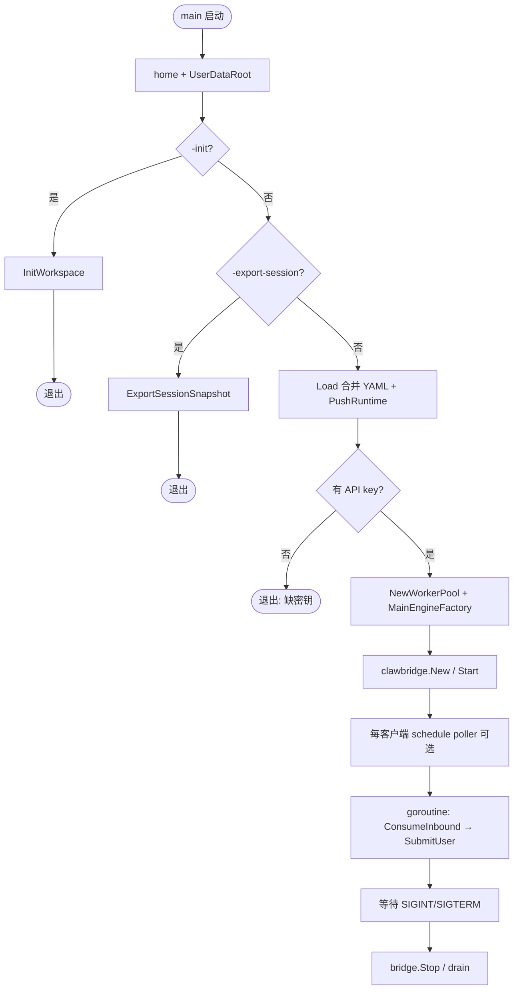
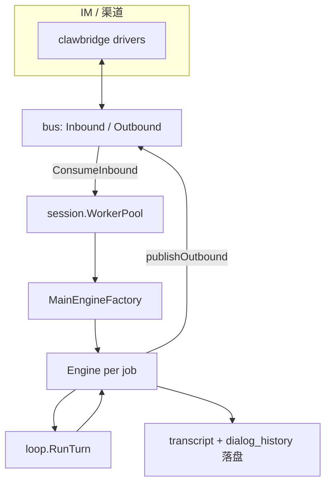
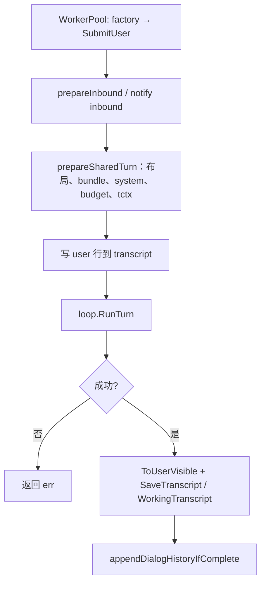
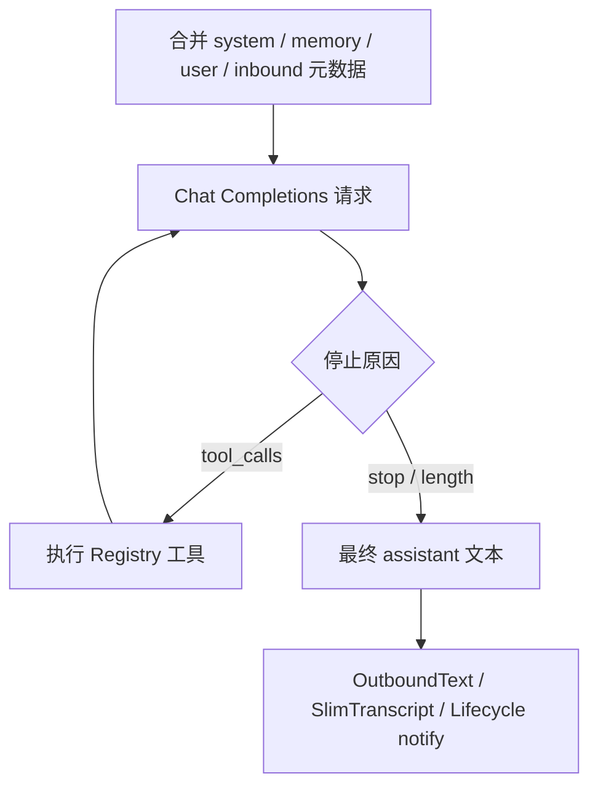
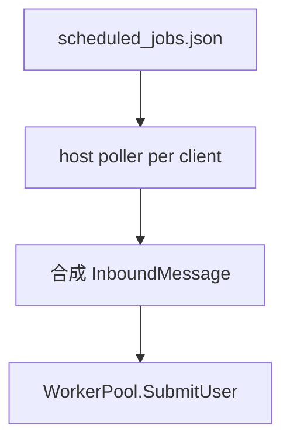

# oneclaw 运行时流程（整理版）

本文描述 **当前实现** 中从进程启动到单轮对话、转写与 dialog 落盘、定时任务与出站的**主路径**，便于对照代码阅读。细节配置见 [`config.md`](config.md)；入站/出站抽象见 [`inbound-routing-design.md`](inbound-routing-design.md)、[`outbound-events-design.md`](outbound-events-design.md)。历史 **LLM 维护双入口** 设计见 [`memory-maintain-dual-entry-design.md`](memory-maintain-dual-entry-design.md)（**主路径未接入**）。

---

## 1. 进程入口：`cmd/oneclaw`

解析 **`$HOME`**、**`-config`**（可选）后，按标志分为多条互斥路径（**`-init` / `-export-session` / 常驻**）：

| 路径 | 条件 | 行为摘要 |
|------|------|----------|
| **初始化** | `-init` | `config.InitWorkspace`：补全 `.oneclaw` 与 `config.yaml`，退出 |
| **导出快照** | `-export-session <dir>` | `workspace.ExportSessionSnapshot`：复制用户数据根到指定目录，退出（无需 API key） |
| **常驻服务** | 默认 | 加载配置 → MCP（可选）→ **WorkerPool** → **clawbridge** → 每客户端可选 **schedule poller** → 消费入站 |

常驻模式要求配置中至少有一个启用的 `clawbridge.clients`，否则进程报错退出。

---

## 2. 常驻模式：组件关系

- **WorkerPool**：按 `hash(session_key) % N` 分片，**同一会话固定落在同一 worker**，每轮任务 **新建 Engine**（`factory`），执行完 `SubmitUser` 后丢弃，避免无界 Engine 映射。
- **SessionHandle**：由入站的 `ClientID`（clawbridge client id）+ 会话键（`InboundSessionKey`：优先 `SessionID`，否则 `Peer.ID`）派生；**StableSessionID**（SHA256 截断）用于目录名、转写路径等。**Engine.CWD** 为 **`<UserDataRoot>/workspace`**（默认）或 **`<UserDataRoot>/sessions/<StableSessionID>/workspace`**（`sessions.isolate_workspace: true`），见 `session.MainEngineFactory` 与 [session-home-isolation-design.md](session-home-isolation-design.md)。

---

## 3. 单轮用户回合：`SubmitUser`（概要）

以下为主路径（非本地 slash）；实现见 `session/engine.go`。

**要点**：

- **prepareSharedTurn**：注入 `MEMORY.md`、预算、`ToolContext` 与入站路由字段合并（见入站设计文档 §2.1）。
- **loop.RunTurn**：模型 ↔ 工具循环；工具轨迹可在 `ToolTraceSink` 中收集，供 notify 等使用。
- **成功后**：折叠可见消息、**`SaveTranscript` / `SaveWorkingTranscript`**，并 **`appendDialogHistoryIfComplete`**（`workspace.AppendDialogHistoryPair`）。
- **本地 slash**（如 `/help`、`/status`、`/paths`、`/reset`、`/stop`；CLI 的 `/exit` 由终端处理）：走 `submitLocalSlashTurn`，**不**调用 `loop.RunTurn`（刻意设计）。`/stop` 在入站 goroutine 内还会先调用 `WorkerPool.CancelInflightTurn` 取消**当前已在执行**的该会话轮次（`context.WithCancel(root)`）。内置列表见 `session/slash_local.go` 与 `/help`。

---

## 4. `loop.RunTurn` 内部（概念）

具体步数上限、流式传输、Abort 等由 `loop.Config` 与 `Engine` 字段决定。

---

## 5. Episodic / dialog 与历史 LLM 维护

- **当前主路径**：回合成功后写 **转写**（`sessions/<id>/transcript.json` 等）与 **`workspace` 包下的 `dialog_history.json`**（见 `workspace/dialog_history.go`）；**无** `memory` 包、**无** `MaybePostTurnMaintain` / `RunScheduledMaintain` / `maintainloop` / **`-maintain-once`** 接入 `cmd/oneclaw`。
- **历史设计**（近场 / 远场 LLM 维护、`maintain.*` YAML）：见 [memory-maintain-dual-entry-design.md](memory-maintain-dual-entry-design.md)、[embedded-maintain-scheduler-design.md](embedded-maintain-scheduler-design.md)，**与当前仓库实现不一致处以代码为准**。

---

## 6. Agent 定时任务（`cron` 工具 / `scheduled_jobs.json`）

- 任务持久化在 **`UserDataRoot` 下的 `scheduled_jobs.json`**（默认 **`~/.oneclaw/scheduled_jobs.json`**；见 `schedule.JobsFilePath`）。
- 每个启用的 clawbridge **client** 可启动 **`schedule.StartHostPollerIfEnabled`**：轮询到期任务，构造 **合成入站** `bus.InboundMessage`，调用与人工消息相同的 **`workerPool.SubmitUser`**，从而走完整模型回合。

`features.disable_scheduled_tasks` 为关总开关。

---

## 7. 出站消息

- **模型回合内**的可见回复通过 `loop` 内配置的 **`OutboundText`**（`Engine.publishOutbound` → **`Bridge.Bus().PublishOutbound`**）写入 bus。
- **不经模型**的主动推送由工具 **`send_message`** 或 **`Engine.SendMessage`** 经 **`Engine.publishOutbound`**，最终 **`bridge.Bus().PublishOutbound`** 分发到对应渠道。

`cmd/oneclaw` 在构造 **`MainEngineFactoryDeps`** 时注入 **`clawbridge.New`** 的 **`Bridge`** 指针（见 `session/bridge.go`）。

---

## 8. 可选横切能力

| 能力 | 作用 |
|------|------|
| **MCP** | `mcpclient.RegisterIfEnabled` 向共享 Registry 注册工具，系统提示可选 `MCPSystemNote` |
| **Notify 生命周期** | `notify` 事件：入站、回合起止、工具结束等（见 [`notification-hooks-design.md`](notification-hooks-design.md)）；**审计类 JSONL Sink 已移除**（[`notify-sinks-audit-design.md`](notify-sinks-audit-design.md) 为归档） |

---

## 9. 与仓库其它文档的关系

- **配置合并与运行时推送**：[`config.md`](config.md)  
- **阶段任务与验收**：[`todo.md`](todo.md)、[`agent-runtime-golang-plan.md`](agent-runtime-golang-plan.md) §9  
- **范式与边界总览**：[`agent-runtime-golang-plan.md`](agent-runtime-golang-plan.md)  
- **Prompt 拼装**：[`prompts/README.md`](prompts/README.md)  

README 中的简化图仍可作一页纸总览；**以本文 + 上述设计文档为准**做实现级对照时更贴近当前代码路径。
