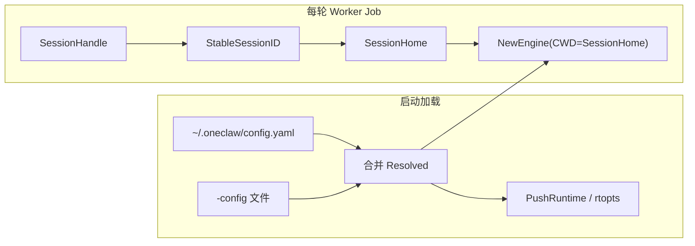

# 用户根 + 按会话工作区隔离（Session Home）设计

本文描述一种**以 `~/.oneclaw` 为全局根**、**以 `~/.oneclaw/sessions/<session_id>/` 替换当前「项目 `-cwd`」** 作为运行时工作目录的模型，使多会话在**默认文件视图**上相互隔离；公共规则从用户根读取。与现状对照见 [config.md](config.md)、[runtime-flow.md](runtime-flow.md)。

---

## 1. 背景与动机

**现状（项目-centric）**：`cmd/oneclaw` 用 `-cwd` 解析出的**项目根**作为 `Engine.CWD` / `toolctx.CWD`。同一项目目录下多个 IM 会话共享同一棵 `<cwd>/.oneclaw/`（除 `sessions/<id>/` 下转写、审计等已按会话分片外），**exec 默认 pwd、tasks、session 级 memory 路径**仍以项目根为锚，会话之间容易在「相对路径与任务文件」层面交叉影响。

**目标**：把「会话可见、可写的默认文件宇宙」收束到**每会话独占目录**；**配置与全局 AGENT / rules** 仍集中在用户根，避免每个会话复制一份密钥与总规范。

---

## 2. 目标与非目标

### 2.1 目标

- **用户根（UserRoot）**：`~/.oneclaw`（或通过既有 `paths.memory_base` 解析后的等价基路径，下文默认 `~/.oneclaw`）。
- **公共只读（概念上）**：用户根下放置 **`AGENT.md`、`rules/`**（及可选 `skills/` 索引策略，见 §7），供所有会话的系统提示与策略引用。
- **会话家目录（SessionHome）**：`~/.oneclaw/sessions/<session_id>/` **整体作为** `Engine.CWD` / `toolctx.CWD` 的替换值，与当前 `session.StableSessionID(handle)` 对齐。
- **默认隔离**：不同 `session_id` 下默认 **exec pwd、read/write 的 cwd 语义、tasks.json、本会话下的 `.oneclaw/memory` 等** 互不重叠（在工具策略允许范围内）。

### 2.2 非目标

- **不做 OS 级沙箱**：同一进程、同一用户下，仍可通过绝对路径、网络、子进程访问机内其他资源；隔离是**约定 + 路径锚点**，不是容器或 Seatbelt。
- **不自动改变 clawbridge / 渠道协议**：仅改变 oneclaw 侧 **cwd 与落盘根** 的解析方式。
- **不强制废弃「项目模式」**：可为 CLI `-cwd`、`-init`、单仓库开发保留 **可选** 项目层配置（见 §6），与常驻 IM 模式的「用户根 + SessionHome」并存或分入口声明。

---

## 3. 术语

| 术语 | 含义 |
|------|------|
| **UserRoot** | `memory.MemoryBaseDir(home)` 解析结果，默认 `~/.oneclaw` |
| **session_id** | 与现实现一致：`session.StableSessionID(SessionHandle)`（稳定、可哈希、用于目录名） |
| **SessionHome** | `filepath.Join(UserRoot, "sessions", session_id)`，**即新的 `Engine.CWD`** |
| **ProjectRoot（旧）** | 当前 `cmd/oneclaw` 的 `-cwd`；本设计在 IM 主路径上**不再**作为工具默认 cwd |

---

## 4. 目录布局

### 4.1 用户根（共享）

```text
~/.oneclaw/
  config.yaml              # 与用户级合并逻辑一致（见 §6）
  AGENT.md                  # 全局默认 Agent 说明（可选；会话内可覆盖见 §7）
  rules/                    # 全局规则片段（可选）
  skills/                   # 若采用「用户级 skills 索引」策略（可选）
  sessions.sqlite           # 可选：仍可放在 UserRoot（推荐），与「会话数据在 sessions/ 下」一致
  sessions/
    <session_id>/
      ...                   # SessionHome：见 §4.2
```

### 4.2 会话根（隔离）

将 **SessionHome** 视为**原「项目根」的替身**：其下仍使用与现实现相同的 **`<SessionHome>/.oneclaw/`** 子树语义，便于**少改 builtin 与 memory 布局代码**。

```text
~/.oneclaw/sessions/<session_id>/
  .oneclaw/
    memory/
      MEMORY.md             # 本会话项目型记忆入口（若启用）
      YYYY-MM-DD.md         # 日更 episodic（若沿用现布局）
    tasks.json
    media/                  # 入站附件等（若沿用现 mediastore 根）
    exec_log/               # 若 exec 改为以 SessionHome 为 cwd，可简化或保留现拼接方式，见 §8
    sessions/               # 若保留「cwd 下 .oneclaw/sessions/<id>/exec_log」逻辑，会产生嵌套；建议 §8 统一
    audit/                  # 审计 JSONL（若仍按会话落盘，可与 transcript 同缀）
    transcript.json         # 可选：与现「每会话转写」一致时可放在此处或 UserRoot 下统一索引
    working_transcript.json
```

**说明**：上表为逻辑布局；**transcript / sqlite / audit** 的精确路径应与 `config.Resolved` 的派生规则一次性对齐（§5），避免「配置算一套路径、Engine 另一套 cwd」长期分裂。

---

## 5. 配置与路径解析（核心）

### 5.1 双根原则

引入显式概念（实现上可为 `Resolved` 扩展字段或并行参数）：

- **ConfigRoot / UserRoot**：加载 YAML、API key、MCP 静态配置等；默认仅 `~/.oneclaw` + 可选 `-config` 文件。
- **SessionWorkspace**：`SessionHome`，仅由 **`session_id`** 派生；**`MainEngineFactory` 创建 `Engine` 时写入 `Engine.CWD`**。

`config.SessionTranscriptPaths(session_id)`、`SessionsSQLitePath()` 等应基于 **同一套「数据根」** 计算：推荐 **UserRoot** 为会话索引根，例如：

- `sessions.sqlite` → `~/.oneclaw/sessions.sqlite`（或 YAML 覆盖）
- `transcript` → `~/.oneclaw/sessions/<session_id>/transcript.json`（与 SessionHome 同级或置于 `SessionHome/.oneclaw/`，二选一写死并文档化）

避免 transcript 仍在「旧项目 cwd」而工具已在 SessionHome 的**跨盘不一致**。

### 5.2 与 `PushRuntime` / `rtopts` 的关系

全局预算、维护开关等仍来自合并后的 YAML；**与 cwd 无关的路径**（如 `log.file`）应明确相对于 **UserRoot** 或绝对路径，而不再默认相对于已废弃的 ProjectRoot（IM 模式）。



---

## 6. 配置合并顺序（建议）

**IM 常驻模式（本设计主场景）**：

1. `~/.oneclaw/config.yaml`
2. 可选：`-config` 显式文件

**可选保留「项目覆盖」**（便于本地仓库仍放 `repo/.oneclaw/config.yaml`）：

3. 若存在 **显式 ProjectRoot**（环境变量或仅 CLI 入口）：再合并 `<ProjectRoot>/.oneclaw/config.yaml`，优先级高于用户根。

文档与实现需标明：**IM worker 路径默认不扫描 ProjectRoot**，以免隐式依赖当前 shell 的 cwd。

---

## 7. 系统提示与 AGENT / rules / skills

| 来源 | 路径 | 用途 |
|------|------|------|
| 全局 | `UserRoot/AGENT.md`、`UserRoot/rules/**` | 所有会话共享的基线 |
| 会话覆盖（可选） | `SessionHome/.oneclaw/AGENT.md`、`SessionHome/.oneclaw/rules/**` | 仅本会话；合并策略建议：**会话覆盖 > 全局** 或 **拼接（全局 + 会话增量）**，产品二选一并写死 |

**skills**：若索引扫描仍基于 `toolctx.CWD`，则会话只能看到 `SessionHome/.oneclaw/skills`；若希望共享用户级 skills，需在 `session`/`prompt` 组装处 **额外注入 `UserRoot/.oneclaw/skills` 或既定目录**，与现 `skills.PromptSkillLines(cwd, home, …)` 行为对齐改造。

---

## 8. 工具、exec、附件

- **exec**：`cmd.Dir = SessionHome`（即新的 `tctx.CWD`）；run log 建议固定在 `SessionHome/.oneclaw/exec_log/<ts>/run.log`（**不再**在 cwd 下重复 `sessions/<id>/`，以免嵌套）。
- **read_file / write_file**：以现 cwd 策略为基础，自然限制在 SessionHome 树内（外加 `MemoryWriteRoots` 等例外）。
- **入站附件**：`PersistInlineAttachmentFiles`、`mediastore` 根应落在 **SessionHome** 下，避免多会话写入同一项目 `media/`。

---

## 9. memory 与 maintain

- **DefaultLayout(SessionHome, home)**： episodic、dialog_history 等应落在 **SessionHome** 或 **UserRoot 下按 session_id 分片**（与现 `dialog_history` 按日期 + session 分文件策略兼容，只需把「项目 slug」从「项目 cwd」改为「session_id」或固定前缀）。
- **maintainloop（定时维护）**：需定义维护对象：  
  - **A**：按会话轮询 SessionHome（重）；  
  - **B**：仅维护 UserRoot 下全局 memory + 最近活跃 session 列表（轻）；  
  - **C**：维护推迟到「该 session 回合结束」的 PostTurn（现 `RunPostTurnMaintain`），定时任务只跑全局。  

推荐首版 **B + C**，避免全盘扫描 `sessions/*`。

---

## 10. MCP、usage、export-session

- **MCP 注册**：stdio 子进程 cwd 或 artifact 目录应基于 **UserRoot** 或 **SessionHome** 明确其一；多会话并发时 artifact 建议 **`SessionHome/.oneclaw/artifacts`**，避免文件名碰撞。
- **usage 落盘**：现依赖 `ToolContext.CWD`；迁移后会话用量自然分文件，全局统计需在聚合任务中扫描 `sessions/*/.oneclaw/usage/` 或统一到 UserRoot（任选，需一致）。
- **export-session**：源路径从「`<cwd>/.oneclaw`」改为「`SessionHome/.oneclaw` + UserRoot 中与本 session 相关的条目标记」；或提供「仅导出 SessionHome」模式。

---

## 11. CLI 与迁移

| 场景 | 行为建议 |
|------|----------|
| `oneclaw -init` | 初始化 **UserRoot**（config 模板、全局 AGENT.md/rules）；**不**再要求项目目录（除非指定 ProjectRoot） |
| 首次某 `session_id` 收到消息 | `MkdirAll(SessionHome/.oneclaw/...)`，可拷贝最小模板（空 MEMORY.md、空 tasks） |
| 从旧部署迁移 | 脚本或文档：按 `StableSessionID` 将 `<旧cwd>/.oneclaw/sessions/<id>/*` 迁到 `~/.oneclaw/sessions/<id>/`；config 迁到 `~/.oneclaw/config.yaml` |

---

## 12. 风险与开放问题

1. **磁盘增长**：每会话一棵 `.oneclaw`；需保留策略、导出与手动清理文档。
2. **用户是否仍需要「绑定某 Git 仓库」**：若需要，可在 SessionHome 下 `git clone` 或由用户把 `SessionHome` 设为某工作副本根；本设计不内置「项目 = Git 根」绑定，除非另加元数据。
3. **StableSessionID 碰撞**：沿用现哈希长度与字符集；目录段需继续 sanitize（与现 `exec` 对 session 路径段一致）。
4. **子 Agent**：`toolctx.ChildContext` 继承同一 `SessionHome` 与父会话一致；若未来要子 Agent 独立 workspace，需再引入 `AgentWorkspace` 子目录。

---

## 13. 建议落地顺序

1. **路径层**：`Resolved` / `MainEngineFactory`：派生 `SessionHome`，`Engine.CWD = SessionHome`；**transcript / sqlite** 与 UserRoot 对齐。
2. **exec / mediastore / tasks**：验证相对路径与日志路径无歧义。
3. **prompt**：全局 AGENT/rules + 可选会话覆盖。
4. **maintain / export / docs**：更新 [config.md](config.md)、[runtime-flow.md](runtime-flow.md) 中的「会话与多通道」一节，标明 IM 模式默认数据根。

---

## 14. 小结

- **可以**用 `~/.oneclaw` 管配置与公共 `AGENT.md`/`rules`，用 `~/.oneclaw/sessions/<session_id>/` **替换**当前 IM 路径下的项目 `cwd`，从而在**默认工具与文件布局**上实现会话级隔离。
- 实现关键是 **ConfigRoot 与 SessionWorkspace 分离**，并 **统一 transcript、SQLite、审计、MCP artifact** 的锚点，避免半套旧「项目 cwd」半套新 SessionHome。
- **完全隔离**仅限文件与约定层面；安全边界仍需工具策略与运维模型配合。

---

## 15. 实现状态（`cmd/oneclaw` 常驻 IM）

已在主进程落地（`home` 非空的 `config.Load` 路径）：

- `config.Resolved.UserDataRoot()`、`SessionTranscriptPaths` / `SessionsSQLitePath` / 默认 media 等与用户数据根对齐。
- `MainEngineFactory`：`Engine.CWD` 由 **`sessions.isolate_workspace`** 决定（默认 **false**：`CWD = UserDataRoot`；**true**：`CWD = <UserDataRoot>/sessions/<StableSessionID>/.oneclaw`）。`Engine.UserDataRoot` 供 cron / system 提示；`Engine.WorkspaceFlat = true` 时 tasks/exec_log/agents 等直接位于 `CWD` 下，不再拼 `CWD/.oneclaw/`。
- `toolctx.HostDataRoot`：`schedule.Add/List/Remove` 写入 `<UserDataRoot>/scheduled_jobs.json`；`StartHostPollerIfEnabled` 使用同一根目录。
- 审计：`RegisterAuditSinks` 使用会话工作区 + 空 `AuditSessionID`，路径为 `<SessionHome>/.oneclaw/audit/…`。
- exec：`run.log` 位于 `<SessionHome>/.oneclaw/exec_log/<ts>/`。
- 定时维护：`maintainloop` 使用 `memory.IMHostMaintainLayout(UserDataRoot, home)`。

`config.Load` **仅**合并 `~/.oneclaw/config.yaml` 与可选 `-config`（相对路径相对 `~/.oneclaw/`），**不再**读取项目目录或进程 `cwd`。`-init` / `-export-session` / `-maintain-once` 均以 **`UserDataRoot()`**（默认 `~/.oneclaw`）为数据根。
